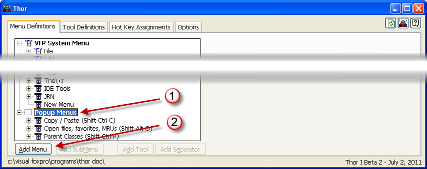
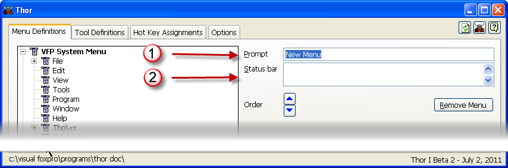

创建弹出式菜单
===
_本文档由 xinjie 于 2018-04-08 翻译_

创建一个新的弹出菜单
* 单击TreeView中的**Popup Menus**节点
* 点击添加菜单命令按钮

你现在可以：
* 为新菜单指定提示信息
* 指定将出现在状态栏中的文本

您也可以使用现有的菜单（VFP系统菜单栏或子菜单）并将其作为弹出式菜单提供。参看[复制菜单](Thor_duplicating_menus.md).

