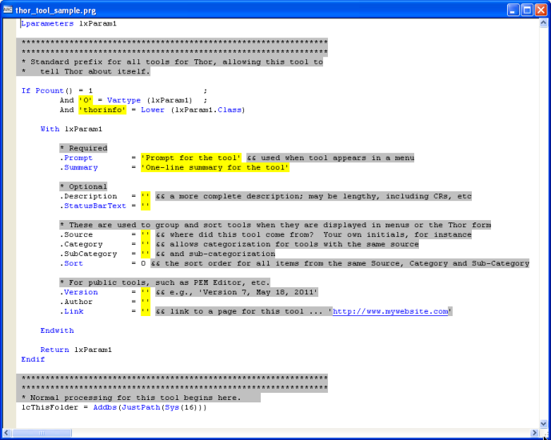

创建新工具
===
_本文档由 xinjie 于 2018-04-07 翻译_

要创建一个新工具，请使用Thor表单第二页上的“创建工具”按钮（**工具定义**）。

 

这将显示“创建工具”表单，该表单将指导您为新工具选择文件夹和文件名。

Thor 在以下文件夹中查找名为 **Thor_Tool _ * .PRG** 的文件：
  
1. CurDir()  
1. 您路径中的所有文件夹
1. **Thor\Tools\My Tools** -- 推荐的个人工具文件夹
1. **Thor\Tools** -- 下载工具的推荐文件夹，例如带有 IDE 工具或`Thor 仓库`的`PEM 编辑器 7`
 
<!--- TBL: Previous: Links to PEME and Thor repository, wrong in old source --->
  
显然，这可能会导致名称冲突，因为在不同的文件夹中可能有相同名称的 PRG 。 Thor 通过识别遇到的第一个此类工具来解决这些冲突，忽略任何具有相同名称的之后的工具。

事实证明，这种设计提供了实质性的好处。 如果该文件夹（**Thor\Tools**）仅用于下载的工具，那么您的个人工具将不会有与其冲突的危险。 除此之外，您可以选择任何可下载的工具，尤其是`Thor 仓库`中的，您可以根据您的喜好来对其进行调整，并将其保存在**Thor\Tools\My Tools**中。 这些个人副本将始终优先于任何下载的副本。

“创建工具”表单为您提供了一个组合框，其中显示了 Thor 将搜索的所有文件夹（按照它们将被搜索的顺序）以及一个文本框，您可以在其中输入要创建的工具的名称。 下面的列表框显示了该文件夹中所有工具的名称，这些工具的名称可能与您创建的名称相冲突。

这将创建PRG并打开它供您编辑。

正如你在下面看到的，新 PRG 的“开始”是一组40行左右的代码，这可以让工具在 Thor 中进行注册。 

 

该工具的实际代码将放置在清单最后的 Procedure **ToolCode** 中。

与往常一样，你还可以浏览其他工具（您也可以在 Thor 表单中执行某些操作）以查看示例了解这些属性通常是如何使用的。

最后的建议：为所有个人工具分配**.Source** 的相同值，以便 Thor 表单将它们组合在一起。

### 参看：

* [浏览工具列表](Thor_browsing_tools.md)  
* [为工具指定快捷键](Thor_assign_tool_hot_keys.md)
* [编辑现有工具](Thor_editing_existing_tools.md) 
* [制作工具的工具](Thor_tools_making_tools.md)
