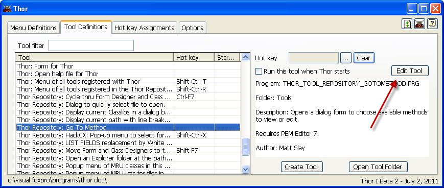

编辑现有工具
===
_本文档由 xinjie 于 2018-04-07 翻译_

您可以使用 Thor 表单的第二页（**工具定义**）编辑现有工具。

您可以打开一个工具进行编辑，方法是双击表格中的一行，或选择该行，然后单击“编辑工具”按钮。

请注意，对工具 PRG 的“开始”所做的更改不会自动反映在表单的显示中; 参看[一般使用说明](Thor_form_usage_notes.md)

**参看**
* [浏览工具列表](Thor_browsing_tools.md)
* [为工具指定快捷键](Thor_assign_tool_hot_keys.md)
* [创建新工具](Thor_creating_new_tools.md)
* [制作工具的工具](Thor_tools_making_tools.md)
