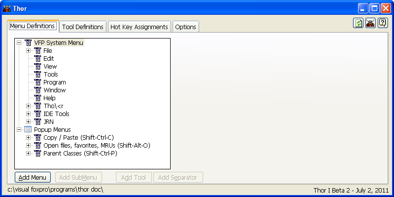

Thor 在线帮助
===
_本文档由 xinjie 于 2018-04-07 翻译_

* [**获取最新的 Thor 新闻**](Thor_news.md)
*   [Thor 概述](Thor_overview.md)
*   安装 Thor：
    *   [首次和手动安装](Thor_install.md)
    *   [Thor（和Thor工具）的一键更新](Thor_one-click_update.md)
*   [运行 Thor](Thor_running.md)
*   [Thor 视频](Thor_videos.md)

### **Thor 配置表单**

*   [打开 Thor 配置表单](Thor_open_form.md)
*   [一般使用说明](Thor_form_usage_notes.md)
*   管理 VFP 系统菜单栏
    *   [创建新的菜单](Thor_create_menu_pad.md)
    *   [移动菜单](Thor_moving_menu_pads.md)
*   管理弹出菜单
    *   [创建弹出菜单](Thor_create_popup_menu.md)
    *   [为弹出式菜单指定快捷键](Thor_assign_tool_hot_keys.md)
*   管理系统菜单，弹出式菜单和子菜单
    *   [创建子菜单](Thor_creating_sub-menus.md)
    *   [将工具添加到菜单](Thor_Adding_tools_to_menus.md)
    *   [重新排序工具和子菜单](Thor_re-ordering%20tools.md)
    *   [复制菜单](Thor_duplicating_menus.md)
*   管理工具
    *   [浏览工具列表](Thor_browsing_tools.md)
    *   [为工具指定快捷键](Thor_assign_tool_hot_keys.md)
    *   [编辑现有工具](Thor_editing_existing_tools.md)
    *   [创建新工具](Thor_creating_new_tools.md)
*   [所有热键、宏、On Key Lable 列表](Thor_hot_key_list.md)
*   [选项](Thor_options.md)
*   [重新安装 Thor](Thor_reinstall.md)

### **其他特性**

*   [**Thor 仓库**](Thor_repository.md)
*   [**The Thor Framework: 制作工具的工具**](Thor_tools_making_tools.md)
*   [**Thor 社区论坛**](http://groups.google.com/group/FoxProThor)   
* [Thor 发布历史](Thor.md)
* [Thor 推特（技巧和提示）](TWEeTs.md)
 

