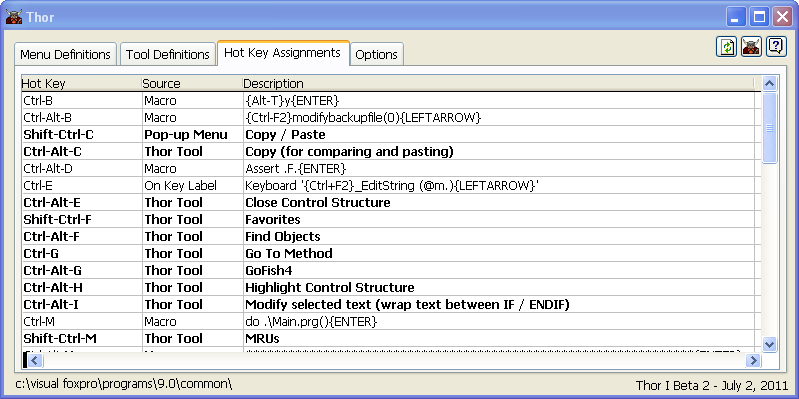

所有快捷键、宏、On Key Label 列表
===
_本文档由 xinjie 于 2018-04-07 翻译_

Thor 表单的第三页（**Tool Definitions**）显示 Thor 中为弹出式菜单和工具以及所有键盘宏和On Key Label定义分配的所有快捷键。 （虽然 Thor 不管理键盘宏或 On Key Label 定义，但在一个地方查看所有这些不同定义确实非常方便。）

点击列标题将按该列进行排序。 请注意，第一列有两种不同的类型可供选择。 列标题上的连续点击将在这两种类型之间交替。

对于由 Thor 控制的行（粗体行），双击某一行将允许您重新定义分配的快捷键。 要删除指定的快捷键，请使用该行上的右键关联菜单。

