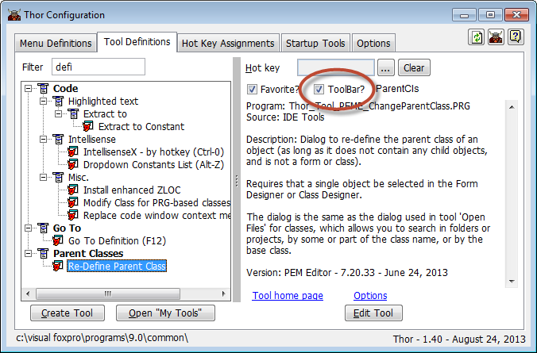
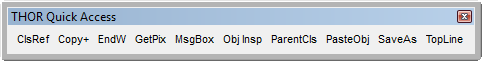
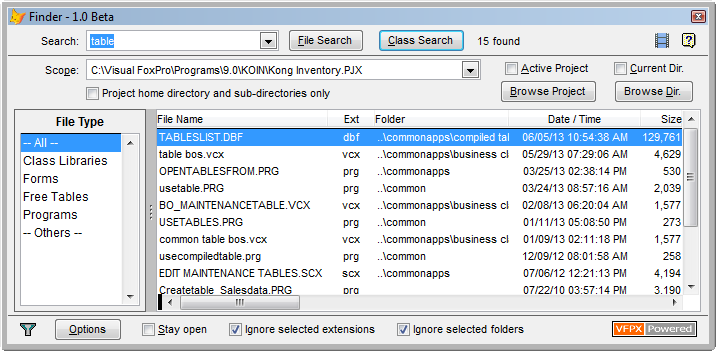
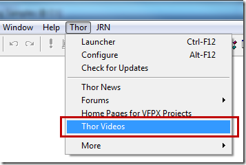
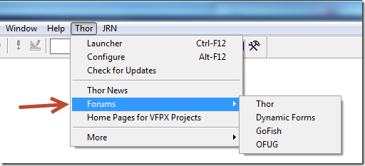
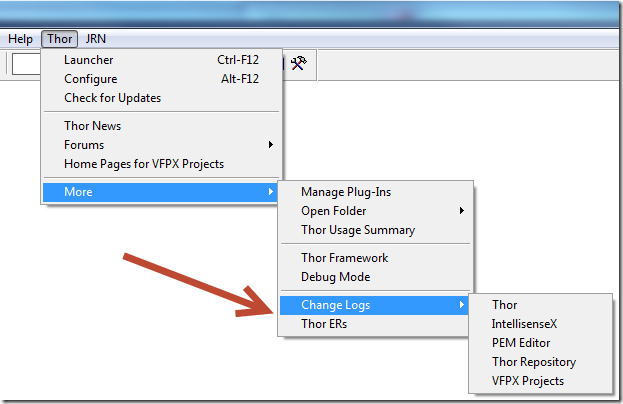
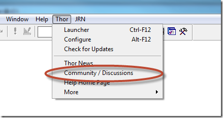
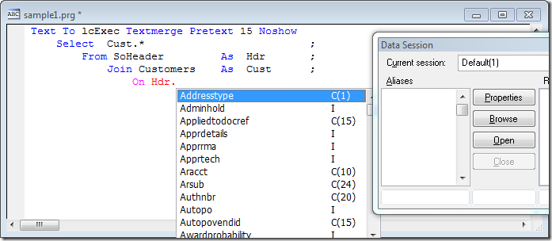
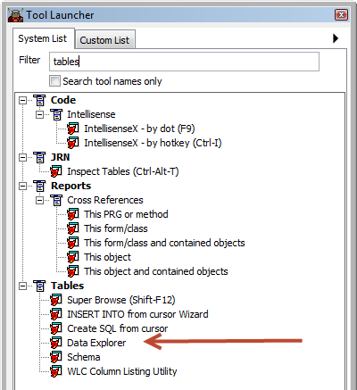
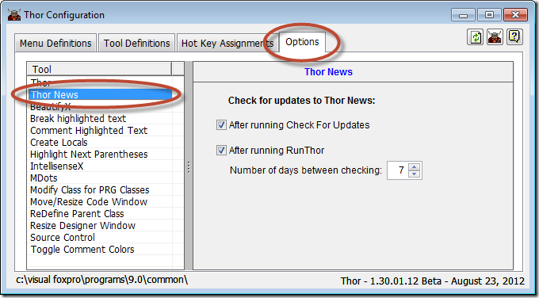

  

FoxPro 的工具管理器
===
_本文档由 xinjie 于 2018-04-07 翻译_

[Thor 社区](http://groups.google.com/group/FoxProThor)

[Thor 视频](Thor_videos.md)

[Thor 推特](TWEeTs.md)

**新的 Thor 工具和 [超级浏览器](Thor_superbrowse.md) 的增强功能** 
---

### #42, 2015-11-30

Thor 仓库中提供了许多新的 Thor 工具。

*   'Toggle tabs in pageframe' – 当选项卡不可见时，在页框的页面之间导航可能非常困难（是的，很麻烦）。 使用此工具切换当前页面中的选项卡。
*   'Compare text in two windows' – 使用您最喜爱的比较工具来比较来自两个不同代码窗口的代码，而不退出FoxPro，如下所示：
    *   选择一个文本窗口
    *   执行此工具（建议使用快捷键）
    *   选择第二个文本窗口
    *   再次执行此工具  
            -- 这将比较两个窗口的内容

> **需要：**  Thor 并不能猜出你最喜欢的比较工具，所以你必须修改插件以便 Thor 可以调用它。插件的默认代码调用 Beyond Compare（_私人建议：强烈建议！）_，并且你必须予以修改以适应您的环境。

*   第三个新工具 [VFP2Text](http://pfsolutions-mi.com/Product/VFP2Text), 一个来自Frank Perez，Jr.的Beyond Compare的插件，可以直接比较VCX和SCX
    *   'Download VFP2Text for Beyond Compare V3'
    *   'Download VFP2Text for Beyond Compare V4'
    *   'VFP2Text Home Page'

还有一些对 **[超级浏览器](Thor_superbrowse.md)** 的改进：

*   由于在过滤器框中切换表达式和值可能非常麻烦，现在可以按如下方式覆盖当前设置：
    *   要选择值，请使用尾随'$'
    *   要选择表达式，请使用前导'='
*   "值"过滤所有选定的字段，如果没有，则为全部字符型字段。
*   如果表是只读的，双击一行（使用动态表单编辑）会显示一个只读表单。
*   新设置允许显示备注字段中的前导字符而不是“Memo”。
*   双击备注字段可单独编辑该字段。
*   有许多新的插件：
    *   格式字段选择器 - 为第一页上提供的选项创建替代格式（“选取器”）以符合您的偏好
    *   绑定列事件 - 将 Grid 列中的事件绑定到此类
    *   Grid 关联菜单 - 为表格中的单元格创建关联菜单  

同时可参看 [所有 Thor 推特的历史](TWEeTs.md) 和 [Thor 社区](https://groups.google.com/forum/?fromgroups#!forum/FoxProThor).

---

以前的头条新闻
---

**[#41, 2015-01-12 添加到 VFPX 的两个新项目](#Headline41)**

**[#40, 2014-01-04 TWEeT #27: 转向定义](TWEeTs/Tweet_27.md)**

**[#39, 2014-12-22 TWEeT #26: 三个新的 Thor 工具](TWEeTs/Tweet_26.md)**

**[#38, 2014-12-17 添加到 VFPX 的两个新项目](#Headline38)**

**[#37, 2014-11-30 TWEeT #25: FoxBin2PRG 的五个新 Thor 工具](TWEeTs/Tweet_25.md)**

**[#36, 2014-11-25 TWEeT #24: 九个新的 Thor 工具](TWEeTs/Tweet_24.md)**

**[#35, 2014-11-17 TWEeT #23: 检测到缓冲区溢出！](TWEeTs/Tweet_23.md)**

**[#34, 2014-06-11 TWEeT #22: 发布 IntellisenseX](TWEeTs/Tweet_22.md)**

**[#33, 2014-06-04 TWEeT #21: 高级功能：用于 IntellisenseX 的插件](TWEeTs/Tweet_21.md)**

**[#32, 2014-05-29 TWEeT #20: IntellisenseX 快速入门指南](TWEeTs/Tweet_20.md)**

**[#31, 2014-05-21 TWEeT #19: IntellisenseX 中的缺陷（以及如何避免它们）...自定义关键字列表](TWEeTs/Tweet_19.md)**

**[#30, 2014-05-10 TWEeT #18: IntellisenseX 嵌套对象](TWEeTs/Tweet_18.md)**

**[#29, 2014-04-29 TWEeT #17: 在 IntellisenseX 中使用局部别名](TWEeTs/Tweet_17.md)**

**[#28, 2014-03-03 TWEeT #16: 字段名的自定义关键字列表](TWEeTs/Tweet_16.md)**

**[#27, 2014-02-24 TWEeT #15: IntellisenseX 和别名字典](TWEeTs/Tweet_15.md)**

**[#26, 2014-02-17 TWEeT #14: IntellisenseX for Objects](TWEeTs/Tweet_14.md)**

**[#25, 2014-02-10 TWEeT #13: 新的（隐藏的）IntellisenseX 功能](TWEeTs/Tweet_13.md)**

**[#24, 2014-02-03 TWEeT #12: IntellisenseX 使用"."操作符还是使用快捷键？](TWEeTs/Tweet_12.md)**

**[#23, 2014-01-27 TWEeT #11: IntellisenseX: VFP 表的别名](TWEeTs/Tweet_11.md)**

**[#22, 2014-01-20 TWEeT #10: IntellisenseX: SQL Server 表中的字段名](TWEeTs/Tweet_10.md)**

**[#21, 2014-01-13 TWEeT #9: 提取到变量和提取为常量](TWEeTs/Tweet_09.md)**

**[#20, 2014-01-05 TWEeT #8: 创建属性和方法 (#3)](TWEeTs/Tweet_08.md)**

**[#19, 2013-12-18 TWEeT #7: 创建属性和方法 (#2)](TWEeTs/Tweet_07.md)**

**[#18, 2013-08-26 Thor Version 1.40 发布: Thor 工具栏](#Headline18)**

**[#17, 2013-06-23 新的 VFPX 项目: Finder](#Headline17)**

**[#16, 2013-03-31 新视频：运行 Thor 工具的50种方法](#Headline16)**

**[#15, 2012-03-05 新的 Thor 工具: AutoComplete](#Headline15)**

**[#14, 2012-01-16 Thor 视频可从 Thor 菜单中获得](#Headline14)**

**[#13, 2012-01-05 Thor 的工具启动器：你必须使用的工具之一](#Headline13)**

**[#12, 2012-11-16 Thor 菜单提供对论坛和更改日志的访问](#Headline12)**

**[#11, 2012-11-10 在线 FoxPro 用户组（OFUG）已创建](#Headline11)**

**[#10, 2012-10-14 新的 VFPX 项目: FoxcodePlus](#Headline10)**

**[#9, 2012-10-06 轻松访问所有 VFPX 主页](#Headline9)**

**[#8, 2012-09-30 IntellisenseX 作为一个 VFPX 项目已发布](#Headline8)**

**[#7, 2012-09-19 所有 VFPX 项目都可以从 Thor 下载](#Headline7)**

**[#6, 2012-09-16 使用 Thor 讨论组](#Headline6)**

**[#5, 2012-09-10 IntellisenseX 发布](#Headline5)**

**[#4, 2012-09-09 Data Explorer 现在成为 Thor 工具](#Headline4)**

**[#3, 2012-09-04 新的 VFPX 项目: Dynamic Forms & Data Explorer](#Headline3)**

**[#2, 2012-08-30 加入Thor Beta讨论组](#Headline2)**

**[#1, 2012-08-25: 介绍Thor新闻](#Headline1)**

---

添加到VFPX的两个新项目
---

#### <a name="Headline41"> #41, 2015-01-12</a>
 

VFPX添加了两个新项目，并可从“检查更新”中找到。

* [ThemedTitleBar](https://github.com/VFPX/ThemedTitleBar) -- 显示为'In Screen'或'In Top-Level Form'的VFP表单的标题栏现在看起来有些过时，至少在Win8上运行，与Office 2013或Visual Studio 2013相比较。此项目的目标是提供一个时髦的 TitleBar 以直接替换默认 TitleBar，不需要更改现有表单的代码。
* [VFP 9 SP2 Hotfix 3 Download](https://github.com/VFPX/VFP9SP2Hotfix3) 是 VFP 9 SP2 的最新修补程序。 此修补程序包括为 VFP 9 SP2 发布的所有三个修补程序
 

参看 [所有 Thor 推特的历史](TWEeTs.md) 和 [Thor 社区](https://groups.google.com/forum/?fromgroups#!forum/FoxProThor).  

添加到VFPX的两个新项目
---

#### <a name="Headline38">#38, 2014-12-17</a>
 

VFPX添加了两个新项目，并可从“检查更新”中找到。

* [VFP Runtime Installers](https://github.com/VFPX/VFPRuntimeInstallers) 包含 VFP 版本6到9的运行时安装程序(因为它们不再可从 Microsoft 网站获得)
* [StripeX](http://github.com/VFPX/StripeX) 是一个与 Stripe.com 合作的包装类。
 

参看 [所有 Thor 推特的历史](TWEeTs.md) 和 [Thor 社区](https://groups.google.com/forum/?fromgroups#!forum/FoxProThor).  

---

Thor Version 1.40 发布: Thor 工具栏
---

#### <a name="Headline18">#18, 2013-08-26</a>
 

添加了 Thor 工具栏。 可以使用下面 Thor Configuration 表单中显示的复选框（也可在Tool Launcher中找到）将工具添加到工具栏。

将工具添加到 Thor 工具栏时，可以为该工具选择一个标题或选择一个图像来表示它。 在下面的示例中，使用缩写字符。

工具栏的尺寸、位置、停靠以及在工作期切换时保持稳定。(事实是，工作期切换时一直有问题。)

---

新的 VFPX 项目: Finder
---

#### <a name="Headline17">#17, 2013-06-23</a>
 

新的 VFPX 项目* Finder *是一个强大的搜索工具，用于查找表单和类。 它搜索项目或文件夹（包含子文件夹）以查找文件或类的名称。

可以通过双击打开文件或类，并且可以从上下文菜单中为 Grid 中的行提供许多其他选项。

使用类搜索时，可以将找到的类拖放到正在编辑的表单或类上。

参看 [Finder 主页](https://github.com/VFPX/Finder) 并观看 [Finder 介绍视频](http://www.youtube.com/watch?v=uL4a9gsCLlk&feature=youtu.be) (11:25).

--- 

Thor 视频可从 Thor 菜单中获得
---

#### <a name="Headline14">#14, 2013-01-16</a>
 

已经有许多视频解释了 Thor 的特征，并且还有更多。 按照 Thor 菜单中的链接查看所有 Thor 视频列表。

---

Thor 工具启动器：您必须使用的工具之一
---

#### <a name="Headline13">#13, 2013-01-05</a>
 

Thor的工具启动器使用一个简单的表单，允许您通过关键字浏览所有 Thor 工具，阅读他们的描述或访问他们的主页，设置他们的选项，最重要的是运行它们。 它还可以帮助您组织最常用的工具，以便于访问。

Thor 拥有过多的工具 - 在众多的工具中你可能无法找到你感兴趣的东西。 工具启动器简化了搜索。

观看[这个短片](http://youtu.be/2ttBR9vQqew)（7:57）了解它的一切。

---

Thor 菜单提供对论坛和更改日志的访问
---

#### <a name="Headline12">#12, 2012-11-16</a>
 

Thor 菜单已更改为可访问多个相关的论坛。

这些论坛是关于这些工具的首选沟通形式，而不是私人电子邮件，或使用 Universal Thread，Foxite 或任何其他在线论坛。

现在可以使用 Thor 各种工具和组件的更改日志，也可以链接到 Thor ERs 的永无止境的列表。

---

在线 FoxPro 用户组（OFUG）创建
---

#### <a name="Headline11">#11, 2012-11-10</a>
 

新的在线 Foxpro 用户组正在启动。 欲了解更多信息，请加入 Google 小组[ https://groups.google.com/forum/?fromgroups#!forum/ofug](https://groups.google.com/forum/?fromgroups#!forum/ofug).

会议将于每个月的第三个星期二在东部标准时间的8:30通过 GotoMeeting.com 或其他举行。

有关如何加入会议的详情将在会议开始前立即在小组论坛上发布（请参阅上面的链接）。

我们打算记录会议并在网上提供给那些无法参加的人。

下次会议：美国东部时间11月20日星期二晚上8:30（11月21日星期三0130）

主持人：

Matt Slay - Dynamic Forms
Jim Nelson - PEM Editor 及相关工具

---

新的 VFPX 项目: FoxcodePlus
---

#### <a name="Headline10">#10, 2012-10-14</a>
 

检查更新中提供了新的VFPX项目[FoxcodePlus（Beta 1）](https://github.com/VFPX/FoxcodePlus)。

这个项目与另一个 VFPX 项目 IntellisenseX 没有关系，尽管它们都提供了 Intellisense 增强功能。 FoxCodePlus 提供更广泛的功能，并包含 IntellisenseX 提供的一些功能。 虽然尚未测试，但似乎可以同时使用两者。

下载完成后（包括代码和文档），您可以使用系统菜单中的 Thor 菜单访问安装这些组件的文件夹：

---

轻松访问所有 VFPX 主页
---

#### <a name="Headline9">#9, 2012-10-06</a>
 

Thor 现在可以访问 Thor 菜单上的所有 VFPX 项目的主页。

---

IntellisenseX 作为 VFPX 项目发布
---

#### <a name="Headline8">#8, 2012-09-30</a>

IntellisenseX 已经作为 VFPX 项目发布。

*IntellisenseX* 是指一套 Thor 工具，提供与原生 Intellisense 相似的功能。 这些工具在键入代码时显示可用变量名称，字段名称或成员（属性，事件，方法和对象）的列表，就像 Intellisense 一样。 但是，它们涵盖了 Intellisense 忘记的那些区域（例如，在代码窗口中编辑时在表格中的字段名称列表），并提供可通过定制提供的功能，例如在 SQL 表中显示字段名称列表。

访问[IntellisenseX 主页](https://github.com/VFPX/IntelliSenseX)并观看[IntellisenseX 培训视频](https://github.com/VFPX/IntelliSenseX#videos)。<!-- TBL video -->

IntellisenseX 可从检查更新中获得。 <!-- TBL -->

所有 VFPX 项目都可以从 Thor 下载
---

#### <a name="Headline7">#7, 2012-09-19</a>

所有 VFPX 项目的当前版本现在可以直接从检查更新中下载。 <!-- TBL -->

检查更新中列出的项目在五个分组中按字母顺序列出： 
1. 您已下载的项目有更新的版本。(参看 #4)
1. 您尚未下载的项目在过去三个月内有更新
1. 您尚未下载的所有其他项目
1. 您已经下载并且是最新的项目
1. 所有标记为“从不更新”的项目。 这优先于任何其他类别。

---

使用 Thor 讨论组提出意见，建议，错误报告等。
---

#### <a name="Headline6">#6, 2012-09-16</a>

使用 Thor 菜单中的“Community / Discussions”菜单项将评论，建议，错误报告等发送到[Thor 讨论组](http://groups.google.com/group/FoxProThor)。 你被邀请成为这个组织的一员，这样你就可以看到Thor上发生了什么。

两个注意事项：

* 您可以通过电子邮件将讨论问题（截图）直接发送至：

    [foxproThor@googlegroups.com](mailto:foxproThor@googlegroups.com)

* 在报告错误时，请提供尽可能多的信息，包括截图。 您可以提供的任何信息（例如调试器的图像等）将不胜感激。

---

IntellisenseX 发布
---

#### <a name="Headline5">#5, 2012-09-10</a>
*IntellisenseX* 是指一套 Thor 工具，提供与原生 Intellisense 相似的功能。 这些工具在键入代码时显示可用变量名称，字段名称或成员（属性，事件，方法和对象）的列表，就像 Intellisense 一样。 但是，它们涵盖了 Intellisense 忘记的那些区域（例如，在代码窗口中编辑时，表中的字段名称列表），并提供可通过自定义提供的新功能，例如在 SQL 表中显示字段名称列表， 如下所示。 有关完整的描述，请参阅 [IntellisenseX 主页](https://github.com/VFPX/IntelliSenseX)

---

Data Explorer 现在是一个 Thor 工具
---

#### <a name="Headline4">#4, 2012-09-09</a>
Data Explorer 3 现在可作为 Thor 工具使用。 这意味着您可以通过指定 Thor 配置表单中的热键来选择通过热键访问它。

---

新的 VFPX 项目: Dynamic Forms & Data Explorer
---

#### <a name="Headline3">#3, 2012-09-04</a>
最近几天创建了两个新的 VFPX 项目，可从[检查更新]获得：

* [Dynamic Forms](https://github.com/mattslay/DynamicForms)
* [Data Explorer 3](https://github.com/rschummer/DataExplorer)

下载后，您可以使用系统菜单中的 Thor 菜单打开安装这些组件的文件夹：

---

加入 Thor Beta 讨论组。
---

#### <a name="Headline2">#2, 2012-08-30</a>

**[Thor Beta讨论组](https://groups.google.com/forum/#!forum/foxprothorBeta)**旨在讨论当前正在开发的 Thor 测试版，Thor 仓库和 PEM 编辑器。

所有其他 Thor 问题都应该直接指向 [Thor 讨论组](https://groups.google.com/forum/#!forum/foxprothor).

要使用 Thor 的 Beta 版本，请下载[Thor Repository Beta Updater.Zip](http://vfpxrepository.com/dl/thorupdate/Tools/Thor_Repository/Beta/Thor_Update_Thor_RepositoryBeta.zip)并将其解压缩到该子文件夹中 安装 Thor 的文件夹：**Thor\Tools\Updates\My Updates**

之后，当您运行“检查更新”时，您会看到“Thor Repository Beta”的记录。

---

介绍 Thor 新闻。
---

#### <a name="Headline1">#1, 2012-08-25</a>

这是 Thor 新闻的第一部分，它会通知你关于 Thor 的变化和更新。 它还会不时地探索 Thor 中的一些更有趣的工具。

最新消息将带给你：

*   每次运行检查更新
*   每周执行一次 RunThor。

您可以在 Thor Configuration 表单中更改这些设置：

