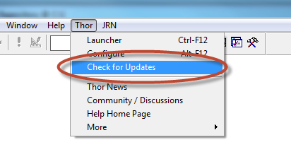
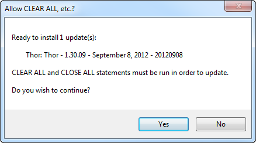
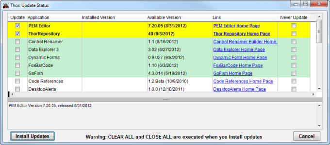

一键更新 Thor
===
_本文档由 xinjie 于 2018-04-07 翻译_

使用 IDE Tools 和其他工具更新[Thor](Thor.md)，[Thor 仓库](Thor_repository.md)，[PEM 编辑器 7](https://github.com/VFPX/PEMEditor) 因为[VFPX](https://github.com/VFPX)中的所有项目都可以通过 Thor 菜单上的单个菜单（在 FoxPro 系统菜单中）使用。 菜单'检查更新'可检查是否有更新可用于任何这些应用程序; 如果找到，它们会被自动下载并安装。

“检查更新”从确定是否有更新版本的 Thor 开始。 如果存在，它会显示如下消息：

然后继续检查所有其他可用应用程序和工具的更新，如下所示。 请注意[PEM 编辑器](https://github.com/VFPX/PEMEditor)和[Thor 仓库](Thor_repository.md)是[Thor](Thor.md)的重要组成部分; 您应该立即下载它们，并随时在“检查更新”窗体上显示更新它们。 表格中绿色的项目是最近更新的项目

检查更新中列出的项目在五个分组中按字母顺序列出：

1.  您已下载的项目有更新的版本。(参看 #4)
2.  您尚未下载的项目在过去三个月内有更新
3.  您尚未下载的所有其他项目
4.  您已经下载并且是最新的项目
5.  所有标记为“从不更新”的项目。 这优先于任何其他类别。

### 这些更新安装在哪里？

如果您已经有[Thor](Thor.md)，[PEM 编辑器](https://github.com/VFPX/PEMEditor)或[GoFish](https://github.com/mattslay/GoFish)的版本， 此更新过程将用新版本替换已安装的版本。 您将不会丢失已经在这些已安装工具的文件夹中完成的任何工作。

如果您**没有**安装过，则更新过程会将它们安装在 Thor 文件夹（Thor\Tools\Apps）的子文件夹中。

### 重要提示

作为“检查更新”一部分而自动下载的应用程序不仅可以下载，而且还可以安装并准备运行。 为了开始使用它们，您无需做任何其他事情。

### 建议

Thor 通过运行 RunThor.PRG 启动，该文件是作为安装过程的一部分创建的。 该文件可以复制到您希望的任何其他文件夹中（例如在您的路径中），因为它包含对安装Thor的文件夹的明确引用。

1.  由于此过程在启动 FoxPro 之后立即运行，因此在开始工作之前以及在打开`PEM 编辑器`之前以及在没有其他 FoxPro 会话正在运行的情况下运行，我们建议您将 RunThor 作为 IDE 设置的一部分调用
2.  随着 Thor 的不断发展，不时有更新。 我们建议使用参数7调用 RunThor，以便每周自动运行“检查更新”。
