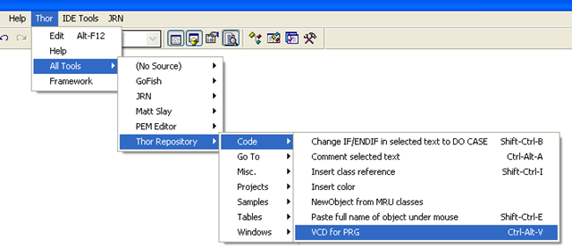

#### Version 0.9 – 9.3, 2011
 _本文档由 xinjie 于 2018-04-06 翻译_

### 目的

此工具的目的在于使用可视化的类设计器来编辑一个基于 PRG 的自定义类成为可能（仅限于不包含子对象的类）。

### 优点

拥有可视化类设计器(继承、智能感应以及同时打开多个多个代码窗口等) 和 Thor 的 IDE 工具 (GoToDefinition, ExtractToMethod, 等)的所有优点

### 用法

VCD4PRG 可以通过 Thor 菜单访问，就像下图这样。最好，你为它指定一个快捷键。



### **如何使用 – 一个示例**

有几种不同的方式可以使 VCD4PRG 针对基于 PRG 格式的类工作。这里是最简单的步骤：

1.  使用 ‘Modify Command’ 打开 PRG 文件，并将光标至于类定义内部的任意位置。
2.  如上图所示使用工具。这将转换PRG类为一个临时的 VCX 类。
3.  根据需要对类进行一些修改(增加属性和方法等)
4.  在当前窗口为临时 VCX 或者它的任意方法窗口使，再次使用该工具将类定义回写到 PRG 类的窗口。

### 如何处理不可调和的分歧

在 PRG 类和 VCX 类之间存在清晰的界限，所以当转换PRG类为VCX时，必须对可用于 PRG 类但是不能直接用于 VCX 的部分予以调整。因为 VCX 必须包含基于 PRG 的整个类定义，所以需要一些技巧，这是你必须要清楚的地方：

*   在 PRG 类中，针对属性描述没有统一的标准。然而，一个常见的用法是，在属性的前一行来描述属性或者在和属性定义的同一行用注释进行描述(例如 Rick Strahl 的 West-Wind Help 生成器中那样的处理)。这些属性定义在此工具下是可用的。(为了允许很长的属性描述，属性定义的“前一行”，可以是带有续行符号的多行描述)。在VCX中的属性描述将按照此格式予以导出。
*   在 PRG 类中，针对方法的描述具有同样的问题。然而，一个常见的用法是，在紧挨着 PROCEDURE 这一行的前一行对方法予以描述（同样，例如 Rick Strahl 的 West-Wind Help 生成器中那样的处理）。本工具适用这种描述方式，注意，描述方法的注释中不能存在空行且和方法定义之间不能存在空行。由于在 VCX 中的属性描述有254个字符的限制，所以，当从 PRG 转换为 VCX 时，PRG 中的方法描述将被置于方法代码的开始部分。当回写到 PRG 时，它位于方法的内部而不是外部。
*   在 PRG 类中，允许多条 #Include 语句，同时，#Define 语句和注释，允许存在于类定义中。但在 VCX 中，并没有对应的结构存在。所有这些行（除上述注释行外）在回写到 PRG 中时，都会放置在 DEFINE CLASS 语句之后。注意，这将包括在 PROCEDURES 和 ENDPROC 之间的注释。
*   PRG 类可以将值分配给数组，在 VCX 中不存在等价的方式。这些任务将在 VCX 类的 INIT 中予以完成。
*   PRG 类允许在过程定义的同一行列出 LParameters ：PROCEDURE SomeProcedure(参数列表)。这些参数将被移动到方法的 LParaments 列表中。

### 非可视类的处理

在 VFP 中有四个类不能用可视化的方式予以处理(Session, Column, Header, 和 Exception)。这些类仍旧可以使用 VCD4PRG 进行编辑，因为它们在进行操作时是导出为基于 Custom 类来进行操作。当回写到PRG时，它们将依据最初的基类重新予以创建。

### 启动 VCD4PRG 的替代方法

*   #### 在一个打开 PRG 的代码窗口：

    *   如果光标位于类定义的过程的内部，则光标所处的类将被予以操作并打开该过程。
    *   如果光标位于类定义内部而不在过程内部，则类被打开。
    *   如果不是上述两种情况，将弹出一个窗口让你选择一个类来进行操作。
    
*   #### 如果当前窗口是一个 PRG、类设计器或者方法代码窗口：

    *   使用 GetFile(‘PRG’) 来选择一个包含类定义的 PRG 文件，然后弹出一个窗口让你选择其中的一个类进行操作。注意：此时，PRG 文件并没有被你用其他任何方式打开。
    
*   #### 以编程的方式打开：

    *   以下代码行可用于以编程方式打开类的过程，而不是通过热键。

```foxpro
Result = ExecScript (_screen.cThorDispatcher, 'THOR_TOOL_REPOSITORY_VCD4PRG', lcSomePRGFileName)
```


*   注意：如果 PRG 中包含任何的类定义，你将被要求选择一个类来进行操作；如果不包含类定义，文件仅仅是被打开。因此，这样的命令可以被用于项目钩子的 QueryModifyFile 事件中，如果文件包含类定义，那么就会触发类的修改行为。

### 版本历史

Version 0.9 – 9. 3, 2011

*   在 #IF / #ENDIF 语句之间的文本保持原状（像注释一样处理）。
*   当 PRG 文件被更新时创建 *.BAK 备份文件。
*   VCX 中方法的描述将被忽略。
*   识别来自 VCX 的父类。
*   如果找不到父类则生成相应的错误消息。

Version 0.04 – 9. 1, 2011

*   解决在 DEFINE CLASS 语句中查找父类的问题。
*   处理不包含在 Procedure 过程块中的注释、#Include 语句、#Define 语句。
*   以Rick Strahl的WestWind为基础，使用属性描述的结构。

Version 0.02 – 8. 27, 2011

*   保存时，首先关闭所有的 VCX/SCX 代码窗口，确保不会丢失任何的工作。很不幸的是，无法区别 VCX 和 SCX 的代码窗口，也不能区分它们属于哪个 VCX 或者 SCX，因此在打开多个 VCX 和 SCX 情况下，所有的代码窗口都将被关闭。
*   可以编辑无法可视化定义的类(Session, Column, 和 Header')；它们被看作 ‘Custom’ 类，这可能会导致一些固有的 PEMs 被错误处理（这好像是次要的）。
*   在回写文件而不是代码窗口时，MessageBox 被用于通知操作已完成。任何原因造成的失败都会显示适当的提示信息（例如，如果文件已被打开，以便通过修改命令进行编辑）。
