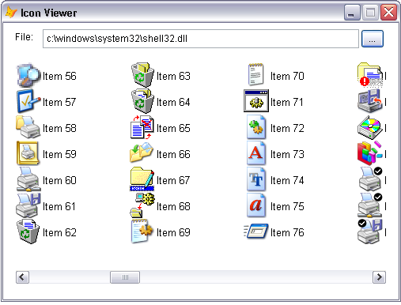

[ 主页 ](https://github.com/VFP9/Win32API)  

# 如何查看存储在可执行文件中的图标(图标浏览器) - II
_翻译：xinjie  2021.01.02_

## 开始之前：
一个API ImageList对象被创建并填充了从指定的可执行文件或库文件中提取的图标。然后，ImageList被链接到表单上的ListView控件。ListView中的每个项目代表一个图标。  

  

参考：

* [Windows Shell 图标显示并导出到ICO文件（Vista）](sample_575.md)  
* [显示文件和文件夹的相关图标和说明](sample_530.md)  
* [转换图像文件到图标文件（ICO）](sample_503.md)  
* [GDI+：在图像文件中存储DLL图标资源](sample_501.md)  
  
***  


## 代码：
```foxpro  
PUBLIC oForm As TForm
oForm = CREATEOBJECT("TForm")
oForm.Visible=.T.
* 主程序结束

DEFINE CLASS Tform As Form
#DEFINE GWL_STYLE -16
#DEFINE LVM_FIRST 0x1000
#DEFINE LVM_SETIMAGELIST (LVM_FIRST + 3)
#DEFINE LVM_SETITEM (LVM_FIRST + 6)
#DEFINE LVIF_IMAGE 0x0002
#DEFINE LVSIL_SMALL 1
#DEFINE LVSIL_NORMAL 0
#DEFINE LVS_SHAREIMAGELISTS 0x0040

	Width=500
	Height=350
	Borderstyle=2
	MaxButton=.F.
	Autocenter=.T.
	Caption="Icon 查看器"
	BackColor=RGB(255,255,255)
	imagelist32=NULL

	ADD OBJECT lst As TListView WITH Left=16, Top=50,;
	Width=468, Height=280
	
	ADD OBJECT lbl As Label WITH Caption="文件:",;
	Left=15, Top=10, BackStyle=0

	ADD OBJECT txt As TextBox WITH Left=50, Top=8,;
	Height=24, Width=400

	ADD OBJECT cmdFile As CommandButton WITH Caption="...",;
	Top=8, Left=452, Width=30, Height=24

PROCEDURE Init
	THIS.declare
	THIS.imagelist32 = CREATEOBJECT("TIconList32")
	THIS.txt.Value = application.ServerName
	THIS.ShowIcons

PROCEDURE Destroy
	CLEAR EVENTS

PROCEDURE cmdFile.Click
	ThisForm.SelectFile

FUNCTION SelectFile
* 选择包含图标资源的DLL或可执行文件
	LOCAL cResult, cPath, cStoredPath
	cPath = SYS(5) + SYS(2003)
	cStoredPath = FULLPATH(THIS.txt.Value)
	cStoredPath = SUBSTR(cStoredPath, 1, RAT(CHR(92),cStoredPath)-1)
	
	SET DEFAULT TO (cStoredPath)
	cResult = GETFILE("EXE;DLL", "获取文件:", "打开", 0)
	SET DEFAULT TO (cPath)
	
	IF NOT EMPTY(m.cResult)
		THIS.txt.Value = LOWER(m.cResult)
		THIS.ShowIcons
	ENDIF

PROCEDURE ShowIcons
* 创建ListView项目，每个项目都显示图像列表中的图标
	LOCAL nImageCount, nImageIndex

	THIS.lst.ListItems.Clear
	nImageCount = THIS.imagelist32.LoadIconsFromFile(THIS.txt.Value)
*!*		nImageCount = ImageList_GetImageCount(THIS.imagelist32.himl)
	THIS.ResetImageList
	THIS.AssignImageList
	
	FOR nImageIndex=0 TO nImageCount-1
		oItem = THIS.lst.ListItems.Add(,,;
			"Item " + TRANSFORM(nImageIndex))
		THIS.SetIcon(oItem.Index, nImageIndex)
	NEXT

PROCEDURE SetIcon(nItemIndex, nImageIndex)
* 设置listitem的图标
    LOCAL cItemBuffer  && LVITEM structure

    cItemBuffer = num2dword(LVIF_IMAGE) +;
    	num2dword(nItemIndex-1) + num2dword(0) + num2dword(0) +;
    	num2dword(0) + num2dword(0) + num2dword(0) +;
    	num2dword(nImageIndex) + num2dword(0)

    = SendMessageS(THIS.lst.hWnd, LVM_SETITEM, 0, @cItemBuffer)

PROCEDURE ResetImageList
* 断开连接到ListView的任何图像列表
	WITH THIS.lst
		= SendMessage(.HWND, LVM_SETIMAGELIST, LVSIL_SMALL, 0)
		= SendMessage(.HWND, LVM_SETIMAGELIST, LVSIL_NORMAL, 0)
		= INKEY(0.1)
	ENDWITH

PROCEDURE AssignImageList
* 将this.imagelist32图像列表连接到ListView
	LOCAL nWStyle, cBuffer, nImageCount, nISizeX, nISizeY
	cBuffer = REPLICATE(CHR(0), 1024)

	WITH THIS.lst
		* 防止在释放ListView时销毁附加的图像列表
		nWStyle = GetWindowLong(.HWND, GWL_STYLE)
		nWStyle = BITOR(m.nWStyle, LVS_SHAREIMAGELISTS)
		SetWindowLong(.HWND, GWL_STYLE, nWStyle)

		= SendMessage(.HWND, LVM_SETIMAGELIST,;
			LVSIL_SMALL, THIS.imagelist32.himl)
	ENDWITH

PROCEDURE declare
	DECLARE INTEGER SendMessage IN user32;
		INTEGER hWindow, INTEGER Msg,;
		INTEGER wParam, INTEGER lParam

	DECLARE INTEGER SendMessage IN user32 AS SendMessageS;
		INTEGER hWindow, INTEGER Msg,;
		INTEGER wParam, STRING @lParam

	DECLARE INTEGER SetWindowLong IN user32;
		INTEGER hWindow, INTEGER nIndex, INTEGER dwNewLong

	DECLARE INTEGER GetWindowLong IN user32;
		INTEGER hWindow, INTEGER nIndex

ENDDEFINE

DEFINE CLASS TListView As OleControl
	OleClass="MSComctlLib.ListViewCtrl"

PROCEDURE Init
	WITH THIS
		.View=2
		.Appearance=0
		.BorderStyle=0
		.Arrange=0
		.LabelEdit=1
		.FullRowSelect=0
		.Font.Size=10
		.AddColumnHeader("Type", 130)
		.hideselection=.F.
	ENDWITH

PROCEDURE AddColumnHeader(cCaption, nWidth)
	WITH THIS.ColumnHeaders.Add()
		.Text=cCaption
		.Width=nWidth
	ENDWITH

ENDDEFINE

DEFINE CLASS TIconList32 As Session
* ImageList对象的部分实现
* 类似于ImageList ActiveX控件
#DEFINE ILC_COLOR 0x0000
#DEFINE ILC_COLOR8 0x0008
#DEFINE ILC_COLOR16 0x0010
#DEFINE ILC_COLOR24 0x0018
#DEFINE ILC_COLOR32 0x0020
#DEFINE ILC_MASK 0x0001
#DEFINE ICONINFO_SIZE 20
#DEFINE DEVICECAPS_BITSPIXEL 12
	himl=0

PROCEDURE Init
	THIS.declare
	THIS.CreateImageList

PROCEDURE CreateImageList
	LOCAL hWindow, hDC, bpp, nColorFlag

	* 找出当前每像素的颜色位数
	hWindow = _screen.HWnd
	hDC = GetDC(hWindow)
	bpp = GetDeviceCaps(m.hDC, DEVICECAPS_BITSPIXEL)
	= ReleaseDC(m.hWindow, m.hDC)
	
	* 选择对应当前bpp的图标集
	DO CASE
	CASE m.bpp = 32
		nColorFlag = ILC_COLOR32
	CASE m.bpp = 24
		nColorFlag = ILC_COLOR24
	CASE m.bpp = 16
		nColorFlag = ILC_COLOR16
	CASE m.bpp = 8
		nColorFlag = ILC_COLOR8
	OTHERWISE
		nColorFlag = ILC_COLOR
	ENDCASE

	THIS.himl = ImageList_Create(32, 32,;
		BITOR(m.nColorFlag, ILC_MASK), 0, 512)

PROCEDURE ClearIcons
*!*		LOCAL nIconCount
*!*		DO WHILE .T.
*!*			nIconCount = ImageList_GetImageCount(THIS.himl)
*!*			IF nIconCount > 0
*!*				= ImageList_Remove(THIS.himl, 0)
*!*			ELSE
*!*				EXIT
*!*			ENDIF
*!*		ENDDO
	= ImageList_Remove(THIS.himl, -1) && removes all

PROCEDURE LoadIconsFromFile(cSourceFile As String) As Number
* 从指定的文件中提取图标资源，并将其加载到这个图像列表中。
	THIS.ClearIcons

	LOCAL nIconIndex, hIcon, cBuffer, hbmMask, hbmColor, nResult
	nIconIndex = 0

	DO WHILE .T.
		hIcon = ExtractIcon(0, cSourceFile, nIconIndex)
		IF hIcon <> 0
			cBuffer = REPLICATE(CHR(0), ICONINFO_SIZE)
			= GetIconInfo(m.hIcon, @cBuffer)

			hbmMask = buf2dword(SUBSTR(cBuffer,13,4))
			hbmColor = buf2dword(SUBSTR(cBuffer,17,4))
			nResult = ImageList_Add(THIS.himl, hbmColor, hbmMask)
			
			= DestroyIcon(hIcon)
			nIconIndex = nIconIndex + 1
		ELSE
			EXIT
		ENDIF
	ENDDO
RETURN m.nIconIndex

PROCEDURE Destroy
	IF THIS.himl <> 0
		THIS.ClearIcons
		= ImageList_Destroy(THIS.himl)
		THIS.himl=0
	ENDIF

PROCEDURE declare
	DECLARE INTEGER DestroyIcon IN user32 INTEGER hIcon
	DECLARE INTEGER ImageList_Destroy IN comctl32 INTEGER himl
	DECLARE INTEGER GetDC IN user32 INTEGER hWindow

	DECLARE INTEGER ReleaseDC IN user32;
		INTEGER hWindow, INTEGER hdc

	DECLARE INTEGER GetDeviceCaps IN gdi32;
		INTEGER hdc, INTEGER nIndex

	DECLARE INTEGER ImageList_GetImageCount IN comctl32;
		INTEGER himl

	DECLARE INTEGER ExtractIcon IN shell32;
		INTEGER hInst, STRING lpszExeFileName,;
		INTEGER lpiIcon

	DECLARE INTEGER GetIconInfo IN user32;
		INTEGER hIcon, STRING @piconinfo

	DECLARE INTEGER ImageList_Create IN comctl32;
		INTEGER cx, INTEGER cy, LONG listflags,;
		INTEGER cInitial, INTEGER cGrow

	DECLARE INTEGER ImageList_Add IN comctl32;
		INTEGER himl, INTEGER hbmImage, INTEGER hbmMask

	DECLARE INTEGER ImageList_Remove IN comctl32;
		INTEGER himl, INTEGER imageindex

ENDDEFINE

*** static functions
FUNCTION buf2dword(lcBuffer)
RETURN Asc(SUBSTR(lcBuffer, 1,1)) + ;
	BitLShift(Asc(SUBSTR(lcBuffer, 2,1)),  8) +;
	BitLShift(Asc(SUBSTR(lcBuffer, 3,1)), 16) +;
	BitLShift(Asc(SUBSTR(lcBuffer, 4,1)), 24)

FUNCTION num2dword(lnValue)
#DEFINE m0 256
#DEFINE m1 65536
#DEFINE m2 16777216
	IF lnValue < 0
		lnValue = 0x100000000 + lnValue
	ENDIF
	LOCAL b0, b1, b2, b3
	b3 = Int(lnValue/m2)
	b2 = Int((lnValue - b3*m2)/m1)
	b1 = Int((lnValue - b3*m2 - b2*m1)/m0)
	b0 = Mod(lnValue, m0)
RETURN Chr(b0)+Chr(b1)+Chr(b2)+Chr(b3)  
```  
***  


## 函数列表：
[DestroyIcon](../libraries/user32/DestroyIcon.md)  
[ExtractIcon](../libraries/shell32/ExtractIcon.md)  
[GetDC](../libraries/user32/GetDC.md)  
[GetDeviceCaps](../libraries/gdi32/GetDeviceCaps.md)  
[GetIconInfo](../libraries/user32/GetIconInfo.md)  
[GetWindowLong](../libraries/user32/GetWindowLong.md)  
[ImageList_Add](../libraries/comctl32/ImageList_Add.md)  
[ImageList_Create](../libraries/comctl32/ImageList_Create.md)  
[ImageList_Destroy](../libraries/comctl32/ImageList_Destroy.md)  
[ImageList_GetImageCount](../libraries/comctl32/ImageList_GetImageCount.md)  
[ImageList_Remove](../libraries/comctl32/ImageList_Remove.md)  
[ReleaseDC](../libraries/user32/ReleaseDC.md)  
[SendMessage](../libraries/user32/SendMessage.md)  
[SetWindowLong](../libraries/user32/SetWindowLong.md)  

## 备注：
2007年5月24日：从头开始重写代码示例。 
  
ImageList ActiveX 控件封装了 comctl32 库中的几个 API 函数，如ImageList_Create, ImageList_GetImageCount等。  
  
在写这段代码的时候，我发现 API ImageList 对象比 ActiveX 对象更加可靠和可预测。例如，ImageList_Add 成功地将新图片添加到 ActiveX 控件中。但这并不影响其 ListImages 集合的 Count 属性。 
  
一个空的 ActiveX ImageList 控件的 hImageList 句柄总是零。要对这个家伙应用任何 ImageList API 函数，必须至少添加一张图片。这是我发现的一个不方便的功能。  
  
* * *  
阅读 Code Project 上的文章 [检索 Shell 图标](https://www.codeproject.com/Articles/2405/Retrieving-shell-icons) 。  
  
***  

