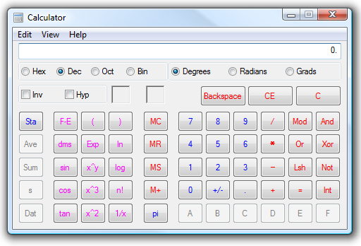

[ 主页 ](https://github.com/VFP9/Win32API)  

# 如何激活 Windows 计算器
_翻译：xinjie  2021.01.03_

## 开始之前：
这个代码示例解释了如何以编程方式打开 Windows 计算器的实例。  

  
  
***  


## 代码：
```foxpro  
PUBLIC frm
frm = CreateObject("Tform")
frm.Visible = .T.

DEFINE CLASS Tform As Form
#DEFINE WM_QUIT 18
#DEFINE SW_SHOWNORMAL 1
	Width=400
	Height=200
	Caption="激活 Windows 计算器"
	
	ADD OBJECT cmdShow As CommandButton WITH;
		Caption="显示计算器", Height=24, Width=100,;
		Top=5, Left=10

	ADD OBJECT cmdHide As CommandButton WITH;
		Caption="隐藏计算器", Height=24, Width=100,;
		Top=5, Left=112

PROCEDURE Init
	THIS.declare

PROCEDURE Destroy
	THIS._hide

PROCEDURE cmdShow.Click
	ThisForm._show

PROCEDURE cmdHide.Click
	ThisForm._hide

PROCEDURE _show
	LOCAL hWindow
	hWindow = FindWindow(Null, "Calculator")

	IF IsWindow(hWindow)=0
		= WinExec("calc.exe", SW_SHOWNORMAL)
		DOEVENTS
		hWindow = FindWindow(Null, "Calculator")
*		= SetParent(hWindow, _vfp.HWnd)
	ENDIF

	IF IsWindow(hWindow) <> 0
		= SetForegroundWindow(hWindow)
*		= SetParent(hWindow, _vfp.HWnd)
		THIS.PasteNumber(PI())
	ENDIF

PROCEDURE _hide
	LOCAL hWindow
	hWindow = FindWindow(Null, "Calculator")
	IF IsWindow(hWindow) <> 0
		= PostMessage(hWindow, WM_QUIT, 0,0)
	ENDIF

PROCEDURE PasteNumber(cNumber)
#DEFINE WM_KEYDOWN 0x0100
#DEFINE WM_KEYUP 0x0101
#DEFINE VK_CONTROL 0x11
#DEFINE KEYEVENTF_EXTENDEDKEY 1
#DEFINE KEYEVENTF_KEYUP 2

	LOCAL hWindow
	hWindow = FindWindow(Null, "Calculator")

	IF hWindow <> 0
		* 在剪贴板中存储数字
		STORE TRANSFORM(m.cNumber) TO _cliptext
		
		* 使计算器成为前景窗口
		= SetForegroundWindow(hWindow)

		* 模拟 CTRL+V 按键
		= keybd_event(VK_CONTROL, 0, 0, 0)
		= keybd_event(VkKeyScan(ASC("V")), 0, 0, 0)
		= keybd_event(VkKeyScan(ASC("V")), 0, KEYEVENTF_KEYUP, 0)
		= keybd_event(VK_CONTROL, 0, KEYEVENTF_KEYUP, 0)
	ENDIF

PROTECTED PROCEDURE declare
	DECLARE INTEGER SetForegroundWindow IN user32;
		INTEGER hWindow

	DECLARE INTEGER IsWindow IN user32 INTEGER hWindow

	DECLARE INTEGER FindWindow IN user32;
		STRING lpClassName, STRING lpWindowName

	DECLARE INTEGER WinExec IN kernel32;
		STRING lpCmdLine, INTEGER nCmdShow

	DECLARE INTEGER PostMessage IN user32;
		INTEGER hWindow, INTEGER Msg,;
		STRING @wParam, INTEGER lParam

	DECLARE keybd_event IN user32;
		SHORT bVk, SHORT bScan, INTEGER dwFlags,;
		INTEGER dwExtraInfo

	DECLARE SHORT VkKeyScan IN user32 INTEGER ch

	DECLARE INTEGER SetParent IN user32;
		INTEGER hWndChild,;
		INTEGER hWndNewParent

ENDDEFINE  
```  
***  


## 函数列表：
[FindWindow](../libraries/user32/FindWindow.md)  
[IsWindow](../libraries/user32/IsWindow.md)  
[PostMessage](../libraries/user32/PostMessage.md)  
[SetForegroundWindow](../libraries/user32/SetForegroundWindow.md)  
[SetParent](../libraries/user32/SetParent.md)  
[VkKeyScan](../libraries/user32/VkKeyScan.md)  
[WinExec](../libraries/kernel32/WinExec.md)  
[keybd_event](../libraries/user32/keybd_event.md)  

## 备注：
另外，你可以使用 SetParent 函数使主 VFP 窗口(_screen.hWnd 或 _vfp.hWnd)成为计算器的父窗口。在这种情况下，计算器窗口将被限制在主 VFP 窗口中。  
  
***  

