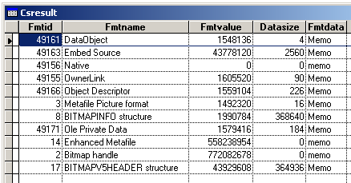
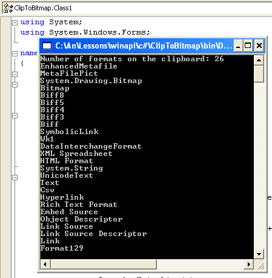

[ 主页 ](https://github.com/VFP9/Win32API)  

# 枚举剪贴板上当前可用的数据格式

## 开始之前：
多次运行此代码，每次将来自不同应用程序的新数据放在剪贴板上：IE，Word，Excel等。有时，从Excel电子表格复制的一个很小的单元格区域，就会获得“几十种格式”。 
  

使用GetClipboardData函数获得的值可以是句柄（如位图句柄），也可以是存储较大数据部分的全局内存地址。 使用API函数GlobalSize，CopyMemory以及可能的GlobalLock和GlobalUnlock来检索此数据。  

参考：

* [如何禁用 Windows 剪贴板(VFP9)](sample_488.md)  
* [监测剪贴板内容变化(VFP9)](sample_601.md)  
  
***  


## 代码：
```foxpro  
DO decl
= OpenClipboard(0)  && 0 表示活动窗口

CREATE CURSOR csResult (fmtid I, fmtname C(35),;
		fmtvalue N(16), datasize N(16), fmtdata M)

nIndex = 0  && 枚举从零开始
DO WHILE .T.
	nIndex = EnumClipboardFormats(nIndex)
	IF nIndex = 0
		EXIT
	ELSE
		cName = GetStdName(nIndex)
		hData = GetClipboardData(nIndex)
		nSize = GlobalSize(hData)
		
		SELECT csResult
		APPEND BLANK
		REPLACE fmtid WITH nIndex, fmtname WITH cName,;
			fmtvalue WITH hData, datasize WITH nSize

		IF nSize <> 0
			cBuffer = Repli(Chr(0), nSize)
			= CopyMemory(@cBuffer, hData, nSize)
			REPLACE fmtdata WITH cBuffer
		ENDIF
	ENDIF
ENDDO

= CloseClipboard()  && 重要
GO TOP
BROWSE NORMAL NOWAIT
* 主程序结束

FUNCTION  GetStdName (nIndex)
#DEFINE CF_BITMAP            2
#DEFINE CF_DIB               8
#DEFINE CF_DIBV5            17
#DEFINE CF_DIF               5
#DEFINE CF_DSPBITMAP       130
#DEFINE CF_DSPENHMETAFILE  142
#DEFINE CF_DSPMETAFILEPICT 131
#DEFINE CF_DSPTEXT         129
#DEFINE CF_ENHMETAFILE      14
#DEFINE CF_GDIOBJFIRST     768
#DEFINE CF_GDIOBJLAST     1023
#DEFINE CF_HDROP            15
#DEFINE CF_LOCALE           16
#DEFINE CF_METAFILEPICT      3
#DEFINE CF_OEMTEXT           7
#DEFINE CF_OWNERDISPLAY    128
#DEFINE CF_PALETTE           9
#DEFINE CF_PENDATA          10
#DEFINE CF_PRIVATEFIRST    512
#DEFINE CF_PRIVATELAST     767
#DEFINE CF_RIFF             11
#DEFINE CF_SYLK              4
#DEFINE CF_TEXT              1
#DEFINE CF_WAVE             12
#DEFINE CF_TIFF              6
#DEFINE CF_UNICODETEXT      13

	DO CASE
	CASE nIndex = CF_BITMAP
		RETURN "Bitmap 句柄"
	CASE nIndex = CF_DIB
		RETURN "BITMAPINFO 结构"
	CASE nIndex = CF_DIBV5
		RETURN "BITMAPV5HEADER 结构"
	CASE nIndex = CF_DIF
		RETURN "数据交换格式"
	CASE nIndex = CF_DSPBITMAP
		RETURN "专用 Bimtap 格式"
	CASE nIndex = CF_DSPENHMETAFILE
		RETURN "专用增强元文件格式"
	CASE nIndex = CF_DSPMETAFILEPICT
		RETURN "专用元文件格式"
	CASE nIndex = CF_DSPTEXT
		RETURN "专用文本格式"
	CASE nIndex = CF_ENHMETAFILE
		RETURN "增强元文件"
	CASE nIndex = CF_GDIOBJFIRST
		RETURN "GDI 对象格式开始"
	CASE nIndex = CF_GDIOBJLAST
		RETURN "GDI 对象格式结束"
	CASE nIndex = CF_HDROP
		RETURN "文件列表"
	CASE nIndex = CF_LOCALE
		RETURN "语言环境标识符句柄"
	CASE nIndex = CF_METAFILEPICT
		RETURN "Metafile 图片格式"
	CASE nIndex = CF_OEMTEXT
		RETURN "带有 OEM 字符集的文本格式"
	CASE nIndex = CF_OWNERDISPLAY
		RETURN "由剪贴板查看器查看的格式"
	CASE nIndex = CF_PALETTE
		RETURN "调色板句柄"
	CASE nIndex = CF_PENDATA
		RETURN "Pen Computing 格式"
	CASE nIndex = CF_PRIVATEFIRST
		RETURN "专用格式开始"
	CASE nIndex = CF_PRIVATELAST
		RETURN "专用格式结束"
	CASE nIndex = CF_RIFF
		RETURN "Audio 数据格式"
	CASE nIndex = CF_SYLK
		RETURN "微软符号链接格式"
	CASE nIndex = CF_TEXT
		RETURN "文本格式"
	CASE nIndex = CF_WAVE
		RETURN "标准 Wave 格式"
	CASE nIndex = CF_TIFF
		RETURN "Tagged 图像格式"
	CASE nIndex = CF_UNICODETEXT
		RETURN "Unicode 文本"
	OTHER
		RETURN GetRegName(nIndex)
	ENDCASE

FUNCTION  GetRegName(nIndex)
#DEFINE cmBufsize  250
	LOCAL cBuffer, nResult
	cBuffer = Repli(Chr(0), cmBufsize)
	nResult = GetClipboardFormatName(nIndex, @cBuffer, cmBufsize)
RETURN Iif(nResult=0, "", Left(cBuffer, nResult))

PROCEDURE  decl
	DECLARE INTEGER EnumClipboardFormats IN user32 INTEGER wFormat
	DECLARE INTEGER OpenClipboard IN user32 INTEGER hwnd
	DECLARE INTEGER CloseClipboard IN user32
	DECLARE INTEGER GetClipboardData IN user32 INTEGER uFormat
	DECLARE INTEGER GlobalSize IN kernel32 INTEGER hMem

	DECLARE INTEGER GetClipboardFormatName IN user32;
		INTEGER fmt, STRING @lpszFmtName, INTEGER cchMaxCount

	DECLARE RtlMoveMemory IN kernel32 As CopyMemory;
		STRING @Dst, INTEGER Src, INTEGER nLen  
```  
***  


## 函数列表：
[CloseClipboard](../libraries/user32/CloseClipboard.md)  
[EnumClipboardFormats](../libraries/user32/EnumClipboardFormats.md)  
[GetClipboardData](../libraries/user32/GetClipboardData.md)  
[GetClipboardFormatName](../libraries/user32/GetClipboardFormatName.md)  
[GlobalSize](../libraries/kernel32/GlobalSize.md)  
[OpenClipboard](../libraries/user32/OpenClipboard.md)  

## 备注：
此功能枚举格式放在剪贴板中的顺序。
已注册的剪贴板格式由 0xC000 到 0xFFFF 范围内的值标识。
  
现在，您可以看到_CLIPTEXT只是剪贴板的一小部分。
  
* * *  
一张 C# 实例的截图：  
  


***  

