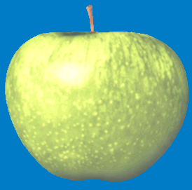
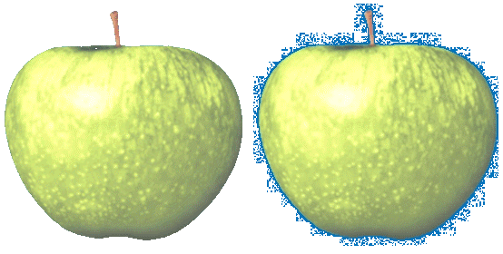
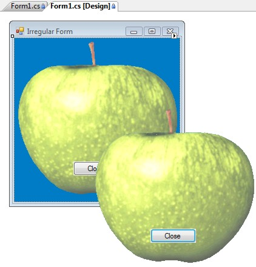
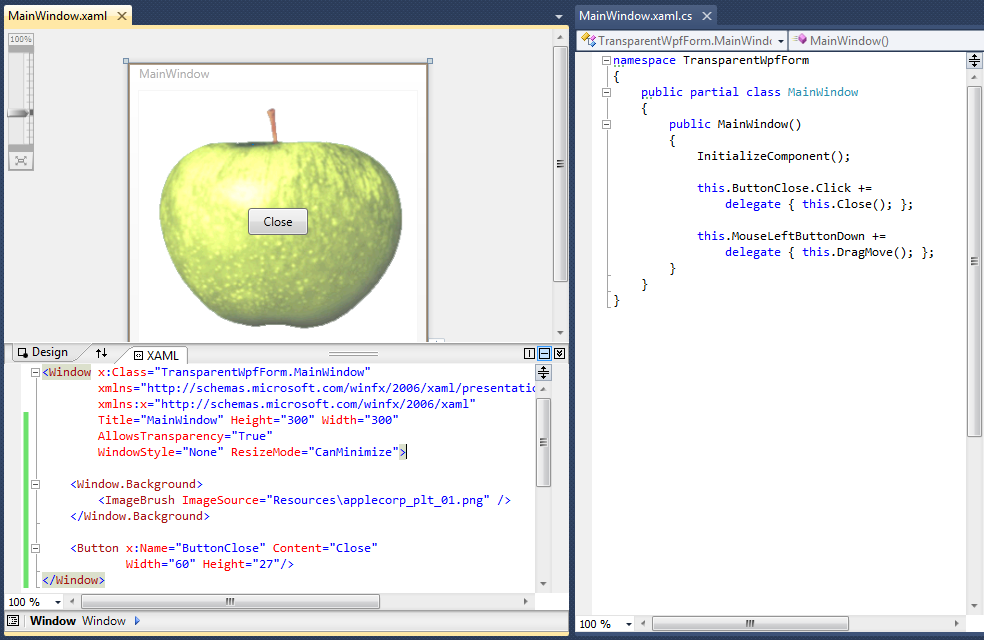

[ 主页 ](https://github.com/VFP9/Win32API)  

# 使用透明颜色键创建形状不规则的FoxPro表单
_翻译：xinjie  2021.01.03_

## 简述：
SetLayeredWindowAttributes 函数可以用来定义顶层 FoxPro 窗体的透明度颜色。这意味着窗体上所有带有这种颜色的区域，包括本机无窗口的FoxPro控件，都会变得透明。   
***  


## 开始之前：
在测试代码样本之前，先下载这个图片文件：  

  

SetLayeredWindowAttributes 函数可以用来定义顶层 FoxPro 窗体的透明度颜色键。这意味着窗体上所有带有这种颜色的区域，包括本机无窗口的 FoxPro 控件，都会变得透明。  

这种透明度不仅是视觉上的。对于*鼠标事件*来说，被屏蔽的区域也是透明的。这些事件是指向下面的窗口的。看起来鼠标透明度只对位图图像提供，而不是对 gif 和 jpegs。 

这张图片上的蓝调背景色的值是 RGB(0,121,197)，它作为透明度颜色键传递给 SetLayeredWindowAttributes 函数。  

参考：

* [圆形 FoxPro 表单](sample_143.md)  
* [如何在 FoxPro 窗体上绘制自定义窗口标题](sample_499.md)  
* [如何在表单中创建透明区域--在表单中打孔](sample_126.md)  
* [半透明表单](sample_453.md)  
  
***  


## 代码：
```foxpro  
oForm = CREATEOBJECT("Tform")
oForm.Visible=.T.
READ EVENTS

DEFINE CLASS Tform As Form
#DEFINE WM_SYSCOMMAND 0x112
#DEFINE WM_LBUTTONUP 0x202
#DEFINE MOUSE_MOVE 0xf012
#DEFINE LWA_COLORKEY 1
#DEFINE LWA_ALPHA 2
#DEFINE GWL_EXSTYLE -20
#DEFINE WS_EX_LAYERED 0x80000
#DEFINE SM_CYSIZE 31
#DEFINE SM_CXFRAME 32
#DEFINE SM_CYFRAME 33

	Width=350
	Height=350
	BorderStyle=0
	ShowWindow=2  && important!!
	Autocenter=.T.
	KeyPreview=.T.

	ADD OBJECT img As Image WITH Left=10, Top=10, Width=100, Height=100,;
	Picture="applecorp_plt.bmp", MaskingColor=RGB(0,123,197)

	ADD OBJECT Label1 As Label WITH Alignment=2,;
	Left=100, Top=140, BackStyle=0, Autosize=.T.,;
	Caption="按 ESC 键关闭此表单" + CHR(13) + CHR(13) +;
		"使用鼠标移动此表单", WordWrap=.T.

PROCEDURE Init(cImageFile, nMaskingColor)
	THIS.declare
	THIS.RemoveFrame
	THIS.SetTransparentMode

PROCEDURE Destroy
	CLEAR EVENTS

PROCEDURE KeyPress
LPARAMETERS nKeyCode, nShiftAltCtrl
	IF nKeyCode=27
		THIS.Release
	ENDIF

PROCEDURE OnMouseDown
LPARAMETERS nButton, nShift, nXCoord, nYCoord
	IF nButton = 1
		= ReleaseCapture()
		= SendMessage(THIS.HWnd, WM_SYSCOMMAND, MOUSE_MOVE, 0)
		= SendMessage(THIS.HWnd, WM_LBUTTONUP, 0, 0)
	ENDIF

PROCEDURE img.MouseDown
LPARAMETERS nButton, nShift, nXCoord, nYCoord
	ThisForm.OnMouseDown(nButton, nShift, nXCoord, nYCoord)

PROCEDURE Label1.MouseDown
LPARAMETERS nButton, nShift, nXCoord, nYCoord
	ThisForm.OnMouseDown(nButton, nShift, nXCoord, nYCoord)

PROTECTED PROCEDURE SetTransparentMode
	LOCAL nExStyle
	nExStyle = GetWindowLong(THIS.HWnd, GWL_EXSTYLE)
	nExStyle = BITOR(nExStyle, WS_EX_LAYERED)
	= SetWindowLong(THIS.HWnd, GWL_EXSTYLE, nExStyle)
	= SetLayeredWindowAttributes(THIS.HWnd,;
		THIS.img.MaskingColor, 0, LWA_COLORKEY)

PROTECTED PROCEDURE RemoveFrame
	LOCAL x0, y0, x1, y1, hRgn

	* 你可以用 SYSMETRIC() 来代替计算区域。
	x0 = GetSystemMetrics(SM_CXFRAME) +;
		THIS.img.Left

	y0 = GetSystemMetrics(SM_CYSIZE) +;
		GetSystemMetrics(SM_CYFRAME) +;
		THIS.img.Top

	x1 = x0 + THIS.img.Width - 4
	y1 = y0 + THIS.img.Height - 4
	
	hRgn = CreateRectRgn(x0, y0, x1, y1)
	= SetWindowRgn(THIS.HWnd, m.hRgn, 1)

PROTECTED PROCEDURE declare
	DECLARE INTEGER ReleaseCapture IN user32
	DECLARE INTEGER GetSystemMetrics IN user32 INTEGER nIndex

	DECLARE INTEGER SendMessage IN user32;
		INTEGER hWindow, INTEGER Msg,;
		INTEGER wParam, INTEGER lParam

	DECLARE INTEGER CreateRectRgn IN gdi32;
		INTEGER nLeftRect, INTEGER nTopRect,;
	    INTEGER nRightRect, INTEGER nBottomRect

	DECLARE INTEGER SetWindowRgn IN user32;
		INTEGER hWindow, INTEGER hRgn, INTEGER bRedraw

	DECLARE INTEGER GetWindowLong IN user32;
		INTEGER hWindow, INTEGER nIndex

	DECLARE INTEGER SetWindowLong IN user32;
		INTEGER hWindow, INTEGER nIndex, INTEGER dwNewLong

	DECLARE INTEGER SetLayeredWindowAttributes IN user32;
		INTEGER hWindow, INTEGER crKey,;
		SHORT bAlpha, INTEGER dwFlags

ENDDEFINE  
```  
***  


## 函数列表：
[CreateRectRgn](../libraries/gdi32/CreateRectRgn.md)  
[GetSystemMetrics](../libraries/user32/GetSystemMetrics.md)  
[GetWindowLong](../libraries/user32/GetWindowLong.md)  
[ReleaseCapture](../libraries/user32/ReleaseCapture.md)  
[SendMessage](../libraries/user32/SendMessage.md)  
[SetLayeredWindowAttributes](../libraries/user32/SetLayeredWindowAttributes.md)  
[SetWindowLong](../libraries/user32/SetWindowLong.md)  
[SetWindowRgn](../libraries/user32/SetWindowRgn.md)  

## 备注：
重要的是要有完美的背景。 转换为JPEG可能会产生色彩伪影，因为图像的压缩方式是删除了不必要的部分。
  
观察掩盖的位图图像与其源自掩盖的JPEG图像之间的差异。 如前所述，只有位图图像才提供鼠标事件的透明度。 



请注意，Region API函数仍然被用来隐藏表单的框架。  
  
如果与单纯使用Region API调用相比，这种组合方式可以毫不费力地创建不规则的表单。毕竟，真正不规则的窗体可能不容易用Region的组合来塑造。 
  
SetLayeredWindowAttributes至少需要Win2K，并且只适用于顶层窗体（ShowWindow=2）。此外，当窗体被移动时，窗体周围可能会出现一个闪烁的黑色边框。  
  
* * *  
.NET WinForm 执行时的情况：  
  


* * *  
.NET WPF 的实现既简短又简单。在这种情况下，PNG图像的背景必须是透明的。  
  


***  

