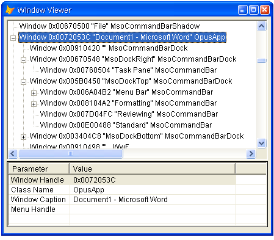

[ 主页 ](https://github.com/VFP9/Win32API)  

# 简单的窗体查看器
_翻译：xinjie  2021.01.07_

## 简述：
这段代码列举了从桌面窗口开始的所有窗口，并在TreeView控件中显示结果。  
***  


## 开始之前：
这段代码列举了从桌面窗口开始的所有窗口，并在TreeView控件中显示结果。  

  

参考：

* [枚举安装在本地机器上的设备](sample_545.md)  
  
***  


## 代码：
```foxpro  
LOCAL oForm As TWindowViewer
oForm = CREATEOBJECT("TWindowViewer")
oForm.Show(1)
* 主程序结束

DEFINE CLASS TWindowViewer As Form
PROTECTED enumwin
	Width=600
	Height=400
	AutoCenter=.T.
	Caption="窗体查看器"
	
	ADD OBJECT tree As Ttree WITH Left=5, Top=5
	ADD OBJECT lst As Tlst WITH Left=5

PROCEDURE Init
	THIS.enumwin = CREATEOBJECT("TWindow")

	LOCAL oRoot As Node
	oRoot = THIS.tree.Nodes.Add(,,;
		THIS.KeyFromHWND(THIS.enumwin.hwindow),;
		"Windows 桌体 (" + THIS.enumwin.winclass + ")")
	oRoot.Tag = THIS.enumwin.hwindow

	= BINDEVENT(THIS.enumwin, "OnWindowEnumerated",;
		THIS, "OnWindowEnumerated")

	= BINDEVENT(THIS.tree, "NodeClick", THIS, "OnNodeClick")

	THIS.enumwin.EnumChildWindows
	oRoot.Expanded=.T.
	
	* 在此表单上设置选择
	LOCAL oNode
	oNode = THIS.NodeFromHWND(THIS.Hwnd)
	
	WITH oNode
		.Expanded=.T.
		.EnsureVisible()
		.Selected=.T.
	ENDWITH
	THIS.Resize

PROCEDURE Destroy
	CLEAR EVENTS

PROTECTED PROCEDURE OnNodeClick
PARAMETERS oNode
	THIS.lst.ListItems.Clear
	LOCAL oWindow
	oWindow = THIS.enumwin.GetWindow(oNode.Tag)
	IF VARTYPE(m.oWindow) = "O"
		WITH oWindow
			THIS.ShowWinInfo("窗体句柄", TRANSFORM(.hwindow, "@0"))
			THIS.ShowWinInfo("类名", .winclass)
			THIS.ShowWinInfo("窗体标题", .wintext)
			THIS.ShowWinInfo("菜单句柄",;
				IIF(.hmenu=0, "", TRANSFORM(.hmenu, "@0")))
		ENDWITH
	ENDIF

PROTECTED PROCEDURE ShowWinInfo(cName, vValue)
	LOCAL oItem As ListItem
	oItem = THIS.lst.ListItems.Add(,, m.cName)
	oItem.SubItems(1) = m.vValue

PROCEDURE OnWindowEnumerated(oWindow As TWindowBase)
	LOCAL oParentNode As Node, oNode As Node
	oParentNode = THIS.NodeFromHWND(oWindow.directparent.hwindow)

	WITH oWindow
		oNode = THIS.tree.Nodes.Add(oParentNode, 4,;
			THIS.KeyFromHWND(.hwindow),;
			THIS.GetNodeText(m.oWindow))
		oNode.Tag = .hwindow
	ENDWITH

PROTECTED FUNCTION GetNodeText(oWindow As TWindowBase)
	WITH oWindow
		RETURN "窗体 " + TRANSFORM(.hwindow, "@0") +;
			[ "] + .wintext + [" ] + .winclass
	ENDWITH

PROTECTED FUNCTION KeyFromHWND(hWindow) As String
RETURN "#" + PADL(TRANSFORM(m.hWindow),12,"0")

PROTECTED FUNCTION NodeFromHWND(hWindow) As Node
	LOCAL oNode As Node, cKey
	cKey=THIS.KeyFromHWND(m.hWindow)
	TRY
		oNode=THIS.tree.Nodes(m.cKey)
	CATCH
		oNode=NULL
	ENDTRY
RETURN m.oNode

PROCEDURE Resize
	WITH THIS.tree
		.Width = THIS.Width - .Left*2
		.Height = MAX(60, THIS.Height - .Top - 120)
		TRY
			.SelectedItem.EnsureVisible()
			RAISEEVENT(THIS, "OnNodeClick", .SelectedItem)
		CATCH
		ENDTRY
	ENDWITH
	WITH THIS.lst
		.Width = THIS.Width - .Left*2
		.Top = THIS.tree.Top + THIS.tree.Height + 2
		.Height = MAX(60, THIS.Height - .Top - 10)
	ENDWITH
	
ENDDEFINE

DEFINE CLASS Ttree As OleControl
	OleClass="MSComctlLib.TreeCtrl"

PROCEDURE Init
	THIS.HideSelection=.F.
	THIS.PathSeparator="\"
	THIS.Style=7
	THIS.LineStyle=0
	THIS.LabelEdit=1
	THIS.Indentation=12
ENDDEFINE

DEFINE CLASS Tlst As OleControl
	OleClass="MSComctlLib.ListViewCtrl"
PROCEDURE Init
	THIS.HideSelection=.F.
	THIS.GridLines=.T.
	THIS.FullRowSelect=.T.
	THIS.View=3
	THIS.Arrange=0
	THIS.LabelEdit=1
	THIS.AddColumnHeader("参数", 100)
	THIS.AddColumnHeader("值", 380)

PROTECTED PROCEDURE AddColumnHeader(cCaption, nWidth)
	WITH THIS.ColumnHeaders.Add()
		.Text=cCaption
		.Width=nWidth
	ENDWITH
ENDDEFINE

DEFINE CLASS TWindow As TWindowBase
	allwindows=NULL

PROCEDURE Init
	THIS.declare
	THIS.globalparent=THIS
	THIS.allwindows = CREATEOBJECT("Collection")
	
	LOCAL hWindow
	hWindow = GetDesktopWindow()
	TWindowBase::EnumTopWindow(m.hWindow, THIS)

PROCEDURE Destroy
	IF VARTYPE(THIS.allwindows)="O"
		DO WHILE THIS.allwindows.Count > 0
			THIS.allwindows.Remove(1)
		ENDDO
	ENDIF
	TWindowBase::Destroy()

PROCEDURE GetWindow(hWindow) As TWindowBase
	LOCAL cKey, oWindow As TWindowBase
	cKey = "#" + LTRIM(STR(m.hWindow))
	
	TRY
		oWindow = THIS.allwindows.Item(m.cKey)
	CATCH
		oWindow=NULL
	ENDTRY
RETURN m.oWindow

PROCEDURE OnWindowEnumerated(oWindow As TWindowBase)
	THIS.allwindows.Add(oWindow, "#"+LTRIM(STR(oWindow.hwindow)))

PROTECTED PROCEDURE declare
	DECLARE INTEGER GetDesktopWindow IN user32
	DECLARE INTEGER GetParent IN user32 INTEGER hWindow
	DECLARE INTEGER GetMenu IN user32 INTEGER hWindow
	DECLARE INTEGER IsWindow IN user32 INTEGER hWindow

	DECLARE INTEGER GetWindow IN user32;
		INTEGER hWindow, INTEGER wFlag

	DECLARE INTEGER FindWindow IN user32;
		STRING lpClassName, STRING lpWindowName

    DECLARE INTEGER GetClassName IN user32;
        INTEGER hWindow, STRING lpClassName, INTEGER nMaxCount

	DECLARE INTEGER GetWindowText IN user32;
		INTEGER hWindow, STRING @lpString, INTEGER cch

	DECLARE INTEGER InternalGetWindowText IN user32;
		INTEGER hWnd, STRING @lpString, INTEGER nMaxCount
ENDDEFINE

DEFINE CLASS TWindowBase As Session
#DEFINE GW_HWNDLAST 1
#DEFINE GW_HWNDNEXT 2
#DEFINE GW_CHILD 5
	globalparent=NULL
	directparent=NULL
	hwindow=0
	winclass=""
	wintext=""
	hmenu=0
	childwindows=NULL
	hierarchy=0

PROCEDURE Init(hWindow As Integer, oParent As TWindowBase)
	THIS.EnumTopWindow(m.hWindow, m.oParent)
	THIS.EnumChildWindows

PROCEDURE EnumTopWindow(hWindow As Integer, oParent As TWindowBase)
	THIS.hwindow = m.hWindow
	THIS.directparent = oParent
	THIS.globalparent = oParent.globalparent
	THIS.hierarchy = oParent.hierarchy + 1
	THIS.winclass = THIS.GetClassName(THIS.hwindow)
	THIS.wintext = THIS.GetWinText(THIS.hwindow)
	THIS.hmenu = GetMenu(THIS.hwindow)
	THIS.globalparent.OnWindowEnumerated(THIS)

PROTECTED PROCEDURE ClearCWCollection
	IF VARTYPE(THIS.childwindows) = "O"
		DO WHILE THIS.childwindows.Count > 0
			WITH THIS.childwindows
				.Remove(1)
			ENDWITH
		ENDDO
	ENDIF

PROCEDURE EnumChildWindows
	THIS.ClearCWCollection
	THIS.childwindows = CREATEOBJECT("Collection")
	IF IsWindow(THIS.hwindow) = 0
		RETURN
	ENDIF

	LOCAL hFirstChild, hChild
	STORE GetWindow(THIS.hwindow, GW_CHILD) TO hFirstChild, hChild
	
	DO WHILE .T.
		IF IsWindow(m.hChild) = 0
			EXIT
		ENDIF
		
		LOCAL oWindow As TWindowBase
		oWindow = CREATEOBJECT("TWindowBase", m.hChild, THIS)
		THIS.childwindows.Add(oWindow, "#"+LTRIM(STR(m.hChild)))
		oWindow=NULL

		IF hChild = GetWindow(m.hChild, GW_HWNDLAST)
			EXIT
		ENDIF
		hChild = GetWindow(m.hChild, GW_HWNDNEXT)
	ENDDO

PROCEDURE Destroy
	THIS.ClearCWCollection
	THIS.directparent = NULL
	THIS.globalparent = NULL

FUNCTION GetClassName(hWindow)
    LOCAL nBufsize, cBuffer
    cBuffer = REPLICATE(Chr(0), 250)
    nBufsize = GetClassName(m.hWindow, @cBuffer, LEN(cBuffer))
RETURN SUBSTR(m.cBuffer, 1, m.nBufsize)

FUNCTION GetWinText(hWindow)
	LOCAL nBufsize, cBuffer
	nBufsize = 1024
	cBuffer = REPLICATE(CHR(0), nBufsize)
	nBufsize = InternalGetWindowText(hWindow, @cBuffer, nBufsize)
	cBuffer = IIF(nBufsize=0, "", LEFT(cBuffer, nBufsize*2))
RETURN STRCONV(m.cBuffer,6)

ENDDEFINE  
```  
***  


## 函数列表：
[FindWindow](../libraries/user32/FindWindow.md)  
[GetClassName](../libraries/user32/GetClassName.md)  
[GetDesktopWindow](../libraries/user32/GetDesktopWindow.md)  
[GetMenu](../libraries/user32/GetMenu.md)  
[GetParent](../libraries/user32/GetParent.md)  
[GetWindow](../libraries/user32/GetWindow.md)  
[GetWindowText](../libraries/user32/GetWindowText.md)  
[InternalGetWindowText](../libraries/user32/InternalGetWindowText.md)  
[IsWindow](../libraries/user32/IsWindow.md)  
