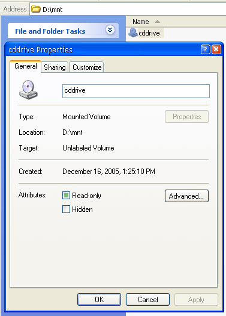

[ Home ](https://github.com/VFPX/Win32API)  

# 枚举卷和卷安装点(NTFS)
_翻译:xinjie  2021.01.20_

## 开始之前：
  

卷挂载点建立后，通过计算机重启自动维护。 

图为本地CDDRIVE设备挂载到D:\mnt\cddrive目录。 

谨慎处理这组功能。不要卸载C:等根目录，除非你知道自己在做什么。  

  
```foxpro
LOCAL oVolumes As TVolumes, oVolume As TVolume, oMountPoint  
oVolumes = CREATEOBJECT("TVolumes")  

*!*	? "[" + oVolumes.PointToVolume("Z") + "]"  
*!*	? oVolumes.MountVolume("d:\mnt\cddrive\", "E")  
*!*	? oVolumes.UnmountVolume("d:\mnt\cddrive\")  

FOR EACH oVolume IN oVolumes.volumes  
	WITH oVolume  
		?.volumename, .volumename1,;  
			.serialnumber, .drvletter  

		FOR EACH oMountPoint IN .mountpoints  
			? oMountPoint  
		NEXT  
	ENDWITH  
NEXT
```

***  


## 代码：
```foxpro  
DEFINE CLASS TVolumes As Session
#DEFINE INVALID_HANDLE_VALUE -1
#DEFINE MAX_PATH 260
	volumes=NULL

PROCEDURE Init
	THIS.declare
	THIS.volumes = CREATEOBJECT("Collection")
	THIS.EnumVolumes

PROCEDURE MountVolume(cMountPath, cDriveLetter)
* 类似于MOUNTVOL.EXE实用程序
* 用法：MountVolume（“ d：\ mnt \ cddrive \”，“ E”）
* 一切都是严格本地的
* 目录“ d：\ mnt \ cddrive \”必须存在
* CDROM必须存在并分配了逻辑驱动器号E
* 如果成功，则可以通过D上的路径访问CDROM：

	LOCAL cVolume
	cVolume = THIS.PointToVolume(cDriveLetter)
	IF EMPTY(cVolume)
		RETURN .F.
	ENDIF
RETURN (SetVolumeMountPoint(cMountPath, cVolume) <> 0)

PROCEDURE UnmountVolume(cMountPath)
* 需要反斜杠
	IF LEN(cMountPath) <= 3
	* 我建议不要卸载根目录
	* 像 C:\, D:\ 等等
		RETURN .F.
	ENDIF
RETURN (DeleteVolumeMountPoint(cMountPath) <> 0)

FUNCTION PointToVolume(cDriveLetter) As String
* 返回一个给定逻辑驱动器字母的乱码
* 例如: "D" --> \\?\Volume{...}\
	LOCAL cBuffer
	cBuffer = REPLICATE(CHR(0), MAX_PATH)
	= GetVolumeNameForVolumeMountPoint(cDriveLetter + ":\",;
		@cBuffer, LEN(cBuffer))
RETURN STRTRAN(cBuffer, CHR(0), "")

PROCEDURE EnumVolumes
	DO WHILE THIS.volumes.Count > 0
		THIS.volumes.Remove(1)
	ENDDO

	LOCAL hFind, cBuffer

	cBuffer = REPLICATE(CHR(0), MAX_PATH+1)
	hFind = FindFirstVolume(@cBuffer, LEN(cBuffer))

	IF hFind = INVALID_HANDLE_VALUE
		RETURN
	ENDIF

	DO WHILE .T.
		LOCAL oVolume As TVolume

		oVolume = CREATEOBJECT("TVolume",;
			STRTRAN(cBuffer, CHR(0), ""))

		THIS.volumes.Add(oVolume)
		oVolume=NULL

		cBuffer = REPLICATE(CHR(0), MAX_PATH+1)
		IF FindNextVolume(hFind, @cBuffer, LEN(cBuffer)) = 0
			EXIT
		ENDIF
	ENDDO
	= FindVolumeClose(hFind)

PROCEDURE declare
	DECLARE INTEGER SetVolumeMountPoint IN kernel32;
		STRING lpszVolumeMountPoint, STRING lpszVolumeName

	DECLARE INTEGER DeleteVolumeMountPoint IN kernel32;
		STRING lpszVolumeMountPoint

	DECLARE INTEGER GetVolumeNameForVolumeMountPoint IN kernel32;
		STRING lpszVolumeMountPoint, STRING @lpszVolumeName,;
		LONG cchBufferLength

	DECLARE INTEGER GetVolumePathNamesForVolumeName IN kernel32;
		STRING lpszVolumeName, STRING @lpszVolumePathNames,;
		LONG cchBufferLength, LONG @lpcchReturnLength

	DECLARE INTEGER FindFirstVolume IN kernel32;
		STRING lpszVolumeName, LONG cchBufferLength

	DECLARE INTEGER FindVolumeClose IN kernel32;
		INTEGER hFindVolume

	DECLARE INTEGER FindNextVolume IN kernel32;
		INTEGER hFindVolume, STRING @lpszVolumeName,;
		LONG cchBufferLength

	DECLARE INTEGER FindFirstVolumeMountPoint IN kernel32;
		STRING lpszRootPathName, STRING @lpszVolumeMountPoint,;
		LONG cchBufferLength

	DECLARE INTEGER FindNextVolumeMountPoint IN kernel32;
		INTEGER hFindVolumeMountPoint, STRING @lpszVolumeMountPoint,;
		LONG cchBufferLength

	DECLARE INTEGER FindVolumeMountPointClose IN kernel32;
		INTEGER hFindVolumeMountPoint

	DECLARE INTEGER GetVolumeInformation IN kernel32;
		STRING lpRootPathName, STRING @lpVolumeNameBuffer,;
		LONG nVolumeNameSize, LONG @lpVolumeSerialNumber,;
		LONG @lpMaximumComponentLength, LONG @lpFlags,;
		STRING @lpFileSystemNameBuffer, LONG nFileSystemNameSize

ENDDEFINE

DEFINE CLASS TVolume As Session
	volumename=""
	filesystemname=""
	volumename1=""
	serialnumber=""
	maxfilenamelen=0
	mountpoints=NULL
	pathnames=NULL
	drvletter=""

PROCEDURE Init(cName)
	THIS.volumename = m.cName
	THIS.GetInfo

	THIS.pathnames = CREATEOBJECT("Collection")
	THIS.EnumPathNames

	THIS.mountpoints = CREATEOBJECT("Collection")
	THIS.EnumMountPoints

PROCEDURE EnumPathNames
	THIS.drvletter=""
	DO WHILE THIS.pathnames.Count > 0
		THIS.pathnames.Remove(1)
	ENDDO
	
	LOCAL cBuffer, nBufsize, nCount, nIndex
	nBufsize=0
	cBuffer = REPLICATE(CHR(0), 0x4000)

	GetVolumePathNamesForVolumeName(THIS.volumename,;
		@cBuffer, LEN(cBuffer), @nBufsize)

	cBuffer = SUBSTR(cBuffer, 1, AT(CHR(0)+CHR(0), cBuffer))

	nCount = ALINES(arrPathNames, cBuffer, .T., CHR(0))
	THIS.drvletter = arrPathNames[1]
	FOR nIndex=1 TO nCount
		THIS.pathnames.Add(arrPathNames[nIndex])
	NEXT
	RELEASE arrPathNames

PROCEDURE GetInfo
	LOCAL cVNBuffer, nSNBuffer, nMaxCmpLen,;
		nFlags, cOSBuffer, nResult

	STORE REPLICATE(CHR(0), MAX_PATH+1) TO cVNBuffer, cOSBuffer
	STORE 0 TO nSNBuffer, nMaxCmpLen, nFlags

	nResult = GetVolumeInformation(THIS.volumename,;
		@cVNBuffer, LEN(cVNBuffer), @nSNBuffer,;
		@nMaxCmpLen, @nFlags, @cOSBuffer, LEN(cOSBuffer))

	IF nResult <> 0
		THIS.filesystemname=STRTRAN(cOSBuffer, CHR(0),"")
		THIS.volumename1=STRTRAN(cVNBuffer, CHR(0),"")
		THIS.serialnumber=TRANSFORM(nSNBuffer, "@0")
		THIS.maxfilenamelen=nMaxCmpLen
	ENDIF

PROCEDURE EnumMountPoints
	DO WHILE THIS.mountpoints.Count > 0
		THIS.mountpoints.Remove(1)
	ENDDO

	LOCAL hFind, cBuffer

	cBuffer = REPLICATE(CHR(0), MAX_PATH+1)
	hFind = FindFirstVolumeMountPoint(THIS.volumename,;
		@cBuffer, LEN(cBuffer))

	IF hFind = INVALID_HANDLE_VALUE
	* 18=ERROR_NO_MORE_FILES
	* 21=ERROR_NOT_READY
	* 123=ERROR_INVALID_NAME
		RETURN
	ENDIF

	DO WHILE .T.
		THIS.mountpoints.Add(STRTRAN(cBuffer, CHR(0), ""))

		cBuffer = REPLICATE(CHR(0), MAX_PATH+1)
		IF FindNextVolumeMountPoint(hFind,;
			@cBuffer, LEN(cBuffer)) = 0
			EXIT
		ENDIF
	ENDDO
	= FindVolumeMountPointClose(hFind)

ENDDEFINE  
```  
***  


## 函数列表：
[DeleteVolumeMountPoint](../libraries/kernel32/DeleteVolumeMountPoint.md)  
[FindFirstVolume](../libraries/kernel32/FindFirstVolume.md)  
[FindFirstVolumeMountPoint](../libraries/kernel32/FindFirstVolumeMountPoint.md)  
[FindNextVolume](../libraries/kernel32/FindNextVolume.md)  
[FindNextVolumeMountPoint](../libraries/kernel32/FindNextVolumeMountPoint.md)  
[FindVolumeClose](../libraries/kernel32/FindVolumeClose.md)  
[FindVolumeMountPointClose](../libraries/kernel32/FindVolumeMountPointClose.md)  
[GetVolumeInformation](../libraries/kernel32/GetVolumeInformation.md)  
[GetVolumeNameForVolumeMountPoint](../libraries/kernel32/GetVolumeNameForVolumeMountPoint.md)  
[GetVolumePathNamesForVolumeName](../libraries/kernel32/GetVolumePathNamesForVolumeName.md)  
[SetVolumeMountPoint](../libraries/kernel32/SetVolumeMountPoint.md)  

## 备注：
相关的注册表键:
HKEY_LOCAL_MACHINE\SYSTEM\MountedDevices  
HKEY_CURRENT_USER\Software\Microsoft\Windows\CurrentVersion\Explorer\MountPoints2  
  
* * *   
函数GetVolumeNameForVolumeMountPoint返回给定驱动器号的卷名。 卷名枚举调用也是如此。 我认为，卷名可用于唯一标识计算机。 例： 
> \\?\Volume{9da8b072-8130-22d6-ff8f-806d6172699f}\  
  
***  

