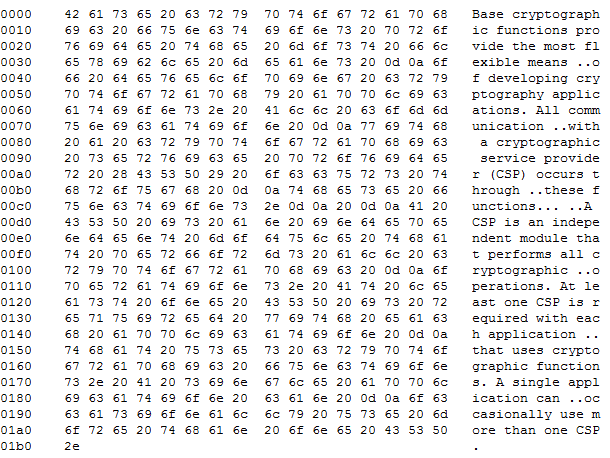

[ 主页 ](https://github.com/VFP9/Win32API)  

# 如何使用 Cryptography API 函数进行 Base64 编码/解码
_翻译：xinjie  2021.01.20_

## 代码：
```foxpro  
#DEFINE CRYPT_STRING_BASE64 0x0001
#DEFINE CRYPT_STRING_NOCRLF 0x40000000
#DEFINE CRYPT_STRING_NOCR 0x80000000

DO declare
SET MEMOWIDTH TO 120

LOCAL cBuffer, cEncoded, cDecoded

TEXT TO cBuffer NOSHOW
基本加密函数提供了开发加密应用程序的最灵活方法。与加密服务提供商 （CSP） 的所有通信都通过这些功能进行。

CSP 是执行所有加密操作的独立模块。每个使用加密函数的应用程序至少需要一个 CSP。单个应用程序偶尔可以使用多个 CSP。
ENDTEXT

cEncoded = ToBase64(m.cBuffer)
? cEncoded

cDecoded = FromBase64(cEncoded)
? cDecoded

* 主程序结束

FUNCTION ToBase64(cSrc)
	LOCAL nFlags, nBufsize, cDst
	nFlags=CRYPT_STRING_BASE64

	nBufsize=0
	= CryptBinaryToString(@cSrc, LEN(cSrc),;
		m.nFlags, NULL, @nBufsize)

	cDst = REPLICATE(CHR(0), m.nBufsize)
	IF CryptBinaryToString(@cSrc, LEN(cSrc), m.nFlags,;
		@cDst, @nBufsize) = 0
		RETURN ""
	ENDIF
RETURN cDst

FUNCTION FromBase64(cSrc)
	LOCAL nFlags, nBufsize, cDst
	nFlags=CRYPT_STRING_BASE64

	nBufsize=0
	= CryptStringToBinary(@cSrc, LEN(m.cSrc),;
		nFlags, NULL, @nBufsize, 0,0)

	cDst = REPLICATE(CHR(0), m.nBufsize)
	IF CryptStringToBinary(@cSrc, LEN(m.cSrc),;
		nFlags, @cDst, @nBufsize, 0,0) = 0
		RETURN ""
	ENDIF
RETURN m.cDst

PROCEDURE declare
	DECLARE INTEGER CryptBinaryToString IN Crypt32;
		STRING @pbBinary, LONG cbBinary, LONG dwFlags,;
		STRING @pszString, LONG @pcchString

	DECLARE INTEGER CryptStringToBinary IN crypt32;
		STRING @pszString, LONG cchString, LONG dwFlags,;
		STRING @pbBinary, LONG @pcbBinary,;
		LONG pdwSkip, LONG pdwFlags  
```  
***  


## 函数列表：
[CryptBinaryToString](../libraries/crypt32/CryptBinaryToString.md)  
[CryptStringToBinary](../libraries/crypt32/CryptStringToBinary.md)  

## 备注：
从VFP8开始，可以用STRCONV()进行base64转换。  
  
在我的测试中，本页介绍的 API 例程对字符串的编码和解码速度比STRCONV()快了大约2倍--在100K循环中，3.7秒：7.7秒。 
  
* * *  
这是调用CryptBinaryToString的输出，其中*dwFlags*设置为CRYPT_STRING_HEXASCIIADDR (0x000b)。可以作为开发一个简单的二进制查看器的良好起点。  



* * *  
来自 *Burkhard Stiller`s* VFP 博客:  
<a href="http://myvfpblog.blogspot.com/2007/10/encoded-your-images-base64-binary.html">在类中编码和存储图片数据的另一种方法</a> -- 与base64编码有关，它本身就是一个有趣的代码示例。  
  
***  

