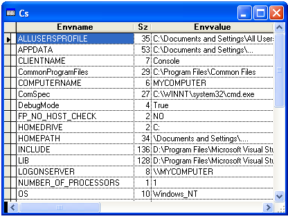

[ 主页 ](https://github.com/VFP9/Win32API)  

# 在游标中存储环境字符串
_翻译：xinjie  2021.01.20_

## 开始之前：
  

参考：

* [另一种检索环境字符串的方法](sample_132.md)  
* [写入 INI 文件](sample_137.md)  
* [读取和设置环境变量](sample_152.md)  

  
***  


## 代码：
```foxpro  
DO declare
LOCAL nProcAddr, cBuffer, nBufsize

* 获取当前进程的环境块地址
nProcAddr = GetEnvironmentStrings()
IF nProcAddr = 0
	RETURN
ENDIF

* 分配足够的缓冲区
nBufsize = GlobalSize(nProcAddr)
nBufsize = Iif(nBufsize=0, 4096, nBufsize)
cBuffer = Repli(Chr(0), nBufsize)
	
* 将内存块复制到缓冲区
= CopyMemory(@cBuffer, nProcAddr, Len(cBuffer))

* 零标志着环境块的结束。
cBuffer = Left(cBuffer, AT(Chr(0)+Chr(0), cBuffer))

* 目标游标
CREATE CURSOR cs (envname C(30), sz I, envvalue C(250))

LOCAL nIndex, ss, ch, lnPos, lcName, lcValue
ss = ""
FOR nIndex=1 TO Len(cBuffer)
	ch = SUBSTR(cBuffer, nIndex, 1)
	IF ch = Chr(0)
		lnPos = AT("=", ss)
		lcName = LEFT(ss, lnPos-1)
		lcValue = SUBSTR(ss, lnPos+1)
		INSERT INTO cs VALUES (lcName, Len(lcValue), lcValue)
		ss = ""
	ELSE
		ss = ss + ch
	ENDIF
ENDFOR

* 释放环境块
= FreeEnvironmentStrings(nProcAddr)

SELECT cs
GO TOP
BROW NORMAL NOWAIT
* 主程序结束

PROCEDURE declare
	DECLARE INTEGER GlobalSize IN kernel32 INTEGER hMem
	DECLARE INTEGER GetEnvironmentStrings IN kernel32

	DECLARE INTEGER FreeEnvironmentStrings IN kernel32;
		INTEGER lpszEnvBlock

  	DECLARE RtlMoveMemory IN kernel32 As CopyMemory;
		STRING @Dest, INTEGER Source, INTEGER nLength  
```  
***  


## 函数列表：
[FreeEnvironmentStrings](../libraries/kernel32/FreeEnvironmentStrings.md)  
[GetEnvironmentStrings](../libraries/kernel32/GetEnvironmentStrings.md)  
[GlobalSize](../libraries/kernel32/GlobalSize.md)  

## 备注：
这样你就可以得到所有的环境变量，所以你不需要像GetEnv()函数那样提供它们的名字。  
  
***  

