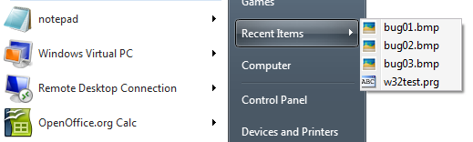
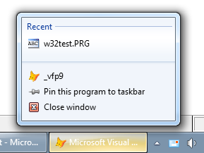

[ 主页 ](https://github.com/VFP9/Win32API)  

# 访问 Windows 最近文档的列表
_翻译：xinjie  2021.01.30_

## 开始之前：
该类实现将文档添加到系统*最近的文档*列表中。   

  


  

参考：

* [读取和设置当前进程的显式应用程序用户模型 ID （Win7）](sample_038.md)  
  
***  


## 代码：
```foxpro  
LOCAL oRecentDocs As WindowsRecentDocuments
oRecentDocs = CREATEOBJECT("WindowsRecentDocuments")

WITH oRecentDocs
*	.ClearDocuments
	.AddDocument( "C:\images\bug01.bmp" )
	.AddDocument( .PIDLFromPath("C:\images\image02.bmp") )

#IF VAL(OS(3))*10 + VAL(OS(4)) >= 61 && Win7
	* 只有VFP类型的文件才会被添加到VFP应用的最近列表中：DBF、PRG、SCX、PJX、VCX等。
	.AddDocumentToCurrentApp( "C:\projects\w32test.prg" )
#ENDIF

ENDWITH

DEFINE CLASS WindowsRecentDocuments As Session
#DEFINE SHARD_PIDL 0x00000001
#DEFINE SHARD_PATHA 0x00000002
#DEFINE SHARD_PATHW 0x00000003
#DEFINE MAX_PATH 260

#IF VAL(OS(3))*10 + VAL(OS(4)) >= 61 && Win7
	#DEFINE SHARD_APPIDINFO 0x00000004
	#DEFINE SHARD_APPIDINFOIDLIST 0x00000005
	#DEFINE SHARD_LINK 0x00000006
	#DEFINE SHARD_APPIDINFOLINK 0x00000007
	#DEFINE SHARD_SHELLITEM 0x00000008
#ENDIF

PROTECTED AppID
	AppID=0

PROCEDURE Init
	THIS.declare

PROCEDURE Destroy
	THIS.ReleaseAppID

PROTECTED PROCEDURE ReleaseAppID
	IF THIS.AppID <> 0
		= CoTaskMemFree( THIS.AppID )
		THIS.AppID = 0
	ENDIF

PROCEDURE ClearDocuments
* 清除最近的文件
	SHAddToRecentDocsC( SHARD_PATHA, NULL )

#IF VAL(OS(3))*10 + VAL(OS(4)) >= 61 && Win7

PROCEDURE AddDocumentToCurrentApp( vValue As Variant )
* 添加到当前VFP应用程序的任务栏中的最近类别。

	LOCAL nPIDL, cBuffer

	DO CASE
	CASE EMPTY( m.vValue )
		RETURN

	CASE VARTYPE(m.vValue) = "C"
		nPIDL = THIS.PIDLFromPath( m.vValue )

	CASE VARTYPE(m.vValue) = "N"
		nPIDL = m.vValue

	OTHERWISE
		RETURN
	ENDCASE

	THIS.ReadCurrentAppID && populates THIS.AppID
	
	cBuffer =;
		num2dword(m.nPIDL) +;
		num2dword( THIS.AppID )

	SHAddToRecentDocsC(;
		SHARD_APPIDINFOIDLIST, @cBuffer )

#ENDIF

PROCEDURE AddDocument( vValue As Variant )
	DO CASE
	CASE EMPTY( m.vValue )

	CASE VARTYPE(m.vValue) = "C"
	* vValue 必须是路径
		SHAddToRecentDocsC( SHARD_PATHA, m.vValue+CHR(0) )

	CASE VARTYPE(m.vValue) = "N"
	* vValue 必须是一个指向ITIMIDLIST（PIDL）的指针
		SHAddToRecentDocsN( SHARD_PIDL, m.vValue )

	ENDCASE

PROCEDURE PIDLFromPath(cPath As String) As Number
RETURN SHSimpleIDListFromPath(;
	THIS.ToUnicode(m.cPath))

PROCEDURE PathFromPIDL(nPIDL As Number) As String
	LOCAL cBuffer
	cBuffer = REPLICATE(CHR(0), MAX_PATH)
	SHGetPathFromIDList( nPIDL, @cBuffer )
RETURN STRTRAN(m.cBuffer, CHR(0), "")

PROCEDURE ToUnicode(cSource As String) As String
RETURN STRCONV(m.cSource+CHR(0),5)

PROCEDURE FindExecutable(cPath As String) As String
	LOCAL cBuffer
	cBuffer = REPLICATE(CHR(0), MAX_PATH)
	FindExecutable(cPath, NULL, @cBuffer)
RETURN STRTRAN(m.cBuffer, CHR(0), "")

PROCEDURE ReadCurrentAppID()
	THIS.ReleaseAppID

	LOCAL hAppID
	hAppID=0
	= API_GetAppID( @hAppID )
	THIS.AppID = m.hAppID

PROCEDURE declare
	DECLARE SHAddToRecentDocs IN shell32;
	AS SHAddToRecentDocsC;
		INTEGER uFlags, STRING @lpName

	DECLARE SHAddToRecentDocs IN shell32;
	AS SHAddToRecentDocsN;
		INTEGER uFlags, INTEGER lpName

	DECLARE INTEGER SHSimpleIDListFromPath IN shell32;
		STRING pszPath

	DECLARE INTEGER SHGetPathFromIDList IN shell32;
		INTEGER pidl, STRING @pszPat

	DECLARE INTEGER FindExecutable IN shell32;
		STRING lpFile, STRING lpDir,;
		STRING @lpResult

	DECLARE SHORT GetCurrentProcessExplicitAppUserModelID IN Shell32;
	AS API_GetAppID;
		INTEGER @AppID

	DECLARE CoTaskMemFree IN Ole32 INTEGER hMem

ENDDEFINE

FUNCTION num2dword(lnValue)
#DEFINE m0 0x0000100
#DEFINE m1 0x0010000
#DEFINE m2 0x1000000
	IF lnValue < 0
		lnValue = 0x100000000 + lnValue
	ENDIF
	LOCAL b0, b1, b2, b3
	b3 = Int(lnValue/m2)
	b2 = Int((lnValue - b3*m2)/m1)
	b1 = Int((lnValue - b3*m2 - b2*m1)/m0)
	b0 = Mod(lnValue, m0)
RETURN Chr(b0)+Chr(b1)+Chr(b2)+Chr(b3)  
```  
***  


## 函数列表：
[CoTaskMemFree](../libraries/ole32/CoTaskMemFree.md)  
[FindExecutable](../libraries/shell32/FindExecutable.md)  
[SHAddToRecentDocs](../libraries/shell32/SHAddToRecentDocs.md)  
[SHGetPathFromIDList](../libraries/shell32/SHGetPathFromIDList.md)  
[SHSimpleIDListFromPath](../libraries/shell32/SHSimpleIDListFromPath.md)  

## 备注：
如果该类的实例是在Windows 7下创建的，则方法*AddDocumentToCurrentApp*可用。 
  
* * *  
当应用程序启动时，如果该应用程序ID存在跳转列表，系统将恢复其跳转列表。 ([AppUserModelID](http://msdn.microsoft.com/en-us/library/dd378459(v=vs.85).aspx)).  
  
在Windows 7下，一个VFP应用程序在启动时收到一个通用的应用程序ID。显然，系统会根据启动应用程序的文件（快捷方式、可执行文件）来生成这样的ID。例如，由相同的快捷方式（除了路径不同）启动的两个VFP实例有不同的跳转列表。  
  
[更改应用程序ID]（sample_038.md）不会立即刷新附加到VFP主窗口的跳转列表。 但是更改后创建的任何顶级窗口都将显示链接到新应用程序ID的跳转列表。 
  
设置新的应用程序ID后，隐藏并重新显示VFP主窗口。这将刷新VFP任务栏图标上的跳转列表。也就是：
```foxpro
_screen.Visible = .F.  
_screen.Visible = .T.
```
***  

