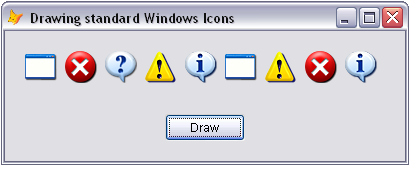

[ 主页 ](https://github.com/VFP9/Win32API)  

# 绘制标准的窗口图标
_翻译：xinjie 2021.06.26_

## 开始之前：
  
参考：

* [显示文件和文件夹的相关图标和说明](sample_530.md)  
* [如何查看存储在可执行文件中的图标(图标浏览器)](sample_113.md)  
* [绘制 Windows 框架控件](sample_254.md)  
* [绘制 Windows 预定义位图](sample_253.md)  
  
***  


## 代码：
```foxpro  
PUBLIC frm
frm = CREATEOBJECT("Tform")
frm.Visible = .T.
* 主程序结束

DEFINE CLASS Tform As Form
* 图标 Ids
#DEFINE IDI_APPLICATION  32512
#DEFINE IDI_ASTERISK  32516
#DEFINE IDI_ERROR  32513
#DEFINE IDI_EXCLAMATION  32515
#DEFINE IDI_HAND  IDI_ERROR
#DEFINE IDI_INFORMATION  IDI_ASTERISK
#DEFINE IDI_QUESTION  32514
#DEFINE IDI_WARNING  IDI_EXCLAMATION
#DEFINE IDI_WINLOGO  32517

	Width=400
	Height=130
	AutoCenter = .T.
	Caption = " 绘制标准的 Windows 图标"

	ADD OBJECT cmd As CommandButton WITH;
		Caption="绘制", Width=80, Height=27

PROCEDURE Init
	THIS.declare
	THIS.Resize

PROCEDURE Resize
	WITH THIS.cmd
		.Left = Int((ThisForm.Width - .Width)/2)
		.Top = THIS.Height - .Height - 20
	ENDWITH
	ThisForm.DrawIcons

PROCEDURE DrawIcons
	THIS._draw(IDI_APPLICATION, 20,20)
	THIS._draw(IDI_HAND, 60,20)
	THIS._draw(IDI_QUESTION, 100,20)
	THIS._draw(IDI_EXCLAMATION, 140,20)
	THIS._draw(IDI_ASTERISK, 180,20)
	THIS._draw(IDI_WINLOGO, 220,20)
	THIS._draw(IDI_WARNING, 260,20)
	THIS._draw(IDI_ERROR, 300,20)
	THIS._draw(IDI_INFORMATION, 340,20)

PROTECTED PROCEDURE _draw(lnIconId, X,Y)
	LOCAL hWindow, hdc, hicon
	hWindow = THIS.HWnd && GetFocus() for older VFP versions

	hdc = GetDC(hWindow)

	hicon = LoadIcon(0, lnIconId)
	IF hicon <> 0
		= DrawIcon(hdc, X,Y, hicon)
	ENDIF
	= ReleaseDC(hWindow, hdc)

PROCEDURE declare
	DECLARE INTEGER GetFocus IN user32
	DECLARE INTEGER GetDC IN user32 INTEGER hWindow

	DECLARE INTEGER LoadIcon IN user32;
		INTEGER hInstance, INTEGER lpIconName

	DECLARE SHORT DrawIcon IN user32;
		INTEGER hDC, INTEGER X, INTEGER Y, INTEGER hIcon

	DECLARE INTEGER ReleaseDC IN user32;
		INTEGER hWindow, INTEGER hdc

PROCEDURE Paint
	ThisForm.DrawIcons

PROCEDURE Moved
	ThisForm.DrawIcons

PROCEDURE cmd.Click
	ThisForm.DrawIcons

ENDDEFINE  
```  
***  


## 函数列表：
[DrawIcon](../libraries/user32/DrawIcon.md)  
[GetDC](../libraries/user32/GetDC.md)  
[GetFocus](../libraries/user32/GetFocus.md)  
[LoadIcon](../libraries/user32/LoadIcon.md)  
[ReleaseDC](../libraries/user32/ReleaseDC.md)  

## 备注：
由于图标不是通过 VFP 固有控件显示的，因此表单需要在Resize、Paint 和 Moved 方法中重新绘制图标。否则，例如，当表单被部分移动到VFP主窗口之外，然后再被移动到主窗口内时，图标就会被抹去。 
  
***  

