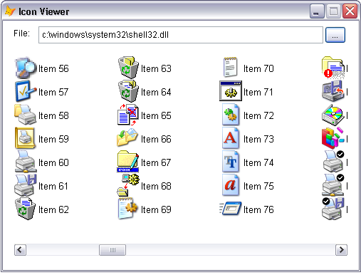

[ 主页 ](https://github.com/VFP9/Win32API)  

# 如何查看存储在可执行文件中的图标(图标浏览器)
_翻译：xinjie 2021.06.26_

## 开始之前：
这段代码显示了如何使用 ExtractIcon 从 EXE 和 DLL 文件中获取图标资源。  

  

参考：

* [如何将 EXE 或 DLL 图标资源导出为 .ICO 文件](sample_502.md)  
* [如何在图像文件中存储 EXE 或 DLL 图标资源](sample_501.md)  
* [转换图像文件到图标文件（ICO）](sample_503.md)  

  
***  


## 代码：
```foxpro  
PUBLIC frm
frm = CreateObject("Tform")
* 主程序结束

DEFINE CLASS Tform As Form
	Width=600
	Height=400
	AutoCenter=.T.
	Caption = "图标浏览器"

	ADD OBJECT lbl As Label WITH Caption="App:", Left=15, Top=10
	ADD OBJECT txt As TextBox WITH Left=60, Top=8, Height=24, Width=450
	ADD OBJECT cmdFile As CommandButton WITH Caption="...",;
	Top=8, Left=512, Width=30, Height=24
	ADD OBJECT cmd As CommandButton WITH Caption="刷新",;
	Width=80, Height=24, Default=.T.

PROCEDURE Init
	THIS.decl
	THIS.txt.Value = THIS.GetVFPmodule()
	THIS.Resize
	THIS.cmd.SetFocus
	THIS.DrawIcons

PROCEDURE Resize
	WITH THIS.cmd
		.Left = Int((ThisForm.Width - .Width)/2)
		.Top = THIS.Height - .Height - 10
	ENDWITH

PROCEDURE DrawIcons
	* 清理表单
	THIS.visible = .F.
	THIS.visible = .T.
	= INKEY(0.1)

	LOCAL lcExe, hApp, lnIndex, hIcon, X,Y, dX,dY
	lcExe = ALLTRIM(THIS.txt.Value)
	IF Not FILE (lcExe)
		WAIT WINDOW "文件 " + lcExe + " 没有找到" NOWAIT
	ENDIF

	hApp = GetModuleHandle(0)
	STORE 40 TO dX,dY
	Y = 56
	X = dX

	lnIndex = 0
	DO WHILE .T.
		hIcon = ExtractIcon (hApp, lcExe, lnIndex)
		IF hIcon = 0
			EXIT
		ENDIF

		THIS._draw (hIcon, X,Y)
		= DestroyIcon (hIcon)

		lnIndex = lnIndex + 1
		X = X + dX
		IF X > THIS.Width-dX*2
			X = dX
			Y = Y + dY
		ENDIF
	ENDDO

PROTECTED PROCEDURE _draw (hIcon, X,Y)
	LOCAL hwnd, hdc
	hwnd = GetFocus()
	hdc = GetDC(hwnd) && this form
	= DrawIcon (hdc, X,Y, hIcon)
	= ReleaseDC (hwnd, hdc)

PROCEDURE selectFile
	LOCAL lcFile
	lcFile = THIS.getFile()
	IF Len(lcFile) <> 0
		THIS.txt.Value = lcFile
		THIS.drawIcons
	ENDIF

PROTECTED FUNCTION getFile
	LOCAL lcResult, lcPath, lcStoredPath
	lcPath = SYS(5) + SYS(2003)
	lcStoredPath = FULLPATH (THIS.txt.Value)
	lcStoredPath = SUBSTR (lcStoredPath, 1, RAT(Chr(92),lcStoredPath)-1)
	
	SET DEFAULT TO (lcStoredPath)
	lcResult = GETFILE("EXE", "Get Executable:", "Open",0)
	SET DEFAULT TO (lcPath)
RETURN LOWER(lcResult)

PROCEDURE decl
	DECLARE INTEGER GetFocus IN user32
	DECLARE INTEGER GetDC IN user32 INTEGER hwnd
	DECLARE INTEGER GetModuleHandle IN kernel32 INTEGER lpModuleName
	DECLARE SHORT DestroyIcon IN user32 INTEGER hIcon
	DECLARE INTEGER ReleaseDC IN user32 INTEGER hwnd, INTEGER hdc

	DECLARE INTEGER LoadIcon IN user32;
		INTEGER hInstance, INTEGER lpIconName

	DECLARE INTEGER ExtractIcon IN shell32;
		INTEGER hInst, STRING lpszExeFileName,;
		INTEGER lpiIcon

	DECLARE SHORT DrawIcon IN user32;
		INTEGER hDC, INTEGER X, INTEGER Y, INTEGER hIcon

	DECLARE INTEGER GetModuleFileName IN kernel32;
		INTEGER hModule, STRING @lpFilename, INTEGER nSize

PROTECTED FUNCTION GetVFPmodule
	LOCAL lpFilename
	lpFilename = SPACE(250)
	lnLen = GetModuleFileName(0, @lpFilename, Len(lpFilename))
RETURN LEFT(lpFilename, lnLen)

PROCEDURE cmd.Click
	ThisForm.drawIcons

PROCEDURE cmdFile.Click
	ThisForm.selectFile
ENDDEFINE  
```  
***  


## 函数列表：
[DestroyIcon](../libraries/user32/DestroyIcon.md)  
[DrawIcon](../libraries/user32/DrawIcon.md)  
[ExtractIcon](../libraries/shell32/ExtractIcon.md)  
[GetDC](../libraries/user32/GetDC.md)  
[GetFocus](../libraries/user32/GetFocus.md)  
[GetModuleFileName](../libraries/kernel32/GetModuleFileName.md)  
[GetModuleHandle](../libraries/kernel32/GetModuleHandle.md)  
[LoadIcon](../libraries/user32/LoadIcon.md)  
[ReleaseDC](../libraries/user32/ReleaseDC.md)  

## 备注
请注意，在用另一个窗口覆盖该表单或最小化然后最大化该表单后，表单上绘制的图标会消失。 
  
存储在内存中的图标可以被保存为图标文件。代码示例[将图像文件转换为.ICO文件](sample_503.md)解释了如何从HICON句柄创建.ICO文件。 
  
* * *  
阅读由 MS 公司的 John Hornick 写的文章[Win32中的图标](https://msdn.microsoft.com/en-us/library/ms997538.aspx)。 
  
MSDN文章[使用图标](https://docs.microsoft.com/zh-cn/windows/win32/menurc/using-icons?redirectedfrom=MSDN)描述了如何执行与图标有关的某些任务：创建、显示、共享图标资源。  
  
* * *  
这是[更高级的图标浏览器](sample_019.md)的屏幕截图，它基于 ImageList API 函数:  
  
[](sample_019.md)


***  

