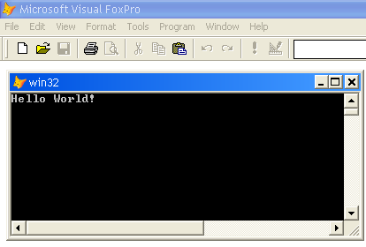

[ Home ](https://github.com/VFPX/Win32API)  

# 使用 VFP 和 WinAPI 书写一个"Hello World!"

_翻译：xinjie  2020.01.29_

## 开始之前：
[hello world 程序](http://en.wikipedia.org/wiki/Hello_world_program#Windows_API_.28in_C.29) 是一个经常使用的编程示例，通常旨在展示系统上最简单的可能应用程序，它实际上可以做一些事 （即打印一行“Hello World”）。

  
这条消息非常适合开始新的一天！  

  
***  


## 代码：
```foxpro  
#DEFINE STD_OUTPUT_HANDLE -11

DECLARE INTEGER AllocConsole IN kernel32
DECLARE INTEGER GetConsoleWindow IN kernel32
DECLARE INTEGER GetStdHandle IN kernel32 LONG nStdHandle

DECLARE INTEGER ShowWindow IN user32 AS ShowWindowA;
	INTEGER hWindow, INTEGER nCmdShow

DECLARE INTEGER WriteConsole IN kernel32;
	INTEGER hConsoleOutput, STRING @lpBuffer,;
	INTEGER nCharsToWrite, INTEGER lpCharsWritten,;
	INTEGER lpReserved

= AllocConsole()
= ShowWindowA(GetConsoleWindow(), 1)
= WriteConsole(GetStdHandle(STD_OUTPUT_HANDLE), "Hello World!", 12,0,0)  
```  
***  


## 函数列表：
[AllocConsole](../libraries/kernel32/AllocConsole.md)  
[GetConsoleWindow](../libraries/kernel32/GetConsoleWindow.md)  
[GetStdHandle](../libraries/kernel32/GetStdHandle.md)  
[ShowWindow](../libraries/user32/ShowWindow.md)  
[WriteConsole](../libraries/kernel32/WriteConsole.md)  

## 备注：
>Windows 1.0 SDK 中最初的 hello-world 程序有点丑闻。 HELLO.C 大约有 150 行长，而 HELLO.RC 资源脚本还有 20 多行。 (...) 经验丰富的 C 程序员在遇到 Windows hello-world 程序时常常会惊恐或大笑。*  
  
&reg; Charles Petzold, 使用 C# 进行 Microsoft Windows 编程  
  
* * *  
有什么比这更容易的？
```foxpro
? "Hello World!"
```
 
或者这个：  
```foxpro
DEFINE WINDOW helloworld FROM 10,10 TO 20,50 SYSTEM CLOSE  
ACTIVATE WINDOW helloworld  
? "Hello World!"
```
* * *  
可以在 [Hello World on FoxPro Wiki](http://fox.wikis.com/wc.dll?Wiki~HelloWorld) 找到 20 钟不同的方法.  
参阅 [Hello World program in Wikipedia](http://en.wikipedia.org/wiki/Hello_world_program).  
  
***  

