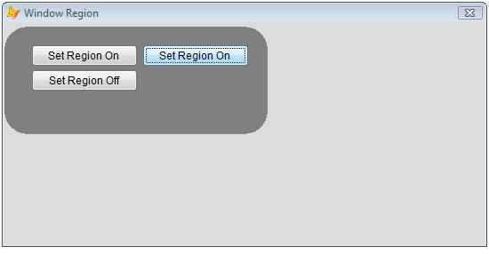

[ Home ](https://github.com/VFPX/Win32API)  

# 设置表单的窗口区域

_翻译：xinjie  2020.01.29_

## 开始之前：
  
当区域被设置为打开时，表单的外部（浅灰色）部分和标题会消失。  

参看：

* [圆形 FoxPro 表单](sample_143.md)  
* [如何在 FoxPro 表单上绘制自定义窗口标题](sample_499.md)  
* [一种在表单中制作透明区域的方法——表单上的一个洞](sample_126.md)  
* [半透明表单](sample_453.md)  
  
***  


## 代码：
```foxpro  
LOCAL frm
frm = CreateObject("Tform")
frm.Show(1)
* end of main

DEFINE CLASS Tform As Form
PROTECTED hRegion
	Caption="窗口区域"
	Width=600
	Height=350
	BorderStyle=2
	Backcolor=RGB(128,128,128)
	AutoCenter=.T.
	MaxButton=.F.
	MinButton=.F.
	hRegion=0
	
	ADD OBJECT cmdOn As CommandButton WITH;
		Left=30, Top=25, Width=120, Height=25,;
		Caption="设置区域"

	ADD OBJECT cmdOn1 As CommandButton WITH;
		Left=155, Top=25, Width=120, Height=25,;
		Caption="设置区域"

	ADD OBJECT cmdOff As CommandButton WITH;
		Left=30, Top=53, Width=120, Height=25,;
		Caption="关闭区域", Enabled=.F.

PROCEDURE Init
	THIS.declare
	
PROCEDURE Destroy
	THIS.RegionOff

PROCEDURE cmdOn.Click
	ThisForm.RegionOn(0)

PROCEDURE cmdOn1.Click
	ThisForm.RegionOn(1)

PROCEDURE cmdOff.Click
	ThisForm.RegionOff

PROCEDURE RegionOn(nMode)
	THIS.RegionOff
	
	LOCAL nX, nY, nWidth, nHeight
	nX = SYSMETRIC(10)+2
	nY = SYSMETRIC(4) + SYSMETRIC(9)
	nWidth=300
	nHeight=150

	IF nMode=0
		THIS.hRegion = CreateRectRgn(nX, nY, nWidth, nHeight)
	ELSE
		THIS.hRegion = CreateRoundRectRgn(nX, nY,;
			nWidth, nHeight, 50, 50)
	ENDIF

	IF THIS.hRegion = 0
		ACTIVATE SCREEN
		? "Failed to create region:", GetLastError()
	ELSE
		IF SetWindowRgn(THIS.HWnd, THIS.hRegion, 1) <> 0
			THIS.cmdOff.Enabled=.T.
		ENDIF
	ENDIF

PROCEDURE RegionOff
* the system owns the region and deletes the handle
* when it is no longer needed
	IF THIS.hRegion <> 0
		IF SetWindowRgn(THIS.HWnd, 0, 1) <> 0
			THIS.hRegion=0
			THIS.cmdOff.Enabled=.F.
		ENDIF
	ENDIF

PROCEDURE declare
	DECLARE INTEGER GetLastError IN kernel32
	DECLARE INTEGER GetFocus IN user32

	DECLARE INTEGER CreateRectRgn IN gdi32;
		INTEGER nLeftRect, INTEGER nTopRect,;
		INTEGER nRightRect, INTEGER nBottomRect

	DECLARE INTEGER CreateRoundRectRgn IN gdi32;
		INTEGER nLeftRect, INTEGER nTopRect,;
		INTEGER nRightRect, INTEGER nBottomRect,;
		INTEGER nWidthEllipse, INTEGER nHeightEllipse

	DECLARE INTEGER SetWindowRgn IN user32;
		INTEGER hWnd, INTEGER hRgn, SHORT bRedraw

ENDDEFINE  
```  
***  


## 函数列表：
[CreateRectRgn](../libraries/gdi32/CreateRectRgn.md)  
[CreateRoundRectRgn](../libraries/gdi32/CreateRoundRectRgn.md)  
[GetFocus](../libraries/user32/GetFocus.md)  
[GetLastError](../libraries/kernel32/GetLastError.md)  
[SetWindowRgn](../libraries/user32/SetWindowRgn.md)  

## 备注：
窗口区域决定了系统允许在窗口内绘制的区域。 系统不显示位于窗口区域之外的窗口的任何部分。
  
系统拥有该区域并在不再需要时删除句柄
  
在 VFP6 中测试此代码示例时，请将 ThisForm.hWnd 替换为 GetFocus() 调用。  
  
***  

