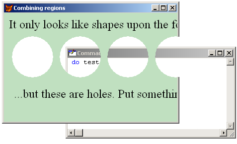

[ Home ](https://github.com/VFPX/Win32API)  

# 如何在表单内部创建透明区域——在表单中打孔

_翻译：xinjie  2020.01.29_

## 开始之前：
  
区域是矩形、多边形或椭圆形，或两种或多种这些形状的组合。 SetWindowRgn 函数设置窗口的窗口区域。

窗口区域决定了系统允许在窗口内绘制的区域。 换句话说，超出该区域的表格部分是不可见的。 对不可见部分的任何鼠标点击都会通过它们传递到下面的窗口。 

参看：

* [如何在 FoxPro 表单上绘制自定义窗口标题](sample_499.md)  
* [圆形 FoxPro 表单](sample_143.md)  
* [将 Form.Closable 设置为 False 的另一种方法](sample_127.md)  
* [半透明表单](sample_453.md)  
* [顶层表单上的透明菜单（需要 VFP9）](sample_496.md)  

  
***  


## 代码：
```foxpro  
PUBLIC frm
frm = CreateObject ("Tform")
frm.Visible = .T.
* end of main

DEFINE CLASS Tform As Form
	Width = 500
	Height = 300
	AutoCenter = .T.
	BackColor = Rgb(192,224,192)
	Caption = "Combining regions"
	
	ADD OBJECT lbl1 As Tlabel WITH;
		Caption="It only looks like shapes upon the form...",;
		Left=10, Top=10
	
	ADD OBJECT lbl2 As Tlabel WITH;
		Caption="...but these are holes. Put something behind.",;
		Left=20, Top=150

PROCEDURE  Load
	THIS.declare
ENDPROC

PROCEDURE  Resize
*	THIS.RemoveRegions   && does not make any difference
	ThisForm.ApplyRegions
ENDPROC

PROCEDURE  Activate
	ThisForm.ApplyRegions
ENDPROC

PROCEDURE  RemoveRegions
	= SetWindowRgn (GetFocus(), 0, 1)
ENDPROC

PROCEDURE  ApplyRegions
#DEFINE RGN_AND  1
#DEFINE RGN_OR   2
#DEFINE RGN_XOR  3
#DEFINE RGN_DIFF 4
#DEFINE RGN_COPY 5

#DEFINE radius  84
#DEFINE interspace 12

	LOCAL hRgnBase, hRgn, hwnd, x0,y0,x1,y1
	DIMEN hRgnExclude [5]  && an array to store elliptical regions

	* create a rectangle region
	* and set it by the rectangle of the form
	hRgn = CreateRectRgn (0,0,1,1)
	hwnd = GetFocus()  && get window handle for the form
	THIS.GetRect (hwnd, @x0,@y0,@x1,@y1)
	hRgnBase = CreateRectRgn (0,0,x1-x0,y1-y0)

	x0 = 20
	y0 = 70
	y1 = y0 + radius
	* create several elliptical regions
	FOR ii=1 TO 5
		hRgnExclude[ii] = CreateEllipticRgn (x0,y0, x0+radius,y1)
 		x0 = x0 + radius + interspace
	ENDFOR

	* combine elliptical regions into one region
	= CombineRgn (hRgn, hRgnExclude[1], hRgnExclude [2], RGN_OR)
	= CombineRgn (hRgn, hRgn, hRgnExclude [3], RGN_OR)
	= CombineRgn (hRgn, hRgn, hRgnExclude [4], RGN_OR)
	= CombineRgn (hRgn, hRgn, hRgnExclude [5], RGN_OR)

	* subtract the resulting region
	* from the region defined by the rectangle of the form
	= CombineRgn (hRgn, hRgnBase, hRgn, RGN_XOR)

	* apply final region to the form
	= SetWindowRgn (hwnd, hRgn, 1)
	
	* free system resources
	= DeleteObject (hRgn)
	FOR ii=1 TO 5
		= DeleteObject (hRgnExclude[ii])
	ENDFOR
	= DeleteObject (hRgnBase)
ENDPROC

PROCEDURE  GetRect (hwnd, x0,y0,x1,y1)
	LOCAL lpRect
	lpRect = SPACE (16)

	= GetWindowRect (hwnd, @lpRect)
	x0 = THIS.buf2dword (SUBSTR(lpRect,  1,4))
	y0 = THIS.buf2dword (SUBSTR(lpRect,  5,4))
	x1 = THIS.buf2dword (SUBSTR(lpRect,  9,4))
	y1 = THIS.buf2dword (SUBSTR(lpRect, 13,4))
ENDPROC

FUNCTION  buf2dword (lcBuffer)
RETURN;
	Asc(SUBSTR(lcBuffer, 1,1)) + ;
	Asc(SUBSTR(lcBuffer, 2,1)) * 256 +;
	Asc(SUBSTR(lcBuffer, 3,1)) * 65536 +;
	Asc(SUBSTR(lcBuffer, 4,1)) * 16777216
ENDFUNC

PROCEDURE  declare
	DECLARE INTEGER CreateEllipticRgn IN gdi32;
		INTEGER nLeftRect, INTEGER nTopRect,;
		INTEGER nRightRect, INTEGER nBottomRect

	DECLARE INTEGER CreateRectRgn IN gdi32;
		INTEGER nLeftRect, INTEGER nTopRect,;
		INTEGER nRightRect, INTEGER nBottomRect

	DECLARE INTEGER CombineRgn IN gdi32;
		INTEGER hrgnDest, INTEGER hrgnSrc1,;
		INTEGER hrgnSrc2, INTEGER fnCombineMode

	DECLARE SetWindowRgn IN user32;
		INTEGER hWnd, INTEGER hRgn, SHORT bRedraw

	DECLARE SHORT GetWindowRect IN user32;
		INTEGER hwnd, STRING @lpRect

	DECLARE INTEGER DeleteObject IN gdi32 INTEGER hObject
	DECLARE INTEGER GetFocus IN user32
ENDPROC
ENDDEFINE

DEFINE CLASS Tlabel As Label
	FontName="Times New Roman"
	FontSize=18
	AutoSize=.T.
	BackStyle=0
ENDDEFINE  
```  
***  


## 函数列表：
[CombineRgn](../libraries/gdi32/CombineRgn.md)  
[CreateEllipticRgn](../libraries/gdi32/CreateEllipticRgn.md)  
[CreateRectRgn](../libraries/gdi32/CreateRectRgn.md)  
[DeleteObject](../libraries/gdi32/DeleteObject.md)  
[GetFocus](../libraries/user32/GetFocus.md)  
[GetWindowRect](../libraries/user32/GetWindowRect.md)  
[SetWindowRgn](../libraries/user32/SetWindowRgn.md)  

## 备注：

  
SetLayeredWindowAttributes 函数可用于在表单上创建透明区域，甚至可用于制作[部分或完全透明的表单](sample_453.md)。 通过在使用 CreateWindowEx 函数创建窗口时指定 WS_EX_LAYERED 或在创建窗口后通过 SetWindowLong 设置 WS_EX_LAYERED 来创建分层窗口。 
  
只能制作顶级窗口 (<a href="http://msdn.microsoft.com/en-us/library/h0ea0kz8(v=vs.80).aspx">ShowWindow</a>=2) 分层窗口，而通过使用 GDI 区域，甚至可以“打出”子窗口。  
  
请阅读 MSDN 上的 [窗口功能](https://docs.microsoft.com/zh-cn/windows/win32/winmsg/window-features?redirectedfrom=MSDN) 。  
  
***  

