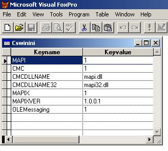

[ Home ](https://github.com/VFPX/Win32API)  

# 读取 Win.ini 文件指定部分中的键

_翻译：xinjie  2022.01.30_

## 开始之前：
通过检查计算机的 WIN.INI 文件中的 [MAIL] 部分的 MAPI 条目来确定 Simple MAPI 可用。如果安装了 Simple MAPI，则此条目的值为 1，如果卸载，则值为 0：  

  
  
***  


## 代码：
```foxpro  
*lcSection = "Windows"  && section name
lcSection = "Mail"  && section name

lcKeys = getKeysString (lcSection)

CREATE CURSOR csWinIni (keyname C(30), keyvalue C(200))

lcKey = ""
FOR ii=1 TO Len(lcKeys)
	ch = SUBSTR (lcKeys, ii,1)
	IF ch = Chr(0)
		lcValue = GetKeyValue(lcSection, lcKey)
		INSERT INTO csWinIni VALUES (lcKey, lcValue)
		lcKey = ""
	ELSE
		lcKey = lcKey + ch
	ENDIF
ENDFOR

SELECT csWinIni
GO TOP
BROW NORMAL NOWAIT

FUNCTION  getKeysString (lcSection)
* returns all key names found in this section
* delimited with zero character

	* Notice that lpKeyName declared as INTEGER
	* to emulate an empty key name

	DECLARE INTEGER GetProfileString IN kernel32;
		STRING   lpAppName,;
		INTEGER  lpKeyName,;
		STRING   lpDefault,;
		STRING @ lpReturnedString,;
		INTEGER  nSize

	nSize = 1024
	lpReturnedString = Repli (Chr(0), nSize)

	lnResult = GetProfileString (lcSection, 0, "#empty#",;
		@lpReturnedString, nSize)
RETURN  Left(lpReturnedString, lnResult)

FUNCTION  GetKeyValue (lcSection, lcKey)

	* Notice that lpKeyName declared as STRING
	* because here we have a string value
	* supplied to this procedure

	DECLARE INTEGER GetProfileString IN kernel32;
		STRING   lpAppName,;
		STRING   lpKeyName,;
		STRING   lpDefault,;
		STRING @ lpReturnedString,;
		INTEGER  nSize

	nSize = 4096
	lpReturnedString = Repli (Chr(0), nSize)

	lnResult = GetProfileString (lcSection, lcKey, "#empty#",;
		@lpReturnedString, nSize)
RETURN  Left(lpReturnedString, lnResult)  
```  
***  


## 函数列表：
[GetProfileString](../libraries/kernel32/GetProfileString.md)  

## 备注：

Win.ini 文件中的部分必须具有以下形式：
```txt
[section]  
key=string
```

***  

