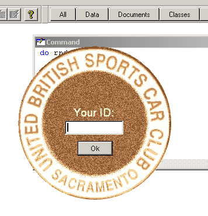
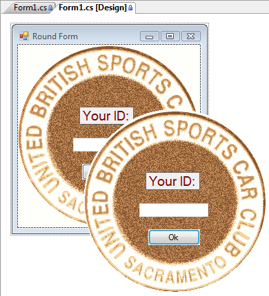
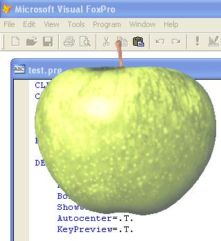

[ Home ](https://github.com/VFPX/Win32API)  

# 圆形 FoxPro 表单

_翻译：xinjie  2022.03.06_

## 开始之前：
在测试代码示例之前下载 [Badge.zip](../downloads/badge.zip) 并解压文件以获取图像文件:  

  
参看：

* [使用透明颜色键创建形状不规则的 FoxPro 表单](sample_033.md)  
* [如何在 FoxPro 表单上绘制自定义窗口标题](sample_499.md)  
* [如何在表单内部创建透明区域——在表单中打孔](sample_126.md)  
* [将 Form.Closable 设置为 False 的另一种方法](sample_127.md)  
* [半透明表单](sample_453.md)  

VFP代码转换为C#时，只需进行语言和平台的特定修改：

  
  
***  


## 代码：
```foxpro  
PUBLIC oForm
oForm = CreateObject("Tform")
oForm.Visible = .T.
* end of main

DEFINE CLASS Tform As Form
#DEFINE badgeDiameter 264
#DEFINE topMargin 4
#DEFINE leftMargin 2
	Width=300
	Height=350
	AutoCenter=.T.
	Picture="badge1.bmp"
	hRgn=0
	
	ADD OBJECT lbl As Label WITH Caption="Your ID:",;
	FontName="Arial", FontSize=14, Bold=.T., BackStyle=0, Alignment=2,;
	Forecolor=Rgb(255,255,225), Left=82, Top=105, Width=100, Height=25

	ADD OBJECT txt As TextBox WITH Width=100, Height=24,;
	Left=82, Top=130, PasswordChar="*"

	ADD OBJECT cmd As CommandButton WITH Width=60, Height=25,;
	Left=104, Top=165, Caption="Ok", Default=.T.

PROCEDURE Init
	DO decl

PROCEDURE Activate
	IF THIS.hRgn = 0
		THIS.RegionOn
	ENDIF

PROCEDURE RegionOn
#DEFINE SM_CYSIZE  31
#DEFINE SM_CXFRAME 32
#DEFINE SM_CYFRAME 33
	LOCAL hwnd, x0, y0, x1, y1

	* 计算区域的位置
	* 你可以用SYSMETRIC()代替
	x0 = GetSystemMetrics(SM_CXFRAME) + leftMargin
	y0 = GetSystemMetrics(SM_CYSIZE) +;
		GetSystemMetrics(SM_CYFRAME) + topMargin
	x1 = x0 + badgeDiameter
	y1 = y0 + badgeDiameter

	* 创造一个椭圆区域
	THIS.hRgn = CreateEllipticRgn (x0, y0, x1, y1)
	hwnd = GetFocus()

	* 将该区域应用到表单中
	IF SetWindowRgn(hwnd, THIS.hRgn, 1) = 0
	* 如果失败，则释放句柄
		= DeleteObject (THIS.hRgn)
		THIS.hRgn = 0
	ENDIF
ENDPROC

PROCEDURE MouseDown
LPARAMETERS nButton, nShift, nXCoord, nYCoord
#DEFINE WM_SYSCOMMAND  0x112
#DEFINE WM_LBUTTONUP   0x202
#DEFINE MOUSE_MOVE     0xf012
	IF nButton = 1
		LOCAL hWindow
		hWindow = GetFocus()
		= ReleaseCapture()
		= SendMessage(hWindow, WM_SYSCOMMAND, MOUSE_MOVE, 0)
		= SendMessage(hWindow, WM_LBUTTONUP, 0, 0)
	ENDIF

PROCEDURE cmd.Click
	ThisForm.Release
ENDDEFINE

PROCEDURE decl
	DECLARE INTEGER GetFocus IN user32
	DECLARE INTEGER DeleteObject IN gdi32 INTEGER hObject
	DECLARE INTEGER GetSystemMetrics IN user32 INTEGER nIndex
	DECLARE INTEGER ReleaseCapture IN user32

	DECLARE INTEGER SendMessage IN user32;
		INTEGER hWnd, INTEGER Msg,;
		INTEGER wParam, INTEGER lParam

	DECLARE INTEGER CreateEllipticRgn IN gdi32;
		INTEGER nLeftRect, INTEGER nTopRect,;
		INTEGER nRightRect, INTEGER nBottomRect

	DECLARE INTEGER SetWindowRgn IN user32;
		INTEGER hWnd, INTEGER hRgn, INTEGER bRedraw  
```  
***  


## 函数列表：
[CreateEllipticRgn](../libraries/gdi32/CreateEllipticRgn.md)  
[DeleteObject](../libraries/gdi32/DeleteObject.md)  
[GetFocus](../libraries/user32/GetFocus.md)  
[GetSystemMetrics](../libraries/user32/GetSystemMetrics.md)  
[ReleaseCapture](../libraries/user32/ReleaseCapture.md)  
[SendMessage](../libraries/user32/SendMessage.md)  
[SetWindowRgn](../libraries/user32/SetWindowRgn.md)  

## 备注：
虽然这个表单没有可见的标题栏，但你仍然可以通过点击和拖动在控件以外的任何一点上移动它。 
  

***  
Nov.7, 2005:   
  


通过 SetLayeredWindowAttributes 函数，表单中具有相同颜色的部分可以被切掉。注意，表单的框架仍然必须使用 Region API 调用来移除。 
  

***  
在 .NET 中，Form 对象的 Region 属性允许创建不规则的表单，而无需直接调用 API 函数。 
  
***  

