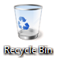

[ 主页 ](https://github.com/VFP9/Win32API)  

# 如何清空回收站
_翻译：xinjie  2021.01.01_

## 开始之前：
  

参考：

* [删除文件到回收站](sample_321.md)  
* [如何检索回收站中存储的对象数量](sample_302.md)  
* [如何删除非空目录](sample_541.md)  
* [复制文件时显示标准进度对话框](sample_508.md)  
  
***  


## 代码：
```foxpro  
#DEFINE S_OK    0
#DEFINE SHERB_DEFAULT         0
#DEFINE SHERB_NOCONFIRMATION  1
#DEFINE SHERB_NOPROGRESSUI    2
#DEFINE SHERB_NOSOUND         4

	DECLARE INTEGER SHEmptyRecycleBin IN shell32;
		INTEGER hwnd, STRING pszRootPath, LONG dwFlags

	= SHEmptyRecycleBin (0, "C:", SHERB_DEFAULT)  
```  
***  


## 函数列表：
[SHEmptyRecycleBin](../libraries/shell32/SHEmptyRecycleBin.md)  
