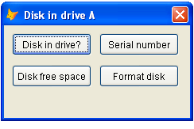

[ 主页 ](https://github.com/VFP9/Win32API)  

# 驱动器 A 的磁盘
_翻译：xinjie  2021.01.01_

## 开始之前：
  
参考：

* [显示驱动器类型值](sample_012.md)  
* [基本卷信息](sample_098.md)  
* [设置卷标](sample_151.md)  
* [获取驱动器的物理参数：扇区，簇，柱面...](sample_101.md)  
* [映射和断开网络驱动器的连接](sample_387.md)  
* [检测与可移动硬盘的连接变化(VFP9)](sample_573.md)  

  
***  


## 代码：
```foxpro  
LOCAL oForm
oForm = CreateObject("Tform", "A")
oForm.Show(1)

DEFINE CLASS Tform As Form
	Width=234
	Height=120
	MaxButton=.F.
	MinButton=.F.
	Caption=" 驱动器 A 中的磁盘"
	Autocenter=.T.
	Keypreview=.T.
	diskname="A"
	
	ADD OBJECT cmd1 As Tcmd WITH Left=10, Top=10,;
	Caption="磁盘在驱动器中？"

	ADD OBJECT cmd2 As Tcmd WITH Left=120, Top=10,;
	Caption="序列号"

	ADD OBJECT cmd3 As Tcmd WITH Left=10, Top=50,;
	Caption="磁盘可用空间"

	ADD OBJECT cmd4 As Tcmd WITH Left=120, Top=50,;
	Caption="格式化磁盘"

PROCEDURE Init(cDiskName)
	IF VARTYPE(m.cDiskName)="C" AND NOT EMPTY(m.cDiskName)
		THIS.diskname=UPPER(ALLTRIM(m.cDiskName))
	ENDIF

PROCEDURE KeyPress
LPARAMETERS nKeyCode, nShiftAltCtrl
	IF nKeyCode = 27
		THIS.Release
	ENDIF

PROCEDURE cmd1.Click
	IF DiskInDrive(ThisForm.diskname + ":\")
		= MESSAGEBOX("磁盘在驱动器中 " + ThisForm.diskname)
	ELSE
		= MESSAGEBOX("磁盘未在驱动器中 " + ThisForm.diskname)
	ENDIF

PROCEDURE cmd2.Click
	LOCAL lnNumber
	lnNumber = GetSerialNumber(ThisForm.diskname + ":\")
	= MESSAGEBOX("序列号: " + LTRIM(STR(lnNumber)))

PROCEDURE cmd3.Click
	LOCAL lnFreeSpace
	lnFreeSpace = GetFreeSpace(ThisForm.diskname + ":\")
	= MESSAGEBOX("磁盘可用空间: " +;
		ALLTR(TRANS(lnFreeSpace, "999,999,999")) + " bytes")

PROCEDURE cmd4.Click
	= FormatFloppy(ThisForm.diskname + ":\")

ENDDEFINE

DEFINE CLASS Tcmd As CommandButton
	Height=28
	Width=100
ENDDEFINE

* * *

FUNCTION DiskInDrive(lcRoot)
RETURN GetDiskInfo(lcRoot, 1)

FUNCTION GetSerialNumber(lcRoot)
RETURN GetDiskInfo(lcRoot, 2)

FUNCTION GetDiskInfo(lcRoot, lnMode)
	DECLARE SHORT GetVolumeInformation IN kernel32;
		STRING lcRootPathName, STRING @lpVolumeNameBuffer,;
		INTEGER nVolumeNameSize, INTEGER @lpVolumeSerialNumber,;
		INTEGER @lpMaximumComponentLength, INTEGER @lpFlags,;
		STRING @lpFileSystemNameBuffer, INTEGER nFileSystemNameSize

	LOCAL lcVolBuffer, lnSerial, lnMaxLen, lpFlags,;
		lcSysBuffer, lnResult

	STORE Repli(Chr(0), 250) TO lcVolBuffer, lcSysBuffer
	STORE 0 TO lnSerial, lnMaxLen, lpFlags

	lnResult = GetVolumeInformation(lcRoot, @lcVolBuffer,;
		Len(lcVolBuffer), @lnSerial, @lnMaxLen, @lpFlags,;
		@lcSysBuffer, Len(lcSysBuffer))

	DO CASE
	CASE lnMode = 1  && disk in drive
		RETURN (lnResult <> 0)
	CASE lnMode = 2  && serial number
		RETURN Iif(lnResult=0, 0, lnSerial)
	ENDCASE

DECLARE SHORT GetDiskFreeSpace IN kernel32;
	STRING lpRootPathName,;
	INTEGER @lpSectorsPerCluster,;
	INTEGER @lpBytesPerSector,;
	INTEGER @lpNumberOfFreeClusters,;
	INTEGER @lpTotalNumberOfClusters

STORE 0 TO lpSectorsPerCluster, lpBytesPerSector,;
	lpNumberOfFreeClusters, lpTotalNumberOfClusters

FUNCTION GetFreeSpace(lcRoot)
	IF Not DiskInDrive(lcRoot)
		RETURN 0
	ENDIF

	DECLARE SHORT GetDiskFreeSpace IN kernel32;
		STRING lpRootPathName, INTEGER @lpSectPerClust,;
		INTEGER @lpBytesPerSect, INTEGER @lpNumOfFreeClust,;
		INTEGER @lpTotNumOfClust

	LOCAL lnSecPerClust, lnBtPerSec,;
		lnFreeClust, lnTotClust, lnResult

	STORE 0 TO lnSecPerClust, lnBtPerSec,;
		lnFreeClust, lnTotClust

	lnResult = GetDiskFreeSpace(lcRoot, @lnSecPerClust,;
		@lnBtPerSec, @lnFreeClust, @lnTotClust)
RETURN Iif(lnResult=0, 0, (lnFreeClust * lnSecPerClust * lnBtPerSec))

FUNCTION FormatFloppy(lcRoot)
#DEFINE SHFMT_DRV_A 0
#DEFINE SHFMT_DRV_B 1
#DEFINE SHFMT_ID_DEFAULT 0xFFFF
#DEFINE SHFMT_OPT_QUICKFORMAT 0
#DEFINE SHFMT_OPT_FULLFORMAT 1
#DEFINE SHFMT_OPT_SYSONLY 2
#DEFINE SHFMT_ERROR -1
#DEFINE SHFMT_CANCEL -2
#DEFINE SHFMT_NOFORMAT -3

	IF Not DiskInDrive(lcRoot)
		= MESSAGEBOX("磁盘不可用")
		RETURN .F.
	ENDIF
	lcRoot = LEFT(lcRoot,1)
	IF Not lcRoot $ "AB"
		= MESSAGEBOX("应该是 A 或 B")
		RETURN .F.
	ENDIF

	DECLARE INTEGER SHFormatDrive IN shell32;
		INTEGER hWindow, INTEGER lpDrive,;
		INTEGER fmtID, INTEGER options

	LOCAL lnResult
	lnResult = SHFormatDrive(0,;
		Iif(lcRoot="A", SHFMT_DRV_A, SHFMT_DRV_B), SHFMT_ID_DEFAULT,;
		SHFMT_OPT_QUICKFORMAT)

	DO CASE
	CASE lnResult = SHFMT_ERROR
		= MESSAGEBOX("格式化磁盘时出错")
	CASE lnResult = SHFMT_CANCEL
		= MESSAGEBOX("用户取消了磁盘格式化")
	CASE lnResult = SHFMT_NOFORMAT
		= MESSAGEBOX("磁盘未格式化")
	OTHER
		= MESSAGEBOX("磁盘已格式化")
	ENDCASE
RETURN  
```  
***  


## 函数列表：
[GetDiskFreeSpace](../libraries/kernel32/GetDiskFreeSpace.md)  
[GetVolumeInformation](../libraries/kernel32/GetVolumeInformation.md)  
[SHFormatDrive](../libraries/shell32/SHFormatDrive.md)  

## 备注：
大多数时候，DISKSPACE("A")已经足够好用了。  
  
***  

