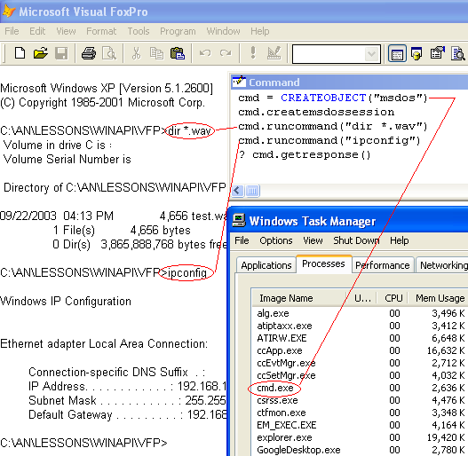

[ 主页 ](https://github.com/VFP9/Win32API)  

# 以子进程的形式运行 MSDOS Shell，并重定向输入和输出(smarter RUN command)
_翻译:xinjie  2020.12.31_

## 简述：
msdos类允许发出一组MSDOS命令，并以字符串形式返回响应。MSDOS窗口是存在的，但不可见。该代码创建了一个运行msdos会话的子进程，并将其标准输入和输出句柄重定向到匿名管道。  
***  


## 开始之前：
下面的类允许运行一组MSDOS命令，并以字符串形式返回响应。MSDOS窗口是存在的，但不可见。 

这是如何从VFP命令窗口测试该类：

  

如果*CreateMsdosSession*方法返回*True*，那么*RunCommand*方法可以用来启动msdos命令。命令处理器的输出被收集到一个缓冲区中。*GetResponse*方法返回内容并清除缓冲区。   

用这个程序代码来测试该类：  

```foxpro
LOCAL cmd As msdos, cResponse  
cmd = CREATEOBJECT("msdos")  

IF NOT cmd.createmsdossession()  
	? "CreateMsdosSession 调用失败。"  
	RETURN  
ENDIF  

cmd.runcommand("dir *.bmp")  
cmd.runcommand("ipconfig")  
= INKEY(2) && 给MSDOS一些时间来返回

cResponse = cmd.getresponse()  
STORE cResponse TO _cliptext  && 备查  

SET MEMOWIDTH TO 120  
? cResponse
```

INKEY() 在这里是为了给命令处理器提供一些时间来产生输出。WaitForSingleObject API，可能是一个理想的解决方案，它不等待控制台输出。使用 Timer 对象应该可以比 INKEY() 更好。 

参考：

* [在 VFP 中使用 WinExec 启动外部应用程序](sample_002.md)  
* [使用 ShellExecute 对文件进行操作](sample_093.md)  
* [通过使用 CreateProcess 从 VFP 应用程序启动可执行文件](sample_003.md)  
* [从 VFP 启动外部程序并等待其终止](sample_377.md)  
* [为 Visual FoxPro 应用程序创建一个控制台窗口](sample_474.md)  
  
***  


## 代码：
```foxpro  
DEFINE CLASS msdos As Custom
#DEFINE SW_HIDE 0
#DEFINE DUPLICATE_SAME_ACCESS 2
#DEFINE STARTF_USESTDHANDLES 0x0100
#DEFINE STARTF_USESHOWWINDOW 1

#DEFINE SECURITYATTR_SIZE 12
#DEFINE STARTUPINFO_SIZE 68
#DEFINE FILEINFO_SIZE 52
#DEFINE crlf CHR(13)+CHR(10)
#DEFINE MsdosShell "cmd.exe"

PROTECTED hChildStdinWrdup, hChildStdoutRddup,;
	hMsdosProcess, hMsdosThread
	hChildStdinWrdup=0
	hChildStdoutRddup=0
	hMsdosProcess=0
	hMsdosThread=0
	
PROCEDURE Init
	THIS.declare

PROCEDURE Destroy
	THIS.ReleaseMsdosSession

PROCEDURE RunCommand(cCommand)
	IF NOT THIS.ValidMsdosSession()
		IF NOT THIS.CreateMsdosSession()
			RETURN ""
		ENDIF
	ENDIF
	THIS.WriteToPipe(cCommand + crlf)

PROCEDURE GetResponse
	LOCAL cResponse
	cResponse = THIS.ReadFromPipe()
	cResponse = STRTRAN(cResponse, CHR(13)+CHR(13), CHR(13))
RETURN m.cResponse

FUNCTION CreateMsdosSession
	THIS.ReleaseMsdosSession

	LOCAL hChildStdinRd, hChildStdinWr, hChildStdinWrdup,;
	hChildStdoutRd, hChildStdoutWr, hChildStdoutRddup,;
	cSecurityAttributes, hProcess, cProcInfo, cStartupInfo, hThread

	STORE 0 TO hChildStdinRd, hChildStdinWr, hChildStdinWrdup,;
	hChildStdoutRd, hChildStdoutWr, hChildStdoutRddup

	hProcess = GetCurrentProcess()
	
	* 分配并填充 SECURITY_ATTRIBUTES 结构。
	* 注意 bInheritHandle 设置为 True 。
	cSecurityAttributes = num2dword(SECURITYATTR_SIZE) +;
		num2dword(0) + num2dword(1)

	* 创建 STDOUT 管道和不可继承的读句柄，用于 ReadFromPipe 方法。
	= CreatePipe(@m.hChildStdoutRd, @m.hChildStdoutWr,;
		@cSecurityAttributes, 0)
	= DuplicateHandle(m.hProcess, hChildStdoutRd, m.hProcess,;
		@hChildStdoutRddup, 0, 0, DUPLICATE_SAME_ACCESS)

	* 创建 STDIN 管道和不可继承的写句柄，用于 WriteToPipe 方法。
	= CreatePipe(@hChildStdinRd, @hChildStdinWr,;
		@cSecurityAttributes, 0)
	= DuplicateHandle(m.hProcess, hChildStdinWr, m.hProcess,;
		@hChildStdinWrdup, 0, 0, DUPLICATE_SAME_ACCESS)

	* 为 STARTUPINFO 结构分配空间。
	cStartupInfo = PADR(Chr(STARTUPINFO_SIZE), STARTUPINFO_SIZE, Chr(0))

	* 设置 STARTUPINFO 的 dwFlags 成员
	* 使用 STARTF_USESHOWWINDOW 标志和 wShowWindow=0 将创建隐藏的 msdos shell 窗口
	cStartupInfo = STUFF(cStartupInfo, 45, 4,;
		num2dword(STARTF_USESTDHANDLES+STARTF_USESHOWWINDOW))

	* 将 hStdInput 成员设置为 STDIN 管道的读取柄
	cStartupInfo = STUFF(cStartupInfo, 57, 4,;
		num2dword(m.hChildStdinRd)) && IN

	* 将 hStdOutput 成员设置为 STDOUT 管道的写句柄
	cStartupInfo = STUFF(cStartupInfo, 61, 4,;
		num2dword(m.hChildStdoutWr)) && OUT

	* 将 hStdError 成员设置为 STDOUT 管道的写句柄
	cStartupInfo = STUFF(cStartupInfo, 65, 4,;
		num2dword(m.hChildStdoutWr)) && ERR

	* 为 PROCESS_INFORMATION 结构分配空间
	cProcInfo = REPLICATE(Chr(0), 16)
	
	* 创建子进程 -- msdos shell窗口
	* 请注意，bInheritHandles 输入参数设置为 True
	= CreateProcess(THIS.GetSysDir() + "\" + MsdosShell, "",;
		0,0, 1, 0,0, SYS(5)+SYS(2003), @cStartupInfo, @cProcInfo)

	* 从PROCESS_INFORMATION结构中获取创建的msdos shell的进程和线程句柄。
	hProcess = buf2dword(SUBSTR(cProcInfo, 1,4))
	hThread = buf2dword(SUBSTR(cProcInfo, 5,4))
	
	THIS.hChildStdoutRddup = m.hChildStdoutRddup
	THIS.hChildStdinWrdup = m.hChildStdinWrdup

	* 关闭可继承的句柄
	= CloseHandle(m.hChildStdinRd)
	= CloseHandle(m.hChildStdinWr)
	= CloseHandle(m.hChildStdoutRd)
	= CloseHandle(m.hChildStdoutWr)

	IF THIS.ValidMsdosSession()
		* 在类属性中存储进程和线程句柄;
		* 在退出时，你需要他们来终止msdos shell进程。
		THIS.hMsdosProcess = m.hProcess
		THIS.hMsdosThread = m.hThread
		RETURN .T.
	ELSE
	* 未能将msdos shell作为子进程启动
		THIS.ReleaseMsdosSession
		RETURN .F.
	ENDIF

FUNCTION ValidMsdosSession
RETURN (THIS.hChildStdoutRddup <> 0);
	AND (THIS.hChildStdinWrdup <> 0)

PROTECTED PROCEDURE ReleaseMsdosSession
	= CloseHandle(THIS.hChildStdinWrdup)
	= CloseHandle(THIS.hChildStdoutRddup)
	STORE 0 TO THIS.hChildStdinWrdup, THIS.hChildStdoutRddup
	IF THIS.hMsdosProcess <> 0
		= TerminateProcess(THIS.hMsdosProcess, 0)
		= CloseHandle(THIS.hMsdosProcess)
		= CloseHandle(THIS.hMsdosThread)
		STORE 0 TO THIS.hMsdosProcess, THIS.hMsdosThread
	ENDIF

PROTECTED PROCEDURE WriteToPipe(cWrite)
	LOCAL nWritten
	nWritten=0
	IF WriteFile(THIS.hChildStdinWrdup, @cWrite,;
		LEN(cWrite), @nWritten, 0) = 0
		RETURN 0
	ENDIF
RETURN m.nWritten

PROTECTED PROCEDURE ReadFromPipe
	LOCAL cBuffer, nBytes, cRead, nRead
	cBuffer = REPLICATE(CHR(0), FILEINFO_SIZE)

	= GetFileInformationByHandle(;
		THIS.hChildStdoutRddup, @cBuffer)
	nBytes = buf2dword(SUBSTR(cBuffer, 37,4))

	IF nBytes = 0  && nothing to read
		RETURN ""
	ENDIF

	cRead = REPLICATE(CHR(0), 16384)
	nRead = 0
	IF ReadFile(THIS.hChildStdoutRddup, @cRead,;
		LEN(cRead), @nRead, 0) = 0
		RETURN ""
	ENDIF
RETURN SUBSTR(cRead, 1, nRead)

PROTECTED PROCEDURE GetSysDir
	LOCAL cBuffer, nBufsize
	cBuffer = REPLICATE(CHR(0), 260)
	nBufsize = GetSystemDirectory(@cBuffer, LEN(cBuffer))
RETURN SUBSTR(cBuffer, 1, nBufsize)

PROTECTED PROCEDURE declare
	DECLARE INTEGER CloseHandle IN kernel32 INTEGER hObject
	DECLARE INTEGER GetCurrentProcess IN kernel32

	DECLARE INTEGER CreatePipe IN kernel32;
		INTEGER @hReadPipe, INTEGER @hWritePipe,;
		STRING @lpPipeAttributes, LONG nSize

	DECLARE INTEGER ReadFile IN kernel32;
		INTEGER hFile, STRING @lpBuffer, INTEGER nBytesToRead,;
		INTEGER @lpBytesRead, INTEGER lpOverlapped

	DECLARE INTEGER WriteFile IN kernel32;
		INTEGER hFile, STRING @lpBuffer, INTEGER nBt2Write,;
		INTEGER @lpBtWritten, INTEGER lpOverlapped

	DECLARE INTEGER GetFileInformationByHandle IN kernel32;
		INTEGER hFile, STRING @lpFileInformation

	DECLARE INTEGER DuplicateHandle IN kernel32;
		INTEGER hSourceProcessHandle, INTEGER hSourceHandle,;
		INTEGER hTargetProcessHandle, INTEGER @lpTargetHandle,;
		LONG dwDesiredAccess, INTEGER bInheritHandle, INTEGER dwOptions

	DECLARE INTEGER CreateProcess IN kernel32;
		STRING lpApplicationName, STRING lpCommandLine,;
		INTEGER lpProcessAttr, INTEGER lpThreadAttr,;
		INTEGER bInheritHandles, INTEGER dwCreationFlags,;
		INTEGER lpEnvironment, STRING lpCurrentDirectory,;
		STRING @lpStartupInfo, STRING @lpProcessInformation

	DECLARE INTEGER GetSystemDirectory IN kernel32;
		STRING @lpBuffer, INTEGER nSize

	DECLARE INTEGER TerminateProcess IN kernel32;
		INTEGER hProcess, INTEGER uExitCode
ENDDEFINE

FUNCTION buf2dword(lcBuffer)
RETURN Asc(SUBSTR(lcBuffer, 1,1)) + ;
	BitLShift(Asc(SUBSTR(lcBuffer, 2,1)),  8) +;
	BitLShift(Asc(SUBSTR(lcBuffer, 3,1)), 16) +;
	BitLShift(Asc(SUBSTR(lcBuffer, 4,1)), 24)

FUNCTION num2dword(lnValue)
#DEFINE m0  256
#DEFINE m1  65536
#DEFINE m2  16777216
	IF lnValue < 0
		lnValue = 0x100000000 + lnValue
	ENDIF
	LOCAL b0, b1, b2, b3
	b3 = Int(lnValue/m2)
	b2 = Int((lnValue - b3*m2)/m1)
	b1 = Int((lnValue - b3*m2 - b2*m1)/m0)
	b0 = Mod(lnValue, m0)
RETURN Chr(b0)+Chr(b1)+Chr(b2)+Chr(b3)  
```  
***  


## 函数列表：
[CloseHandle](../libraries/kernel32/CloseHandle.md)  
[CreatePipe](../libraries/kernel32/CreatePipe.md)  
[CreateProcess](../libraries/kernel32/CreateProcess.md)  
[DuplicateHandle](../libraries/kernel32/DuplicateHandle.md)  
[GetCurrentProcess](../libraries/kernel32/GetCurrentProcess.md)  
[GetFileInformationByHandle](../libraries/kernel32/GetFileInformationByHandle.md)  
[GetSystemDirectory](../libraries/kernel32/GetSystemDirectory.md)  
[ReadFile](../libraries/kernel32/ReadFile.md)  
[TerminateProcess](../libraries/kernel32/TerminateProcess.md)  
[WriteFile](../libraries/kernel32/WriteFile.md)  

## 备注：
VFP类使用CreateProcess作为子进程启动命令处理器（cmd.exe）。 通过此调用的输入参数，子进程的标准输入和输出句柄被重定向到两个匿名管道。
  
通过将STARTF_USESHOWWINDOW放在STARTUPINFO结构中，可以将msdos窗口置于隐藏状态。 因此，通常的黑色msdos窗口不会闪烁，并且不会出现在任务栏中。
  
尽管它具有意想不到的效果：
  
`cmd.RunCommand("C:\myprog.exe")`
  
上面的代码行将启动myprog.exe，并使其处于隐藏状态。只有在释放*cmd*对象后，myprog.exe才会变得可见并出现在任务栏中。  
  
* * *  
命令处理器通过一条管道接收命令（RunCommand方法）。 另一个管道用于获取命令处理器生成的输出（GetResponse方法）。
  
*匿名管道是未命名的单向管道，通常在父进程和子进程之间传输数据。 *
  
这就像一个由两个进程共享的临时文件。 这些过程之一可以写入管道，而另一个可以从管道读取，这就是“单向”的意思。  
  
MSDN 链接：  

* [创建具有重定向输入和输出的子进程 ](https://msdn.microsoft.com/en-us/library/windows/desktop/ms682499(v=vs.85).aspx) -- *上面的FoxPro类实际上使用了这段C代码的大部分翻译而来*   

* <a href="https://blog.csdn.net/iiprogram/article/details/1833042">如何使用重定向的标准句柄生成控制台进程</a>（译者注：原MSDN链接失效，更换为 CSDN 博客链接）  
  
***  

