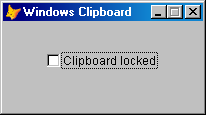

[ 主页 ](https://github.com/VFP9/Win32API)  

# 如何禁用 Windows 剪贴板(VFP9)
_翻译：xinjie  2021.01.03_

## 简述：
Windows 操作系统有一个机制，当剪贴板的内容发生变化时，可以通知窗口。任何 FoxPro 窗口都可以被注册为剪贴板查看器。这些通知实际上是窗口消息。由于扩展了 BINDEVENT() 函数，VFP9 可以很好地处理窗口消息。  
***  


## 开始之前：

  

这个 FoxPro 表单被设置为当任何东西被复制到剪贴板时，都会被通知--文本，图像等。而且每次通知时都会清除剪贴板内容。  

既不涉及定时器也不涉及 ON KEY 处理程序。  

参考：

* [如何禁止 PrintScreen 键](sample_489.md)  
* [如何防止用户访问 Windows 桌面和切换到其他应用程序](sample_492.md)  
* [使用Raw Input API（VFP9）捕获另一个应用程序的键盘活动](sample_572.md)  
* [监测剪贴板内容变化(VFP9)](sample_601.md)  
* [枚举剪贴板上当前可用的数据格式](sample_032.md)  

  
***  


## 代码：
```foxpro  
LOCAL obj As Tform
	obj = CREATEOBJECT("Tform")
	obj.Show(1)
* 主程序结束

DEFINE CLASS Tform As Form
	Width=200
	Height=90
	Caption="Windows 剪贴板"
	MaxButton=.F.
	BorderStyle=2
	AutoCenter=.T.

	ADD OBJECT ch As CheckBox WITH Left=44, Top=30,;
	AutoSize=.T., BackStyle=0, Caption="锁定剪贴板",;
	Value=.F.
	
	ADD OBJECT watch As ClipboardWatch
	
PROCEDURE ch.InteractiveChange
	LOCAL ex As Exception
	
	TRY
		IF THIS.Value
			ThisForm.watch.RegisterWindow(ThisForm.HWnd)
		ELSE
			ThisForm.watch.UnregisterWindow
		ENDIF
	CATCH TO ex
		WAIT WINDOW "Clipboard Chain API call failed " +;
			"with error " + TRANSFORM(ex.ErrorNo) + ": ";
			+ CHR(13) + ex.Message
	ENDTRY

ENDDEFINE

DEFINE CLASS ClipboardWatch As Custom
#DEFINE GWL_WNDPROC -4
#DEFINE WM_CHANGECBCHAIN 0x030D
#DEFINE WM_DRAWCLIPBOARD 0x0308

PROTECTED hWindow, hNextViewer, hOrigProc
	hWindow=0  && 目标窗口
	hNextViewer=0  && 剪贴板链中的下一个窗口
	hOrigProc=0  && ptr to hWindow original window proc

PROCEDURE Init
	THIS.declare

PROCEDURE Destroy
	THIS.UnregisterWindow

PROCEDURE RegisterWindow(hWindow)
	THIS.UnregisterWindow

	THIS.hWindow = m.hWindow
	THIS.ClearClipboard

	* 将 this.hWindow 添加到剪贴板查看器链中
	THIS.hNextViewer = SetClipboardViewer(THIS.hWindow)
	
	* 存储原始窗口过程的地址
	* for THIS.hWindow
	THIS.hOrigProc = GetWindowLong(THIS.hWindow, GWL_WNDPROC)

	* 将 THIS.hWindow 接收到的两种类型的窗口消息链接到 ClipboardWatch 类的一个方法。
	= BINDEVENT(THIS.hWindow, WM_CHANGECBCHAIN, THIS, "OnMessage")
	= BINDEVENT(THIS.hWindow, WM_DRAWCLIPBOARD, THIS, "OnMessage")

PROCEDURE UnregisterWindow
	IF THIS.hWindow <> 0
		= ChangeClipboardChain(THIS.hWindow, THIS.hNextViewer)
		THIS.hWindow=0
	ENDIF

PROTECTED PROCEDURE ClearClipboard
	_cliptext=""  && 就这么简单

PROTECTED PROCEDURE OnMessage(hWindow as Integer, nMsgID as Integer,;
	wParam as Integer, lParam as Integer)

	* 恕我直言：此时 m.hWindow 和 THIS.hWindow 必须相同
	
	LOCAL nReturn
	nReturn=0
	
	DO CASE
	CASE nMsgID=WM_CHANGECBCHAIN
	* 当一个窗口被从剪贴板查看器链中移除时，hWindow 会收到这个通知
		IF THIS.hNextViewer = m.wParam
			THIS.hNextViewer = m.lParam
		ELSE
			= SendMessage(THIS.hNextViewer,;
				m.nMsgID, m.wParam, m.lParam)
		ENDIF

	CASE nMsgID=WM_DRAWCLIPBOARD
	* 当剪贴板的内容发生变化时，hWindow 会收到这个通知
		THIS.ClearClipboard

	OTHERWISE
	* 将控制权传递给原窗口过程只是一种预防措施；除非添加更多的 BINDEVENTS，否则执行不应该到达那里......。
		nReturn = CallWindowProc(THIS.hOrigProc, THIS.hWindow,;
			m.nMsgID, m.wParam, m.lParam)
	ENDCASE
RETURN nReturn

PROTECTED PROCEDURE declare

	DECLARE INTEGER SetClipboardViewer IN user32;
		INTEGER hWndNewViewer

	DECLARE INTEGER ChangeClipboardChain IN user32;
		INTEGER hWndRemove, INTEGER hWndNewNext

	DECLARE INTEGER SendMessage IN user32;
		INTEGER hWnd, INTEGER Msg,;
		INTEGER wParam, INTEGER lParam

	DECLARE INTEGER CallWindowProc IN user32;
		INTEGER lpPrevWndFunc, INTEGER hWindow, LONG Msg,;
		INTEGER wParam, INTEGER lParam

	DECLARE INTEGER GetWindowLong IN user32;
		INTEGER hWnd, INTEGER nIndex

ENDDEFINE  
```  
***  


## 函数列表：
[CallWindowProc](../libraries/user32/CallWindowProc.md)  
[ChangeClipboardChain](../libraries/user32/ChangeClipboardChain.md)  
[GetWindowLong](../libraries/user32/GetWindowLong.md)  
[SendMessage](../libraries/user32/SendMessage.md)  
[SetClipboardViewer](../libraries/user32/SetClipboardViewer.md)  

## 备注：
Windows 操作系统具有一种允许剪贴板内容更改时通知窗口的机制。
  
不仅可以通知一个窗口，而且可以通知许多窗口。 它们是链式组织的。 该链中的第一个窗口会收到一条通知，并将其传递给下一个通知，因此该通知会转到该链中注册的最后一个窗口。
  
任何FoxPro窗口（*_screen* 或窗体）都可以注册为剪贴板查看器，这就是它的调用方式。 通知实际上是窗口消息。 由于扩展了BINDEVENT（）函数，因此VFP9可以很好地处理窗口消息。  
  
WM_CHANGECBCHAIN -- 当注册的窗口被从剪贴板查看器链中移除后，会发送该通知。  
  
WM_DRAWCLIPBOARD -- 这个通知是在剪贴板的内容改变后发送的  
  
***  

