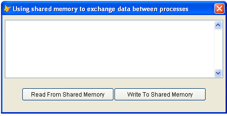

[ 主页 ](https://github.com/VFP9/Win32API)  

# 使用共享内存在应用程序（进程）之间交换数据
_翻译：xinjie  2021.01.01_

## 开始之前：
在 *SharedMemory* 类下面显示的内容使用 FileMapping API 调用来分配可从任何可以实例化该类的 FoxPro 应用程序访问的内存块。所有应用程序都共享该内存缓冲区的名称，例如“ MYAPPSHAREDMEMORY”。  

  

要测试这个类，请启动两个或多个VFP可执行文件，并在每个会话中运行这个代码。  

```foxpro
LOCAL oForm As TForm  
oForm = CREATEOBJECT("Tform")  
oForm.Show(1)  
* 主程序结束  

DEFINE CLASS Tform As Form  
	Width=460  
	Height=200  
	Caption="使用共享内存在进程间交换数据"  
	smObject=NULL  

	ADD OBJECT txtSharedMemory As EditBox WITH;  
	Left=5, Top=10, Width=450, Height=120  

	ADD OBJECT cmdReadFromMemory As CommandButton WITH;  
	Left=40, Top=150, Width=190, Height=27,;  
	Caption="从共享内存读取"  

	ADD OBJECT cmdWriteToMemory As CommandButton WITH;  
	Left=230, Top=150, Width=190, Height=27,;  
	Caption="写入共享内存"  

PROCEDURE Init  
	THIS.smObject = CREATEOBJECT("SharedMemory",;  
		"MYAPPSHAREDMEMORY", 1024)  

PROCEDURE cmdReadFromMemory.Click  
	ThisForm.txtSharedMemory.Value =;  
		ThisForm.smObject.ReadFromSharedMemory()  

PROCEDURE cmdWriteToMemory.Click  
	LOCAL cBuffer  
	cBuffer = PADR(ThisForm.txtSharedMemory.Value,;  
		ThisForm.smObject.GetSharedMemorySize())  
	ThisForm.smObject.WriteToSharedMemory(m.cBuffer)  
ENDDEFINE
```
参考：

* [使用 Semaphore 对象只允许一个VFP应用实例运行](sample_147.md)  
* [通过剪贴板在 VFP 应用程序之间传递数据记录](sample_346.md)  
  
***  


## 代码：
```foxpro  
#DEFINE ERROR_ALREADY_EXISTS 183
#DEFINE INVALID_HANDLE_VALUE -1
#DEFINE PAGE_READWRITE 4
#DEFINE WAIT_OBJECT_0 0
#DEFINE SECTION_QUERY 1
#DEFINE SECTION_MAP_WRITE 2
#DEFINE SECTION_MAP_READ 4
#DEFINE SECTION_MAP_EXECUTE 8
#DEFINE SECTION_EXTEND_SIZE 0x10
#DEFINE STANDARD_RIGHTS_REQUIRED 0xF0000
#DEFINE FILE_MAP_ALL_ACCESS BITOR(STANDARD_RIGHTS_REQUIRED,;
	SECTION_QUERY, SECTION_MAP_WRITE, SECTION_MAP_READ,;
	SECTION_MAP_EXECUTE, SECTION_EXTEND_SIZE)

DEFINE CLASS SharedMemory As Session
PROTECTED hSyncObject, hMapping, hBuffer, MappingName, bufsize
	hSyncObject=0
	hMapping=0
	hBuffer=0
	errorcode=0

PROCEDURE Init(cMappingName, nBufsize)
	THIS.declare
	THIS.MappingName=cMappingName
	THIS.bufsize=m.nBufsize
	THIS.InitMapping

PROCEDURE Destroy
	THIS.ReleaseMapping

FUNCTION GetSharedMemorySize
RETURN THIS.bufsize

PROTECTED FUNCTION LockAccess
* 要求拥有互斥体
	LOCAL nResult
	nResult = WaitForSingleObject(THIS.hSyncObject, 5000)
RETURN (m.nResult=0)

PROTECTED PROCEDURE ReleaseAccess
* 释放互斥体
	= ReleaseMutex(THIS.hSyncObject)

FUNCTION WriteToSharedMemory(cBuffer, nOffset)
* nOffset 从 0 开始
	IF THIS.hBuffer=0
		RETURN 0
	ENDIF
	IF VARTYPE(nOffset) <> "N"
		nOffset=0
	ENDIF

	LOCAL nBytesToWrite

	IF THIS.LockAccess()
		nBytesToWrite = MIN(THIS.bufsize-nOffset, LEN(cBuffer))
		= StrToMem(THIS.hBuffer+nOffset, @cBuffer, nBytesToWrite)
		THIS.ReleaseAccess
	ELSE
		nBytesToWrite=0
	ENDIF
RETURN m.nBytesToWrite

FUNCTION ReadFromSharedMemory(nBytesToRead, nOffset)
* nOffset 从 0 开始
	IF THIS.hBuffer=0
		RETURN ""
	ENDIF
	IF VARTYPE(nOffset) <> "N"
		nOffset=0
	ENDIF
	IF VARTYPE(nBytesToRead) <> "N"
		nBytesToRead=THIS.bufsize
	ELSE
		nBytesToRead=MIN(nBytesToRead, THIS.bufsize)
	ENDIF

	LOCAL cBuffer

	IF THIS.LockAccess()
		cBuffer = REPLICATE(CHR(0), nBytesToRead)
		= MemToStr(@cBuffer, THIS.hBuffer+nOffset, nBytesToRead)
		THIS.ReleaseAccess
	ELSE
		cBuffer=0
	ENDIF
RETURN m.cBuffer

PROTECTED PROCEDURE InitMapping
* 创建同步和共享内存对象
	THIS.hSyncObject = CreateMutex(0,0, "sync_"+THIS.MappingName)

	IF THIS.hSyncObject=0
		THIS.errorcode = GetLastError()
		RETURN
	ENDIF

	* 给同步对象和共享内存对象起不同的名字
	THIS.hMapping = CreateFileMapping(INVALID_HANDLE_VALUE,;
		0, PAGE_READWRITE, 0, THIS.bufsize, THIS.MappingName)

	IF INLIST(THIS.hMapping,0,INVALID_HANDLE_VALUE)
		THIS.errorcode = GetLastError()
	ELSE
		THIS.hBuffer = MapViewOfFile(THIS.hMapping,;
			FILE_MAP_ALL_ACCESS, 0,0,THIS.bufsize)

		IF THIS.hBuffer = 0
			THIS.errorcode = GetLastError()
		ENDIF
	ENDIF

PROTECTED PROCEDURE ReleaseMapping
* 释放同步和共享内存对象
	IF THIS.hBuffer <> 0
		= UnmapViewOfFile(THIS.hBuffer)
		THIS.hBuffer=0
	ENDIF
	IF NOT INLIST(THIS.hMapping,0,INVALID_HANDLE_VALUE)
		= CloseHandle(THIS.hMapping)
		THIS.hMapping=0
	ENDIF
	IF THIS.hSyncObject<>0
		THIS.ReleaseAccess
		= CloseHandle(THIS.hSyncObject)
		THIS.hSyncObject=0
	ENDIF

PROTECTED PROCEDURE declare
* RtlMoveMemory是用两个别名来声明的 -- 需要VFP8+
* 在较旧的VFP版本中，在调用之前立即声明它
	DECLARE INTEGER CloseHandle IN kernel32 INTEGER hObject
	DECLARE INTEGER UnmapViewOfFile IN kernel32 LONG lpBaseAddress
	DECLARE INTEGER GetLastError IN kernel32
	DECLARE INTEGER ReleaseMutex IN kernel32 INTEGER hMutex

	DECLARE INTEGER CreateFileMapping IN kernel32;
		INTEGER hFile, INTEGER lpAttributes, INTEGER flProtect,;
		LONG dwMaximumSizeHi, LONG dwMaximumSizeLo, STRING lpName

	DECLARE LONG MapViewOfFile IN kernel32;
		INTEGER hFileMappingObject, INTEGER dwDesiredAccess,;
		LONG dwFileOffsetHi, LONG dwFileOffsetLo,;
		LONG dwNumberOfBytesToMap

	DECLARE RtlMoveMemory IN kernel32 As StrToMem;
		INTEGER, STRING @, INTEGER

	DECLARE RtlMoveMemory IN kernel32 As MemToStr;
		STRING @, INTEGER, INTEGER

	DECLARE INTEGER CreateMutex IN kernel32;
		INTEGER lpMutexAttributes, INTEGER bInitialOwner, STRING lpName

	DECLARE INTEGER WaitForSingleObject IN kernel32;
		INTEGER hHandle, INTEGER dwMilliseconds

ENDDEFINE  
```  
***  


## 函数列表：
[CloseHandle](../libraries/kernel32/CloseHandle.md)  
[CreateFileMapping](../libraries/kernel32/CreateFileMapping.md)  
[CreateMutex](../libraries/kernel32/CreateMutex.md)  
[GetLastError](../libraries/kernel32/GetLastError.md)  
[MapViewOfFile](../libraries/kernel32/MapViewOfFile.md)  
[ReleaseMutex](../libraries/kernel32/ReleaseMutex.md)  
[UnmapViewOfFile](../libraries/kernel32/UnmapViewOfFile.md)  
[WaitForSingleObject](../libraries/kernel32/WaitForSingleObject.md)  

## 备注：
互斥对象用于同步对共享内存块的访问。  
  
***  

