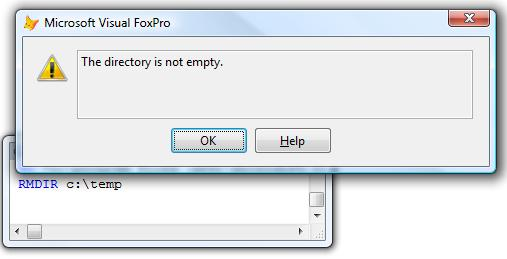
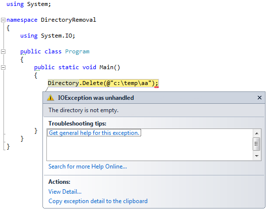

[ 主页 ](https://github.com/VFP9/Win32API)  

# 如何删除非空目录
_翻译：xinjie  2021.01.01_

## 简述：
如你所知，当试图删除一个非空的目录时，RMDIR会产生一个错误消息。这个例子展示了如何基于SHFileOperation调用来删除一个带有文件的目录。  
***  


## 开始之前：
如你所知，如果目标目录不是空的，即包含文件或子目录，对 RMDIR() 的调用会产生一个错误(#1962)。  

  
克服这个障碍的最明显的方法是写一个递归，把 ADIR 和 DELETE FILE | RMDIR 调用结合起来。  

作为一种选择，Windows脚本有自己的解决方案：
```foxpro
fso = CREATEOBJECT("Scripting.FileSystemObject")  
fso.DeleteFolder("c:\temp\test")
```

还有另外一种方法，如下面的代码示例所示。 可以通过调用 SHFileOperation API 函数来递归删除目录。  

参考：

* [删除文件到回收站](sample_321.md)  
* [如何清空回收站](sample_301.md)  
* [复制文件时显示标准进度对话框](sample_508.md)  
  
***  


## 代码：
```foxpro  
FUNCTION DeleteDirectory(cTargetPath As String) As Number
* 成功时返回 0，失败时返回错误代码
#DEFINE FO_DELETE 3
#DEFINE FOF_ALLOWUNDO 64
#DEFINE FOF_SILENT 4
#DEFINE FOF_NOCONFIRMATION 0x10
#DEFINE FOF_NOERRORUI 0x400

	DECLARE INTEGER SHFileOperation IN Shell32;
		STRING @lpFileOp

	LOCAL oTarget, cBuffer, hWindow, nFlags

	oTarget = CREATEOBJECT("PChar", cTargetPath)
	
	* 早期的 VFP 版本调用GetActiveWindow API
	hWindow = _screen.HWnd

	* 完全静音模式，适用于早期 VFP 版本功能有限的 BITOR()，只需将标志相加即可。
	nFlags = BITOR(FOF_SILENT, FOF_NOCONFIRMATION,;
		FOF_NOERRORUI)

	* 填充 SHFILEOPSTRUCT 结构
	cBuffer = num2dword(hWindow) +;
		num2dword(FO_DELETE) +;
		num2dword(oTarget.GetAddr()) +;
		num2dword(0) + num2word(nFlags) +;
		num2word(0) + num2dword(0) + num2dword(0)

RETURN SHFileOperation(@cBuffer)

FUNCTION num2word(lnValue)
RETURN Chr(MOD(m.lnValue,256)) + CHR(INT(m.lnValue/256))

FUNCTION num2dword(lnValue)
#DEFINE m0 0x0000100
#DEFINE m1 0x0010000
#DEFINE m2 0x1000000
	IF lnValue < 0
		lnValue = 0x100000000 + lnValue
	ENDIF
	LOCAL b0, b1, b2, b3
	b3 = Int(lnValue/m2)
	b2 = Int((lnValue - b3*m2)/m1)
	b1 = Int((lnValue - b3*m2 - b2*m1)/m0)
	b0 = Mod(lnValue, m0)
RETURN Chr(b0)+Chr(b1)+Chr(b2)+Chr(b3)

DEFINE CLASS PChar As Session
PROTECTED hMem

PROCEDURE Init(lcString)
	THIS.hMem = 0
	THIS.setValue(lcString)

PROCEDURE Destroy
	THIS.ReleaseString

FUNCTION GetAddr
RETURN THIS.hMem

FUNCTION GetValue
	LOCAL lnSize, lcBuffer
	lnSize = THIS.getAllocSize()
	lcBuffer = SPACE(lnSize)

	IF THIS.hMem <> 0
		DECLARE RtlMoveMemory IN kernel32 As MemToStr;
			STRING @, INTEGER, INTEGER
		= MemToStr(@lcBuffer, THIS.hMem, lnSize)
	ENDIF
RETURN lcBuffer

FUNCTION GetAllocSize
	DECLARE INTEGER GlobalSize IN kernel32 INTEGER hMem
RETURN Iif(THIS.hMem=0, 0, GlobalSize(THIS.hMem))

PROCEDURE SetValue(lcString)
#DEFINE GMEM_FIXED 0
#DEFINE GMEM_MOVEABLE 2
#DEFINE GMEM_ZEROINIT 0x0040

	THIS.ReleaseString

	DECLARE INTEGER GlobalAlloc IN kernel32 INTEGER, INTEGER
	DECLARE RtlMoveMemory IN kernel32 As StrToMem;
		INTEGER, STRING @, INTEGER

	LOCAL lnSize
	lcString = lcString + Chr(0)
	lnSize = Len(lcString)
	THIS.hMem = GlobalAlloc(0x0040, lnSize)
	IF THIS.hMem <> 0
		= StrToMem(THIS.hMem, @lcString, lnSize)
	ENDIF

PROCEDURE ReleaseString
	IF THIS.hMem <> 0
		DECLARE INTEGER GlobalFree IN kernel32 INTEGER
		= GlobalFree (THIS.hMem)
		THIS.hMem = 0
	ENDIF
ENDDEFINE  
```  
***  


## 函数列表：
[GetActiveWindow](../libraries/user32/GetActiveWindow.md)  
[GlobalAlloc](../libraries/kernel32/GlobalAlloc.md)  
[GlobalFree](../libraries/kernel32/GlobalFree.md)  
[GlobalSize](../libraries/kernel32/GlobalSize.md)  
[SHFileOperation](../libraries/shell32/SHFileOperation.md)  

## 备注：
如我所见，SHFileOperation是一个更好的选择，因为它更加灵活。 当然，这是以处理 <a href="http://msdn.microsoft.com/en-us/library/bb759795(v=vs.85).aspx">SHFILEOPSTRUCT 结构</a> 所需的额外编码为代价的。
  
SHFileOperation递归删除目标目录内的文件和子目录。
  
每当遇到无法删除的对象时，文件删除过程就会中止。 该调用返回错误代码（例如32，*文件共享冲突*）。 此文件中的文件及其后的子目录不会被删除。
  
* * *  
.NET 有不止一种的删除目录的方式。  
  
当路径不是空目录时，System.IO <a href="http://msdn.microsoft.com/en-us/library/fxeahc5f.aspx">Directory.Delete</a> 会抛出一个异常。  



而 System.IO <a href="http://msdn.microsoft.com/en-us/library/c66e2tts">DirectoryInfo.Delete</a> 可以递归地删除文件和目录。  

  

***  

