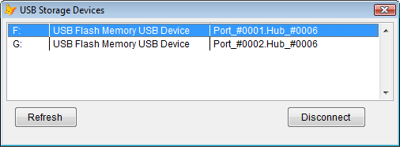
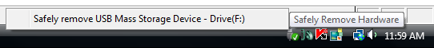
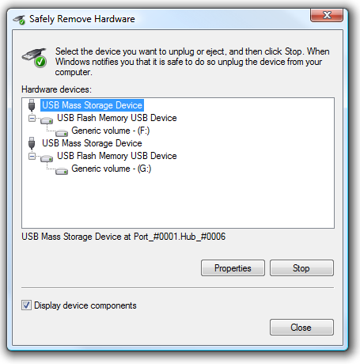

[ 主页 ](https://github.com/VFP9/Win32API)  

# 以程序方式断开 USB 大容量存储设备的连接
_翻译：xinjie  2021.01.01_

## 开始之前：
  
在 VFP 代码中可以断开 USB 存储设备的连接（安全移除）。其过程与系统实用程序使用的相同。  
  

  

参考：

* [枚举安装在本地机器上的设备](sample_545.md)  
* [检测与可移动硬盘的连接变化(VFP9)](sample_573.md)  
* [检索可用磁盘驱动器的列表](sample_013.md)  

  
***  


## 代码：
```foxpro  
LOCAL oForm As Tform
oForm= CREATEOBJECT("Tform")
oForm.Show(1)
* 主程序结束

DEFINE CLASS Tform As Form
#DEFINE CLASS_GUID_USBCONTROLLER "{36fc9e60-c465-11cf-8056-444553540000}"
#DEFINE CLASS_GUID_DISKDRIVE "{4d36e967-e325-11ce-bfc1-08002be10318}"
	Width=500
	Height=160
	BorderStyle=2
	MaxButton=.F.
	MinButton=.F.
	Autocenter=.T.
	Caption="USB 存储设备"
	devenum=NULL

	ADD OBJECT lstDevices As ListBox WITH;
	Left=5, Top=5, Width=490, Height=100, ColumnCount=3,;
	ColumnWidths="50,200,240", BoundTo=.T., BoundColumn=4
	
	ADD OBJECT cmdRefresh As CommandButton WITH;
	Left=15, Top=112, Width=80, Height=27, Caption="刷新"

	ADD OBJECT cmdDisconnect As CommandButton WITH;
	Left=360, Top=112, Width=100, Height=27,;
	Caption="断开连接", Alt="安全移除硬件"

PROCEDURE Init
	THIS.EnumDevices

PROCEDURE cmdRefresh.Click
	ThisForm.EnumDevices

PROCEDURE cmdDisconnect.Click
	ThisForm.DisconnectSelectedDevice
	ThisForm.EnumDevices

PROCEDURE DisconnectSelectedDevice
* 断开 USB 存储设备的连接
	IF THIS.lstDevices.ListIndex > 0
		LOCAL nDevinst
		nDevinst = VAL(SUBSTR(THIS.lstDevices.Value,2))
		THIS.devenum.DisconnectRequest(m.nDevinst)
	ENDIF

PROCEDURE EnumDevices
	THIS.lstDevices.Clear
	THIS.cmdDisconnect.Enabled=.F.
	
	THIS.devenum=NULL
	THIS.devenum=CREATEOBJECT("TDeviceEnumerator")

	LOCAL oDevice As TDevice, oParent As TDevice,;
		nDevicesFound, cDriveLetter

	nDevicesFound=0  && USB Drives found

	FOR EACH oDevice IN THIS.devenum.devices
	* 寻找 "磁盘驱动器 "类设备，其父级设备为 "通用串行总线控制器"。

		IF oDevice.classguid=CLASS_GUID_DISKDRIVE
			oParent = THIS.devenum.GetDevice(oDevice.devparent)

			IF VARTYPE(oParent)="O" AND;
				oParent.classguid=CLASS_GUID_USBCONTROLLER
			* 找到一个设备;
			* 可以断开父级（USB控制器）

				* 假设连接的第一台设备的驱动字母小于连接的第二台设备
				* 其实，这个假设在某些情况下未必正确？

				nDevicesFound=nDevicesFound+1
				cDriveLetter =THIS.devenum.GetRemovableDriveLetter(;
					m.nDevicesFound)

				WITH THIS.lstDevices
					.AddItem(" "+m.cDriveLetter)
					.List(.ListCount,2)=" "+oDevice.friendlyname
					.List(.ListCount,3)=" "+oParent.locationinfo
					.List(.ListCount,4)="#" + TRANSFORM(oParent.devinst)
				ENDWITH
			ENDIF
		ENDIF
	NEXT

	WITH THIS.lstDevices
	* 如果连接并启用 USB 驱动器
		IF .ListCount > 0
			.ListIndex=1
			THIS.cmdDisconnect.Enabled=.T.
		ENDIF
	ENDWITH

ENDDEFINE

DEFINE CLASS TDeviceEnumerator As Relation
#DEFINE CR_SUCCESS 0
#DEFINE MAX_PATH 260
#DEFINE MAX_DEVICE_ID_LEN 200
	oRoot=NULL
	hMachine=0
	MachineName=""
	hRoot=0
	devices=NULL

PROCEDURE Init(cMachine As String)
	THIS.declare
	THIS.devices = CREATEOBJECT("Collection")

	IF EMPTY(cMachine)
		cMachine = SUBSTR(SYS(0), 1, AT(" ",SYS(0))-1)
	ENDIF
	IF SUBSTR(THIS.MachineName,1,2) <> "\\"
		THIS.MachineName = "\\"+m.cMachine
	ENDIF
	
	LOCAL hMachine, nResult
	hMachine=0
	
	nResult = CM_Connect_Machine(THIS.MachineName, @hMachine)
	IF m.nResult <> CR_SUCCESS
		= MESSAGEBOX("CM_Connect_Machine 失败: "+;
			TRANSFORM(nResult))
		RETURN .F.
	ENDIF
	THIS.hMachine = m.hMachine

	LOCAL hRoot
	hRoot=0
	= CM_Locate_DevNode_Ex(@hRoot, 0, 0, THIS.hMachine)
	THIS.hRoot=m.hRoot

	WAIT WINDOW NOWAIT "枚举设备..."
	THIS.oRoot = CREATEOBJECT("TDevice",;
		THIS, THIS.hRoot, 0)
	WAIT CLEAR  && 枚举结束

PROCEDURE Destroy
	WITH THIS
		= CM_Disconnect_Machine(.hMachine)
		.hMachine=0
	ENDWITH

FUNCTION DisconnectRequest(cDevInst) As Number
	LOCAL oDevice As TDevice, nResult, ex As Exception

	oDevice = THIS.GetDevice(cDevInst)
	TRY
		nResult = CM_Request_Device_Eject_Ex(oDevice.devinst,;
			0,0,0,0, THIS.hMachine)
	CATCH TO ex
		nResult=-1
	ENDTRY
RETURN m.nResult

PROCEDURE GetDevice(nDevInst) As TDevice
	LOCAL cKey, oDevice As TDevice
	cKey = "#" + TRANSFORM(m.nDevInst)
	TRY
		oDevice = THIS.devices.Item(m.cKey)
	CATCH
		oDevice=NULL
	ENDTRY
RETURN m.oDevice

PROCEDURE OnDeviceEnumerated(oDevice As TDevice)
	THIS.devices.Add(oDevice,;
		"#"+TRANSFORM(oDevice.devinst))

FUNCTION GetRemovableDriveLetter(nOccurence)
#DEFINE DRIVE_REMOVABLE 2

	LOCAL nDrivesMask, nIndex, nShift, cDrive, nFound
	nDrivesMask = GetLogicalDrives()
	
	STORE 0 TO nIndex, nFound
	DO WHILE .T.
		nShift = BITLSHIFT(1, nIndex)
		IF nShift > nDrivesMask
			EXIT
		ENDIF

		cDrive = CHR(nIndex + 65) + ":"
		IF BITAND(nDrivesMask, nShift) <> 0
			IF GetDriveType(cDrive) = DRIVE_REMOVABLE
				nFound=m.nFound + 1
				IF nFound = nOccurence
					RETURN m.cDrive
				ENDIF
			ENDIF
		ENDIF
		nIndex = nIndex + 1
	ENDDO
RETURN ""

PROCEDURE declare
	DECLARE INTEGER GetLogicalDrives IN kernel32
	DECLARE INTEGER GetDriveType IN kernel32 STRING nDrive

	DECLARE INTEGER CM_Connect_Machine IN cfgmgr32;
		STRING UNCServerName, INTEGER @phMachine

	DECLARE INTEGER CM_Disconnect_Machine IN cfgmgr32;
		INTEGER hMachine

	DECLARE INTEGER CM_Locate_DevNode_Ex IN cfgmgr32;
		INTEGER @pdnDevInst, INTEGER pDeviceID,;
		LONG ulFlags, INTEGER hMachine

	DECLARE INTEGER CM_Get_Sibling_Ex IN cfgmgr32;
		INTEGER @pdnDevInst, INTEGER DevInst,;
		LONG ulFlags, INTEGER hMachine

	DECLARE INTEGER CM_Get_Child_Ex IN cfgmgr32;
		INTEGER @pdnDevInst, INTEGER DevInst,;
		LONG ulFlags, INTEGER hMachine

	DECLARE INTEGER CM_Get_DevNode_Registry_Property_Ex IN cfgmgr32;
		INTEGER pdnDevInst, LONG ulProperty,;
		INTEGER pulRegDataType, STRING @outBuffer,;
		LONG @BufferLen, LONG ulFlags, INTEGER hMachine

	DECLARE INTEGER CM_Request_Device_Eject_Ex IN setupapi;
		INTEGER dnDevInst, INTEGER pVetoType,;
		INTEGER pszVetoName, LONG ulNameLength,;
		LONG ulFlags, INTEGER hMachine

ENDDEFINE

DEFINE CLASS TDevice As Relation
	DevViewer=NULL
	devinst=0
	devparent=0
	description=""
	classguid=""
	friendlyname=""
	locationinfo=""
	enumname=""

PROCEDURE Init(oDevViewer, hDevInst, hParent)
	WITH THIS
		.DevViewer=oDevViewer
		.devinst=m.hDevInst
		.devparent=m.hParent

		.description=.GetDeviceProperty(1)
		.classguid=.GetDeviceProperty(9)
		.friendlyname=.GetDeviceProperty(13)
		.locationinfo=.GetDeviceProperty(14)
		.enumname=.GetDeviceProperty(23)

		.DevViewer.OnDeviceEnumerated(THIS)
		.EnumChildren
	ENDWITH

PROCEDURE EnumChildren
	LOCAL hFirst, hCurrent, hNext
	hFirst=0
	IF CM_Get_Child_Ex(@hFirst, THIS.devinst,;
		0, THIS.DevViewer.hMachine) <> CR_SUCCESS
		RETURN
	ENDIF
	
	hCurrent = hFirst
	DO WHILE .T.
		LOCAL oChild As TDevice

		oChild = CREATEOBJECT("TDevice",;
			THIS.DevViewer, m.hCurrent, THIS.devinst)

		oChild=NULL

		hNext=0
		IF CM_Get_Sibling_Ex(@hNext, hCurrent, 0,;
			THIS.DevViewer.hMachine) <> CR_SUCCESS
			EXIT
		ENDIF
		hCurrent = hNext
	ENDDO

FUNCTION GetDeviceProperty(nIndex As Number) As String
	LOCAL nBuflen, cBuffer, nResult
	nBuflen=MAX_PATH + MAX_DEVICE_ID_LEN
	cBuffer=REPLICATE(CHR(0), nBuflen)
	
	nResult = CM_Get_DevNode_Registry_Property_Ex(;
		THIS.devinst, m.nIndex, 0, @cBuffer, @nBuflen,;
		0, THIS.DevViewer.hMachine)

	IF nResult = CR_SUCCESS
		cBuffer = SUBSTR(cBuffer, 1, nBuflen)
	ELSE
		cBuffer = ""
	ENDIF
RETURN ALLTRIM(STRTRAN(cBuffer, CHR(0),""))

ENDDEFINE  
```  
***  


## 函数列表：
[CM_Connect_Machine](../libraries/cfgmgr32/CM_Connect_Machine.md)  
[CM_Disconnect_Machine](../libraries/cfgmgr32/CM_Disconnect_Machine.md)  
[CM_Get_Child_Ex](../libraries/cfgmgr32/CM_Get_Child_Ex.md)  
[CM_Get_Sibling_Ex](../libraries/cfgmgr32/CM_Get_Sibling_Ex.md)  
[CM_Locate_DevNode_Ex](../libraries/cfgmgr32/CM_Locate_DevNode_Ex.md)  
[CM_Request_Device_Eject_Ex](../libraries/setupapi/CM_Request_Device_Eject_Ex.md)  
[GetDriveType](../libraries/kernel32/GetDriveType.md)  
[GetLogicalDrives](../libraries/kernel32/GetLogicalDrives.md)  

## 备注：
```txt
#DEFINE CLASS_GUID_USBCONTROLLER;  
	"{36fc9e60-c465-11cf-8056-444553540000}"  
  
#DEFINE CLASS_GUID_DISKDRIVE;  
	"{4d36e967-e325-11ce-bfc1-08002be10318}"
```

***  

