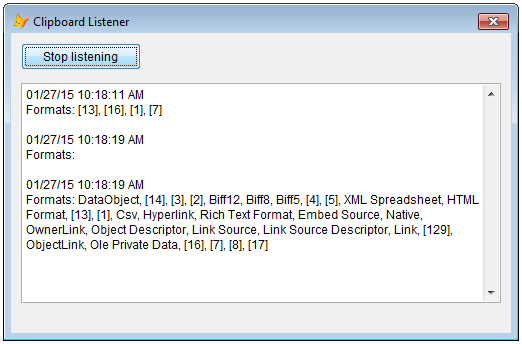

[ 主页 ](https://github.com/VFP9/Win32API)  

# 监测剪贴板内容变化(VFP9)
_翻译：xinjie  2021.01.03_

## 开始之前：
将 VFP 表单（ThisForm.hWnd）添加到*剪贴板格式侦听器列表*后，只要剪贴板的内容发生更改，它就会收到 WM_CLIPBOARDUPDATE 消息。 

  

参考：

* [枚举剪贴板上当前可用的数据格式](sample_032.md)  
* [如何禁用 Windows 剪贴板(VFP9)](sample_488.md)  
* [使用Raw Input API（VFP9）捕获另一个应用程序的键盘活动](sample_572.md)  

  
***  


## 代码：
```foxpro  
LOCAL oForm as TForm
oForm = CREATEOBJECT("TForm")
oForm.Visible = .T.
READ EVENTS

DEFINE CLASS TForm as Form
#DEFINE CRLF CHR(13)+CHR(10)
	Caption="剪贴板监听器"
	Width=500
	Height=500
	AutoCenter=.T.
	MaxButton=.F.
	MinButton=.F.
	
	ADD OBJECT CFListener As ClipboardListener
	
	ADD OBJECT Button1 as CommandButton WITH;
	Left=10, Top=10, Width=120, Height=27,;
	Caption="开始监听"
	
	ADD OBJECT Edit1 as EditBox WITH;
	Left=10, Top=50, Width=480, Height=420,;
	MaxLength=0

PROCEDURE Destroy
	CLEAR EVENTS

PROCEDURE Button1.Click
	IF ThisForm.CFListener.IsListening()
		ThisForm.CFListener.StopListening
		THIS.Caption = "开始监听"
	ELSE
		IF ThisForm.CFListener.StartListening(ThisForm.HWnd)
			THIS.Caption = "停止监听"
		ENDIF
	ENDIF

PROCEDURE CFListener.OnUdfMessage
PARAMETERS wParam As Integer, lParam As Integer
	DODEFAULT()
	
	LOCAL cValue
	cValue = ThisForm.Edit1.Value
	
	ThisForm.Edit1.Value = m.cValue +;
		TRANSFORM(DATETIME()) + CRLF +;
		"格式: " + THIS.GetCFInfo() + CRLF + CRLF
	
ENDDEFINE

DEFINE CLASS ClipboardListener as Control
#DEFINE GWL_WNDPROC -4
#DEFINE WM_CLIPBOARDUPDATE 0x031D

* 一些标准剪贴板格式
#DEFINE CF_BITMAP            2
#DEFINE CF_DIB               8
#DEFINE CF_DIBV5            17
#DEFINE CF_DIF               5
#DEFINE CF_DSPBITMAP       130
#DEFINE CF_DSPENHMETAFILE  142
#DEFINE CF_DSPMETAFILEPICT 131
#DEFINE CF_DSPTEXT         129
#DEFINE CF_ENHMETAFILE      14
#DEFINE CF_GDIOBJFIRST     768
#DEFINE CF_GDIOBJLAST     1023
#DEFINE CF_HDROP            15
#DEFINE CF_LOCALE           16
#DEFINE CF_METAFILEPICT      3
#DEFINE CF_OEMTEXT           7
#DEFINE CF_OWNERDISPLAY    128
#DEFINE CF_PALETTE           9
#DEFINE CF_PENDATA          10
#DEFINE CF_PRIVATEFIRST    512
#DEFINE CF_PRIVATELAST     767
#DEFINE CF_RIFF             11
#DEFINE CF_SYLK              4
#DEFINE CF_TEXT              1
#DEFINE CF_WAVE             12
#DEFINE CF_TIFF              6
#DEFINE CF_UNICODETEXT      13

PROTECTED ListeningOn
	hWindow=0
	hOrigProc=0
	ListeningOn=.F.
	Visible=.F.

PROCEDURE Init
	THIS.declare
	THIS.hOrigProc = GetWindowLong(THIS.hWindow, GWL_WNDPROC)

PROCEDURE Destroy
	THIS.StopListening
	= CloseClipboard()

FUNCTION IsListening() as Boolean
RETURN THIS.ListeningOn

PROCEDURE StartListening(hWindow as Number)
* 开始监听剪贴板的变化
	THIS.StopListening

	LOCAL nResult
	nResult = AddClipboardFormatListener(m.hWindow)

	IF nResult = 0
		* 1400 = ERROR_INVALID_WINDOW_HANDLE
		ACTIVATE SCREEN
		? "AddClipboardFormatListener 失败:", GetLastError(), m.hWindow
		RETURN .F.
	ENDIF

	THIS.hWindow = m.hWindow

	IF VERSION(5) >= 900  && VFP9+
		= BINDEVENT(THIS.hWindow, WM_CLIPBOARDUPDATE,;
			THIS, "WindowProc")
	ENDIF
	
	THIS.ListeningOn = .T.
RETURN .T.

PROCEDURE StopListening
* 停止监听剪贴板的变化
	THIS.ListeningOn = .F.
	IF THIS.hWindow = 0
		RETURN
	ENDIF

	IF VERSION(5) >= 900  && VFP9+
		UNBINDEVENTS(THIS.hWindow)
	ENDIF

	RemoveClipboardFormatListener(THIS.hWindow)
	THIS.hWindow = 0

PROCEDURE WindowProc(hWindow as Integer,;
	nMsgID as Integer, wParam as Integer, lParam as Integer)
* 需要 VFP9，否则忽略

	LOCAL nReturn
	nReturn=0
	
	DO CASE
	CASE nMsgID = WM_CLIPBOARDUPDATE
		THIS.OnUdfMessage(wParam, lParam)

	OTHERWISE
	* 将控制权交给原窗口程序
		nReturn = CallWindowProc(THIS.hOrigProc, THIS.hWindow,;
			m.nMsgID, m.wParam, m.lParam)
	ENDCASE

RETURN nReturn

PROCEDURE OnUdfMessage(wParam As Integer, lParam As Integer)
* 占位符，覆盖

FUNCTION GetCFInfo() as String
* 返回当前剪贴板上的格式列表
	LOCAL nIndex, cResult
	cResult=""
	nIndex = 0

	= OpenClipboard(THIS.hWindow)

	TRY
		DO WHILE .T.
			nIndex = EnumClipboardFormats(m.nIndex)
			IF m.nIndex = 0
				EXIT
			ENDIF
			
			cResult = m.cResult + IIF(EMPTY(m.cResult), "", ", ") +;
				THIS.GetCFName(m.nIndex)
		ENDDO
	CATCH
	FINALLY
		= CloseClipboard()
	ENDTRY

RETURN m.cResult

FUNCTION GetCFName(nIndex) as String
* 返回指定剪贴板格式的名称
#DEFINE cmBufsize 250
	LOCAL cBuffer, nResult
	cBuffer = REPLICATE(CHR(0), cmBufsize)
	nResult = GetClipboardFormatName(nIndex, @cBuffer, cmBufsize)

RETURN IIF(nResult=0,;
	"[" + TRANSFORM(m.nIndex) + "]",;
	LEFT(cBuffer, nResult))

PROCEDURE declare
	DECLARE INTEGER GetLastError IN kernel32

	DECLARE INTEGER AddClipboardFormatListener IN user32;
		INTEGER hWindow

	DECLARE INTEGER RemoveClipboardFormatListener IN user32;
		INTEGER hWindow

	DECLARE INTEGER GetWindowLong IN user32;
		INTEGER hWindow, INTEGER nIndex

	DECLARE INTEGER CallWindowProc IN user32;
		INTEGER lpPrevWndFunc, INTEGER hWindow, LONG Msg,;
		INTEGER wParam, INTEGER lParam

	DECLARE INTEGER GetClipboardFormatName IN user32;
		INTEGER fmt, STRING @lpszFmtName, INTEGER cchMaxCount

	DECLARE INTEGER OpenClipboard IN user32 INTEGER hwnd
	DECLARE INTEGER CloseClipboard IN user32
	DECLARE INTEGER EnumClipboardFormats IN user32 INTEGER wFormat

ENDDEFINE  
```  
***  


## 函数列表：
[AddClipboardFormatListener](../libraries/user32/AddClipboardFormatListener.md)  
[CallWindowProc](../libraries/user32/CallWindowProc.md)  
[CloseClipboard](../libraries/user32/CloseClipboard.md)  
[EnumClipboardFormats](../libraries/user32/EnumClipboardFormats.md)  
[GetClipboardFormatName](../libraries/user32/GetClipboardFormatName.md)  
[GetLastError](../libraries/kernel32/GetLastError.md)  
[GetWindowLong](../libraries/user32/GetWindowLong.md)  
[OpenClipboard](../libraries/user32/OpenClipboard.md)  
[RemoveClipboardFormatListener](../libraries/user32/RemoveClipboardFormatListener.md)  

## 备注
```txt
#define WM_CLIPBOARDUPDATE 0x031D
```
  
参考：

[GetClipboardSequenceNumber](../libraries/user32/GetClipboardSequenceNumber.md)
   
每当剪贴板的内容更改（包括清空剪贴板）时，此API函数返回的结果都会增加。 例如，在Excel中执行单个复制粘贴操作，首先清除剪贴板，然后以N种不同格式向其中添加数据。 因此前后差将为N + 1。  
  
***  

