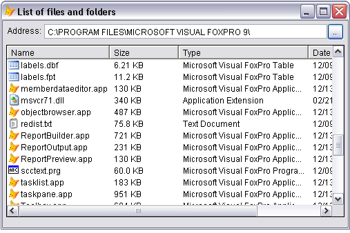

[ 主页 ](https://github.com/vfp9/Win32API)  

# 分组的示例列表
_翻译:xinjie  2020.12.27 —— 2020.12.31_

#  原子(Atom)

## [检索全局原子名（Global Atom names）](samples/sample_116.md)

#  认证方式

## [Smart Card 数据查询函数](samples/sample_539.md)

#  权限

## [如何为应用程序启用 SE_SHUTDOWN_NAME 权限](samples/sample_552.md)
要关闭或重启系统（API 调用 ExitWindowsEx、InitiateShutdown 等），进程必须拥有 SE_SHUTDOWN_NAME 权限（Vista 的默认行为）。 
## [如何加载用户配置文件（user profile）](samples/sample_602.md)

## [读取和设置当前进程的系统访问权限](samples/sample_554.md)

#  位图（Bitmap）

## [VFP 的 Bitmap Class](samples/sample_295.md)

## [转换图像文件到图标文件（ICO）](samples/sample_503.md)
此代码示例演示如何加载图像文件（BMP，GIF，JPEG，PNG，TIFF），缩放图像并将其另存为.ICO文件。 它创建一个简单的图标文件，其中包含一个32x32图标（每像素32位），并将新图标分配给Icon属性。  
## [使用增强的 Metafile API 函数将活动表单的图片复制到剪贴板](samples/sample_404.md)

## [使用 BitBlt 和 StretchBlt 函数在 FoxPro 表单中显示动画图像](samples/sample_355.md)

## [使用 AlphaBlend 函数显示位图](samples/sample_293.md)

## [使用 LoadBitmap 函数绘制 Windows 预定义位图](samples/sample_253.md)

## [表单放大镜](samples/sample_414.md)

## [GDI+: 将活动的 VFP 表单/图片文件拷贝到剪贴板](samples/sample_457.md)

## [GDI+: 如何可视化的抖动 VFP 控件](samples/sample_526.md)
抖动控制可能是吸引用户立即注意的好方法。 例如，当“采购订单”表单打开并且未输入或未输入运输日期时，对应的文本框可能会开始抖动，这样更容易使用户注意到问题。
## [GDI+: 将 FoxPro 表单的图像保存到图形文件中 (BMP, GIF, JPG, PNG, TIF)](samples/sample_454.md)

## [GDI+: 打印表单](samples/sample_455.md)

## [如何将位图文件转换为单色格式(1 bpp)](samples/sample_493.md)
这一切都源于我在 Universal Thread Visual FoxPro 论坛上注意到的一个问题：*有谁知道如何从VFP报告中创建一个单色位图或单色tiff文件？*
  
## [如何使用 Bitmap API 函数将表单的图像复制到剪贴板上](samples/sample_091.md)

## [如何让 VFP 表单在释放时渐渐消失(GDI版)](samples/sample_528.md)
当一个 VFP 表单被释放时，通常它会立即消失。如果能让表单慢慢（或不那么慢）消失，不是很好吗？

一个显而易见的方法是用另一个窗口覆盖表单，该窗口拥有原始表单的图像。一旦覆盖后，原表单就消失了。之后，覆盖窗口逐渐改变其不透明度（alpha通道），从不透明（255）到完全透明（0）。 
## [如何让 VFP 表单在释放时渐渐消失(GDI+版)](samples/sample_527.md)
当一个 VFP 表单被释放时，通常它会立即消失。如果能让表单慢慢（或不那么慢）消失，不是很好吗？

一个显而易见的方法是用另一个窗口覆盖表单，该窗口拥有原始表单的图像。一旦覆盖后，原表单就消失了。之后，覆盖窗口逐渐改变其不透明度（alpha通道），从不透明（255）到完全透明（0）。
## [如何打印表单](samples/sample_158.md)

## [如何打印表单 -- II](samples/sample_406.md)

## [如何打印一个位图文件](samples/sample_211.md)

## [如何在表单上实现水平滚动的文本（新闻、标语）](samples/sample_352.md)

## [如何在表单上实现垂直滚动的文本（演员表）](samples/sample_354.md)

## [将主 VFP 窗口的任意矩形区域拷贝到剪贴板](samples/sample_081.md)

## [VFP 应用程序的 Splash Screen](samples/sample_294.md)

## [将剪贴板的内容存储到一个位图文件](samples/sample_189.md)

## [将表单的屏幕截图存储到一个位图文件](samples/sample_187.md)

## [将表单的屏幕截图存储到一个增强型元文件(*.emf)](samples/sample_402.md)

## [子类化 CommandButton 控件以创建BackColor属性](samples/sample_392.md)

## [使用 GradientFill 函数](samples/sample_353.md)

## [使用 LoadImage 函数加载位图文件并将其显示在 VFP 主窗口上](samples/sample_210.md)

## [垂直标签](samples/sample_398.md)

#  Brush

## [在 VFP 顶层表单后面显示一个暗色调窗口](samples/sample_578.md)

## [如何让 VFP 表单在释放时渐渐消失(GDI版)](samples/sample_528.md)
当一个 VFP 表单被释放时，通常它会立即消失。如果能让表单慢慢（或不那么慢）消失，不是很好吗？

一个显而易见的方法是用另一个窗口覆盖表单，该窗口拥有原始表单的图像。一旦覆盖后，原表单就消失了。之后，覆盖窗口逐渐改变其不透明度（alpha通道），从不透明（255）到完全透明（0）。
## [如何在表单上实现水平滚动的文本（新闻、标语）](samples/sample_352.md)

## [如何在表单上实现垂直滚动的文本（演员表）](samples/sample_354.md)

## [子类化 CommandButton 控件以创建BackColor属性](samples/sample_392.md)

## [使用 FrameRgn 来显示系统颜色](samples/sample_125.md)

## [垂直标签](samples/sample_398.md)

#  COM

## [访问 Windows 最近文档的列表](samples/sample_094.md)

## [浏览 Windows 已知文件夹（特殊文件夹)](samples/sample_576.md)

## [自定义 GDI+ 类](samples/sample_450.md)

## [枚举安装在本机上的设备](samples/sample_545.md)
PnP管理器维护着一棵设备树，用来跟踪系统中的设备。

设备树包含有关系统中存在的设备的信息。PnP管理器在机器启动时利用来自驱动程序和其他组件的信息建立该树，并在添加或删除设备时更新该树。  
## [如何生成 GUID 值](samples/sample_456.md)

## [读取和设置当前进程的显式应用程序用户模型 ID （Win7）](samples/sample_038.md)

## [Smart Card 数据查询函数](samples/sample_539.md)

## [Winsock：检索有关可用传输协议的信息](samples/sample_223.md)

#  剪贴板

## [VFP 应用程序的 Bitmap 类](samples/sample_295.md)

## [使用给定的代码页将剪贴板中的Unicode数据转换为字符串](samples/sample_316.md)

## [使用增强的 Metafile API 函数将活动窗体的图片复制到剪贴板](samples/sample_404.md)

## [枚举剪贴板上当前可用的数据格式](samples/sample_032.md)

## [GDI+：将剪贴板的内容存储到位图文件](samples/sample_475.md)
基于GdiPlus类，这段代码展示了如何检索存储在剪贴板上的图像，并将其保存为GDI+支持的格式之一的图形文件，即BMP、GIF、PNG、TIFF、JPEG。PNG、TIFF、JPEG。  
## [GDI+: 将活动的 VFP 表单/图片文件拷贝到剪贴板](samples/sample_457.md)

## [获得比 _CLIPTEXT 提供的更多的东西](samples/sample_278.md)

## [如何使用 Bitmap API 函数将表单的图像复制到剪贴板上](samples/sample_091.md)

## [如何禁用Windows剪贴板(VFP9)](samples/sample_488.md)
Windows操作系统有一个机制，当剪贴板的内容发生变化时，可以通知窗口。任何FoxPro窗口都可以被注册为剪贴板查看器。这些通知实际上是窗口消息。由于扩展了BINDEVENT()函数，VFP9可以很好地处理窗口消息。 
## [监测剪贴板内容变化(VFP9)](samples/sample_601.md)

## [可用剪贴板格式的数量](samples/sample_031.md)

## [通过剪贴板在VFP应用程序之间传递数据记录](samples/sample_346.md)

## [将主 VFP 窗口的任意矩形区域拷贝到剪贴板](samples/sample_081.md)

## [检索已注册剪贴板格式的名称](samples/sample_268.md)

## [将剪贴板的内容存储到一个位图文件](samples/sample_189.md)

## [测试剪贴板功能：清空剪贴板](samples/sample_028.md)

## [谁是第一个查看剪贴板的人](samples/sample_030.md)

## [谁拥有Windows剪贴板](samples/sample_029.md)

#  颜色

## [使用 GetNearestColor](samples/sample_044.md)

#  通用对话框

## [创建 "打开 "对话框，指定要打开的文件的驱动器、目录和名称](samples/sample_363.md)

## [创建 "保存 "对话框，指定要保存的文件的驱动器、目录和名称](samples/sample_265.md)

## [增强的 GetFont 对话框](samples/sample_159.md)

## [提取路径字符串的名称和扩展名。](samples/sample_118.md)

## [FindText--绝望无用的通用对话框](samples/sample_160.md)

## [GDI+: 打印图像文件](samples/sample_452.md)

## [GDI+: 打印 FoxPro 表单的截图](samples/sample_455.md)

## [如何显示任务对话框(Vista)](samples/sample_557.md)

## [如何显示高级任务对话框(Vista)](samples/sample_558.md)

## [如何显示 "打印 "属性页](samples/sample_531.md)

## [如何打印 FoxPro 表单](samples/sample_158.md)

## [如何打印 FoxPro 表单 -- II](samples/sample_406.md)

## [如何打印一个位图文件](samples/sample_211.md)

## [如何打印存储在增强格式元文件(*.emf)中的图片](samples/sample_405.md)

## [打开 "页面设置 "对话框，指定打印页面的属性](samples/sample_272.md)

## [使用 PrintDlg 函数检索打印机设备上下文](samples/sample_150.md)

## [检索默认打印机的图形功能](samples/sample_155.md)

## [使用 ChooseColor 函数](samples/sample_264.md)

#  控制台

## [为 Visual FoxPro 应用程序创建一个控制台窗口](samples/sample_474.md)
该代码解释了如何在 Visual FoxPro 应用程序中创建和使用控制台（类似DOS）窗口。 
## [用 VFP和 WinAPI 说 "世界你好！"](samples/sample_119.md)

#  坐标空间和坐标变换

## [表单放大镜](samples/sample_414.md)

#  密码相关

## [一个使用 Cryptography API 函数对文件进行加密和解密的类](samples/sample_511.md)
这个简单的类使用几个 Cryptography API 函数来实现密码保护的文件的加密和解密。 
## [CryptoAPI: Providers 类的集合](samples/sample_463.md)
CryptoAPI Providers类提供了计算机上可用的加密服务 providers（CSP）的集合。每个 provider 都被描述为类型、名称、可用容器和算法的集合。
## [生成随机加密密钥](samples/sample_590.md)
在下面的代码示例中定义的CryptKeyHelper类是Windows API加密函数的一个封装器。它实现了允许生成一个随机的加密密钥，将密钥导出到指定的文件，以及从指定的文件导入密钥的方法。 
## [如何从字符串中创建 MD-5 和 SHA-1 哈希值](samples/sample_483.md)
MD-5是一种单向的信息摘要散列函数。该算法处理输入的文本，并创建一个128位的消息摘要，该摘要对消息来说是唯一的，可以用来验证数据的完整性。本例展示了如何使用 CryptoAPI 调用为一个字符串创建 MD-5 哈希值。 
## [如何使用 Cryptography API 函数用随机字节填充缓冲区](samples/sample_053.md)

## [如何使用 Cryptography API 函数进行 Base64 编码/解码](samples/sample_088.md)

## [使用 Authenticode 策略提供程序验证文件](samples/sample_569.md)

#  鼠标指针

## [剪裁鼠标指针区域](samples/sample_080.md)
Mauricio Henao Romero
maohenao@hotmail.com
http://www.codefox.net/modules.php?name=News&file=article&sid=193  
## [从所选路径到表单的设备上下文中创建一个剪切区域。](samples/sample_144.md)

## [表单放大镜](samples/sample_414.md)

## [GDI+: 利用惯性实现图像滚动](samples/sample_595.md)
惯性滚动可以描述如下：
释放鼠标按钮后，图像滚动继续进行，同时缓慢减速，模拟惯性的存在。减速的程度取决于鼠标光标在释放按钮时获得的动量
  
## [隐藏鼠标的光标](samples/sample_139.md)

## [检索鼠标光标所在的矩形区域](samples/sample_074.md)

## [快捷菜单类](samples/sample_419.md)

## [将表单的屏幕截图存储到一个位图文件](samples/sample_187.md)

## [追踪鼠标移动以检测何时开始拖动](samples/sample_281.md)

## [使用 FoxTray ActiveX 控件：系统托盘图标和菜单附加到VFP窗体上](samples/sample_336.md)

#  数据解压缩库

## [使用 Windows API Runtime Library 例程压缩和解压文件](samples/sample_568.md)

#  调试

## [将快捷方式移动到 Windows 桌面上的指定位置](samples/sample_581.md)

## [获取位于 Windows 桌面上的快捷方式的名称和位置](samples/sample_579.md)

#  桌面窗口管理器(DWM)

## [自定义顶层表单的框架：删除标准框架（VFP9，Vista）](samples/sample_574.md)

#  设备上下文

## [将 Form.Closable 设置为False的另一种方法](samples/sample_127.md)

## [VFP 的 Bitmap Class](samples/sample_295.md)

## [为打印机配置 DEVMODE 结构](samples/sample_384.md)

## [转换图像文件到图标文件（ICO）](samples/sample_503.md)
此代码示例演示如何加载图像文件（BMP，GIF，JPEG，PNG，TIFF），缩放图像并将其另存为.ICO文件。 它创建一个简单的图标文件，其中包含一个32x32图标（每像素32位），并将新图标分配给Icon属性。  
## [将 twips 转换为像素，反之亦然](samples/sample_161.md)

## [使用增强的 Metafile API 函数将活动表单的图片复制到剪贴板](samples/sample_404.md)

## [从所选路径到表单的设备上下文中创建一个剪切区域](samples/sample_144.md)

## [为指定的打印机创建设备上下文](samples/sample_145.md)

## [使用 CreateWindowEx 函数创建窗口](samples/sample_050.md)

## [自定义 GDI+ 类](samples/sample_450.md)

## [使用 BitBlt 和 StretchBlt 函数在 FoxPro 表单中显示动画图像](samples/sample_355.md)

## [使用 AlphaBlend 函数显示位图](samples/sample_293.md)

## [在 VFP 顶层表单后面显示一个暗色调窗口](samples/sample_578.md)

## [显示文件和文件夹的相关图标和说明](samples/sample_530.md)
当文件和文件夹的列表要在 VFP 窗体中显示时，ListBox VFP 控件和 ListView ActiveX 控件可能是这项工作的前两个候选控件。

ListBox 的表现风格只能用简约来形容:) ，而 ListView 的表现方式则要花哨得多，甚至可以给每个文件和文件夹加上一个图标。ListView 是以更精细的方式显示项目，甚至可以给每个文件和文件夹加上一个图标。

而一个迫在眉睫的问题出现了：这些图标存放在哪里，如何使用它们？  

## [使用 DrawFrameControl 函数绘制 Windows 框架控件](samples/sample_254.md)

## [使用 LoadBitmap 函数绘制 Windows 预定义位图](samples/sample_253.md)

## [使用 Windows 常规的边缘和边框绘制一个矩形](samples/sample_256.md)

## [使用 DrawCaption 例程绘制一个窗口标题](samples/sample_238.md)

## [绘制系统定义的类的光标（预注册）：BUTTON, EDIT, LISTBOX等](samples/sample_203.md)

## [绘制与VFP主窗口相关的图标](samples/sample_202.md)

## [绘制标准的窗口图标](samples/sample_112.md)

## [表单放大镜](samples/sample_414.md)

## [GDI+ fun: 满桌面乱爬的蟑螂](samples/sample_548.md)

## [GDI+: 颜色透明度](samples/sample_549.md)
通过GDI+，可以在图形对象上绘制图像，该图像具有选定的单一颜色或透明的颜色范围。  
## [GDI+: 创建缩略图以预览目录中的图像](samples/sample_547.md)
这个代码示例显示了在指定目录中找到的JPEG图像的缩略图。表格中的缩略图会随着光标的移动而动态高亮。 
## [GDI+: 利用惯性实现图像滚动](samples/sample_595.md)
惯性滚动可以描述如下： 释放鼠标按钮后，图像滚动继续进行，同时缓慢减速，模拟惯性的存在。减速的程度取决于鼠标光标在释放按钮时获得的动量
  
## [GDI+: 用鼠标滚动浏览大图片](samples/sample_546.md)

## [GDI+: 将活动的 VFP 表单/图片文件拷贝到剪贴板](samples/sample_457.md)

## [GDI+: 自定义控件：基类](samples/sample_599.md)

## [GDI+: 如何可视化的抖动 VFP 控件](samples/sample_526.md)
抖动控制可能是吸引用户立即注意的好方法。 例如，当“采购订单”表单打开并且未输入或未输入运输日期时，对应的文本框可能会开始抖动，这样更容易使用户注意到问题。  
## [GDI+: 打印图像文件](samples/sample_452.md)

## [GDI+: 将 FoxPro 表单的图像保存到图形文件中 (BMP, GIF, JPG, PNG, TIF)](samples/sample_454.md)

## [GDI+: 打印表单](samples/sample_455.md)

## [如何更改显示设置：屏幕分辨率、屏幕刷新率](samples/sample_374.md)
即使从您的应用程序中改变显示分辨率并不总是一个好主意，但知道有一种方法可以做到这一点，还是很舒服的。  
## [如何在 MessageBox 对话框中更改字体名称和大小](samples/sample_434.md)

## [如何将位图文件转换为单色格式(1 bpp)](samples/sample_493.md)
这一切都源于我在 Universal Thread Visual FoxPro 论坛上注意到的一个问题：*有谁知道如何从VFP报告中创建一个单色位图或单色tiff文件？*
  
## [如何使用 Bitmap API 函数将表单的图像复制到剪贴板上](samples/sample_091.md)

## [如何在表单中创建透明区域--在表单中打孔](samples/sample_126.md)

## [如何检测是否连接了额外的监视器并处于活动状态](samples/sample_542.md)
如今，将两台显示器连接到一台PC上已经成为一种普遍现象，而不是例外。这个代码示例解释了如何通过枚举显示设备及其属性来检测所有可用的显示器。  
## [如何显示存储在增强格式元文件(*.emf)中的图片](samples/sample_403.md)

## [如何在 FoxPro 表单上绘制自定义窗口标题](samples/sample_499.md)
这个代码示例展示了如何隐藏FoxPro窗体的标题和边框，并用8个图像控件和1个标签控件来代替它们。该表单是可调整大小的，可关闭的，并且可以点击它的标题并拖动。
  
## [如何找到 Windows 用于绘制标题、菜单和消息框的字体](samples/sample_556.md)
使用SPI_GETNONCLIENTMETRICS输入参数调用SystemParametersInfo会填充NONCLIENTMETRICS结构。 此结构包含与未最小化窗口的非客户区域关联的度量。 其中包括的度量标准包括5种字体的设置，操作系统用于绘制字幕，小标题，菜单，状态栏和消息框的信息。  
## [如何让 VFP 表单在释放时渐渐消失(GDI版)](samples/sample_528.md)
当一个 VFP 表单被释放时，通常它会立即消失。如果能让表单慢慢（或不那么慢）消失，不是很好吗？

一个显而易见的方法是用另一个窗口覆盖表单，该窗口拥有原始表单的图像。一旦覆盖后，原表单就消失了。之后，覆盖窗口逐渐改变其不透明度（alpha通道），从不透明（255）到完全透明（0）。 
## [如何让 VFP 表单在释放时渐渐消失(GDI+版)](samples/sample_527.md)
当一个 VFP 表单被释放时，通常它会立即消失。如果能让表单慢慢（或不那么慢）消失，不是很好吗？

一个显而易见的方法是用另一个窗口覆盖表单，该窗口拥有原始表单的图像。一旦覆盖后，原表单就消失了。之后，覆盖窗口逐渐改变其不透明度（alpha通道），从不透明（255）到完全透明（0）。 
## [如何在 _screen 中播放 AVI 文件](samples/sample_430.md)

## [如何打印表单](samples/sample_158.md)

## [如何打印表单 -- II](samples/sample_406.md)

## [如何打印一个位图文件](samples/sample_211.md)

## [如何打印存储在增强格式元文件(*.emf)中的图片](samples/sample_405.md)

## [如何在表单上实现水平滚动的文本（新闻、标语）](samples/sample_352.md)

## [如何在表单上实现垂直滚动的文本（演员表）](samples/sample_354.md)

## [如何查看存储在可执行文件中的图标(图标浏览器)](samples/sample_113.md)

## [如何查看存储在可执行文件中的图标(图标浏览器) - II](samples/sample_019.md)

## [获取指定设备上下文的边界矩形](samples/sample_237.md)

## [在所有窗口的顶部放置屏幕提示。](samples/sample_504.md)
有时候，我觉得WAIT WINDOW的吸引力不够。太过普通的外观可能会导致信息的传递被忽视。所以如果想给用户一个真实的东西，就应该使用On-screen Alert。

它的理念很简单--透明背景的常亮窗口。窗口样式的组合使其不仅在视觉上透明，而且对键盘和鼠标信息也是透明的。  
## [将主 VFP 窗口的任意矩形区域放置在剪贴板上](samples/sample_081.md)

## [打印图像文件，程序化设置打印页面方向为横向](samples/sample_555.md)

## [在 VFP 主窗口的客户端区域打印文本](samples/sample_034.md)

## [在 VFP 主窗口上打印文本](samples/sample_035.md)

## [使用 "转义 "功能打印文本](samples/sample_357.md)

## [当前所选字体的字体量度](samples/sample_339.md)

## [读取 VFP 主菜单的结构](samples/sample_337.md)

## [使用 PrintDlg 函数检索打印机设备上下文](samples/sample_150.md)

## [检索默认打印机的图形功能](samples/sample_155.md)

## [检索显示器的图形功能](samples/sample_188.md)

## [圆形 FoxPro 表单](samples/sample_143.md)

## [VFP 应用程序的 Splash Screen](samples/sample_294.md)

## [将剪贴板的内容存储到一个位图文件](samples/sample_189.md)

## [将表单的屏幕截图存储到一个位图文件](samples/sample_187.md)

## [将表单的屏幕截图存储到一个增强型元文件(*.emf)](samples/sample_402.md)

## [子类化 CommandButton 控件以创建BackColor属性](samples/sample_392.md)

## [VFP 固有的 LoadPicture() 函数返回位图、图标、光标和元文件的有效句柄](samples/sample_296.md)

## [使用通用控件：Header 控件](samples/sample_298.md)

## [使用字体和文本函数](samples/sample_304.md)

## [使用 FrameRgn 来显示系统颜色](samples/sample_125.md)

## [使用 GetNearestColor](samples/sample_044.md)

## [使用 DrawText 函数](samples/sample_303.md)

## [使用 GradientFill 函数](samples/sample_353.md)

## [使用 LoadImage 函数加载位图文件并将其显示在 VFP 主窗口上](samples/sample_210.md)

## [垂直标签](samples/sample_398.md)

#  设备输入输出

## [获取驱动器的物理参数：扇区，簇，柱面...](samples/sample_101.md)
该代码显示了如何获取给定设备（如HD，软盘或CD）的柱面，磁道，扇区和簇的数量。 
#  对话框

## [扩展的 MessageBox 类](samples/sample_418.md)

## [如何在 MessageBox 对话框中更改字体名称和大小](samples/sample_434.md)

## [如何在 MessageBox 对话框中显示用户自定义的图标](samples/sample_500.md)

## [使用 Messageox Win32 函数](samples/sample_048.md)

#  动态链接库

## [基于现有的文件名创建一个唯一的文件名](samples/sample_014.md)

## [在 VFP 顶层表单后面显示一个暗色调窗口](samples/sample_578.md)

## [在系统托盘中显示图标(VFP9)](samples/sample_235.md)

## [绘制与VFP主窗口相关的图标](samples/sample_202.md)

## [将DLL图标资源导出为.ICO文件](samples/sample_502.md)
这段代码包括三个类的定义。IconGroups、IconGroupResource和IconResource三个类的定义。IconGroups是IconGroupResource对象的集合。IconGroupResource类的icons属性是IconResource对象的集合。

IconGroupResource和IconResource类包含SaveToFile方法，可以将资源保存到.ICO文件中。
  
## [找到运行VFP可执行文件的路径](samples/sample_086.md)

## [GDI+：在图像文件中存储DLL图标资源](samples/sample_501.md)

## [GDI+: 自定义 Clock 控件](samples/sample_597.md)

## [如何在 MessageBox 对话框中显示用户自定义的图标](samples/sample_500.md)

## [如何显示文件的属性对话框（ShellExecuteEx）](samples/sample_320.md)

## [如何查看存储在可执行文件中的图标(图标浏览器)](samples/sample_113.md)

## [从可执行文件加载字符串资源](samples/sample_213.md)

## [检索VFP窗口的窗口类信息](samples/sample_201.md)

## [检索DLL的句柄和其中的导出函数的地址](samples/sample_085.md)

## [检索正在运行的VFP可执行文件的文件信息](samples/sample_242.md)

## [检索VFP主窗口的信息](samples/sample_111.md)

## [检索指定图标的信息](samples/sample_206.md)

## [在可执行文件的资源中存储注册码](samples/sample_401.md)
这个例子展示了如何在任何VFP应用程序（可执行文件）编译后的任何时候将注册密钥--实际上它可以是任何二进制数据--保存在其资源中。

你知道项目管理器中的 "其他文件 "部分。我想，如果能有一个类似的 "资源 "部分，那将会很方便，在那里可以添加图标、位图、声音、字符串等文件。而在文件编译成可执行文件后，可以通过 Resource API 调用LoadResource、LoadString、LoadImage等来访问它们。 
## [使用 FoxTray ActiveX 控件：系统托盘图标和菜单附加到VFP窗体上](samples/sample_336.md)

## [使用GetBinaryType（仅适用于WinNT）确定可执行文件的类型](samples/sample_115.md)

## [使用 LoadLibrary](samples/sample_007.md)

#  错误处理

## [一个使用 Cryptography API 函数对文件进行加密和解密的类](samples/sample_511.md)
这个简单的类使用几个 Cryptography API 函数来实现密码保护的文件的加密和解密。 
## [将打印机添加到指定服务器支持的打印机列表中](samples/sample_335.md)

## [基本卷信息](samples/sample_098.md)

## [使用Raw Input API（VFP9）捕获另一个应用程序的键盘活动](samples/sample_572.md)

## [关闭操作系统](samples/sample_036.md)

## [使用 Windows API Runtime Library 例程压缩和解压文件](samples/sample_568.md)

## [将本地设备连接到网络资源](samples/sample_318.md)

## [通过发送WM_APPCOMMAND消息来控制主音频音量](samples/sample_592.md)
WM_APPCOMMAND消息允许获得对多个OS区域的中等控制级别：扬声器，麦克风，媒体，浏览器，邮件，默认应用程序。 此代码示例演示如何静音，取消静音和更改扬声器的音量。 此技术无法读取音量或静音状态。  
## [使用给定的代码页将剪贴板中的Unicode数据转换为字符串](samples/sample_316.md)

## [将命令行字符串转换为一组Unicode参数字符串](samples/sample_212.md)

## [将长文件名转换为短格式，反之亦然](samples/sample_055.md)

## [将复制文件作为一项事务性操作（Vista）](samples/sample_540.md)

## [为 Visual FoxPro 应用程序创建一个控制台窗口](samples/sample_474.md)
该代码解释了如何在 Visual FoxPro 应用程序中创建和使用控制台（类似DOS）窗口。  
## [为指定的打印机创建设备上下文](samples/sample_145.md)

## [创建一个文件夹](samples/sample_001.md)

## [创建一个邮箱](samples/sample_267.md)

## [CryptoAPI: Providers 类的集合](samples/sample_463.md)
CryptoAPI Providers类提供了计算机上可用的加密服务 providers（CSP）的集合。每个 provider 都被描述为类型、名称、可用容器和算法的集合。  
## [用于Visual FoxPro应用程序的自定义 FTP 类](samples/sample_344.md)

## [自定义HttpRequest类(WinHTTP)](samples/sample_397.md)

## [自定义HttpRequest类(WinINet)](samples/sample_185.md)
该类用于向webserver发送 "GET "和 "POST "HTTP请求并接收响应。  
## [确定是否有活动的网络连接](samples/sample_324.md)

## [DiskFreeSpace 类](samples/sample_100.md)

## [使用 AlphaBlend 函数显示位图](samples/sample_293.md)

## [在 VFP 顶层表单后面显示一个暗色调窗口](samples/sample_578.md)

## [将对Windows服务的访问封装在一个类中](samples/sample_476.md)
从Collection类继承的winservices类枚举了在本地计算机上默认服务控制管理器数据库中找到的Windows Services。 集合中的每个项目都是winservice类的实例，该类包装给定服务的ENUM_SERVICE_STATUS结构的成员。 winservice对象公开了StartService，StopService和PauseService方法。  
## [枚举进程 -- WinNT](samples/sample_162.md)

## [枚举指定打印机支持的格式](samples/sample_390.md)

## [枚举指定服务器上可用的打印端口](samples/sample_334.md)

## [枚举打印作业并检索默认打印机的信息(JOB_INFO_1结构)](samples/sample_368.md)

## [枚举安装在指定服务器上的打印处理器和支持的数据类型](samples/sample_333.md)

## [枚举安装的打印机驱动程序](samples/sample_082.md)

## [枚举用户指定(注册表)键的子键](samples/sample_129.md)

## [查找指定区域的参数](samples/sample_124.md)

## [生成随机加密密钥](samples/sample_590.md)
在下面的代码示例中定义的CryptKeyHelper类是Windows API加密函数的一个封装器。它实现了允许生成一个随机的加密密钥，将密钥导出到指定的文件，以及从指定的文件导入密钥的方法。  
## [GetFileOwner - 获取NTFS文件的所有者](samples/sample_433.md)

## [获得比 _CLIPTEXT 提供的更多的东西](samples/sample_278.md)

## [HOWTO: 使用Win32 API访问文件日期和时间](samples/sample_177.md)

## [如何以其他用户的身份启动进程(NT/XP/2K)](samples/sample_426.md)

## [如何不使用文件名而使用别名访问文件（硬链接）](samples/sample_018.md)

## [如何调整显示器亮度（Vista，支持DDC的显示器）](samples/sample_543.md)
监视器配置API首次在Windows Vista中提供。这些功能仅在显示器支持与图形适配器的显示数据通道（DDC/CI）连接时适用。  
## [如何禁止ALT+TAB快捷键 (WinXP)](samples/sample_432.md)

## [如何禁止PrintScreen键](samples/sample_489.md)
PrintScreen键可以将整个屏幕或活动窗口（如果与ALT键一起按下）发送到剪贴板。要防止用户通过按下该键来捕获和打印应用程序的窗口，请使用RegisterHotKey API功能。但这个解决方案并不能提供绝对的保护。坚定的用户可以使用与PrintScreen键和剪贴板无关的第三方屏幕捕获工具。   
## [如何从字符串中创建 MD-5 和 SHA-1 哈希值](samples/sample_483.md)
MD-5是一种单向的信息摘要散列函数。该算法处理输入的文本，并创建一个128位的消息摘要，该摘要对消息来说是唯一的，可以用来验证数据的完整性。本例展示了如何使用 CryptoAPI 调用为一个字符串创建 MD-5 哈希值。  
## [如何创建服务对象](samples/sample_517.md)

## [如何删除IE cookie，清除IE历史记录，删除互联网文件临时目录下的文件](samples/sample_471.md)
下面的例子介绍了会话类*CacheEntry*和集合类*CacheEntries*。后者在创建时，枚举了互联网缓存条目，根据搜索模式，可以是cookie或历史记录或缓存文件。可以通过集合类的*DeleteCacheEntry*和*DeleteCacheEntries*方法删除缓存条目。  
## [如何删除服务对象](samples/sample_518.md)

## [如何删除打印机的所有打印任务](samples/sample_370.md)

## [如何在 MessageBox 对话框中显示用户自定义的图标](samples/sample_500.md)

## [如何显示文件的属性对话框（ShellExecuteEx）](samples/sample_320.md)

## [如何在指定的服务器上显示端口配置对话框](samples/sample_362.md)

## [如何通过WinInet函数使用InternetOpenUrl下载该参考文献的档案](samples/sample_110.md)

## [如何为应用程序启用 SE_SHUTDOWN_NAME 权限](samples/sample_552.md)
要关闭或重启系统（API 调用 ExitWindowsEx、InitiateShutdown 等），进程必须拥有 SE_SHUTDOWN_NAME 权限（Vista 的默认行为）。  
## [如何列举本地计算机缓存中的Cookie和URL历史记录](samples/sample_350.md)

## [如何在指定的终端服务器上枚举会话和进程](samples/sample_519.md)

## [如何在指定的Windows域中枚举终端服务器](samples/sample_520.md)

## [如何从AVI文件中提取帧](samples/sample_484.md)
该示例介绍了AviBrowser类。 此类可以打开AVI文件，并将其帧转换为位图文件。 AviBrowser对象显示为FoxPro窗体上的控件。 因此，它是Image控件的子类。  
## [如何使用 Cryptography API 函数用随机字节填充缓冲区](samples/sample_053.md)

## [如何查找与文件名相关联的应用程序](samples/sample_138.md)

## [如何查找应用程序的启动时间](samples/sample_534.md)

## [如何找到 Windows 用于绘制标题、菜单和消息框的字体](samples/sample_556.md)
使用SPI_GETNONCLIENTMETRICS输入参数调用SystemParametersInfo会填充NONCLIENTMETRICS结构。 此结构包含与未最小化窗口的非客户区域关联的度量。 其中包括的度量标准包括5种字体的设置，操作系统用于绘制字幕，小标题，菜单，状态栏和消息框的信息。  
## [如何启动系统关机](samples/sample_122.md)

## [如何加载用户配置文件（user profile）](samples/sample_602.md)

## [如何让应用程序自动关闭所有打开的文件](samples/sample_491.md)
想象一下，FoxPro应用程序已经打开了几个窗口，如Word，Excel，PDF，浏览器，图片查看器等。在退出应用程序时自动关闭所有这些文件，有时这可能是一个好主意。

下面是几种可能的方法之一。Windows XP/2K引入了一个作业对象，这个工具可以把一组进程作为一个单一的进程来管理。换句话说，在作业对象上执行的操作会影响与之相关的所有进程。
## [如何使VFP应用程序的标题在Windows任务栏中闪动](samples/sample_228.md)

## [如何使用 IP Helper API 来 ping 远程站点](samples/sample_382.md)

## [如何在 _screen 中播放 AVI 文件](samples/sample_430.md)

## [如何防止用户访问Windows桌面和切换到其他应用程序](samples/sample_492.md)
有时你可能需要一台计算机上只运行一个应用程序，而其他所有应用程序和资源都对用户隐藏。举个例子，Indigo Book Store的客户只有在使用店内的公共计算机时才能搜索书籍。
 
## [如何移除 FTP 目录](samples/sample_070.md)

## [如何检索存储在注册表（PrinterDriverData键）中的指定打印机的配置数据](samples/sample_369.md)

## [如何检索有关缓存条目的信息（Internet Explorer）](samples/sample_332.md)

## [如何检索打印机排队等候的打印作业数量](samples/sample_367.md)

## [如何检索指定文件的版本信息](samples/sample_480.md)
FileVersionInfo类封装GetFileVersionInfo API调用，并提供对结构VS_VERSIONINFO和VS_FIXEDFILEINFO的只读访问。  
## [如何在不同的用户名下运行FoxPro应用程序（冒充用户）](samples/sample_470.md)
这个例子展示了如何在FoxPro应用程序中切换到另一个域用户。它可以用于为网络用户提供有限的网络资源访问（文件，打印机）。  
## [如何将注册表键值（包括其子键和值）保存到文件中](samples/sample_135.md)

## [如何设置文件夹的创建日期/时间 (WinNT)](samples/sample_399.md)

## [如何测试文件属性(FileExists和DirectoryExists例程的关键方法)](samples/sample_097.md)

## [如何写入和读取指定窗口的 "窗口属性"](samples/sample_205.md)

## [锁定和解锁 VFP 表](samples/sample_154.md)

## [锁定工作站](samples/sample_300.md)

## [监视目录内的变化](samples/sample_400.md)

## [监测剪贴板内容变化(VFP9)](samples/sample_601.md)

## [获取当前进程的I/O计数](samples/sample_535.md)

## [获取驱动器的物理参数：扇区，簇，柱面...](samples/sample_101.md)
该代码显示了如何获取给定设备（如HD，软盘或CD）的柱面，磁道，扇区和簇的数量。 
## [使用Mailslot API功能构建的点对点局域网信使](samples/sample_410.md)

## [将主 VFP 窗口的任意矩形区域拷贝到剪贴板](samples/sample_081.md)

## [打印图像文件，程序化设置打印页面方向为横向](samples/sample_555.md)

## [读取并设置当前进程的系统访问权限](samples/sample_554.md)

## [读取当前硬件配置文件](samples/sample_134.md)

## [从事件日志中读取条目](samples/sample_524.md)

## [读取NTFS文件和文件夹的安全权限](samples/sample_516.md)
此代码示例包括一组实现几个NTFS访问控制对象的类。 通过访问控制列表（ACL）和访问控制项（ACE）等对象，操作系统为不同的用户和用户组定义了对文件，文件夹（尤其是文件夹）的访问权限。  
## [读取VFP主菜单的结构](samples/sample_337.md)

## [检索活动窗口的信息（即使它不为调用进程所拥有）](samples/sample_371.md)

## [检索系统错误信息字符串](samples/sample_056.md)

## [检索DLL的句柄和其中的导出函数的地址](samples/sample_085.md)

## [检索默认打印机的图形功能](samples/sample_155.md)

## [检索本地计算机和用户名](samples/sample_041.md)

## [检索系统时间的调整](samples/sample_072.md)

## [检索本地计算机上当前用户的默认打印机名称（Win NT/XP）](samples/sample_360.md)
该代码示例检索本地计算机上默认打印机的名称，并以PRINTER_INFO_5格式获取该打印机的详细信息。   
## [从Windows桌面向下扫描子窗口的层次结构](samples/sample_045.md)

## [设置默认打印机](samples/sample_589.md)

## [设置窗体的窗口区域](samples/sample_120.md)

## [设置文件创建的日期和时间](samples/sample_065.md)

## [为FoxPro设置最后的错误代码](samples/sample_058.md)

## [设置卷标](samples/sample_151.md)

## [简单的打印机队列监控：删除、暂停、恢复本地打印机的打印作业](samples/sample_373.md)

## [通过使用CreateProcess从VFP应用程序启动可执行文件](samples/sample_003.md)

## [从VFP启动外部程序并等待其终止](samples/sample_377.md)

## [在可执行文件的资源中存储注册码](samples/sample_401.md)
这个例子展示了如何在任何VFP应用程序（可执行文件）编译后的任何时候将注册密钥--实际上它可以是任何二进制数据--保存在其资源中。

你知道项目管理器中的 "其他文件 "部分。我想，如果能有一个类似的 "资源 "部分，那将会很方便，在那里可以添加图标、位图、声音、字符串等文件。而在文件编译成可执行文件后，可以通过 Resource API 调用LoadResource、LoadString、LoadImage等来访问它们。 
## [使用FatalAppExit终止VFP应用程序](samples/sample_229.md)

## [测试串口](samples/sample_308.md)
在Windows中，所有输入/输出端口均以文件形式显示，因此使用端口的工作通过* CreateFile，CloseHandle，ReadFile，ReadFileEx，WriteFile *和* WriteFileEx *等文件功能执行。  
## [DetectAutoProxyUrl函数可以识别自动配置脚本的位置](samples/sample_341.md)

## [使用Beep和Sleep功能让蜂鸣器唱歌（仅限WinNT？）](samples/sample_240.md)

## [使用更改通知对象来监控对打印机或打印服务器的更改](samples/sample_485.md)
该代码说明了如何使用FindFirstPrinterChangeNotification和FindNextPrinterChangeNotification API调用来监视指定本地或网络打印机的作业更改。 考虑到Visual FoxPro对API结构和指针的独特态度，对于Visual FoxPro而言并非易事。 尽管在某种程度上受Visual FoxPro的单线程特性限制，但此功能可用于构建打印监视器。  
## [使用EnumPrinters函数枚举本地安装的打印机](samples/sample_146.md)

## [使用文件映射来枚举Visual FoxPro打开的文件](samples/sample_473.md)
*文件映射*是将文件的内容与进程的一部分虚拟地址空间联系起来。API函数GetMappedFileName与CreateFileMapping和MapViewOfFile函数结合调用，能够检索给定文件句柄的名称。  
## [使用FlashWindowEx刷新VFP应用程序的任务栏按钮](samples/sample_271.md)

## [使用 FtpCommand](samples/sample_059.md)

## [使用 LoadLibrary](samples/sample_007.md)

## [使用 MessageBeep](samples/sample_037.md)

## [使用命名管道进行进程间通信](samples/sample_522.md)
这个代码示例包含两个类的定义，NamedPipeServer和NamedPipeClient，封装了命名管道的API功能。Pipes以及mailslots可用于在同一台计算机或不同计算机上运行的进程之间传输数据。  
## [使用共享内存在应用程序（进程）之间交换数据](samples/sample_498.md)

## [使用 CreateFile](samples/sample_010.md)

## [使用NetMessageBufferSend在网络上发送消息](samples/sample_494.md)
该代码示例解释了如何使用NetMessageBufferSend作为NET SEND命令的替代品来广播系统警报。  
## [使用 Semaphore 对象](samples/sample_008.md)

## [使用 Semaphore 对象只允许一个VFP应用实例运行](samples/sample_147.md)

## [使用SetErrorMode来确定软盘驱动器是否准备好](samples/sample_227.md)

## [验证调用过程的堆](samples/sample_200.md)

## [Wininet最后的错误描述](samples/sample_109.md)

## [Winsock：从主机数据库中检索给定主机名的信息](samples/sample_216.md)

## [将条目写入自定义事件日志](samples/sample_564.md)
该代码示例解释了如何使用事件日志API向事件日志添加条目。  
#  事件日志

## [从事件日志中读取条目](samples/sample_524.md)

## [将条目写入自定义事件日志](samples/sample_564.md)
该代码示例解释了如何使用事件日志API向事件日志添加条目。  
#  可扩展存储引擎(ESE，Jet Blue)

## [可扩展存储引擎类库](samples/sample_532.md)

#  文件管理

## [设置文件时间的程序](samples/sample_128.md)

## [使用FindFile函数为给定路径建立子目录树](samples/sample_236.md)

## [更改文件属性](samples/sample_103.md)

## [比较文件时间](samples/sample_171.md)

## [将长文件名转换为短格式，反之亦然](samples/sample_055.md)

## [将路径转换为原始大小写](samples/sample_102.md)

## [将复制文件作为一项事务性操作（Vista）](samples/sample_540.md)

## [创建一个文件，然后将其移动到另一个位置](samples/sample_015.md)

## [创建一个文件夹](samples/sample_001.md)

## [基于现有的文件名创建一个唯一的文件名](samples/sample_014.md)

## [当前应用程序的目录](samples/sample_004.md)

## [检测与可移动硬盘的连接变化(VFP9)](samples/sample_573.md)

## [以程序方式断开USB大容量存储设备的连接](samples/sample_553.md)

## [显示驱动器类型值](samples/sample_012.md)

## [HOWTO: 使用Win32 API访问文件日期和时间](samples/sample_177.md)

## [如何不使用文件名而使用别名访问文件（硬链接）](samples/sample_018.md)

## [如何将位图文件转换为单色格式(1 bpp)](samples/sample_493.md)
这一切都源于我在 Universal Thread Visual FoxPro 论坛上注意到的一个问题：*有谁知道如何从VFP报告中创建一个单色位图或单色tiff文件？*
  
## [如何设置文件夹的创建日期/时间 (WinNT)](samples/sample_399.md)

## [如何测试文件属性(FileExists和DirectoryExists例程的关键方法)](samples/sample_097.md)

## [锁定和解锁 VFP 表](samples/sample_154.md)

## [映射和断开网络驱动器的连接](samples/sample_387.md)

## [监测目录中的变化](samples/sample_117.md)

## [监视目录内的变化](samples/sample_400.md)

## [获取驱动器的物理参数：扇区，簇，柱面...](samples/sample_101.md)
该代码显示了如何获取给定设备（如HD，软盘或CD）的柱面，磁道，扇区和簇的数量。 
## [通过剪贴板在VFP应用程序之间传递数据记录](samples/sample_346.md)

## [使用Mailslot API功能构建的点对点局域网信使](samples/sample_410.md)

## [检索正在运行的VFP可执行文件的文件信息](samples/sample_242.md)

## [使用QueryDosDevice检索有关MS-DOS设备名称的信息（仅WinNT）](samples/sample_241.md)

## [检索可用磁盘驱动器的列表](samples/sample_013.md)

## [以子进程的形式运行MSDOS Shell，并重定向输入和输出（smarter RUN命令）](samples/sample_477.md)
msdos类允许发出一组MSDOS命令，并以字符串形式返回响应。MSDOS窗口是存在的，但不可见。该代码创建了一个运行msdos会话的子进程，并将其标准输入和输出句柄重定向到匿名管道。  
## [使用SearchPath搜索指定的文件。](samples/sample_250.md)

## [设置文件创建的日期和时间](samples/sample_065.md)

## [将剪贴板的内容存储到一个位图文件](samples/sample_189.md)

## [将表单的屏幕截图存储到一个位图文件](samples/sample_187.md)

## [子类化 CommandButton 控件以创建BackColor属性](samples/sample_392.md)

## [测试串口](samples/sample_308.md)
在Windows中，所有输入/输出端口均以文件形式显示，因此使用端口的工作通过* CreateFile，CloseHandle，ReadFile，ReadFileEx，WriteFile *和* WriteFileEx *等文件功能执行。  
## [使用文件映射来枚举Visual FoxPro打开的文件](samples/sample_473.md)
*文件映射*是将文件的内容与进程的一部分虚拟地址空间联系起来。API函数GetMappedFileName与CreateFileMapping和MapViewOfFile函数结合调用，能够检索给定文件句柄的名称。  
## [使用GetBinaryType（仅适用于WinNT）确定可执行文件的类型](samples/sample_115.md)

## [使用 GetFileSize](samples/sample_114.md)

## [使用InternetSetFilePointer恢复从互联网上中断的下载](samples/sample_191.md)

## [使用邮件槽在网络上发送消息](samples/sample_269.md)

## [使用命名管道进行进程间通信](samples/sample_522.md)
这个代码示例包含两个类的定义，NamedPipeServer和NamedPipeClient，封装了命名管道的API功能。Pipes以及mailslots可用于在同一台计算机或不同计算机上运行的进程之间传输数据。  
## [使用 CopyFile](samples/sample_009.md)

## [使用 CreateFile](samples/sample_010.md)

## [使用 DeleteFile](samples/sample_011.md)

## [使用 GetLogicalDriveStrings](samples/sample_017.md)

## [使用 GetTempFileName](samples/sample_016.md)

## [垂直标签](samples/sample_398.md)

#  文件映射

## [使用文件映射来枚举Visual FoxPro打开的文件](samples/sample_473.md)
*文件映射*是将文件的内容与进程的一部分虚拟地址空间联系起来。API函数GetMappedFileName与CreateFileMapping和MapViewOfFile函数结合调用，能够检索给定文件句柄的名称。  
## [使用共享内存在应用程序（进程）之间交换数据](samples/sample_498.md)

#  文件系统

## [基本卷信息](samples/sample_098.md)

## [检测与可移动硬盘的连接变化(VFP9)](samples/sample_573.md)

## [以程序方式断开USB大容量存储设备的连接](samples/sample_553.md)

## [驱动器A的磁盘](samples/sample_319.md)

## [DiskFreeSpace 类](samples/sample_100.md)

## [枚举卷和卷安装点(NTFS)](samples/sample_087.md)

## [获取驱动器的物理参数：扇区，簇，柱面...](samples/sample_101.md)
该代码显示了如何获取给定设备（如HD，软盘或CD）的柱面，磁道，扇区和簇的数量。 
## [通过剪贴板在VFP应用程序之间传递数据记录](samples/sample_346.md)

## [使用QueryDosDevice检索有关MS-DOS设备名称的信息（仅WinNT）](samples/sample_241.md)

## [检索可用磁盘驱动器的列表](samples/sample_013.md)

## [设置卷标](samples/sample_151.md)

## [使用文件映射来枚举Visual FoxPro打开的文件](samples/sample_473.md)
*文件映射*是将文件的内容与进程的一部分虚拟地址空间联系起来。API函数GetMappedFileName与CreateFileMapping和MapViewOfFile函数结合调用，能够检索给定文件句柄的名称。  
## [使用 GetCompressedFileSize (仅适用于 WinNT)](samples/sample_192.md)

## [使用 GetFileSize](samples/sample_114.md)

## [使用InternetSetFilePointer恢复从互联网上中断的下载](samples/sample_191.md)

## [使用 GetLogicalDriveStrings](samples/sample_017.md)

#  填充形状

## [如何让 VFP 表单在释放时渐渐消失(GDI版)](samples/sample_528.md)
当一个 VFP 表单被释放时，通常它会立即消失。如果能让表单慢慢（或不那么慢）消失，不是很好吗？

一个显而易见的方法是用另一个窗口覆盖表单，该窗口拥有原始表单的图像。一旦覆盖后，原表单就消失了。之后，覆盖窗口逐渐改变其不透明度（alpha通道），从不透明（255）到完全透明（0）。  
## [如何在表单上实现水平滚动的文本（新闻、标语）](samples/sample_352.md)

## [如何在表单上实现垂直滚动的文本（演员表）](samples/sample_354.md)

## [子类化 CommandButton 控件以创建BackColor属性](samples/sample_392.md)

## [垂直标签](samples/sample_398.md)

#  字体和文本

## [从所选路径到表单的设备上下文中创建一个剪切区域](samples/sample_144.md)

## [使用CreateWindowEx函数创建窗口](samples/sample_050.md)

## [如何在 MessageBox 对话框中更改字体名称和大小](samples/sample_434.md)

## [如何在表单上实现水平滚动的文本（新闻、标语）](samples/sample_352.md)

## [如何在表单上实现垂直滚动的文本（演员表）](samples/sample_354.md)

## [在所有窗口的顶部放置屏幕提示](samples/sample_504.md)
有时候，我觉得WAIT WINDOW的吸引力不够。太过普通的外观可能会导致信息的传递被忽视。所以如果想给用户一个真实的东西，就应该使用On-screen Alert。

它的理念很简单--透明背景的常亮窗口。窗口样式的组合使其不仅在视觉上透明，而且对键盘和鼠标信息也是透明的。  
## [在 VFP 主窗口的客户端区域打印文本](samples/sample_034.md)

## [在VFP主窗口上打印文本](samples/sample_035.md)

## [使用 "转义 "功能打印文本](samples/sample_357.md)

## [当前所选字体的字体量度](samples/sample_339.md)

## [VFP 应用程序的 Splash Screen](samples/sample_294.md)

## [子类化 CommandButton 控件以创建BackColor属性](samples/sample_392.md)

## [使用通用控件：Header 控件](samples/sample_298.md)

## [使用字体和文本函数](samples/sample_304.md)

## [使用 FrameRgn 来显示系统颜色](samples/sample_125.md)

## [使用 DrawText 函数](samples/sample_303.md)

## [垂直标签](samples/sample_398.md)

#  GDI+

## [自定义 GDI+ 类](samples/sample_450.md)

## [GDI+：检索可用的图像编码器和图像解码器列表](samples/sample_459.md)

#  GDI+ Bitmap

## [自定义 GDI+ 类](samples/sample_450.md)

## [GDI+: 色彩透明度](samples/sample_549.md)
通过GDI+，可以在图形对象上绘制图像，该图像具有选定的单一颜色或透明的颜色范围。  
#  GDI+ Brush

## [为VFP报告添加背景图片(VFP9, ReportListener)](samples/sample_562.md)

## [自定义 GDI+ 类](samples/sample_450.md)

#  GDI+ Font

## [自定义 GDI+ 类](samples/sample_450.md)

#  GDI+ Graphics

## [为VFP报告添加背景图片(VFP9, ReportListener)](samples/sample_562.md)

## [自定义 GDI+ 类](samples/sample_450.md)

## [GDI+ fun: 满桌面乱爬的蟑螂](samples/sample_548.md)

## [GDI+: 色彩透明度](samples/sample_549.md)
通过GDI+，可以在图形对象上绘制图像，该图像具有选定的单一颜色或透明的颜色范围。  
## [GDI+: 绘制饼图](samples/sample_514.md)
该代码示例展示了如何使用PieChart GDI+函数建立一个简单的图表并将其存储在一个图形文件中。  
## [GDI+：使用鼠标滚动浏览大型图像](samples/sample_546.md)

## [GDI+。使用比例和剪切变换](samples/sample_479.md)
变换是一个将图形对象从一种状态改变为另一种状态的过程。旋转、缩放、反射、平移和剪切是变换的一些例子。变换可以应用于图形形状、曲线、图像和图像颜色。
  
#  GDI+ Image

## [为VFP报告添加背景图片(VFP9, ReportListener)](samples/sample_562.md)

## [自定义 GDI+ 类](samples/sample_450.md)

## [显示存储在图像文件中的调色板](samples/sample_529.md)
根据每个像素的位数模式，一个图像文件可以在其数据中存储一个调色板。GDI+函数GdipGetImagePalette和GdipGetImagePaletteSize允许以ColorPalette结构的形式检索调色板。
  
## [GDI+：读取和写入JPEG和TIFF文件中的元数据](samples/sample_461.md)
该代码显示了如何在图像文件中存储和检索元数据。 **元数据**定义为*“关于数据的数据，或关于图像的已知信息，以便提供对图像的访问”*。 例如，它可能是您的数码相机的粉碎速度值或生日派对图片的描述。  
#  GDI+ ImageAttributes

## [GDI+: 色彩透明度](samples/sample_549.md)
通过GDI+，可以在图形对象上绘制图像，该图像具有选定的单一颜色或透明的颜色范围。  
#  GDI+ Matrix

## [自定义 GDI+ 类](samples/sample_450.md)

## [GDI+。使用比例和剪切变换](samples/sample_479.md)
变换是一个将图形对象从一种状态改变为另一种状态的过程。旋转、缩放、反射、平移和剪切是变换的一些例子。变换可以应用于图形形状、曲线、图像和图像颜色。
  
#  GDI+ PathGradient Brush 

## [GDI+：创建渐变](samples/sample_596.md)

#  GDI+ Pen

## [自定义 GDI+ 类](samples/sample_450.md)

#  GDI+ StringFormat

## [自定义 GDI+ 类](samples/sample_450.md)

#  GDI+ Text

## [自定义 GDI+ 类](samples/sample_450.md)

#  HTTP 函数(WinHTTP)

## [自定义HttpRequest类(WinHTTP)](samples/sample_397.md)

#  手柄和对象

## [比较文件时间](samples/sample_171.md)

## [将复制文件作为一项事务性操作（Vista）](samples/sample_540.md)

## [为 Visual FoxPro 应用程序创建一个控制台窗口](samples/sample_474.md)
该代码解释了如何在 Visual FoxPro 应用程序中创建和使用控制台（类似DOS）窗口。  
## [创建一个文件，然后将其移动到另一个位置](samples/sample_015.md)

## [创建一个邮箱](samples/sample_267.md)

## [枚举进程 -- Win9*](samples/sample_164.md)

## [枚举进程 -- WinNT](samples/sample_162.md)

## [HOWTO: 使用Win32 API访问文件日期和时间](samples/sample_177.md)

## [如何以其他用户的身份启动进程(NT/XP/2K)](samples/sample_426.md)

## [如何检查系统是32位还是64位](samples/sample_580.md)

## [如何将位图文件转换为单色格式(1 bpp)](samples/sample_493.md)
这一切都源于我在 Universal Thread Visual FoxPro 论坛上注意到的一个问题：*有谁知道如何从VFP报告中创建一个单色位图或单色tiff文件？*
  
## [如何为应用程序启用 SE_SHUTDOWN_NAME 权限](samples/sample_552.md)
To s要关闭或重启系统（API 调用 ExitWindowsEx、InitiateShutdown 等），进程必须拥有 SE_SHUTDOWN_NAME 权限（Vista 的默认行为）。  
## [如何查找应用程序的启动时间](samples/sample_534.md)

## [如何加载用户配置文件（user profile）](samples/sample_602.md)

## [如何让应用程序自动关闭所有打开的文件](samples/sample_491.md)
想象一下，FoxPro应用程序已经打开了几个窗口，如Word，Excel，PDF，浏览器，图片查看器等。在退出应用程序时自动关闭所有这些文件，有时这可能是一个好主意。

下面是几种可能的方法之一。Windows XP/2K引入了一个作业对象，这个工具可以把一组进程作为一个单一的进程来管理。换句话说，在作业对象上执行的操作会影响与之相关的所有进程。
## [如何防止用户访问Windows桌面和切换到其他应用程序](samples/sample_492.md)
有时你可能需要一台计算机上只运行一个应用程序，而其他所有应用程序和资源都对用户隐藏。举个例子，Indigo Book Store的客户只有在使用店内的公共计算机时才能搜索书籍。
 
## [如何在不同的用户名下运行FoxPro应用程序（冒充用户）](samples/sample_470.md)
这个例子展示了如何在FoxPro应用程序中切换到另一个域用户。它可以用于为网络用户提供有限的网络资源访问（文件，打印机）。  
## [如何设置文件夹的创建日期/时间 (WinNT)](samples/sample_399.md)

## [如何让系统暂停或休眠](samples/sample_395.md)

## [锁定和解锁 VFP 表](samples/sample_154.md)

## [当前VFP会话的内存使用信息(仅限WinNT)](samples/sample_172.md)

## [监视目录内的变化](samples/sample_400.md)

## [将快捷方式移动到Windows桌面上的指定位置](samples/sample_581.md)

## [获取当前进程的I/O计数](samples/sample_535.md)

## [获取位于Windows桌面上的快捷方式的名称和位置](samples/sample_579.md)

## [获取驱动器的物理参数：扇区，簇，柱面...](samples/sample_101.md)
该代码显示了如何获取给定设备（如HD，软盘或CD）的柱面，磁道，扇区和簇的数量。 
## [通过剪贴板在VFP应用程序之间传递数据记录](samples/sample_346.md)

## [使用Mailslot API功能构建的点对点局域网信使](samples/sample_410.md)

## [读取并设置当前进程的系统访问权限](samples/sample_554.md)

## [读取并设置当前进程和线程的优先级类值](samples/sample_218.md)

## [检索正在运行的VFP可执行文件的文件信息](samples/sample_242.md)

## [以子进程的形式运行MSDOS Shell，并重定向输入和输出（smarter RUN命令）](samples/sample_477.md)
msdos类允许发出一组MSDOS命令，并以字符串形式返回响应。MSDOS窗口是存在的，但不可见。该代码创建了一个运行msdos会话的子进程，并将其标准输入和输出句柄重定向到匿名管道。  
## [设置文件创建的日期和时间](samples/sample_065.md)

## [从VFP启动外部程序并等待其终止](samples/sample_377.md)

## [将剪贴板的内容存储到一个位图文件](samples/sample_189.md)

## [将表单的屏幕截图存储到一个位图文件](samples/sample_187.md)

## [子类化 CommandButton 控件以创建BackColor属性](samples/sample_392.md)

## [终止VFP程序中所有正在运行的应用程序](samples/sample_243.md)

## [测试串口](samples/sample_308.md)
在Windows中，所有输入/输出端口均以文件形式显示，因此使用端口的工作通过* CreateFile，CloseHandle，ReadFile，ReadFileEx，WriteFile *和* WriteFileEx *等文件功能执行。  
## [使用文件映射来枚举Visual FoxPro打开的文件](samples/sample_473.md)
*文件映射*是将文件的内容与进程的一部分虚拟地址空间联系起来。API函数GetMappedFileName与CreateFileMapping和MapViewOfFile函数结合调用，能够检索给定文件句柄的名称。  
## [使用 GetFileSize](samples/sample_114.md)

## [使用InternetSetFilePointer恢复从互联网上中断的下载](samples/sample_191.md)

## [使用邮件槽在网络上发送消息](samples/sample_269.md)

## [使用命名管道进行进程间通信](samples/sample_522.md)
这个代码示例包含两个类的定义，NamedPipeServer和NamedPipeClient，封装了命名管道的API功能。Pipes以及mailslots可用于在同一台计算机或不同计算机上运行的进程之间传输数据。  
## [使用共享内存在应用程序（进程）之间交换数据](samples/sample_498.md)

## [使用 CreateFile](samples/sample_010.md)

## [使用 DeleteFile](samples/sample_011.md)

## [使用 Semaphore 对象](samples/sample_008.md)

## [使用 Semaphore 对象 只允许一个VFP应用实例运行](samples/sample_147.md)

## [垂直标签](samples/sample_398.md)

#  IP Helper

## [显示本地系统的所有TCP连接](samples/sample_222.md)

## [如何使用 ICMP API 来 ping 远程站点](samples/sample_486.md)
Ping类使用几个API函数-IcmpCreateFile，IcmpCloseHandle，IcmpSendEcho和其他函数-发送ICMP Echo请求并获得回复（RTT，往返时间）。   
## [如何使用 IP Helper API 来 ping 远程站点](samples/sample_382.md)

## [如何对之前通过动态主机配置协议(DHCP)获得的IP地址解除和续租](samples/sample_349.md)

## [如何检索本机的适配器信息（包括MAC地址）](samples/sample_347.md)

## [如何检索本地计算机的网络参数（包括主机名、域名、DNS服务器）](samples/sample_348.md)

## [通过地址解析协议（ARP）请求获得MAC地址](samples/sample_585.md)

## [获取本地计算机上适配器的地址(Win XP/2003/Vista)](samples/sample_506.md)

## [检索计算机的IP统计数据](samples/sample_248.md)

## [检索运行在本地计算机上的TCP协议的统计数据](samples/sample_231.md)

## [检索IP到物理地址的映射表](samples/sample_230.md)

## [检索用户数据报协议（UDP）侦听器表](samples/sample_234.md)

## [检索接口到IP地址的映射表](samples/sample_233.md)

#  图标

## [浏览 Windows 已知文件夹（特殊文件夹)](samples/sample_576.md)

## [转换图像文件到图标文件（ICO）](samples/sample_503.md)
此代码示例演示如何加载图像文件（BMP，GIF，JPEG，PNG，TIFF），缩放图像并将其另存为.ICO文件。 它创建一个简单的图标文件，其中包含一个32x32图标（每像素32位），并将新图标分配给Icon属性。  
## [检测与可移动硬盘的连接变化(VFP9)](samples/sample_573.md)

## [在系统托盘中显示图标(VFP9)](samples/sample_235.md)

## [显示文件和文件夹的相关图标和说明](samples/sample_530.md)
当文件和文件夹的列表要在 VFP 窗体中显示时，ListBox VFP 控件和 ListView ActiveX 控件可能是这项工作的前两个候选控件。

ListBox 的表现风格只能用简约来形容:) ，而 ListView 的表现方式则要花哨得多，甚至可以给每个文件和文件夹加上一个图标。ListView 是以更精细的方式显示项目，甚至可以给每个文件和文件夹加上一个图标。

而一个迫在眉睫的问题出现了：这些图标存放在哪里，如何使用它们？  
## [绘制系统定义的类的光标（预注册）：BUTTON, EDIT, LISTBOX等](samples/sample_203.md)

## [绘制与VFP主窗口相关的图标](samples/sample_202.md)

## [绘制标准的窗口图标](samples/sample_112.md)

## [GDI+：在图像文件中存储DLL图标资源](samples/sample_501.md)

## [GDI+: 自定义 Clock 控件](samples/sample_597.md)

## [如何查看存储在可执行文件中的图标(图标浏览器)](samples/sample_113.md)

## [如何查看存储在可执行文件中的图标(图标浏览器) - II](samples/sample_019.md)

## [检索指定图标的信息](samples/sample_206.md)

## [将表单的屏幕截图存储到一个位图文件](samples/sample_187.md)

## [系统图像列表查看器](samples/sample_021.md)

## [使用 FoxTray ActiveX 控件：系统托盘图标和菜单附加到VFP窗体上](samples/sample_336.md)

## [Windows Shell图标显示并导出到ICO文件（Vista）](samples/sample_575.md)

#  Internet 函数(WinInet)

## [另一种上网方式(这与选择ISP无关)](samples/sample_141.md)

## [将HTTP时间/日期字符串转换为SYSTEMTIME结构。](samples/sample_328.md)

## [在FTP上创建一个目录](samples/sample_047.md)

## [用于Visual FoxPro应用程序的自定义 FTP 类](samples/sample_344.md)

## [自定义HttpRequest类(WinINet)](samples/sample_185.md)
该类用于向webserver发送 "GET "和 "POST "HTTP请求并接收响应。  
## [自动拨号上网](samples/sample_140.md)

## [使用InternetReadFile从FTP服务器下载文件](samples/sample_063.md)

## [如何删除IE cookie，清除IE历史记录，删除互联网文件临时目录下的文件](samples/sample_471.md)
下面的例子介绍了会话类*CacheEntry*和集合类*CacheEntries*。后者在创建时，枚举了互联网缓存条目，根据搜索模式，可以是cookie或历史记录或缓存文件。可以通过集合类的*DeleteCacheEntry*和*DeleteCacheEntries*方法删除缓存条目。  
## [如何删除FTP服务器上的文件](samples/sample_071.md)

## [如何使用FtpGetFile从FTP服务器下载文件](samples/sample_043.md)

## [如何通过WinInet函数使用InternetOpenUrl下载该参考文献的档案](samples/sample_110.md)

## [如何列举本地计算机缓存中的Cookie和URL历史记录](samples/sample_350.md)

## [如何移除 FTP 目录](samples/sample_070.md)

## [如何检索有关缓存条目的信息（Internet Explorer）](samples/sample_332.md)

## [如何检索远程文件的大小(FTP)](samples/sample_069.md)

## [使用调制解调器启动Inet连接](samples/sample_312.md)

## [管理Cookies](samples/sample_186.md)

## [打开对应用程序的Microsoft Internet功能的访问](samples/sample_042.md)

## [读取互联网查询选项](samples/sample_060.md)

## [读取FTP服务器上的文件夹和文件列表](samples/sample_340.md)

## [检索FTP目录下的文件列表](samples/sample_046.md)

## [检索互联网连接的状态](samples/sample_068.md)

## [测试是否能建立与Url的连接](samples/sample_327.md)

## [DetectAutoProxyUrl函数可以识别自动配置脚本的位置](samples/sample_341.md)

## [URL：将不安全字符和空格转换为转义序列。](samples/sample_183.md)

## [URL: 分割成不同的部分](samples/sample_184.md)

## [使用InternetWriteFile上传文件到FTP服务器](samples/sample_062.md)

## [用FtpPutFile上传本地文件到FTP服务器](samples/sample_061.md)

## [使用 FtpCommand](samples/sample_059.md)

## [使用 InternetGoOnline 函数](samples/sample_067.md)

## [使用InternetSetFilePointer恢复从互联网上中断的下载](samples/sample_191.md)

## [Wininet最后的错误描述](samples/sample_109.md)

#  内核事务管理

## [将复制文件作为一项事务性操作（Vista）](samples/sample_540.md)

#  键盘输入

## [使用SQLConfigDataSource添加ODBC数据源；使用自动或交互模式](samples/sample_381.md)

## [将Form.Closable设置为False的另一种方法](samples/sample_127.md)

## [动画化VFP表单的过渡（线框矩形）](samples/sample_255.md)

## [将菜单附加到顶层表单中](samples/sample_208.md)

## [VFP 的 Bitmap Class](samples/sample_295.md)

## [使用Raw Input API（VFP9）捕获另一个应用程序的键盘活动](samples/sample_572.md)

## [将VFP主窗口的尺寸与_SCREEN属性进行比较](samples/sample_078.md)

## [为打印机配置DEVMODE结构](samples/sample_384.md)

## [将Windows计算器限制在VFP主窗口内](samples/sample_245.md)

## [使用增强的Metafile API函数将活动窗体的图片复制到剪贴板](samples/sample_404.md)

## [从所选路径到表单的设备上下文中创建一个剪切区域](samples/sample_144.md)

## [使用CreateWindowEx函数创建窗口](samples/sample_050.md)

## [创建 "打开 "对话框，指定要打开的文件的驱动器、目录和名称（Shell32版本）](samples/sample_365.md)

## [创建 "打开 "对话框，指定要打开的文件的驱动器、目录和名称](samples/sample_363.md)

## [创建 "保存 "对话框，指定要保存的文件的驱动器、目录和名称](samples/sample_265.md)

## [删除文件到回收站](samples/sample_321.md)

## [在VFP表单中禁用 drawing](samples/sample_257.md)

## [禁用VFP主窗口的鼠标和键盘输入（应用程序仍在运行时）](samples/sample_083.md)

## [使用 BitBlt 和 StretchBlt 函数在 FoxPro 表单中显示动画图像](samples/sample_355.md)

## [使用 AlphaBlend 函数显示位图](samples/sample_293.md)

## [显示指定打印机的打印机属性](samples/sample_372.md)

## [显示选择文件夹的系统对话框](samples/sample_364.md)

## [从资源管理器窗口拖拽文件到FoxPro控件上（需要VFP9）](samples/sample_323.md)

## [使用DrawFrameControl函数绘制Windows框架控件](samples/sample_254.md)

## [使用LoadBitmap函数绘制Windows预定义位图](samples/sample_253.md)

## [使用Windows常规的边缘和边框绘制一个矩形](samples/sample_256.md)

## [使用DrawCaption例程绘制一个窗口标题](samples/sample_238.md)

## [绘制系统定义的类的光标（预注册）：BUTTON, EDIT, LISTBOX等](samples/sample_203.md)

## [绘制与VFP主窗口相关的图标](samples/sample_202.md)

## [绘制标准的窗口图标](samples/sample_112.md)

## [使用SQLDriverConnect建立连接](samples/sample_290.md)

## [扩展的 MessageBox 类](samples/sample_418.md)

## [FindText--绝望无用的通用对话框](samples/sample_160.md)

## [表单放大镜](samples/sample_414.md)

## [GDI+: 利用惯性实现图像滚动](samples/sample_595.md)
惯性滚动可以描述如下： 释放鼠标按钮后，图像滚动继续进行，同时缓慢减速，模拟惯性的存在。减速的程度取决于鼠标光标在释放按钮时获得的动量  
## [GDI+: 将活动的 VFP 表单/图片文件拷贝到剪贴板](samples/sample_457.md)

## [GDI+: 将 FoxPro 表单的图像保存到图形文件中 (BMP, GIF, JPG, PNG, TIF)](samples/sample_454.md)

## [GDI+: 打印表单](samples/sample_455.md)

## [GetFocus返回一个HWND值](samples/sample_090.md)

## [获得比 _CLIPTEXT 提供的更多的东西](samples/sample_278.md)

## [如何激活Windows计算器](samples/sample_026.md)

## [如何禁止ALT+TAB快捷键 (WinXP)](samples/sample_432.md)

## [如何禁止PrintScreen键](samples/sample_489.md)
PrintScreen键可以将整个屏幕或活动窗口（如果与ALT键一起按下）发送到剪贴板。要防止用户通过按下该键来捕获和打印应用程序的窗口，请使用RegisterHotKey API功能。但这个解决方案并不能提供绝对的保护。坚定的用户可以使用与PrintScreen键和剪贴板无关的第三方屏幕捕获工具。   
## [如何浏览和连接网络上的打印机(WinNT)](samples/sample_376.md)

## [如何在 MessageBox 对话框中更改字体名称和大小](samples/sample_434.md)

## [如何使用 Bitmap API 函数将表单的图像复制到剪贴板上](samples/sample_091.md)

## [如何在表单中创建透明区域--在表单中打孔](samples/sample_126.md)

## [如何显示一个对话框，让用户可以添加数据源（DSN）](samples/sample_380.md)

## [如何显示存储在增强格式元文件(*.emf)中的图片](samples/sample_403.md)

## [如何显示文件的属性对话框（ShellExecuteEx）](samples/sample_320.md)

## [如何在指定的服务器上显示端口配置对话框](samples/sample_362.md)

## [如何在不使用标题栏或标题的情况下拖动表单](samples/sample_195.md)

## [如何拦截发送到VFP表单的窗口消息](samples/sample_307.md)

## [如何使VFP应用程序的标题在Windows任务栏中闪动](samples/sample_228.md)

## [如何在 _screen 中播放 AVI 文件](samples/sample_430.md)

## [如何定位GETPRINTER()对话框](samples/sample_482.md)
GETPRINTER()对话框通常出现在FoxPro主窗口的左上角。如果您想让它弹出在屏幕中间怎么办？界面没有输入参数可以用来定位对话框。不过Timer控件和一些API调用可以解决这个小问题。  
## [如何打印表单](samples/sample_158.md)

## [如何打印表单 -- II](samples/sample_406.md)

## [如何打印位图文件](samples/sample_211.md)

## [如何打印存储在增强格式元文件(*.emf)中的图片](samples/sample_405.md)

## [如何在表单上实现水平滚动的文本（新闻、标语）](samples/sample_352.md)

## [如何在表单上实现垂直滚动的文本（演员表）](samples/sample_354.md)

## [如何删除非空目录](samples/sample_541.md)
如你所知，当试图删除一个非空的目录时，RMDIR会产生一个错误消息。这个例子展示了如何基于SHFileOperation调用来删除一个带有文件的目录。  
## [如何启动屏幕保护程序，如何查找屏幕保护程序是否处于激活状态](samples/sample_196.md)

## [如何查看存储在可执行文件中的图标(图标浏览器)](samples/sample_113.md)

## [使用调制解调器启动Inet连接](samples/sample_312.md)

## [锁定VFP应用程序的鼠标和键盘输入](samples/sample_084.md)

## [最小化所有正在运行的应用程序](samples/sample_244.md)

## [获取指定设备上下文的边界矩形](samples/sample_237.md)

## [获取VFP主窗口的窗口类名称](samples/sample_049.md)

## [在VFP窗体上放置一个按钮作为新的子窗口](samples/sample_274.md)

## [将主 VFP 窗口的任意矩形区域拷贝到剪贴板](samples/sample_081.md)

## [在 VFP 主窗口的客户端区域打印文本](samples/sample_034.md)

## [在VFP主窗口上打印文本](samples/sample_035.md)

## [当前所选字体的字体量度](samples/sample_339.md)

## [读取DO WHILE循环中鼠标按钮的状态](samples/sample_280.md)

## [读取VFP主菜单的结构](samples/sample_337.md)

## [读取虚拟键的状态值和键名](samples/sample_305.md)

## [检索VFP窗口的窗口类信息](samples/sample_201.md)

## [检索VFP主窗口的信息](samples/sample_111.md)

## [检索与VFP窗口的类相关的 long 值。](samples/sample_204.md)

## [检索国家语言设置](samples/sample_077.md)

## [检索 VFP 窗体的顶级子窗口](samples/sample_209.md)

## [检索窗口和菜单帮助上下文标识符](samples/sample_025.md)

## [圆形 FoxPro 表单](samples/sample_143.md)

## [在主VFP窗口最小化的情况下运行常规的FoxPro表单](samples/sample_246.md)

## [从主VFP窗口向下扫描子窗口的层次结构](samples/sample_261.md)

## [使用默认的电子邮件客户端发送带有一个或多个附件的标准信息](samples/sample_273.md)

## [设置窗体的窗口区域](samples/sample_120.md)

## [在指定的窗口中设置鼠标捕捉](samples/sample_282.md)

## [快捷菜单类](samples/sample_419.md)

## [简单的MAPI：如何从Outlook Express通讯录中选择电子邮件收件人](samples/sample_407.md)

## [VFP 应用程序的 Splash Screen](samples/sample_294.md)

## [启动连接网络资源的对话框（映射网络驱动器）](samples/sample_309.md)

## [将剪贴板的内容存储到一个位图文件](samples/sample_189.md)

## [将表单的屏幕截图存储到一个位图文件](samples/sample_187.md)

## [将表单的屏幕截图存储到一个增强型元文件(*.emf)](samples/sample_402.md)

## [在键盘布局之间切换](samples/sample_275.md)

## [终止VFP程序中所有正在运行的应用程序](samples/sample_243.md)

## [测试剪贴板函数：清空剪贴板](samples/sample_028.md)

## [窗口及其祖先](samples/sample_266.md)

## [追踪鼠标移动以检测何时开始拖动](samples/sample_281.md)

## [使用通用控件：Header 控件](samples/sample_298.md)

## [使用FlashWindowEx刷新VFP应用程序的任务栏按钮](samples/sample_271.md)

## [使用字体和文本函数](samples/sample_304.md)

## [使用 FrameRgn 来显示系统颜色](samples/sample_125.md)

## [使用 GetNearestColor](samples/sample_044.md)

## [使用 InternetGoOnline 函数](samples/sample_067.md)

## [使用IsChild()来测试ThisForm.ShowWindow属性](samples/sample_207.md)

## [使用 ChooseColor 函数](samples/sample_264.md)

## [使用 DrawText 函数](samples/sample_303.md)

## [使用 GradientFill 函数](samples/sample_353.md)

## [使用 IsWindowEnabled 函数](samples/sample_306.md)

## [使用 LoadImage 函数加载位图文件并将其显示在 VFP 主窗口上](samples/sample_210.md)

## [使用 Messageox Win32 函数](samples/sample_048.md)

## [使用RestartDialog功能--重启Windows](samples/sample_361.md)

## [谁是第一个查看剪贴板的人](samples/sample_030.md)

## [谁拥有Windows剪贴板](samples/sample_029.md)

#  MSHTML 参考

## [又一个模态对话框：现在是基于HTML的](samples/sample_561.md)

#  邮件槽（Mailslot）

## [创建一个邮箱](samples/sample_267.md)

## [使用Mailslot API功能构建的点对点局域网信使](samples/sample_410.md)

#  内存管理

## [访问LSA策略对象（本地安全机构）](samples/sample_427.md)

## [使用NetScheduleJob API函数添加和删除计划任务](samples/sample_490.md)
有了 "计划任务"，你可以安排任何脚本、程序或文档在对你最方便的时间运行。每次启动Windows XP时，"计划任务 "都会启动，并在后台运行。  
## [添加和删除用户帐户](samples/sample_478.md)
FoxPro类UserAccount封装了NetUserAdd、NetUserDel、NetUserGetInfo和NetUserSetInfo API调用，用于添加、删除和修改服务器上的用户账户。  
## [将打印机添加到指定服务器支持的打印机列表中](samples/sample_335.md)

## [在VFP表单的控制菜单中添加用户定义的项目（需要VFP9）](samples/sample_512.md)
用户定义的项目可以添加到任何VFP表单的控制菜单中。在VFP9中，还可以将这些菜单项与表单的某一方法联系起来。
  
## [将菜单附加到顶层表单中](samples/sample_208.md)

## [浏览 Windows 已知文件夹（特殊文件夹)](samples/sample_576.md)

## [改变波形文件的音调和速度](samples/sample_422.md)

## [录音类](samples/sample_420.md)

## [使用 Windows API Runtime Library 例程压缩和解压文件](samples/sample_568.md)

## [将本地设备连接到网络资源](samples/sample_318.md)

## [将命令行字符串转换为一组Unicode参数字符串](samples/sample_212.md)

## [通过全局内存块复制字符串](samples/sample_156.md)

## [创建一个文件夹](samples/sample_001.md)

## [创建 "打开 "对话框，指定要打开的文件的驱动器、目录和名称](samples/sample_363.md)

## [创建 "保存 "对话框，指定要保存的文件的驱动器、目录和名称](samples/sample_265.md)

## [用于Visual FoxPro应用程序的自定义 FTP 类](samples/sample_344.md)

## [自定义HttpRequest类(WinHTTP)](samples/sample_397.md)

## [删除文件到回收站](samples/sample_321.md)

## [显示操作系统的内存状态](samples/sample_020.md)

## [在 VFP 顶层表单后面显示一个暗色调窗口](samples/sample_578.md)

## [复制文件时显示标准进度对话框](samples/sample_508.md)
如果您曾经考虑过淘汰老化的VFP命令COPY FILE和RENAME，请尝试使用此代码。

SHFileOperation复制，删除和移动一个或多个文件。 fFlags成员可以采用的各种标志提供了极大的灵活性。 例如，在单个SHFileOperation调用中，可以将一组文件复制到一个目标，而不仅仅是一个文件。 该过程伴随着熟悉的OS对话框，显示进度或在即将替换现有文件时发送提醒。  
## [显示选择文件夹的系统对话框](samples/sample_364.md)

## [通过VFP自定义类实现动态字符串](samples/sample_157.md)

## [将对Windows服务的访问封装在一个类中](samples/sample_476.md)
从Collection类继承的winservices类枚举了在本地计算机上默认服务控制管理器数据库中找到的Windows Services。 集合中的每个项目都是winservice类的实例，该类包装给定服务的ENUM_SERVICE_STATUS结构的成员。 winservice对象公开了StartService，StopService和PauseService方法。  
## [增强的GetFont对话框](samples/sample_159.md)

## [枚举剪贴板上当前可用的数据格式](samples/sample_032.md)

## [枚举网络上打开的文件](samples/sample_121.md)

## [枚举指定打印机支持的格式](samples/sample_390.md)

## [枚举网络资源](samples/sample_313.md)
该代码使用WNet API 来枚举网络上的所有资源。  
## [枚举指定服务器上可用的打印端口](samples/sample_334.md)

## [枚举打印作业并检索默认打印机的信息(JOB_INFO_1结构)](samples/sample_368.md)

## [枚举安装的打印机驱动程序](samples/sample_082.md)

## [可扩展存储引擎类库](samples/sample_532.md)

## [FindText--绝望无用的通用对话框](samples/sample_160.md)

## [GDI+：读取和写入JPEG和TIFF文件中的元数据](samples/sample_461.md)
该代码显示了如何在图像文件中存储和检索元数据。 **元数据**定义为*“关于数据的数据，或关于图像的已知信息，以便提供对图像的访问”*。 例如，它可能是您的数码相机的粉碎速度值或生日派对图片的描述。  
## [GetFileOwner - 获取NTFS文件的所有者](samples/sample_433.md)

## [如何组装一个字符串数组并将其传递给外部函数](samples/sample_487.md)
PathFindOnPath函数并不特别。无论它做什么，都可以通过使用FILE()和GETENV()FoxPro函数来完成。虽然它给了我一个机会来演示一个组装字符串数组的技术，以便传递给外部函数。  
## [如何浏览和连接网络上的打印机(WinNT)](samples/sample_376.md)

## [如何将位图文件转换为单色格式(1 bpp)](samples/sample_493.md)
这一切都源于我在 Universal Thread Visual FoxPro 论坛上注意到的一个问题：*有谁知道如何从VFP报告中创建一个单色位图或单色tiff文件？*
  
## [如何删除IE cookie，清除IE历史记录，删除互联网文件临时目录下的文件](samples/sample_471.md)
下面的例子介绍了会话类*CacheEntry*和集合类*CacheEntries*。后者在创建时，枚举了互联网缓存条目，根据搜索模式，可以是cookie或历史记录或缓存文件。可以通过集合类的*DeleteCacheEntry*和*DeleteCacheEntries*方法删除缓存条目。  
## [如何在 MessageBox 对话框中显示用户自定义的图标](samples/sample_500.md)

## [如何显示高级任务对话框(Vista)](samples/sample_558.md)

## [如何显示打印属性页](samples/sample_531.md)

## [如何显示文件的属性对话框（ShellExecuteEx）](samples/sample_320.md)

## [如何列举本地计算机缓存中的Cookie和URL历史记录](samples/sample_350.md)

## [如何在指定的终端服务器上枚举会话和进程](samples/sample_519.md)

## [如何在指定的Windows域中枚举终端服务器](samples/sample_520.md)

## [如何在本地计算机上列举、添加和删除共享(WinNT/XP)](samples/sample_351.md)

## [如何从AVI文件中提取帧](samples/sample_484.md)
该示例介绍了AviBrowser类。 此类可以打开AVI文件，并将其帧转换为位图文件。 AviBrowser对象显示为FoxPro窗体上的控件。 因此，它是Image控件的子类。  
## [如何加载用户配置文件（user profile）](samples/sample_602.md)

## [如何使用 ICMP API 来 ping 远程站点](samples/sample_486.md)
Ping类使用几个API函数-IcmpCreateFile，IcmpCloseHandle，IcmpSendEcho和其他函数-发送ICMP Echo请求并获得回复（RTT，往返时间）。   
## [如何防止用户访问Windows桌面和切换到其他应用程序](samples/sample_492.md)
有时你可能需要一台计算机上只运行一个应用程序，而其他所有应用程序和资源都对用户隐藏。举个例子，Indigo Book Store的客户只有在使用店内的公共计算机时才能搜索书籍。

## [如何打印表单](samples/sample_158.md)

## [如何打印位图文件](samples/sample_211.md)

## [如何删除非空目录](samples/sample_541.md)
如你所知，当试图删除一个非空的目录时，RMDIR会产生一个错误消息。这个例子展示了如何基于SHFileOperation调用来删除一个带有文件的目录。  
## [如何写入和读取指定窗口的 "窗口属性"](samples/sample_205.md)

## [从可执行文件加载字符串资源](samples/sample_213.md)

## [Visual FoxPro应用程序的MapiSendMail类](samples/sample_342.md)

## [映射和断开网络驱动器的连接](samples/sample_387.md)

## [将快捷方式移动到Windows桌面上的指定位置](samples/sample_581.md)

## [获取本地计算机上适配器的地址(Win XP/2003/Vista)](samples/sample_506.md)

## [获取堆句柄和枚举当前VFP会话的内存块（仅 WinNT）](samples/sample_176.md)

## [获取存储在ODBC数据源中的表列表](samples/sample_409.md)

## [获取位于Windows桌面上的快捷方式的名称和位置](samples/sample_579.md)

## [获取当前用户的本地组和全局组的名称(WinNT/XP/2K)](samples/sample_431.md)

## [打开 "页面设置 "对话框，指定打印页面的属性](samples/sample_272.md)

## [通过剪贴板在VFP应用程序之间传递数据记录](samples/sample_346.md)

## [同时播放WAV声音](samples/sample_523.md)
编写此代码是为了响应UT上发布的一个问题：一次播放两个WAV？ 如我所见，sndPlaySound不适合此功能。 要同时播放多种声音，必须使用*waveOut*功能。  
## [Pocket PC: 基础类](samples/sample_440.md)
该类是为访问存储在Pocket PC上的对象而创建的几个自定义RAPI类的基础类：系统注册表、对象存储数据库、文件和文件夹、远程例程。  
## [打印图像文件，程序化设置打印页面方向为横向](samples/sample_555.md)

## [查询音频混合器设备](samples/sample_423.md)

## [读取和设置当前进程的显式应用程序用户模型 ID （Win7）](samples/sample_038.md)

## [从事件日志中读取条目](samples/sample_524.md)

## [读取NTFS文件和文件夹的安全权限](samples/sample_516.md)
此代码示例包括一组实现几个NTFS访问控制对象的类。 通过访问控制列表（ACL）和访问控制项（ACE）等对象，操作系统为不同的用户和用户组定义了对文件，文件夹（尤其是文件夹）的访问权限。  
## [读取VFP主菜单的结构](samples/sample_337.md)

## [检索系统错误信息字符串](samples/sample_056.md)

## [检索指定服务器的配置信息(Win2000/XP)](samples/sample_425.md)

## [检索本地计算机和用户名](samples/sample_041.md)

## [检索VFP会话的命令行](samples/sample_051.md)

## [检索本地计算机上当前用户的默认打印机名称（Win NT/XP）](samples/sample_360.md)
该代码示例检索本地计算机上默认打印机的名称，并以PRINTER_INFO_5格式获取该打印机的详细信息。   
## [使用简单的MAPI发送电子邮件](samples/sample_193.md)

## [快捷菜单类](samples/sample_419.md)

## [简单的打印机队列监控：删除、暂停、恢复本地打印机的打印作业](samples/sample_373.md)

## [启动一个对话框以连接到网络资源并传递输入参数](samples/sample_551.md)
此代码示例是“＃309。启动用于连接网络资源的对话框”的扩展。 该代码围绕WNetConnectionDialog1函数编写，并且可以通过输入参数更好地控制网络连接对话框。  
## [将剪贴板的内容存储到一个位图文件](samples/sample_189.md)

## [将表单的屏幕截图存储到一个位图文件](samples/sample_187.md)

## [在游标中存储环境字符串](samples/sample_089.md)

## [StrDup 返回指向源 VFP 字符串副本的指针](samples/sample_181.md)

## [子类化 CommandButton 控件以创建BackColor属性](samples/sample_392.md)

## [测试串口](samples/sample_308.md)
在Windows中，所有输入/输出端口均以文件形式显示，因此使用端口的工作通过* CreateFile，CloseHandle，ReadFile，ReadFileEx，WriteFile *和* WriteFileEx *等文件功能执行。  
## [URL: 分割成不同的部分](samples/sample_184.md)

## [使用更改通知对象来监控对打印机或打印服务器的更改](samples/sample_485.md)
该代码说明了如何使用FindFirstPrinterChangeNotification和FindNextPrinterChangeNotification API调用来监视指定本地或网络打印机的作业更改。 考虑到Visual FoxPro对API结构和指针的独特态度，对于Visual FoxPro而言并非易事。 尽管在某种程度上受Visual FoxPro的单线程特性限制，但此功能可用于构建打印监视器。  
## [使用通用控件：Header 控件](samples/sample_298.md)

## [使用EnumPrinters函数枚举本地安装的打印机](samples/sample_146.md)

## [使用 FillMemory](samples/sample_198.md)

## [使用 FoxTray ActiveX 控件：系统托盘图标和菜单附加到VFP窗体上](samples/sample_336.md)

## [使用WM_BDATA进行进程间通信(VFP9)](samples/sample_536.md)
一个应用程序发送WM_BDATA消息，将数据传递给运行在同一台PC上的另一个应用程序。这个代码示例的C#和VFP版本在功能上是相同的。这允许在.NET和VFP窗体（应用程序）之间交换数据。  
## [使用 ChooseColor 函数](samples/sample_264.md)

## [使用调用进程的堆来分配内存块](samples/sample_199.md)

## [验证调用过程的堆](samples/sample_200.md)

## [使用Authenticode策略提供程序验证文件](samples/sample_569.md)

## [垂直标签](samples/sample_398.md)

## [WAV 文件播放器](samples/sample_417.md)

## [Windows Shell图标显示并导出到ICO文件（Vista）](samples/sample_575.md)

## [Winsock: 连接到新闻服务器 (NNTP, 端口 119)](samples/sample_389.md)

## [Winsock：从主机数据库中检索给定主机名的信息](samples/sample_216.md)

## [将条目写入自定义事件日志](samples/sample_564.md)
该代码示例解释了如何使用事件日志API向事件日志添加条目。  
#  菜单

## [从VFP应用程序访问Adobe Reader 7.0的主菜单](samples/sample_495.md)
我一直在寻找一种关闭Adobe Reader文档并保留其他打开的PDF文档和阅读器本身的简单方法。 呈现的AdobeAcrobat7类枚举了打开的pdf文档。 它还可以关闭任何Acrobat文档窗口或所有文档窗口等等。  
## [在VFP表单的控制菜单中添加用户定义的项目（需要VFP9）](samples/sample_512.md)
用户定义的项目可以添加到任何VFP表单的控制菜单中。在VFP9中，还可以将这些菜单项与表单的某一方法联系起来。
 
## [将菜单附加到顶层表单中](samples/sample_208.md)

## [如何从VFP应用程序控制Adobe Reader 9.0（SDI模式）](samples/sample_550.md)
每个Adobe Reader 9窗口都是由窗口类AcrobatSDIWindow创建的，并由Windows桌面作为父类。 在桌面窗口中枚举该类的子窗口，返回打开的Adobe Acrobat 9文档的确切数量。

AdobeReaderSDIWindow类能够虚拟地 "点击 "Adobe Reader 9窗口主菜单中的一个项目，并以此来控制部分功能。  
## [程序化地从VFP主菜单中删除子菜单](samples/sample_258.md)

## [读取VFP主菜单的结构](samples/sample_337.md)

## [检索窗口和菜单帮助上下文标识符](samples/sample_025.md)

## [快捷菜单类](samples/sample_419.md)

## [简单的窗口查看器](samples/sample_057.md)
这段代码列举了从桌面窗口开始的所有窗口，并在TreeView控件中显示结果。 
## [使用 FoxTray ActiveX 控件：系统托盘图标和菜单附加到VFP窗体上](samples/sample_336.md)

#  消息和消息队列

## [从VFP应用程序访问Adobe Reader 7.0的主菜单](samples/sample_495.md)
我一直在寻找一种关闭Adobe Reader文档并保留其他打开的PDF文档和阅读器本身的简单方法。 呈现的AdobeAcrobat7类枚举了打开的pdf文档。 它还可以关闭任何Acrobat文档窗口或所有文档窗口等等。  
## [浏览 Windows 已知文件夹（特殊文件夹)](samples/sample_576.md)

## [通过发送WM_APPCOMMAND消息来控制主音频音量](samples/sample_592.md)
WM_APPCOMMAND消息允许获得对多个OS区域的中等控制级别：扬声器，麦克风，媒体，浏览器，邮件，默认应用程序。 此代码示例演示如何静音，取消静音和更改扬声器的音量。 此技术无法读取音量或静音状态。  
## [使用透明颜色键创建形状不规则的FoxPro表单](samples/sample_033.md)
SetLayeredWindowAttributes函数可以用来定义顶层FoxPro窗体的透明度颜色。这意味着窗体上所有带有这种颜色的区域，包括本机无窗口的FoxPro控件，都会变得透明。   
## [检测与可移动硬盘的连接变化(VFP9)](samples/sample_573.md)

## [用SysLink控件(VFP9, Comctl32.dll)显示超文本链接](samples/sample_559.md)

## [显示文件和文件夹的相关图标和说明](samples/sample_530.md)
当文件和文件夹的列表要在 VFP 窗体中显示时，ListBox VFP 控件和 ListView ActiveX 控件可能是这项工作的前两个候选控件。

ListBox 的表现风格只能用简约来形容:) ，而 ListView 的表现方式则要花哨得多，甚至可以给每个文件和文件夹加上一个图标。ListView 是以更精细的方式显示项目，甚至可以给每个文件和文件夹加上一个图标。

而一个迫在眉睫的问题出现了：这些图标存放在哪里，如何使用它们？  
## [枚举安装在本地机器上的设备](samples/sample_545.md)
PnP管理器维护着一棵设备树，用来跟踪系统中的设备。

设备树包含有关系统中存在的设备的信息。PnP管理器在机器启动时利用来自驱动程序和其他组件的信息建立该树，并在添加或删除设备时更新该树。  
## [扩展的 MessageBox 类](samples/sample_418.md)

## [如何激活Windows计算器](samples/sample_026.md)

## [如何在 MessageBox 对话框中更改字体名称和大小](samples/sample_434.md)

## [如何从VFP应用程序控制Adobe Reader 9.0（SDI模式）](samples/sample_550.md)
每个Adobe Reader 9窗口都是由窗口类AcrobatSDIWindow创建的，并由Windows桌面作为父类。 在桌面窗口中枚举该类的子窗口，返回打开的Adobe Acrobat 9文档的确切数量。

AdobeReaderSDIWindow类能够虚拟地 "点击 "Adobe Reader 9窗口主菜单中的一个项目，并以此来控制部分功能。  
## [如何禁用Windows剪贴板(VFP9)](samples/sample_488.md)
Windows操作系统有一个机制，当剪贴板的内容发生变化时，可以通知窗口。任何FoxPro窗口都可以被注册为剪贴板查看器。这些通知实际上是窗口消息。由于扩展了BINDEVENT()函数，VFP9可以很好地处理窗口消息。  
## [如何在不使用标题栏或标题的情况下拖动表单](samples/sample_195.md)

## [如何在FoxPro窗体上绘制自定义窗口标题](samples/sample_499.md)
这个代码示例展示了如何隐藏FoxPro窗体的标题和边框，并用8个图像控件和1个标签控件来代替它们。该表单是可调整大小的，可关闭的，并且可以点击它的标题并拖动。
  
## [如何启动屏幕保护程序，如何查找屏幕保护程序是否处于激活状态](samples/sample_196.md)

## [如何查看存储在可执行文件中的图标(图标浏览器) - II](samples/sample_019.md)

## [如何查看本地计算机上安装的类的系统图标](samples/sample_544.md)
机器上安装的类的位图图像存储在某个系统区域。这些图像更多的是一般性的，说明了功能组而不是单个类。通过一些API调用，VFP应用程序可以访问这些图像，并将它们作为图标显示在TreeView和ListView控件中。  
## [MSMQ：如何打开一个队列](samples/sample_603.md)

## [将快捷方式移动到Windows桌面上的指定位置](samples/sample_581.md)

## [获取位于Windows桌面上的快捷方式的名称和位置](samples/sample_579.md)

## [圆形 FoxPro 表单](samples/sample_143.md)

## [模拟DOEVENTS](samples/sample_163.md)

## [系统图像列表查看器](samples/sample_021.md)

## [终止VFP程序中所有正在运行的应用程序](samples/sample_243.md)

## [使用通用控件：Header 控件](samples/sample_298.md)

## [使用月历控件(VFP9, Comctl32.dll)](samples/sample_560.md)

## [使用视频捕获：在FoxPro窗体上显示和预览从数码相机获得的视频](samples/sample_437.md)
该代码示例显示了如何使用Video Capture API从数码相机显示预览。 同样，该API可以显示静止帧并将帧保存到DIB文件中。  
## [使用WM_BDATA进行进程间通信(VFP9)](samples/sample_536.md)
一个应用程序发送WM_BDATA消息，将数据传递给运行在同一台PC上的另一个应用程序。这个代码示例的C#和VFP版本在功能上是相同的。这允许在.NET和VFP窗体（应用程序）之间交换数据。  
## [Windows Shell图标显示并导出到ICO文件（Vista）](samples/sample_575.md)

#  Metafile

## [使用增强的Metafile API函数将活动窗体的图片复制到剪贴板](samples/sample_404.md)

## [如何显示存储在增强格式元文件(*.emf)中的图片](samples/sample_403.md)

## [如何打印表单 -- II](samples/sample_406.md)

## [如何打印存储在增强格式元文件(*.emf)中的图片](samples/sample_405.md)

## [将表单的屏幕截图存储到一个增强型元文件(*.emf)](samples/sample_402.md)

#  显示器配置（Vista）

## [如何调整显示器亮度（Vista，支持DDC的显示器）](samples/sample_543.md)
监视器配置API首次在Windows Vista中提供。这些功能仅在显示器支持与图形适配器的显示数据通道（DDC/CI）连接时适用。  
#  鼠标输入

## [使用透明颜色键创建形状不规则的FoxPro表单](samples/sample_033.md)
SetLayeredWindowAttributes函数可以用来定义顶层FoxPro窗体的透明度颜色。这意味着窗体上所有带有这种颜色的区域，包括本机无窗口的FoxPro控件，都会变得透明。   
## [在 VFP 顶层表单后面显示一个暗色调窗口](samples/sample_578.md)

## [GDI+: 利用惯性实现图像滚动](samples/sample_595.md)
惯性滚动可以描述如下： 释放鼠标按钮后，图像滚动继续进行，同时缓慢减速，模拟惯性的存在。减速的程度取决于鼠标光标在释放按钮时获得的动量  
## [如何在不使用标题栏或标题的情况下拖动表单](samples/sample_195.md)

## [如何在FoxPro窗体上绘制自定义窗口标题](samples/sample_499.md)
这个代码示例展示了如何隐藏FoxPro窗体的标题和边框，并用8个图像控件和1个标签控件来代替它们。该表单是可调整大小的，可关闭的，并且可以点击它的标题并拖动。
  
## [圆形 FoxPro 表单](samples/sample_143.md)

## [设置和获取鼠标双击时间](samples/sample_054.md)

## [在指定的窗口中设置鼠标捕捉](samples/sample_282.md)

## [追踪鼠标移动以检测何时开始拖动](samples/sample_281.md)

#  多台显示器

## [如何调整显示器亮度（Vista，支持DDC的显示器）](samples/sample_543.md)
监视器配置API首次在Windows Vista中提供。这些功能仅在显示器支持与图形适配器的显示数据通道（DDC/CI）连接时适用。  
## [如何更改显示设置：屏幕分辨率、屏幕刷新率](samples/sample_374.md)
即使从您的应用程序中改变显示分辨率并不总是一个好主意，但知道有一种方法可以做到这一点，还是很舒服的。  
## [如何检测是否连接了额外的监控器并处于活动状态](samples/sample_542.md)
如今，将两台显示器连接到一台PC上已经成为一种普遍现象，而不是例外。这个代码示例解释了如何通过枚举显示设备及其属性来检测所有可用的显示器。  
#  国家语言支持

## [分析指定字符串中的字符类型](samples/sample_600.md)

## [检索国家语言设置](samples/sample_077.md)

## [将可用的语言环境记录保存到游标中](samples/sample_076.md)

#  网络管理

## [使用NetScheduleJob API函数添加和删除计划任务](samples/sample_490.md)
有了 "计划任务"，你可以安排任何脚本、程序或文档在对你最方便的时间运行。每次启动Windows XP时，"计划任务 "都会启动，并在后台运行。  
## [添加和删除用户帐户](samples/sample_478.md)
FoxPro类UserAccount封装了NetUserAdd、NetUserDel、NetUserGetInfo和NetUserSetInfo API调用，用于添加、删除和修改服务器上的用户账户。  
## [枚举本地计算机对共享资源的连接（仅限WinNT）](samples/sample_168.md)

## [枚举网络上打开的文件](samples/sample_121.md)

## [枚举服务器上的全局和本地组账户(WinNT/XP/2K)](samples/sample_411.md)

## [枚举在服务器上建立的网络会话](samples/sample_505.md)

## [枚举主域中指定类型的服务器（如SQL Server）](samples/sample_165.md)

## [找出当前用户是否是Guest账户](samples/sample_566.md)
在这个代码示例中，CurrentUser类封装调用NetUserGetInfo，填充USER_INFO_1结构。这个结构中的usri1_priv成员表示用户账户是Guest还是Admin。  
## [如何在本地计算机上列举、添加和删除共享(WinNT/XP)](samples/sample_351.md)

## [获取服务器上所有用户账户的信息(仅限WinNT)](samples/sample_249.md)

## [获取当前用户的本地组和全局组的名称(WinNT/XP/2K)](samples/sample_431.md)

## [检索指定服务器的配置信息(Win2000/XP)](samples/sample_425.md)

## [检索指定服务器的配置信息(Win98/Me)](samples/sample_276.md)

## [检索指定工作站的配置信息(Win2000/XP)](samples/sample_436.md)

## [检索当前登录到工作站的所有用户的信息（仅限WinNT）](samples/sample_167.md)

## [检索主域控制器（PDC）的名称和加入状态信息](samples/sample_166.md)

## [使用NetWkstaTransportEnum获取远程服务器的MAC地址](samples/sample_435.md)

## [使用NetMessageBufferSend在网络上发送消息](samples/sample_494.md)
该代码示例解释了如何使用NetMessageBufferSend作为NET SEND命令的替代品来广播系统警报。  
#  ODBC API

## [使用SQLConfigDataSource添加ODBC数据源；使用自动或交互模式](samples/sample_381.md)

## [枚举本地计算机上可用的ODBC数据源](samples/sample_284.md)
这段代码展示了如何使用SQLDataSources函数来检索可用的数据源列表（无论是系统还是用户DSN）。  
## [枚举本地计算机上可用的ODBC驱动程序](samples/sample_285.md)

## [使用SQLDriverConnect建立连接](samples/sample_290.md)

## [如何显示一个对话框，让用户可以添加数据源（DSN）](samples/sample_380.md)

## [如何获得受远程UPDATE、INSERT或DELETE语句影响的行数](samples/sample_416.md)

## [如何通过参数检索系统DSN（数据源名称）列表](samples/sample_375.md)
该代码显示了如何使用SQLGetPrivateProfileString函数来检索当前数据源（系统或用户DSN）的列表。  
## [已安装的ODBC驱动程序列表（从[ODBC驱动程序]部分读取）](samples/sample_378.md)

## [获取存储在ODBC数据源中的表列表](samples/sample_409.md)

## [检索有关与ODBC连接关联的驱动程序和数据源的常规信息](samples/sample_289.md)

## [检索ODBC连接的当前设置](samples/sample_292.md)

## [测试支持特定功能的ODBC连接](samples/sample_286.md)

## [SQLGetProp()在Visual FoxPro和ODBC API之间建立了一座桥梁](samples/sample_291.md)

## [使用SQLBrowseConnect通过多个迭代调用连接到数据源（SQL Server）](samples/sample_288.md)

## [使用与供应商无关的SQL构造](samples/sample_287.md)

#  Painting 和 Drawing

## [将Form.Closable设置为False的另一种方法](samples/sample_127.md)

## [动画化VFP表单的过渡（线框矩形）](samples/sample_255.md)

## [VFP 的 Bitmap Class](samples/sample_295.md)

## [使用增强的Metafile API函数将活动窗体的图片复制到剪贴板](samples/sample_404.md)

## [从所选路径到表单的设备上下文中创建一个剪切区域](samples/sample_144.md)

## [使用透明颜色键创建形状不规则的FoxPro表单](samples/sample_033.md)
SetLayeredWindowAttributes函数可以用来定义顶层FoxPro窗体的透明度颜色。这意味着窗体上所有带有这种颜色的区域，包括本机无窗口的FoxPro控件，都会变得透明。   
## [在VFP表单中禁用 drawing](samples/sample_257.md)

## [使用 BitBlt 和 StretchBlt 函数在 FoxPro 表单中显示动画图像](samples/sample_355.md)

## [使用 AlphaBlend 函数显示位图](samples/sample_293.md)

## [显示文件和文件夹的相关图标和说明](samples/sample_530.md)
当文件和文件夹的列表要在 VFP 窗体中显示时，ListBox VFP 控件和 ListView ActiveX 控件可能是这项工作的前两个候选控件。

ListBox 的表现风格只能用简约来形容:) ，而 ListView 的表现方式则要花哨得多，甚至可以给每个文件和文件夹加上一个图标。ListView 是以更精细的方式显示项目，甚至可以给每个文件和文件夹加上一个图标。

而一个迫在眉睫的问题出现了：这些图标存放在哪里，如何使用它们？ 
## [使用DrawFrameControl函数绘制Windows框架控件](samples/sample_254.md)

## [使用LoadBitmap函数绘制Windows预定义位图](samples/sample_253.md)

## [使用Windows常规的边缘和边框绘制一个矩形](samples/sample_256.md)

## [使用DrawCaption例程绘制一个窗口标题](samples/sample_238.md)

## [绘制系统定义的类的光标（预注册）：BUTTON, EDIT, LISTBOX等](samples/sample_203.md)

## [绘制与VFP主窗口相关的图标](samples/sample_202.md)

## [表单放大镜](samples/sample_414.md)

## [GDI+: 创建缩略图以预览目录中的图像](samples/sample_547.md)
这个代码示例显示了在指定目录中找到的JPEG图像的缩略图。表单中的缩略图会随着光标的移动而动态高亮。  
## [GDI+: 利用惯性实现图像滚动](samples/sample_595.md)
惯性滚动可以描述如下： 释放鼠标按钮后，图像滚动继续进行，同时缓慢减速，模拟惯性的存在。减速的程度取决于鼠标光标在释放按钮时获得的动量
## [GDI+：使用鼠标滚动浏览大型图像](samples/sample_546.md)

## [GDI+: 将活动的 VFP 表单/图片文件拷贝到剪贴板](samples/sample_457.md)

## [GDI+: 如何可视化的抖动 VFP 控件](samples/sample_526.md)
抖动控制可能是吸引用户立即注意的好方法。 例如，当“采购订单”表单打开并且未输入或未输入运输日期时，对应的文本框可能会开始抖动，这样更容易使用户注意到问题。  
## [GDI+: 将 FoxPro 表单的图像保存到图形文件中 (BMP, GIF, JPG, PNG, TIF)](samples/sample_454.md)

## [GDI+: 打印表单](samples/sample_455.md)

## [如何在 MessageBox 对话框中更改字体名称和大小](samples/sample_434.md)

## [如何使用 Bitmap API 函数将表单的图像复制到剪贴板上](samples/sample_091.md)

## [如何在表单中创建透明区域--在表单中打孔](samples/sample_126.md)

## [如何显示存储在增强格式元文件(*.emf)中的图片](samples/sample_403.md)

## [如何在FoxPro窗体上绘制自定义窗口标题](samples/sample_499.md)
这个代码示例展示了如何隐藏FoxPro窗体的标题和边框，并用8个图像控件和1个标签控件来代替它们。该表单是可调整大小的，可关闭的，并且可以点击它的标题并拖动。
   
## [如何找到 Windows 用于绘制标题、菜单和消息框的字体](samples/sample_556.md)
使用SPI_GETNONCLIENTMETRICS输入参数调用SystemParametersInfo会填充NONCLIENTMETRICS结构。 此结构包含与未最小化窗口的非客户区域关联的度量。 其中包括的度量标准包括5种字体的设置，操作系统用于绘制字幕，小标题，菜单，状态栏和消息框的信息。  
## [如何让 VFP 表单在释放时渐渐消失(GDI版)](samples/sample_528.md)
当一个 VFP 表单被释放时，通常它会立即消失。如果能让表单慢慢（或不那么慢）消失，不是很好吗？

一个显而易见的方法是用另一个窗口覆盖表单，该窗口拥有原始表单的图像。一旦覆盖后，原表单就消失了。之后，覆盖窗口逐渐改变其不透明度（alpha通道），从不透明（255）到完全透明（0）。  
## [如何让 VFP 表单在释放时渐渐消失(GDI+版)](samples/sample_527.md)
当一个 VFP 表单被释放时，通常它会立即消失。如果能让表单慢慢（或不那么慢）消失，不是很好吗？

一个显而易见的方法是用另一个窗口覆盖表单，该窗口拥有原始表单的图像。一旦覆盖后，原表单就消失了。之后，覆盖窗口逐渐改变其不透明度（alpha通道），从不透明（255）到完全透明（0）。  
## [如何在 _screen 中播放 AVI 文件](samples/sample_430.md)

## [如何定位GETPRINTER()对话框](samples/sample_482.md)
GETPRINTER()对话框通常出现在FoxPro主窗口的左上角。如果您想让它弹出在屏幕中间怎么办？界面没有输入参数可以用来定位对话框。不过Timer控件和一些API调用可以解决这个小问题。  
## [如何打印表单](samples/sample_158.md)

## [如何打印表单 -- II](samples/sample_406.md)

## [如何打印位图文件](samples/sample_211.md)

## [如何打印存储在增强格式元文件(*.emf)中的图片](samples/sample_405.md)

## [如何在表单上实现水平滚动的文本（新闻、标语）](samples/sample_352.md)

## [如何在表单上实现垂直滚动的文本（演员表）](samples/sample_354.md)

## [获取指定设备上下文的边界矩形](samples/sample_237.md)

## [在所有窗口的顶部放置屏幕提示](samples/sample_504.md)
有时候，我觉得WAIT WINDOW的吸引力不够。太过普通的外观可能会导致信息的传递被忽视。所以如果想给用户一个真实的东西，就应该使用On-screen Alert。

它的理念很简单--透明背景的常亮窗口。窗口样式的组合使其不仅在视觉上透明，而且对键盘和鼠标信息也是透明的。  
## [将主 VFP 窗口的任意矩形区域拷贝到剪贴板](samples/sample_081.md)

## [在VFP主窗口上打印文本](samples/sample_035.md)

## [使用 "转义 "功能打印文本](samples/sample_357.md)

## [当前所选字体的字体量度](samples/sample_339.md)

## [圆形 FoxPro 表单](samples/sample_143.md)

## [设置窗体的窗口区域](samples/sample_120.md)

## [VFP 应用程序的 Splash Screen](samples/sample_294.md)

## [将剪贴板的内容存储到一个位图文件](samples/sample_189.md)

## [将表单的屏幕截图存储到一个位图文件](samples/sample_187.md)

## [将表单的屏幕截图存储到一个增强型元文件(*.emf)](samples/sample_402.md)

## [子类化 CommandButton 控件以创建BackColor属性](samples/sample_392.md)

## [透明菜单类(需要VFP9)](samples/sample_496.md)
SetLayeredWindowAttributes函数可以设置分层窗口的不透明度和透明度色键。所有的菜单弹出窗口都是分层窗口，所以这个技术可以应用到它们身上。  
## [使用字体和文本函数](samples/sample_304.md)

## [使用 FrameRgn 来显示系统颜色](samples/sample_125.md)

## [使用 DrawText 函数](samples/sample_303.md)

## [使用 GradientFill 函数](samples/sample_353.md)

## [使用 LoadImage 函数加载位图文件并将其显示在 VFP 主窗口上](samples/sample_210.md)

## [垂直标签](samples/sample_398.md)

#  Path

## [从所选路径到表单的设备上下文中创建一个剪切区域](samples/sample_144.md)

#  性能监测

## [枚举进程 -- Win9*](samples/sample_164.md)

## [枚举进程 -- WinNT](samples/sample_162.md)

## [列出系统中的设备驱动程序：加载地址、名称](samples/sample_174.md)

## [当前VFP会话的内存使用信息(仅限WinNT)](samples/sample_172.md)

## [获取操作系统内存性能信息](samples/sample_567.md)

#  管道

## [以子进程的形式运行MSDOS Shell，并重定向输入和输出（smarter RUN命令）](samples/sample_477.md)
msdos类允许发出一组MSDOS命令，并以字符串形式返回响应。MSDOS窗口是存在的，但不可见。该代码创建了一个运行msdos会话的子进程，并将其标准输入和输出句柄重定向到匿名管道。  
## [使用命名管道进行进程间通信](samples/sample_522.md)
这个代码示例包含两个类的定义，NamedPipeServer和NamedPipeClient，封装了命名管道的API功能。Pipes以及mailslots可用于在同一台计算机或不同计算机上运行的进程之间传输数据。  
#  PnP配置管理器

## [以程序方式断开USB大容量存储设备的连接](samples/sample_553.md)

## [枚举安装在本地机器上的设备](samples/sample_545.md)
PnP管理器维护着一棵设备树，用来跟踪系统中的设备。

设备树包含有关系统中存在的设备的信息。PnP管理器在机器启动时利用来自驱动程序和其他组件的信息建立该树，并在添加或删除设备时更新该树。  
#  电源管理

## [获取笔记本电脑的电源状态](samples/sample_006.md)

## [如何让系统暂停或休眠](samples/sample_395.md)

## [系统的电源能力：电池、UPS、睡眠和休眠模式、处理器限制](samples/sample_394.md)

#  打印和打印池

## [将打印机添加到指定服务器支持的打印机列表中](samples/sample_335.md)

## [为打印机配置DEVMODE结构](samples/sample_384.md)

## [显示指定打印机的打印机属性](samples/sample_372.md)

## [枚举指定打印机支持的格式](samples/sample_390.md)

## [枚举指定服务器上可用的打印端口](samples/sample_334.md)

## [枚举打印作业并检索默认打印机的信息(JOB_INFO_1结构)](samples/sample_368.md)

## [枚举安装在指定服务器上的打印处理器和支持的数据类型](samples/sample_333.md)

## [枚举安装的打印机驱动程序](samples/sample_082.md)

## [GDI+: 打印图像文件](samples/sample_452.md)

## [GDI+: 打印表单](samples/sample_455.md)

## [如何浏览和连接网络上的打印机(WinNT)](samples/sample_376.md)

## [如何删除打印机的所有打印任务](samples/sample_370.md)

## [如何在指定的服务器上显示端口配置对话框](samples/sample_362.md)

## [如何打印表单](samples/sample_158.md)

## [如何打印表单 -- II](samples/sample_406.md)

## [如何打印位图文件](samples/sample_211.md)

## [如何打印存储在增强格式元文件(*.emf)中的图片](samples/sample_405.md)

## [如何检索存储在注册表（PrinterDriverData键）中的指定打印机的配置数据](samples/sample_369.md)

## [如何检索打印机排队等候的打印作业数量](samples/sample_367.md)

## [打印图像文件，程序化设置打印页面方向为横向](samples/sample_555.md)

## [使用 "转义 "功能打印文本](samples/sample_357.md)

## [检索默认假脱机目录名称](samples/sample_358.md)

## [检索指定打印机支持的纸张名称列表（例如，Letter或Legal）](samples/sample_356.md)

## [检索本地计算机上当前用户的默认打印机名称（Win NT/XP）](samples/sample_360.md)
该代码示例检索本地计算机上默认打印机的名称，并以PRINTER_INFO_5格式获取该打印机的详细信息。   
## [检索打印机驱动程序目录和打印机处理器目录的路径](samples/sample_359.md)

## [设置默认打印机](samples/sample_589.md)

## [简单的打印机队列监控：删除、暂停、恢复本地打印机的打印作业](samples/sample_373.md)

## [使用更改通知对象来监控对打印机或打印服务器的更改](samples/sample_485.md)
该代码说明了如何使用FindFirstPrinterChangeNotification和FindNextPrinterChangeNotification API调用来监视指定本地或网络打印机的作业更改。 考虑到Visual FoxPro对API结构和指针的独特态度，对于Visual FoxPro而言并非易事。 尽管在某种程度上受Visual FoxPro的单线程特性限制，但此功能可用于构建打印监视器。  
## [使用EnumPrinters函数枚举本地安装的打印机](samples/sample_146.md)

#  Process and Thread group

## [从VFP应用程序访问Windows控制面板](samples/sample_391.md)
这段代码展示了如何从VFP应用程序中启动各种控制面板属性页（如Internet选项）和向导（如添加新打印机）。通常，您可以通过Windows主菜单项 "设置 "进入控制面板。  
## [将Windows计算器限制在VFP主窗口内](samples/sample_245.md)

## [将命令行字符串转换为一组Unicode参数字符串](samples/sample_212.md)

## [枚举进程 -- WinNT](samples/sample_162.md)

## [GDI+ fun: 满桌面乱爬的蟑螂](samples/sample_548.md)

## [GetProcessVersion指向目标操作系统](samples/sample_170.md)

## [如何以其他用户的身份启动进程(NT/XP/2K)](samples/sample_426.md)

## [如何激活Windows计算器](samples/sample_026.md)

## [如何检查系统是32位还是64位](samples/sample_580.md)

## [如何从VFP应用程序控制Adobe Reader 9.0（SDI模式）](samples/sample_550.md)
每个Adobe Reader 9窗口都是由窗口类AcrobatSDIWindow创建的，并由Windows桌面作为父类。 在桌面窗口中枚举该类的子窗口，返回打开的Adobe Acrobat 9文档的确切数量。

AdobeReaderSDIWindow类能够虚拟地 "点击 "Adobe Reader 9窗口主菜单中的一个项目，并以此来控制部分功能。  
## [如何为应用程序启用 SE_SHUTDOWN_NAME 权限](samples/sample_552.md)
要关闭或重启系统（API 调用 ExitWindowsEx、InitiateShutdown 等），进程必须拥有 SE_SHUTDOWN_NAME 权限（Vista 的默认行为）。  
## [如何查找应用程序的启动时间](samples/sample_534.md)

## [如何从 "关闭程序 "对话框中隐藏程序(仅限Win9*)](samples/sample_277.md)

## [如何加载用户配置文件（user profile）](samples/sample_602.md)

## [如何让应用程序自动关闭所有打开的文件](samples/sample_491.md)
想象一下，FoxPro应用程序已经打开了几个窗口，如Word，Excel，PDF，浏览器，图片查看器等。在退出应用程序时自动关闭所有这些文件，有时这可能是一个好主意。

下面是几种可能的方法之一。Windows XP/2K引入了一个作业对象，这个工具可以把一组进程作为一个单一的进程来管理。换句话说，在作业对象上执行的操作会影响与之相关的所有进程。
## [如何使VFP应用程序的标题在Windows任务栏中闪动](samples/sample_228.md)

## [如何演奏MIDI音符](samples/sample_537.md)
将音符设置在0～127范围内，将速度（按键的力度）设置在20～200+范围内，然后按Enter键。 
## [如何防止用户访问Windows桌面和切换到其他应用程序](samples/sample_492.md)
有时你可能需要一台计算机上只运行一个应用程序，而其他所有应用程序和资源都对用户隐藏。举个例子，Indigo Book Store的客户只有在使用店内的公共计算机时才能搜索书籍。

## [当前VFP会话的内存使用信息(仅限WinNT)](samples/sample_172.md)

## [将快捷方式移动到Windows桌面上的指定位置](samples/sample_581.md)

## [获取当前进程的I/O计数](samples/sample_535.md)

## [获取与调用线程相关联的桌面的句柄](samples/sample_239.md)

## [获取位于Windows桌面上的快捷方式的名称和位置](samples/sample_579.md)

## [读取当前VFP会话的STARTUPINFO结构](samples/sample_153.md)

## [读取和设置环境变量](samples/sample_152.md)

## [读取并设置当前进程的系统访问权限](samples/sample_554.md)

## [读取并设置当前进程和线程的优先级类值](samples/sample_218.md)

## [检索活动窗口的信息（即使它不为调用进程所拥有）](samples/sample_371.md)

## [检索VFP会话的命令行](samples/sample_051.md)

## [检索当前进程的优先级](samples/sample_173.md)

## [以子进程的形式运行MSDOS Shell，并重定向输入和输出（smarter RUN命令）](samples/sample_477.md)
msdos类允许发出一组MSDOS命令，并以字符串形式返回响应。MSDOS窗口是存在的，但不可见。该代码创建了一个运行msdos会话的子进程，并将其标准输入和输出句柄重定向到匿名管道。  
## [设置窗口的属性：标题和用户定义的值](samples/sample_182.md)

## [通过使用CreateProcess从VFP应用程序启动可执行文件](samples/sample_003.md)

## [在VFP中使用WinExec启动外部应用程序](samples/sample_002.md)

## [从VFP启动外部程序并等待其终止](samples/sample_377.md)

## [在游标中存储环境字符串](samples/sample_089.md)

## [终止VFP程序中所有正在运行的应用程序](samples/sample_243.md)

## [使用Beep和Sleep功能让蜂鸣器唱歌（仅限WinNT？）](samples/sample_240.md)

## [使用文件映射来枚举Visual FoxPro打开的文件](samples/sample_473.md)
*文件映射*是将文件的内容与进程的一部分虚拟地址空间联系起来。API函数GetMappedFileName与CreateFileMapping和MapViewOfFile函数结合调用，能够检索给定文件句柄的名称。  
#  Raw Input

## [使用Raw Input API（VFP9）捕获另一个应用程序的键盘活动](samples/sample_572.md)

## [枚举连接到系统的原始输入设备（键盘、鼠标、人机界面设备）](samples/sample_571.md)

#  Region

## [将Form.Closable设置为False的另一种方法](samples/sample_127.md)

## [使用透明颜色键创建形状不规则的FoxPro表单](samples/sample_033.md)
SetLayeredWindowAttributes函数可以用来定义顶层FoxPro窗体的透明度颜色。这意味着窗体上所有带有这种颜色的区域，包括本机无窗口的FoxPro控件，都会变得透明。   
## [查找指定区域的参数](samples/sample_124.md)

## [如何在表单中创建透明区域--在表单中打孔](samples/sample_126.md)

## [如何在FoxPro窗体上绘制自定义窗口标题](samples/sample_499.md)
这个代码示例展示了如何隐藏FoxPro窗体的标题和边框，并用8个图像控件和1个标签控件来代替它们。该表单是可调整大小的，可关闭的，并且可以点击它的标题并拖动。
   
## [如何让 VFP 表单在释放时渐渐消失(GDI版)](samples/sample_528.md)
当一个 VFP 表单被释放时，通常它会立即消失。如果能让表单慢慢（或不那么慢）消失，不是很好吗？

一个显而易见的方法是用另一个窗口覆盖表单，该窗口拥有原始表单的图像。一旦覆盖后，原表单就消失了。之后，覆盖窗口逐渐改变其不透明度（alpha通道），从不透明（255）到完全透明（0）。  
## [如何让 VFP 表单在释放时渐渐消失(GDI+版)](samples/sample_527.md)
当一个 VFP 表单被释放时，通常它会立即消失。如果能让表单慢慢（或不那么慢）消失，不是很好吗？

一个显而易见的方法是用另一个窗口覆盖表单，该窗口拥有原始表单的图像。一旦覆盖后，原表单就消失了。之后，覆盖窗口逐渐改变其不透明度（alpha通道），从不透明（255）到完全透明（0）。  
## [在所有窗口的顶部放置屏幕提示](samples/sample_504.md)
有时候，我觉得WAIT WINDOW的吸引力不够。太过普通的外观可能会导致信息的传递被忽视。所以如果想给用户一个真实的东西，就应该使用On-screen Alert。

它的理念很简单--透明背景的常亮窗口。窗口样式的组合使其不仅在视觉上透明，而且对键盘和鼠标信息也是透明的。  
## [圆形 FoxPro 表单](samples/sample_143.md)

## [设置窗体的窗口区域](samples/sample_120.md)

## [使用 FrameRgn 来显示系统颜色](samples/sample_125.md)

#  注册表

## [提供访问系统注册表的类库](samples/sample_472.md)
这个代码示例包括*registry*, *regkey*, *regkeys*, *regvalue*和*regvalues*等类。它们共同提供了系统注册表的查看、读取、写入和删除功能。展示如何使用该类的示例即将推出。  
## [为打印机配置DEVMODE结构](samples/sample_384.md)

## [显示指定打印机的打印机属性](samples/sample_372.md)

## [Enumerating Performance Counters](samples/sample_565.md)

## [枚举指定打印机支持的格式](samples/sample_390.md)

## [枚举打印作业并检索默认打印机的信息(JOB_INFO_1结构)](samples/sample_368.md)

## [枚举给定注册表键的子键](samples/sample_130.md)

## [枚举用户指定(注册表)键的子键](samples/sample_129.md)

## [如何删除打印机的所有打印任务](samples/sample_370.md)

## [如何从系统注册表中获取文件类型的Content-Type值](samples/sample_468.md)
这段代码展示了如何读取本地计算机上注册的Content-Type值列表，以及如何获取特定文件扩展名的Content-Type值。Content-Type值可以在创建HTTP和SMTP头文件时使用。  
## [如何检索存储在注册表（PrinterDriverData键）中的指定打印机的配置数据](samples/sample_369.md)

## [如何检索打印机排队等候的打印作业数量](samples/sample_367.md)

## [如何将注册表键值（包括其子键和值）保存到文件中](samples/sample_135.md)

## [获取当前的Internet Explorer浏览器版本和UserAgent](samples/sample_142.md)

## [使用 "转义 "功能打印文本](samples/sample_357.md)

## [从Windows注册表读取VFP设置](samples/sample_131.md)

## [从INI文件中读取数据](samples/sample_133.md)

## [读取Win.ini文件中指定部分的键值](samples/sample_136.md)

## [检索默认假脱机目录名称](samples/sample_358.md)

## [检索指定打印机支持的纸张名称列表（例如，Letter或Legal）](samples/sample_356.md)

## [检索本地计算机上当前用户的默认打印机名称（Win NT/XP）](samples/sample_360.md)
该代码示例检索本地计算机上默认打印机的名称，并以PRINTER_INFO_5格式获取该打印机的详细信息。  
## [检索初始化文件中所有部分的名称](samples/sample_252.md)

## [将本地机器的ODBC注册表条目保存到XML文件](samples/sample_379.md)

## [简单的打印机队列监控：删除、暂停、恢复本地打印机的打印作业](samples/sample_373.md)

## [写入INI文件](samples/sample_137.md)

#  远程访问服务(RAS)

## [显示主拨号联网对话框](samples/sample_331.md)

## [自动拨号映射数据库中的地址清单](samples/sample_330.md)

## [从Windows电话的国家列表中检索特定国家的拨号信息](samples/sample_329.md)

## [检索所有活动的RAS连接列表](samples/sample_326.md)

## [检索所有可用的RAS功能设备的名称和类型](samples/sample_325.md)

#  远程应用编程(RAPI)

## [Pocket PC: 基础类](samples/sample_440.md)
该类是为访问存储在Pocket PC上的对象而创建的几个自定义RAPI类的基础类：系统注册表、对象存储数据库、文件和文件夹、远程例程。  
## [Pocket PC：用于在移动设备上处理文件和文件夹的自定义RAPI类](samples/sample_448.md)
该类创建了一个围绕RAPI函数的包装器，允许通过ActiveSync连接到计算机的远程Windows CE设备上操作文件和文件夹。  
## [Pocket PC：用于与对象存储数据库一起操作的自定义RAPI类](samples/sample_445.md)
此类与Pocket PC的对象存储中的数据库一起使用。 它实现了枚举，创建和删除数据库，读取，写入和删除数据库中的记录。  
## [Pocket PC：用于与系统注册表一起运行的自定义RAPI类](samples/sample_441.md)

## [PocketPC：用于在远程Windows CE设备上执行例程的自定义RAPI类](samples/sample_466.md)
该类调用CeCreateProcess RAPI函数以在PocketPC设备上创建新进程。 新进程将执行指定的可执行文件。  
#  远程过程调用(RPC)

## [从数字中生成UUID值](samples/sample_588.md)

## [随机生成UUID值](samples/sample_024.md)

## [生成连续的UUID值](samples/sample_587.md)

#  Resource

## [VFP 的 Bitmap Class](samples/sample_295.md)

## [使用 BitBlt 和 StretchBlt 函数在 FoxPro 表单中显示动画图像](samples/sample_355.md)

## [使用 AlphaBlend 函数显示位图](samples/sample_293.md)

## [在系统托盘中显示图标(VFP9)](samples/sample_235.md)

## [将DLL图标资源导出为.ICO文件](samples/sample_502.md)
这段代码包括三个类的定义。IconGroups、IconGroupResource和IconResource三个类的定义。IconGroups是IconGroupResource对象的集合。IconGroupResource类的icons属性是IconResource对象的集合。

IconGroupResource和IconResource类包含SaveToFile方法，可以将资源保存到.ICO文件中。
  
## [如何将位图文件转换为单色格式(1 bpp)](samples/sample_493.md)
这一切都源于我在 Universal Thread Visual FoxPro 论坛上注意到的一个问题：*有谁知道如何从VFP报告中创建一个单色位图或单色tiff文件？*
  
## [如何打印位图文件](samples/sample_211.md)

## [从可执行文件加载字符串资源](samples/sample_213.md)

## [VFP 应用程序的 Splash Screen](samples/sample_294.md)

## [在可执行文件的资源中存储注册码](samples/sample_401.md)
这个例子展示了如何在任何VFP应用程序（可执行文件）编译后的任何时候将注册密钥--实际上它可以是任何二进制数据--保存在其资源中。

你知道项目管理器中的 "其他文件 "部分。我想，如果能有一个类似的 "资源 "部分，那将会很方便，在那里可以添加图标、位图、声音、字符串等文件。而在文件编译成可执行文件后，可以通过 Resource API 调用LoadResource、LoadString、LoadImage等来访问它们。  
## [使用 FoxTray ActiveX 控件：系统托盘图标和菜单附加到VFP窗体上](samples/sample_336.md)

## [使用 LoadImage 函数加载位图文件并将其显示在 VFP 主窗口上](samples/sample_210.md)

#  安全

## [访问LSA策略对象（本地安全机构）](samples/sample_427.md)

## [创建一个文件夹](samples/sample_001.md)

## [GetFileOwner - 获取NTFS文件的所有者](samples/sample_433.md)

## [如何以其他用户的身份启动进程(NT/XP/2K)](samples/sample_426.md)

## [如何列举本地计算机上的登录会话](samples/sample_591.md)

## [如何在指定的终端服务器上枚举会话和进程](samples/sample_519.md)

## [如何加载用户配置文件（user profile）](samples/sample_602.md)

## [如何在不同的用户名下运行FoxPro应用程序（冒充用户）](samples/sample_470.md)
这个例子展示了如何在FoxPro应用程序中切换到另一个域用户。它可以用于为网络用户提供有限的网络资源访问（文件，打印机）。  
## [获取与调用线程相关联的桌面的句柄](samples/sample_239.md)

## [读取NTFS文件和文件夹的安全权限](samples/sample_516.md)
此代码示例包括一组实现几个NTFS访问控制对象的类。 通过访问控制列表（ACL）和访问控制项（ACE）等对象，操作系统为不同的用户和用户组定义了对文件，文件夹（尤其是文件夹）的访问权限。  
## [检索本地计算机和用户名](samples/sample_041.md)

#  服务

## [将对Windows服务的访问封装在一个类中](samples/sample_476.md)
从Collection类继承的winservices类枚举了在本地计算机上默认服务控制管理器数据库中找到的Windows Services。 集合中的每个项目都是winservice类的实例，该类包装给定服务的ENUM_SERVICE_STATUS结构的成员。 winservice对象公开了StartService，StopService和PauseService方法。  
## [如何创建服务对象](samples/sample_517.md)

## [如何删除服务对象](samples/sample_518.md)

## [获取与调用线程相关联的桌面的句柄](samples/sample_239.md)

#  设置API功能

## [枚举安装在本地机器上的设备](samples/sample_545.md)
PnP管理器维护着一棵设备树，用来跟踪系统中的设备。

设备树包含有关系统中存在的设备的信息。PnP管理器在机器启动时利用来自驱动程序和其他组件的信息建立该树，并在添加或删除设备时更新该树。  
## [如何查看本地计算机上安装的类的系统图标](samples/sample_544.md)
机器上安装的类的位图图像存储在某个系统区域。这些图像更多的是一般性的，说明了功能组而不是单个类。通过一些API调用，VFP应用程序可以访问这些图像，并将它们作为图标显示在TreeView和ListView控件中。  
## [列出指定目录中的INF文件](samples/sample_169.md)

## [返回指定 INF 文件的一些基本信息](samples/sample_123.md)

#  Shell 函数

## [从VFP应用程序访问Adobe Reader 7.0的主菜单](samples/sample_495.md)
我一直在寻找一种关闭Adobe Reader文档并保留其他打开的PDF文档和阅读器本身的简单方法。 呈现的AdobeAcrobat7类枚举了打开的pdf文档。 它还可以关闭任何Acrobat文档窗口或所有文档窗口等等。  
## [从VFP应用程序访问Windows控制面板](samples/sample_391.md)
这段代码展示了如何从VFP应用程序中启动各种控制面板属性页（如Internet选项）和向导（如添加新打印机）。通常，您可以通过Windows主菜单项 "设置 "进入控制面板。  
## [从VFP应用程序中访问本参考资料中包含的示例](samples/sample_197.md)

## [通过网络服务访问本参考文献中的示例](samples/sample_469.md)
该代码使用XML Web Service封装的GetListOfExample和GetExample函数。需要VFP 8或9版本。  
## [访问Windows最近文档的列表](samples/sample_094.md)

## [浏览 Windows 已知文件夹（特殊文件夹)](samples/sample_576.md)

## [创建一个文件夹](samples/sample_001.md)

## [基于现有的文件名创建一个唯一的文件名](samples/sample_014.md)

## [创建 "打开 "对话框，指定要打开的文件的驱动器、目录和名称（Shell32版本）](samples/sample_365.md)

## [删除文件到回收站](samples/sample_321.md)

## [检测与可移动硬盘的连接变化(VFP9)](samples/sample_573.md)

## [确定系统是否连接到互联网](samples/sample_322.md)

## [驱动器A的磁盘](samples/sample_319.md)

## [在系统托盘中显示图标(VFP9)](samples/sample_235.md)

## [复制文件时显示标准进度对话框](samples/sample_508.md)
如果您曾经考虑过淘汰老化的VFP命令COPY FILE和RENAME，请尝试使用此代码。

SHFileOperation复制，删除和移动一个或多个文件。 fFlags成员可以采用的各种标志提供了极大的灵活性。 例如，在单个SHFileOperation调用中，可以将一组文件复制到一个目标，而不仅仅是一个文件。 该过程伴随着熟悉的OS对话框，显示进度或在即将替换现有文件时发送提醒。 
## [显示选择文件夹的系统对话框](samples/sample_364.md)

## [显示文件和文件夹的相关图标和说明](samples/sample_530.md)
当文件和文件夹的列表要在 VFP 窗体中显示时，ListBox VFP 控件和 ListView ActiveX 控件可能是这项工作的前两个候选控件。

ListBox 的表现风格只能用简约来形容:) ，而 ListView 的表现方式则要花哨得多，甚至可以给每个文件和文件夹加上一个图标。ListView 是以更精细的方式显示项目，甚至可以给每个文件和文件夹加上一个图标。

而一个迫在眉睫的问题出现了：这些图标存放在哪里，如何使用它们？  
## [显示驱动器类型值](samples/sample_012.md)

## [从资源管理器窗口拖拽文件到FoxPro控件上（需要VFP9）](samples/sample_323.md)

## [查找与文件名相关联的应用程序、图标和友好的名称](samples/sample_584.md)

## [GDI+: 绘制饼图](samples/sample_514.md)
该代码示例展示了如何使用PieChart GDI+函数建立一个简单的图表并将其存储在一个图形文件中。  
## [GDI+：将文本字符串转换为图像并保存在图形文件中](samples/sample_513.md)
在这段代码中，文本样本行使用指定的字体打印在GDI+位图对象上。其结果保存在一个图形文件中。例如，这种功能可以用于在网页上显示特设图像。

在创建目标位图之前，GdipMeasureString函数被用来计算用指定字体绘制的文本行的边界矩形。  
## [GDI+：创建渐变](samples/sample_596.md)

## [GDI+：创建图像文件的缩放副本](samples/sample_460.md)

## [GDI+：裁剪图像](samples/sample_515.md)
该代码示例解释了如何从文件中加载图像，使用GdipDrawImageRectI GDI+函数对其进行裁剪，并将结果保存在另一个文件中。  
## [如何不使用文件名而使用别名访问文件（硬链接）](samples/sample_018.md)

## [如何从VFP应用程序控制Adobe Reader 9.0（SDI模式）](samples/sample_550.md)
每个Adobe Reader 9窗口都是由窗口类AcrobatSDIWindow创建的，并由Windows桌面作为父类。 在桌面窗口中枚举该类的子窗口，返回打开的Adobe Acrobat 9文档的确切数量。

AdobeReaderSDIWindow类能够虚拟地 "点击 "Adobe Reader 9窗口主菜单中的一个项目，并以此来控制部分功能。  
## [如何显示Windows屏幕上的键盘](samples/sample_582.md)

## [如何显示文件的属性对话框（ShellExecuteEx）](samples/sample_320.md)

## [如何清空回收站](samples/sample_301.md)

## [如何查找与文件名相关联的应用程序](samples/sample_138.md)

## [如何获得特殊文件夹的路径](samples/sample_415.md)

## [如何加载用户配置文件（user profile）](samples/sample_602.md)

## [如何让应用程序自动关闭所有打开的文件](samples/sample_491.md)
想象一下，FoxPro应用程序已经打开了几个窗口，如Word，Excel，PDF，浏览器，图片查看器等。在退出应用程序时自动关闭所有这些文件，有时这可能是一个好主意。

下面是几种可能的方法之一。Windows XP/2K引入了一个作业对象，这个工具可以把一组进程作为一个单一的进程来管理。换句话说，在作业对象上执行的操作会影响与之相关的所有进程。
## [如何删除非空目录](samples/sample_541.md)
如你所知，当试图删除一个非空的目录时，RMDIR会产生一个错误消息。这个例子展示了如何基于SHFileOperation调用来删除一个带有文件的目录。  
## [如何检索回收站中存储的对象数量](samples/sample_302.md)

## [映射和断开网络驱动器的连接](samples/sample_387.md)

## [获取Shell32.dll版本](samples/sample_299.md)

## [读取VFP主菜单的结构](samples/sample_337.md)

## [检索进程的当前用户](samples/sample_310.md)

## [检索窗口和菜单帮助上下文标识符](samples/sample_025.md)

## [将本地机器的ODBC注册表条目保存到XML文件](samples/sample_379.md)

## [将剪贴板的内容存储到一个位图文件](samples/sample_189.md)

## [系统图像列表查看器](samples/sample_021.md)

## [使用 FoxTray ActiveX 控件：系统托盘图标和菜单附加到VFP窗体上](samples/sample_336.md)

## [使用Shell对文件进行操作](samples/sample_093.md)

## [使用RestartDialog功能--重启Windows](samples/sample_361.md)

## [Windows Shell图标显示并导出到ICO文件（Vista）](samples/sample_575.md)

#  Shell轻量级实用API-- path 函数

## [将URL中的字符转换为相应的转义序列并向后转换](samples/sample_396.md)

## [将路径转换为原始大小写](samples/sample_102.md)

## [为URL列表创建两个字节的哈希值](samples/sample_180.md)

## [如何组装一个字符串数组并将其传递给外部函数](samples/sample_487.md)
PathFindOnPath函数并不特别。无论它做什么，都可以通过使用FILE()和GETENV()FoxPro函数来完成。虽然它给了我一个机会来演示一个组装字符串数组的技术，以便传递给外部函数。  
## [如何显示Windows屏幕上的键盘](samples/sample_582.md)

## [读取VFP主菜单的结构](samples/sample_337.md)

## [使用Shell轻量级实用程序API中的Path函数（shlapi.dll）](samples/sample_178.md)

## [Winsock：使用套接字（HTTP，端口80）检索网页](samples/sample_383.md)

#  Shell轻量级实用程序接口 -- 其他功能

## [为名称列表创建哈希值](samples/sample_179.md)

#  Shell轻量级实用程序接口--字符串函数

## [将整数值转换为十六进制字符串](samples/sample_260.md)

## [VFP中的Printf格式文本输出](samples/sample_259.md)

## [检索DLL的句柄和其中的导出函数的地址](samples/sample_085.md)

## [StrDup 返回指向源 VFP 字符串副本的指针](samples/sample_181.md)

## [使用通用控件：Header 控件](samples/sample_298.md)

#  简单的 MAPI

## [如何使用简单的MAPI读取邮件信息](samples/sample_270.md)

## [Visual FoxPro应用程序的MapiSendMail类](samples/sample_342.md)

## [打开和关闭一个简单的MAPI会话](samples/sample_190.md)

## [使用默认的电子邮件客户端发送带有一个或多个附件的标准信息](samples/sample_273.md)

## [使用简单的MAPI发送电子邮件](samples/sample_193.md)

## [简单的MAPI：如何从Outlook Express通讯录中选择电子邮件收件人](samples/sample_407.md)

## [简单的MAPI：如何将名称解析为唯一的地址列表条目](samples/sample_408.md)

#  字符串

## [将小数字符串转换为整数](samples/sample_106.md)

## [将十六进制字符串转换为整数](samples/sample_107.md)

## [将字符转换为大写或小写](samples/sample_075.md)

## [在ANSI和OEM之间转换字符串](samples/sample_099.md)

## [大功率的ALLTRIM](samples/sample_104.md)

## [操作系统的版本和修订版](samples/sample_022.md)

## [磁盘或内存容量的字符串表示](samples/sample_108.md)

## [时间以毫秒为单位，用字符串表示（如1小时24分36秒）](samples/sample_105.md)

#  同步（Synchronization）

## [如何防止用户访问Windows桌面和切换到其他应用程序](samples/sample_492.md)
有时你可能需要一台计算机上只运行一个应用程序，而其他所有应用程序和资源都对用户隐藏。举个例子，Indigo Book Store的客户只有在使用店内的公共计算机时才能搜索书籍。
 
## [如何让系统暂停或休眠](samples/sample_395.md)

## [监测目录中的变化](samples/sample_117.md)

## [Pocket PC: 基础类](samples/sample_440.md)
该类是为访问存储在Pocket PC上的对象而创建的几个自定义RAPI类的基础类：系统注册表、对象存储数据库、文件和文件夹、远程例程。  
## [Pocket PC：用于在移动设备上处理文件和文件夹的自定义RAPI类](samples/sample_448.md)
该类创建了一个围绕RAPI函数的包装器，允许通过ActiveSync连接到计算机的远程Windows CE设备上操作文件和文件夹。  
## [Pocket PC：用于与系统注册表一起运行的自定义RAPI类](samples/sample_441.md)

## [PocketPC：用于在远程Windows CE设备上执行例程的自定义RAPI类](samples/sample_466.md)
该类调用CeCreateProcess RAPI函数以在PocketPC设备上创建新进程。 新进程将执行指定的可执行文件。  
## [从VFP启动外部程序并等待其终止](samples/sample_377.md)

## [使用更改通知对象来监控对打印机或打印服务器的更改](samples/sample_485.md)
该代码说明了如何使用FindFirstPrinterChangeNotification和FindNextPrinterChangeNotification API调用来监视指定本地或网络打印机的作业更改。 考虑到Visual FoxPro对API结构和指针的独特态度，对于Visual FoxPro而言并非易事。 尽管在某种程度上受Visual FoxPro的单线程特性限制，但此功能可用于构建打印监视器。  
## [使用事件对象。A部分：运行创建Event对象的应用程序](samples/sample_148.md)

## [使用事件对象。B部分：运行响应事件的应用程序](samples/sample_149.md)

## [使用共享内存在应用程序（进程）之间交换数据](samples/sample_498.md)

## [使用 Semaphore 对象](samples/sample_008.md)

## [使用 Semaphore 对象只允许一个VFP应用实例运行](samples/sample_147.md)

#  系统信息

## [将Form.Closable设置为False的另一种方法](samples/sample_127.md)

## [更改系统颜色](samples/sample_040.md)

## [剪裁鼠标指针区域](samples/sample_080.md)
Mauricio Henao Romero
maohenao@hotmail.com
http://www.codefox.net/modules.php?name=News&file=article&sid=193  
## [将路径转换为原始大小写](samples/sample_102.md)

## [使用透明颜色键创建形状不规则的FoxPro表单](samples/sample_033.md)
SetLayeredWindowAttributes函数可以用来定义顶层FoxPro窗体的透明度颜色。这意味着窗体上所有带有这种颜色的区域，包括本机无窗口的FoxPro控件，都会变得透明。   
## [当前系统信息](samples/sample_096.md)

## [当前键盘类型](samples/sample_095.md)

## [确定是否有活动的网络连接](samples/sample_324.md)

## [显示文件和文件夹的相关图标和说明](samples/sample_530.md)
当文件和文件夹的列表要在 VFP 窗体中显示时，ListBox VFP 控件和 ListView ActiveX 控件可能是这项工作的前两个候选控件。

ListBox 的表现风格只能用简约来形容:) ，而 ListView 的表现方式则要花哨得多，甚至可以给每个文件和文件夹加上一个图标。ListView 是以更精细的方式显示项目，甚至可以给每个文件和文件夹加上一个图标。

而一个迫在眉睫的问题出现了：这些图标存放在哪里，如何使用它们？ 
## [扩展的操作系统版本信息](samples/sample_023.md)

## [找出当前用户是否是Guest账户](samples/sample_566.md)
在这个代码示例中，CurrentUser类封装调用NetUserGetInfo，填充USER_INFO_1结构。这个结构中的usri1_priv成员表示用户账户是Guest还是Admin。  
## [GDI+: 如何可视化的抖动 VFP 控件](samples/sample_526.md)
抖动控制可能是吸引用户立即注意的好方法。 例如，当“采购订单”表单打开并且未输入或未输入运输日期时，对应的文本框可能会开始抖动，这样更容易使用户注意到问题。  
## [如何以其他用户的身份启动进程(NT/XP/2K)](samples/sample_426.md)

## [如何显示Windows屏幕上的键盘](samples/sample_582.md)

## [如何在FoxPro窗体上绘制自定义窗口标题](samples/sample_499.md)
这个代码示例展示了如何隐藏FoxPro窗体的标题和边框，并用8个图像控件和1个标签控件来代替它们。该表单是可调整大小的，可关闭的，并且可以点击它的标题并拖动。
  
## [如何找到 Windows 用于绘制标题、菜单和消息框的字体](samples/sample_556.md)
使用SPI_GETNONCLIENTMETRICS输入参数调用SystemParametersInfo会填充NONCLIENTMETRICS结构。 此结构包含与未最小化窗口的非客户区域关联的度量。 其中包括的度量标准包括5种字体的设置，操作系统用于绘制字幕，小标题，菜单，状态栏和消息框的信息。  
## [如何让 VFP 表单在释放时渐渐消失(GDI版)](samples/sample_528.md)
当一个 VFP 表单被释放时，通常它会立即消失。如果能让表单慢慢（或不那么慢）消失，不是很好吗？

一个显而易见的方法是用另一个窗口覆盖表单，该窗口拥有原始表单的图像。一旦覆盖后，原表单就消失了。之后，覆盖窗口逐渐改变其不透明度（alpha通道），从不透明（255）到完全透明（0）。  
## [如何让 VFP 表单在释放时渐渐消失(GDI+版)](samples/sample_527.md)
当一个 VFP 表单被释放时，通常它会立即消失。如果能让表单慢慢（或不那么慢）消失，不是很好吗？

一个显而易见的方法是用另一个窗口覆盖表单，该窗口拥有原始表单的图像。一旦覆盖后，原表单就消失了。之后，覆盖窗口逐渐改变其不透明度（alpha通道），从不透明（255）到完全透明（0）。  
## [如何让应用程序自动关闭所有打开的文件](samples/sample_491.md)
想象一下，FoxPro应用程序已经打开了几个窗口，如Word，Excel，PDF，浏览器，图片查看器等。在退出应用程序时自动关闭所有这些文件，有时这可能是一个好主意。

下面是几种可能的方法之一。Windows XP/2K引入了一个作业对象，这个工具可以把一组进程作为一个单一的进程来管理。换句话说，在作业对象上执行的操作会影响与之相关的所有进程。 
## [从可执行文件加载字符串资源](samples/sample_213.md)

## [操作系统的版本和修订版](samples/sample_022.md)

## [获取当前用户的本地组和全局组的名称(WinNT/XP/2K)](samples/sample_431.md)

## [获取系统和Windows文件夹名称](samples/sample_005.md)

## [另一种检索环境字符串的方法](samples/sample_132.md)

## [在所有窗口的顶部放置屏幕提示](samples/sample_504.md)
有时候，我觉得WAIT WINDOW的吸引力不够。太过普通的外观可能会导致信息的传递被忽视。所以如果想给用户一个真实的东西，就应该使用On-screen Alert。

它的理念很简单--透明背景的常亮窗口。窗口样式的组合使其不仅在视觉上透明，而且对键盘和鼠标信息也是透明的。  
## [读取当前硬件配置文件](samples/sample_134.md)

## [从INI文件中读取数据](samples/sample_133.md)

## [检索DLL的句柄和其中的导出函数的地址](samples/sample_085.md)

## [检索本地计算机和用户名](samples/sample_041.md)

## [检索各种系统指标](samples/sample_079.md)

## [圆形 FoxPro 表单](samples/sample_143.md)

## [以子进程的形式运行MSDOS Shell，并重定向输入和输出（smarter RUN命令）](samples/sample_477.md)
msdos类允许发出一组MSDOS命令，并以字符串形式返回响应。MSDOS窗口是存在的，但不可见。该代码创建了一个运行msdos会话的子进程，并将其标准输入和输出句柄重定向到匿名管道。  
## [简单的打印机队列监控：删除、暂停、恢复本地打印机的打印作业](samples/sample_373.md)

## [VFP 应用程序的 Splash Screen](samples/sample_294.md)

## [追踪鼠标移动以检测何时开始拖动](samples/sample_281.md)

## [使用 GetSysColor](samples/sample_039.md)

## [使用 LoadLibrary](samples/sample_007.md)

## [使用Shell对文件进行操作](samples/sample_093.md)

## [使用邮件槽在网络上发送消息](samples/sample_269.md)

## [使用 SystemParametersInfo 函数](samples/sample_283.md)

#  关闭系统

## [关闭操作系统](samples/sample_036.md)

## [如何为应用程序启用 SE_SHUTDOWN_NAME 权限](samples/sample_552.md)
要关闭或重启系统（API 调用 ExitWindowsEx、InitiateShutdown 等），进程必须拥有 SE_SHUTDOWN_NAME 权限（Vista 的默认行为）。  
## [如何启动系统关机](samples/sample_122.md)

## [锁定工作站](samples/sample_300.md)

#  终端服务

## [如何在指定的终端服务器上枚举会话和进程](samples/sample_519.md)

## [如何在指定的Windows域中枚举终端服务器](samples/sample_520.md)

## [锁定工作站](samples/sample_300.md)

#  时间

## [设置文件时间的程序](samples/sample_128.md)

## [使用FindFile函数为给定路径建立子目录树](samples/sample_236.md)

## [比较文件时间](samples/sample_171.md)

## [用于Visual FoxPro应用程序的自定义 FTP 类](samples/sample_344.md)

## [使用InternetReadFile从FTP服务器下载文件](samples/sample_063.md)

## [GDI+ fun: 满桌面乱爬的蟑螂](samples/sample_548.md)

## [GDI+: 利用惯性实现图像滚动](samples/sample_595.md)
惯性滚动可以描述如下： 释放鼠标按钮后，图像滚动继续进行，同时缓慢减速，模拟惯性的存在。减速的程度取决于鼠标光标在释放按钮时获得的动量 
## [GDI+: 自定义 Clock 控件](samples/sample_597.md)

## [GDI+: 如何可视化的抖动 VFP 控件](samples/sample_526.md)
抖动控制可能是吸引用户立即注意的好方法。 例如，当“采购订单”表单打开并且未输入或未输入运输日期时，对应的文本框可能会开始抖动，这样更容易使用户注意到问题。  
## [HOWTO: 使用Win32 API访问文件日期和时间](samples/sample_177.md)

## [如何删除IE cookie，清除IE历史记录，删除互联网文件临时目录下的文件](samples/sample_471.md)
The 下面的例子介绍了会话类*CacheEntry*和集合类*CacheEntries*。后者在创建时，枚举了互联网缓存条目，根据搜索模式，可以是cookie或历史记录或缓存文件。可以通过集合类的*DeleteCacheEntry*和*DeleteCacheEntries*方法删除缓存条目。 
## [如何查找应用程序的启动时间](samples/sample_534.md)

## [如何在 _screen 中播放 AVI 文件](samples/sample_430.md)

## [如何在表单上实现水平滚动的文本（新闻、标语）](samples/sample_352.md)

## [如何检索有关缓存条目的信息（Internet Explorer）](samples/sample_332.md)

## [如何设置文件夹的创建日期/时间 (WinNT)](samples/sample_399.md)

## [如何让系统暂停或休眠](samples/sample_395.md)

## [使用Mailslot API功能构建的点对点局域网信使](samples/sample_410.md)

## [检索当前时区的特定信息](samples/sample_073.md)

## [检索FTP目录下的文件列表](samples/sample_046.md)

## [检索系统时间的调整](samples/sample_072.md)

## [检索系统启动后的已过时间](samples/sample_066.md)

## [设置文件创建的日期和时间](samples/sample_065.md)

## [System and Local Time values](samples/sample_064.md)

## [时间以毫秒为单位，用字符串表示（如1小时24分36秒）](samples/sample_105.md)

## [使用 GetTempFileName](samples/sample_016.md)

## [使用高分辨率性能计数器](samples/sample_262.md)

## [Winsock: 发送电子邮件(SMTP, 端口 25)](samples/sample_385.md)

#  URL Monikers

## [从VFP应用程序中访问本参考资料中包含的示例](samples/sample_197.md)

## [GDI+：将文本字符串转换为图像并保存在图形文件中](samples/sample_513.md)
在这段代码中，文本样本行使用指定的字体打印在GDI+位图对象上。其结果保存在一个图形文件中。例如，这种功能可以用于在网页上显示特设图像。

在创建目标位图之前，GdipMeasureString函数被用来计算用指定字体绘制的文本行的边界矩形。  
## [如何使用URL Monikers功能从HTTP服务器下载文件](samples/sample_175.md)

## [获取当前的Internet Explorer浏览器版本和UserAgent](samples/sample_142.md)

## [DetectAutoProxyUrl函数可以识别自动配置脚本的位置](samples/sample_341.md)

## [使用FindMediaType函数](samples/sample_297.md)

## [使用moniker函数验证URL](samples/sample_194.md)

## [又一个模态对话框：现在是基于HTML的](samples/sample_561.md)

#  Unicode和字符集

## [使用给定的代码页将剪贴板中的Unicode数据转换为字符串](samples/sample_316.md)

## [基于现有的文件名创建一个唯一的文件名](samples/sample_014.md)

## [创建 "打开 "对话框，指定要打开的文件的驱动器、目录和名称（Shell32版本）](samples/sample_365.md)

#  版本信息

## [如何检索指定文件的版本信息](samples/sample_480.md)
FileVersionInfo类封装GetFileVersionInfo API调用，并提供对结构VS_VERSIONINFO和VS_FIXEDFILEINFO的只读访问。  
#  Window

## [从VFP应用程序访问Adobe Reader 7.0的主菜单](samples/sample_495.md)
我一直在寻找一种关闭Adobe Reader文档并保留其他打开的PDF文档和阅读器本身的简单方法。 呈现的AdobeAcrobat7类枚举了打开的pdf文档。 它还可以关闭任何Acrobat文档窗口或所有文档窗口等等。  
## [将Form.Closable设置为False的另一种方法](samples/sample_127.md)

## [将VFP主窗口的尺寸与_SCREEN属性进行比较](samples/sample_078.md)

## [将Windows计算器限制在VFP主窗口内](samples/sample_245.md)

## [使用增强的Metafile API函数将活动窗体的图片复制到剪贴板](samples/sample_404.md)

## [为 Visual FoxPro 应用程序创建一个控制台窗口](samples/sample_474.md)
该代码解释了如何在 Visual FoxPro 应用程序中创建和使用控制台（类似DOS）窗口。  
## [使用CreateWindowEx函数创建窗口](samples/sample_050.md)

## [使用透明颜色键创建形状不规则的FoxPro表单](samples/sample_033.md)
SetLayeredWindowAttributes函数可以用来定义顶层FoxPro窗体的透明度颜色。这意味着窗体上所有带有这种颜色的区域，包括本机无窗口的FoxPro控件，都会变得透明。   
## [自定义 GDI+ 类](samples/sample_450.md)

## [自定义顶层表单的框架：删除标准框架（VFP9，Vista）](samples/sample_574.md)

## [使用 BitBlt 和 StretchBlt 函数在 FoxPro 表单中显示动画图像](samples/sample_355.md)

## [在 VFP 顶层表单后面显示一个暗色调窗口](samples/sample_578.md)

## [用SysLink控件(VFP9, Comctl32.dll)显示超文本链接](samples/sample_559.md)

## [扩展的 MessageBox 类](samples/sample_418.md)

## [GDI+: 利用惯性实现图像滚动](samples/sample_595.md)
惯性滚动可以描述如下： 释放鼠标按钮后，图像滚动继续进行，同时缓慢减速，模拟惯性的存在。减速的程度取决于鼠标光标在释放按钮时获得的动量 
## [GDI+: 将活动的 VFP 表单/图片文件拷贝到剪贴板](samples/sample_457.md)

## [GDI+: 自定义控件，基础类](samples/sample_599.md)

## [GDI+: 将 FoxPro 表单的图像保存到图形文件中 (BMP, GIF, JPG, PNG, TIF)](samples/sample_454.md)

## [GDI+: 打印表单](samples/sample_455.md)

## [GetFocus返回一个HWND值](samples/sample_090.md)

## [如何激活Windows计算器](samples/sample_026.md)

## [如何禁止ALT+TAB快捷键 (WinXP)](samples/sample_432.md)

## [如何更改显示设置：屏幕分辨率、屏幕刷新率](samples/sample_374.md)
即使从您的应用程序中改变显示分辨率并不总是一个好主意，但知道有一种方法可以做到这一点，还是很舒服的。  
## [如何在 MessageBox 对话框中更改字体名称和大小](samples/sample_434.md)

## [如何从VFP应用程序控制Adobe Reader 9.0（SDI模式）](samples/sample_550.md)
每个Adobe Reader 9窗口都是由窗口类AcrobatSDIWindow创建的，并由Windows桌面作为父类。 在桌面窗口中枚举该类的子窗口，返回打开的Adobe Acrobat 9文档的确切数量。

AdobeReaderSDIWindow类能够虚拟地 "点击 "Adobe Reader 9窗口主菜单中的一个项目，并以此来控制部分功能。  
## [如何使用 Bitmap API 函数将表单的图像复制到剪贴板上](samples/sample_091.md)

## [如何在表单中创建透明区域--在表单中打孔](samples/sample_126.md)

## [如何在顶层表单中热键选择菜单项（需要VFP9）](samples/sample_521.md)
这段代码展示了VFP顶层表单如何在选择菜单项时得到通知。请注意，菜单项不是被点击的，而是通过鼠标悬停在它上面或通过键盘选择的。  
## [如何让 VFP 表单在释放时渐渐消失(GDI版)](samples/sample_528.md)
当一个 VFP 表单被释放时，通常它会立即消失。如果能让表单慢慢（或不那么慢）消失，不是很好吗？

一个显而易见的方法是用另一个窗口覆盖表单，该窗口拥有原始表单的图像。一旦覆盖后，原表单就消失了。之后，覆盖窗口逐渐改变其不透明度（alpha通道），从不透明（255）到完全透明（0）。  
## [如何让 VFP 表单在释放时渐渐消失(GDI+版)](samples/sample_527.md)
当一个 VFP 表单被释放时，通常它会立即消失。如果能让表单慢慢（或不那么慢）消失，不是很好吗？

一个显而易见的方法是用另一个窗口覆盖表单，该窗口拥有原始表单的图像。一旦覆盖后，原表单就消失了。之后，覆盖窗口逐渐改变其不透明度（alpha通道），从不透明（255）到完全透明（0）。  
## [如何定位GETPRINTER()对话框](samples/sample_482.md)
GETPRINTER()对话框通常出现在FoxPro主窗口的左上角。如果您想让它弹出在屏幕中间怎么办？界面没有输入参数可以用来定位对话框。不过Timer控件和一些API调用可以解决这个小问题。  
## [如何打印表单](samples/sample_158.md)

## [如何打印表单 -- II](samples/sample_406.md)

## [如何在表单上实现水平滚动的文本（新闻、标语）](samples/sample_352.md)

## [如何在表单上实现垂直滚动的文本（演员表）](samples/sample_354.md)

## [如何启动屏幕保护程序，如何查找屏幕保护程序是否处于激活状态](samples/sample_196.md)

## [列出Windows桌面的子窗口](samples/sample_027.md)

## [最小化所有正在运行的应用程序](samples/sample_244.md)

## [将快捷方式移动到Windows桌面上的指定位置](samples/sample_581.md)

## [获取位于Windows桌面上的快捷方式的名称和位置](samples/sample_579.md)

## [使用GetWindowPlacement函数获取Windows桌面的一些属性](samples/sample_263.md)

## [获取VFP主窗口的窗口类名称](samples/sample_049.md)

## [在所有窗口的顶部放置屏幕提示](samples/sample_504.md)
有时候，我觉得WAIT WINDOW的吸引力不够。太过普通的外观可能会导致信息的传递被忽视。所以如果想给用户一个真实的东西，就应该使用On-screen Alert。

它的理念很简单--透明背景的常亮窗口。窗口样式的组合使其不仅在视觉上透明，而且对键盘和鼠标信息也是透明的。  
## [在VFP窗体上放置一个按钮作为新的子窗口](samples/sample_274.md)

## [使用 "转义 "功能打印文本](samples/sample_357.md)

## [读取VFP主菜单的结构](samples/sample_337.md)

## [检索活动窗口的信息（即使它不为调用进程所拥有）](samples/sample_371.md)

## [检索系统桌面窗口的几何参数](samples/sample_092.md)

## [检索 VFP 窗体的顶级子窗口](samples/sample_209.md)

## [在主VFP窗口最小化的情况下运行常规的FoxPro表单](samples/sample_246.md)

## [用VFP和WinAPI说 "世界你好！"](samples/sample_119.md)

## [从Windows桌面向下扫描子窗口的层次结构](samples/sample_045.md)

## [从主VFP窗口向下扫描子窗口的层次结构](samples/sample_261.md)

## [半透明表单](samples/sample_453.md)

## [设置窗口的属性：标题和用户定义的值](samples/sample_182.md)

## [简单的窗口查看器](samples/sample_057.md)
这段代码列举了从桌面窗口开始的所有窗口，并在TreeView控件中显示结果。 
## [VFP 应用程序的 Splash Screen](samples/sample_294.md)

## [将表单的屏幕截图存储到一个位图文件](samples/sample_187.md)

## [将表单的屏幕截图存储到一个增强型元文件(*.emf)](samples/sample_402.md)

## [子类化 CommandButton 控件以创建BackColor属性](samples/sample_392.md)

## [终止VFP程序中所有正在运行的应用程序](samples/sample_243.md)

## [使用顶级表单测试透明菜单类（需要VFP9）](samples/sample_497.md)
该代码使用菜单创建顶级表单。 [MenuManager类](samples/sample_496.md)的实例用于使此菜单半透明。 该窗体记录到与光标菜单相关的Windows消息，并将它们显示在列表框中。

## [窗口及其祖先](samples/sample_266.md)

## [透明菜单类(需要VFP9)](samples/sample_496.md)
SetLayeredWindowAttributes函数可以设置分层窗口的不透明度和透明度色键。所有的菜单弹出窗口都是分层窗口，所以这个技术可以应用到它们身上。  
## [使用通用控件：Header 控件](samples/sample_298.md)

## [使用IsChild()来测试ThisForm.ShowWindow属性](samples/sample_207.md)

## [使用月历控件(VFP9, Comctl32.dll)](samples/sample_560.md)

## [使用视频捕获：在FoxPro窗体上显示和预览从数码相机获得的视频](samples/sample_437.md)
该代码示例显示了如何使用Video Capture API从数码相机显示预览。 同样，该API可以显示静止帧并将帧保存到DIB文件中。  
## [使用 IsWindowEnabled 函数](samples/sample_306.md)

## [垂直标签](samples/sample_398.md)

## [谁是第一个查看剪贴板的人](samples/sample_030.md)

## [谁拥有Windows剪贴板](samples/sample_029.md)

#  Window Class

## [在VFP表单的控制菜单中添加用户定义的项目（需要VFP9）](samples/sample_512.md)
用户定义的项目可以添加到任何VFP表单的控制菜单中。在VFP9中，还可以将这些菜单项与表单的某一方法联系起来。
  
## [浏览 Windows 已知文件夹（特殊文件夹)](samples/sample_576.md)

## [使用Raw Input API（VFP9）捕获另一个应用程序的键盘活动](samples/sample_572.md)

## [使用透明颜色键创建形状不规则的FoxPro表单](samples/sample_033.md)
SetLayeredWindowAttributes函数可以用来定义顶层FoxPro窗体的透明度颜色。这意味着窗体上所有带有这种颜色的区域，包括本机无窗口的FoxPro控件，都会变得透明。   
## [自定义顶层表单的框架：删除标准框架（VFP9，Vista）](samples/sample_574.md)

## [检测与可移动硬盘的连接变化(VFP9)](samples/sample_573.md)

## [在 VFP 顶层表单后面显示一个暗色调窗口](samples/sample_578.md)

## [用SysLink控件(VFP9, Comctl32.dll)显示超文本链接](samples/sample_559.md)

## [在系统托盘中显示图标(VFP9)](samples/sample_235.md)

## [显示文件和文件夹的相关图标和说明](samples/sample_530.md)
当文件和文件夹的列表要在 VFP 窗体中显示时，ListBox VFP 控件和 ListView ActiveX 控件可能是这项工作的前两个候选控件。

ListBox 的表现风格只能用简约来形容:) ，而 ListView 的表现方式则要花哨得多，甚至可以给每个文件和文件夹加上一个图标。ListView 是以更精细的方式显示项目，甚至可以给每个文件和文件夹加上一个图标。

而一个迫在眉睫的问题出现了：这些图标存放在哪里，如何使用它们？ 
## [从资源管理器窗口拖拽文件到FoxPro控件上（需要VFP9）](samples/sample_323.md)

## [绘制系统定义的类的光标（预注册）：BUTTON, EDIT, LISTBOX等](samples/sample_203.md)

## [绘制与VFP主窗口相关的图标](samples/sample_202.md)

## [扩展的 MessageBox 类](samples/sample_418.md)

## [如何禁止PrintScreen键](samples/sample_489.md)
PrintScreen键可以将整个屏幕或活动窗口（如果与ALT键一起按下）发送到剪贴板。要防止用户通过按下该键来捕获和打印应用程序的窗口，请使用RegisterHotKey API功能。但这个解决方案并不能提供绝对的保护。坚定的用户可以使用与PrintScreen键和剪贴板无关的第三方屏幕捕获工具。   
## [如何禁用Windows剪贴板(VFP9)](samples/sample_488.md)
The Windows操作系统有一个机制，当剪贴板的内容发生变化时，可以通知窗口。任何FoxPro窗口都可以被注册为剪贴板查看器。这些通知实际上是窗口消息。由于扩展了BINDEVENT()函数，VFP9可以很好地处理窗口消息。  
## [如何在顶层表单中热键选择菜单项（需要VFP9）](samples/sample_521.md)
这段代码展示了VFP顶层表单如何在选择菜单项时得到通知。请注意，菜单项不是被点击的，而是通过鼠标悬停在它上面或通过键盘选择的。  
## [如何让 VFP 表单在释放时渐渐消失(GDI版)](samples/sample_528.md)
当一个 VFP 表单被释放时，通常它会立即消失。如果能让表单慢慢（或不那么慢）消失，不是很好吗？

一个显而易见的方法是用另一个窗口覆盖表单，该窗口拥有原始表单的图像。一旦覆盖后，原表单就消失了。之后，覆盖窗口逐渐改变其不透明度（alpha通道），从不透明（255）到完全透明（0）。  
## [如何让 VFP 表单在释放时渐渐消失(GDI+版)](samples/sample_527.md)
当一个 VFP 表单被释放时，通常它会立即消失。如果能让表单慢慢（或不那么慢）消失，不是很好吗？

一个显而易见的方法是用另一个窗口覆盖表单，该窗口拥有原始表单的图像。一旦覆盖后，原表单就消失了。之后，覆盖窗口逐渐改变其不透明度（alpha通道），从不透明（255）到完全透明（0）。  
## [如何查看存储在可执行文件中的图标(图标浏览器) - II](samples/sample_019.md)

## [列出Windows桌面的子窗口](samples/sample_027.md)

## [锁定工作站](samples/sample_300.md)

## [监测剪贴板内容变化(VFP9)](samples/sample_601.md)

## [在VFP窗体上放置一个按钮作为新的子窗口](samples/sample_274.md)

## [检索VFP窗口的窗口类信息](samples/sample_201.md)

## [检索VFP主窗口的信息](samples/sample_111.md)

## [检索与VFP窗口的类相关的 long 值。](samples/sample_204.md)

## [半透明表单](samples/sample_453.md)

## [设置窗口的属性：标题和用户定义的值](samples/sample_182.md)

## [简单的窗口查看器](samples/sample_057.md)
这段代码列举了从桌面窗口开始的所有窗口，并在TreeView控件中显示结果。
## [在键盘布局之间切换](samples/sample_275.md)

## [系统图像列表查看器](samples/sample_021.md)

## [透明菜单类(需要VFP9)](samples/sample_496.md)
SetLayeredWindowAttributes函数可以设置分层窗口的不透明度和透明度色键。所有的菜单弹出窗口都是分层窗口，所以这个技术可以应用到它们身上。  
## [使用通用控件：Header 控件](samples/sample_298.md)

## [使用 FoxTray ActiveX 控件：系统托盘图标和菜单附加到VFP窗体上](samples/sample_336.md)

## [使用月历控件(VFP9, Comctl32.dll)](samples/sample_560.md)

## [使用WM_BDATA进行进程间通信(VFP9)](samples/sample_536.md)
一个应用程序发送WM_BDATA消息，将数据传递给运行在同一台PC上的另一个应用程序。这个代码示例的C#和VFP版本在功能上是相同的。这允许在.NET和VFP窗体（应用程序）之间交换数据。  
## [Windows Shell图标显示并导出到ICO文件（Vista）](samples/sample_575.md)

#  Window Procedure

## [在VFP表单的控制菜单中添加用户定义的项目（需要VFP9）](samples/sample_512.md)
用户定义的项目可以添加到任何VFP表单的控制菜单中。在VFP9中，还可以将这些菜单项与表单的某一方法联系起来。
 
## [使用Raw Input API（VFP9）捕获另一个应用程序的键盘活动](samples/sample_572.md)

## [自定义顶层表单的框架：删除标准框架（VFP9，Vista）](samples/sample_574.md)

## [检测与可移动硬盘的连接变化(VFP9)](samples/sample_573.md)

## [用SysLink控件(VFP9, Comctl32.dll)显示超文本链接](samples/sample_559.md)

## [在系统托盘中显示图标(VFP9)](samples/sample_235.md)

## [从资源管理器窗口拖拽文件到FoxPro控件上（需要VFP9）](samples/sample_323.md)

## [如何禁止PrintScreen键](samples/sample_489.md)
PrintScreen键可以将整个屏幕或活动窗口（如果与ALT键一起按下）发送到剪贴板。要防止用户通过按下该键来捕获和打印应用程序的窗口，请使用RegisterHotKey API功能。但这个解决方案并不能提供绝对的保护。坚定的用户可以使用与PrintScreen键和剪贴板无关的第三方屏幕捕获工具。   
## [如何禁用Windows剪贴板(VFP9)](samples/sample_488.md)
Windows操作系统有一个机制，当剪贴板的内容发生变化时，可以通知窗口。任何FoxPro窗口都可以被注册为剪贴板查看器。这些通知实际上是窗口消息。由于扩展了BINDEVENT()函数，VFP9可以很好地处理窗口消息。  
## [如何在顶层表单中热键选择菜单项（需要VFP9）](samples/sample_521.md)
这段代码展示了VFP顶层表单如何在选择菜单项时得到通知。请注意，菜单项不是被点击的，而是通过鼠标悬停在它上面或通过键盘选择的。  
## [监测剪贴板内容变化(VFP9)](samples/sample_601.md)

## [在键盘布局之间切换](samples/sample_275.md)

## [透明菜单类(需要VFP9)](samples/sample_496.md)
SetLayeredWindowAttributes函数可以设置分层窗口的不透明度和透明度色键。所有的菜单弹出窗口都是分层窗口，所以这个技术可以应用到它们身上。  
## [使用 FoxTray ActiveX 控件：系统托盘图标和菜单附加到VFP窗体上](samples/sample_336.md)

## [使用月历控件(VFP9, Comctl32.dll)](samples/sample_560.md)

## [使用WM_BDATA进行进程间通信(VFP9)](samples/sample_536.md)
一个应用程序发送WM_BDATA消息，将数据传递给运行在同一台PC上的另一个应用程序。这个代码示例的C#和VFP版本在功能上是相同的。这允许在.NET和VFP窗体（应用程序）之间交换数据。  
#  Window Property

## [如何写入和读取指定窗口的 "窗口属性"](samples/sample_205.md)

#  Window Station and Desktop

## [如何防止用户访问Windows桌面和切换到其他应用程序](samples/sample_492.md)
有时你可能需要一台计算机上只运行一个应用程序，而其他所有应用程序和资源都对用户隐藏。举个例子，Indigo Book Store的客户只有在使用店内的公共计算机时才能搜索书籍。
 
## [如何启动屏幕保护程序，如何查找屏幕保护程序是否处于激活状态](samples/sample_196.md)

## [获取与调用线程相关联的桌面的句柄](samples/sample_239.md)

#  Windows Controls

## [如何查看存储在可执行文件中的图标(图标浏览器) - II](samples/sample_019.md)

## [如何查看本地计算机上安装的类的系统图标](samples/sample_544.md)
机器上安装的类的位图图像存储在某个系统区域。这些图像更多的是一般性的，说明了功能组而不是单个类。通过一些API调用，VFP应用程序可以访问这些图像，并将它们作为图标显示在TreeView和ListView控件中。  
## [系统图像列表查看器](samples/sample_021.md)

## [使用通用控件：Header 控件](samples/sample_298.md)

#  Windows Multimedia

## [使用多媒体命令访问CD设备(cdaudio)](samples/sample_279.md)

## [添加补充数据到AVI文件](samples/sample_481.md)
该代码解释了如何在AVI文件中存储补充数据（版权、注释等）。  
## [改变波形文件的音调和速度](samples/sample_422.md)

## [录音类](samples/sample_420.md)

## [枚举MIDI输出设备](samples/sample_507.md)

## [如何从AVI文件中提取帧](samples/sample_484.md)
该示例介绍了AviBrowser类。 此类可以打开AVI文件，并将其帧转换为位图文件。 AviBrowser对象显示为FoxPro窗体上的控件。 因此，它是Image控件的子类。  
## [如何在 _screen 中播放 AVI 文件](samples/sample_430.md)

## [如何演奏MIDI音符](samples/sample_537.md)
将音符设置在0～127范围内，将速度（按键的力度）设置在20～200+范围内，然后按Enter键。  
## [如何播放波形声音（特别是WAV文件）](samples/sample_251.md)

## [在InteractiveChange上播放WAV文件](samples/sample_594.md)

## [同时播放WAV声音](samples/sample_523.md)
编写此代码是为了响应UT上发布的一个问题：一次播放两个WAV？ 如我所见，sndPlaySound不适合此功能。 要同时播放多种声音，必须使用*waveOut*功能。  
## [查询音频混合器设备](samples/sample_423.md)

## [查询波形音频输入设备](samples/sample_366.md)

## [查询波形音频输出设备](samples/sample_393.md)

## [读取AVI文件的头信息](samples/sample_428.md)

## [读取AVI文件中的流参数](samples/sample_429.md)

## [使用多媒体命令播放MIDI文件](samples/sample_538.md)

## [使用视频捕获：在FoxPro窗体上显示和预览从数码相机获得的视频](samples/sample_437.md)
该代码示例显示了如何使用Video Capture API从数码相机显示预览。 同样，该API可以显示静止帧并将帧保存到DIB文件中。  
## [使用视频采集：列举已安装的采集驱动程序](samples/sample_438.md)

## [WAV 文件播放器](samples/sample_417.md)

## [WAV file recorder](samples/sample_421.md)

#  Windows Networking

## [将本地设备连接到网络资源](samples/sample_318.md)

## [枚举网络资源](samples/sample_313.md)
该代码使用WNet API 来枚举网络上的所有资源。  
## [将本地计算机加入到域中（XP/2000）](samples/sample_439.md)

## [映射和断开网络驱动器的连接](samples/sample_387.md)

## [获取特定类型的网络的提供程序名称](samples/sample_311.md)

## [检索网络供应商信息](samples/sample_315.md)

## [检索网络资源基于驱动器的路径的通用形式](samples/sample_317.md)

## [检索进程的当前用户](samples/sample_310.md)

## [检索与本地设备相关联的网络资源的名称](samples/sample_314.md)

## [检索主域控制器（PDC）的名称和加入状态信息](samples/sample_166.md)

## [启动连接网络资源的对话框（映射网络驱动器）](samples/sample_309.md)

## [启动一个对话框以连接到网络资源并传递输入参数](samples/sample_551.md)
此代码示例是“＃309。启动用于连接网络资源的对话框”的扩展。 该代码围绕WNetConnectionDialog1函数编写，并且可以通过输入参数更好地控制网络连接对话框。  
#  Windows Sockets 2 (Winsock)

## [用于测试非阻塞Winsock服务器的客户端](samples/sample_413.md)

## [如何建立UDP应答器](samples/sample_052.md)

## [如何创建无阻塞的Winsock服务器](samples/sample_412.md)

## [如何使用 ICMP API 来 ping 远程站点](samples/sample_486.md)
Ping类使用几个API函数-IcmpCreateFile，IcmpCloseHandle，IcmpSendEcho和其他函数-发送ICMP Echo请求并获得回复（RTT，往返时间）。   
## [如何使用 IP Helper API 来 ping 远程站点](samples/sample_382.md)

## [如何检索本地计算机的网络参数（包括主机名、域名、DNS服务器）](samples/sample_348.md)

## [通过地址解析协议（ARP）请求获得MAC地址](samples/sample_585.md)

## [检索IP到物理地址的映射表](samples/sample_230.md)

## [检索用户数据报协议（UDP）侦听器表](samples/sample_234.md)

## [检索接口到IP地址的映射表](samples/sample_233.md)

## [Winsock：改变字节顺序](samples/sample_221.md)

## [Winsock: 连接到新闻服务器 (NNTP, 端口 119)](samples/sample_389.md)

## [Winsock：创建一个绑定到特定服务提供者的套接字](samples/sample_226.md)

## [Winsock：如何检索一个端口对应的服务信息](samples/sample_219.md)

## [Winsock：如何检索一个服务名称对应的服务信息](samples/sample_220.md)

## [Winsock：如何检索协议名对应的协议信息](samples/sample_224.md)

## [Winsock：如何检索协议号对应的协议信息](samples/sample_225.md)

## [Winsock：初始化VFP应用中的服务](samples/sample_214.md)

## [Winsock：读取和设置socket选项](samples/sample_232.md)

## [Winsock：读取邮件信息（POP3，端口110）](samples/sample_388.md)

## [Winsock：将地址解析为主机名](samples/sample_570.md)

## [Winsock：使用套接字（HTTP，端口80）检索网页](samples/sample_383.md)

## [Winsock: 使用被动数据连接从FTP服务器检索目录列表(FTP，端口21)](samples/sample_386.md)

## [Winsock：检索有关可用传输协议的信息](samples/sample_223.md)

## [Winsock：从主机数据库中检索给定主机名的信息](samples/sample_216.md)

## [Winsock：检索网络地址对应的主机信息](samples/sample_217.md)

## [Winsock：检索本地机器的标准主机名和IP地址](samples/sample_215.md)

## [Winsock: 发送电子邮件(SMTP, 端口 25)](samples/sample_385.md)
[ 主页 ](https://github.com/vfp9/Win32API)  

