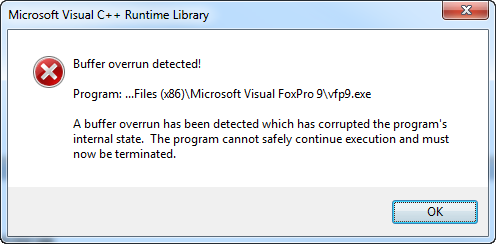

Thor TWEeT #23: Buffer overrun detected!
===

There is a nasty error, “Buffer overrun”, that be-devils a small number of users of PEM Editor and IntellisenseX:

This error is a close cousin of the better known C5 error: it blows your FoxPro session away and all un-saved changes are lost. Unlike C5, though, there is no hint in the _vfp9err.log_ file.

When this error was first reported back in 2009, the cause was unknown, although it was learned that the error only occurred for some specific classes (always occurring for these classes). Furthermore, it was determined that the error was reproducible outside of PEM Editor, like this:

A work-around was added to PEM Editor, wherein this call to AMembers was avoided for classes whose names were found in a table created for this use.  While cumbersome, this solution was better than nothing.

Recently, I encountered this problem for the first time in my own code and was able to identify the root cause of the problem.  Curiously, it happens because of the innocuous code shown here:

After some testing (and getting blown out of FoxPro many times), I was able to learn that the problem has to do with the length of the LParameters statement.  The limit is 255 characters (not a surprise) but the character count includes all the white space, semi-colons, carriage returns and line feeds. When I modified that statement to fit all on one line, removing all the extra unneeded space, the error evaporated.

I was contacted by Tore Bleken this past week about these Buffer Overun problems in classes based on classes of FoxInCloud.  He has reported that changing the LParameters statements in the parent classes cured the problem.

See also [History of all Thor TWEeTs](../TWEeTs.md) and [the Thor Forum](https://groups.google.com/forum/?fromgroups#!forum/FoxProThor).
