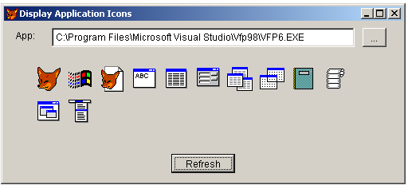
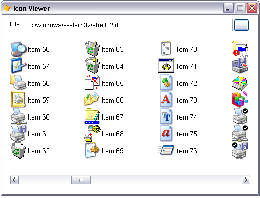

[ Home ](https://github.com/VFPX/Win32API)  

# How to view icons stored in executable files (Icon Viewer)

## Before you begin:
This code shows how to retrieve icon resources from EXE and DLL files using the ExtractIcon.   

  

See also:

* [How to extract icon resources from EXE or DLL and save them in .ICO files](sample_502.md)  
* [How to extract the icon resources from an EXE or DLL and save them in image files](sample_501.md)  
* [Converting image file to .ICO file](sample_503.md)  

  
***  


## Code:
```foxpro  
PUBLIC frm
frm = CreateObject("Tform")
* end of main

DEFINE CLASS Tform As Form
	Width=600
	Height=400
	AutoCenter=.T.
	Caption = "Icon Viewer"

	ADD OBJECT lbl As Label WITH Caption="App:", Left=15, Top=10
	ADD OBJECT txt As TextBox WITH Left=60, Top=8, Height=24, Width=450
	ADD OBJECT cmdFile As CommandButton WITH Caption="...",;
	Top=8, Left=512, Width=30, Height=24
	ADD OBJECT cmd As CommandButton WITH Caption="Refresh",;
	Width=80, Height=24, Default=.T.

PROCEDURE Init
	THIS.decl
	THIS.txt.Value = THIS.GetVFPmodule()
	THIS.Resize
	THIS.cmd.SetFocus
	THIS.DrawIcons

PROCEDURE Resize
	WITH THIS.cmd
		.Left = Int((ThisForm.Width - .Width)/2)
		.Top = THIS.Height - .Height - 10
	ENDWITH

PROCEDURE DrawIcons
	* clears form
	THIS.visible = .F.
	THIS.visible = .T.
	= INKEY(0.1)

	LOCAL lcExe, hApp, lnIndex, hIcon, X,Y, dX,dY
	lcExe = ALLTRIM(THIS.txt.Value)
	IF Not FILE (lcExe)
		WAIT WINDOW "File " + lcExe + " not found" NOWAIT
	ENDIF

	hApp = GetModuleHandle(0)
	STORE 40 TO dX,dY
	Y = 56
	X = dX

	lnIndex = 0
	DO WHILE .T.
		hIcon = ExtractIcon (hApp, lcExe, lnIndex)
		IF hIcon = 0
			EXIT
		ENDIF

		THIS._draw (hIcon, X,Y)
		= DestroyIcon (hIcon)

		lnIndex = lnIndex + 1
		X = X + dX
		IF X > THIS.Width-dX*2
			X = dX
			Y = Y + dY
		ENDIF
	ENDDO

PROTECTED PROCEDURE _draw (hIcon, X,Y)
	LOCAL hwnd, hdc
	hwnd = GetFocus()
	hdc = GetDC(hwnd) && this form
	= DrawIcon (hdc, X,Y, hIcon)
	= ReleaseDC (hwnd, hdc)

PROCEDURE selectFile
	LOCAL lcFile
	lcFile = THIS.getFile()
	IF Len(lcFile) <> 0
		THIS.txt.Value = lcFile
		THIS.drawIcons
	ENDIF

PROTECTED FUNCTION getFile
	LOCAL lcResult, lcPath, lcStoredPath
	lcPath = SYS(5) + SYS(2003)
	lcStoredPath = FULLPATH (THIS.txt.Value)
	lcStoredPath = SUBSTR (lcStoredPath, 1, RAT(Chr(92),lcStoredPath)-1)
	
	SET DEFAULT TO (lcStoredPath)
	lcResult = GETFILE("EXE", "Get Executable:", "Open",0)
	SET DEFAULT TO (lcPath)
RETURN LOWER(lcResult)

PROCEDURE decl
	DECLARE INTEGER GetFocus IN user32
	DECLARE INTEGER GetDC IN user32 INTEGER hwnd
	DECLARE INTEGER GetModuleHandle IN kernel32 INTEGER lpModuleName
	DECLARE SHORT DestroyIcon IN user32 INTEGER hIcon
	DECLARE INTEGER ReleaseDC IN user32 INTEGER hwnd, INTEGER hdc

	DECLARE INTEGER LoadIcon IN user32;
		INTEGER hInstance, INTEGER lpIconName

	DECLARE INTEGER ExtractIcon IN shell32;
		INTEGER hInst, STRING lpszExeFileName,;
		INTEGER lpiIcon

	DECLARE SHORT DrawIcon IN user32;
		INTEGER hDC, INTEGER X, INTEGER Y, INTEGER hIcon

	DECLARE INTEGER GetModuleFileName IN kernel32;
		INTEGER hModule, STRING @lpFilename, INTEGER nSize

PROTECTED FUNCTION GetVFPmodule
	LOCAL lpFilename
	lpFilename = SPACE(250)
	lnLen = GetModuleFileName(0, @lpFilename, Len(lpFilename))
RETURN LEFT(lpFilename, lnLen)

PROCEDURE cmd.Click
	ThisForm.drawIcons

PROCEDURE cmdFile.Click
	ThisForm.selectFile
ENDDEFINE  
```  
***  


## Listed functions:
[DestroyIcon](../libraries/user32/DestroyIcon.md)  
[DrawIcon](../libraries/user32/DrawIcon.md)  
[ExtractIcon](../libraries/shell32/ExtractIcon.md)  
[GetDC](../libraries/user32/GetDC.md)  
[GetFocus](../libraries/user32/GetFocus.md)  
[GetModuleFileName](../libraries/kernel32/GetModuleFileName.md)  
[GetModuleHandle](../libraries/kernel32/GetModuleHandle.md)  
[LoadIcon](../libraries/user32/LoadIcon.md)  
[ReleaseDC](../libraries/user32/ReleaseDC.md)  

## Comment:
Notice that the icons drawn on the form disappear after covering this form by another window or minimizing and then maximizing it.  
  
An icon stored in memory can be saved as icon file. Code sample [Converting image file to .ICO file](sample_503.md) explains how to create .ICO file from HICON handle.  
  
* * *  
Read [Icons in Win32](https://msdn.microsoft.com/en-us/library/ms997538.aspx) article wriiten by John Hornick from MS Corp.  
  
MSDN article [Using Icons](https://msdn.microsoft.com/en-us/library/windows/desktop/ms648051(v=vs.85).aspx) describes how to perform certain tasks related to icons: creating, displaying, sharing Icon resources.  
  
* * *  
This is a screenshot of [more advanced Icon Viewer](sample_019.md) built on ImageList API functions:  
  
[](sample_019.md)


***  

