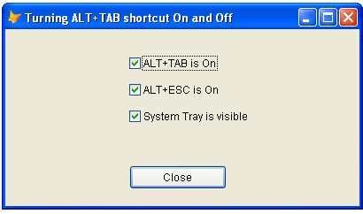

[ Home ](https://github.com/VFPX/Win32API)  

# How to block the ALT+TAB shortcut (WinXP)

## Before you begin:
Windows XP allows the AltTab to be registered as a hotkey, effectively blocking ALT+TAB and ALT+ESC shortcuts.  

  

See also:

* [How to block the PrintScreen key](sample_489.md)  
* [How to prevent users from accessing the Windows Desktop and from switching to other applications](sample_492.md)  
* [Capturing keyboard activity of another application using the Raw Input API](sample_572.md)  

  
***  


## Code:
```foxpro  
LOCAL obj
obj = CREATEOBJECT("Tform")
obj.Show(1)

DEFINE CLASS Tform As Form
#DEFINE MOD_ALT     1
#DEFINE MOD_SHIFT   4
#DEFINE VK_TAB      9
#DEFINE VK_ESCAPE   0x1b
#DEFINE cnHotKey01  1000
#DEFINE cnHotKey02  1001
#DEFINE SW_HIDE 0
#DEFINE SW_SHOWNORMAL 1

	Width=400
	Height=200
	Caption="Turning ALT+TAB shortcut On and Off"
	Autocenter=.T.
	hWindow=0

	ADD OBJECT chAltTab As CheckBox WITH Autosize=.T.,;
	Left=140, Top=30, Caption="ALT+TAB is On", Value=.T.
	
	ADD OBJECT chAltEsc As CheckBox WITH Autosize=.T.,;
	Left=140, Top=60, Caption="ALT+ESC is On", Value=.T.

	ADD OBJECT chSystray As CheckBox WITH Autosize=.T.,;
	Left=140, Top=90, Caption="System Tray is visible", Value=.T.

	ADD OBJECT cmdClose As CommandButton WITH Cancel=.T., Default=.T.,;
	Left=140, Top=154, Width=110, Height=27, Caption="Close"

PROCEDURE Init
	THIS.decl
	THIS.ShowSystemTray(.T.)

PROCEDURE Activate
	IF THIS.hWindow=0
		THIS.hWindow = GetFocus()
	ENDIF

PROCEDURE cmdClose.Click
	ThisForm.Release

PROCEDURE chAltTab.Click
	ThisForm.RegKey(cnHotKey01, MOD_ALT, VK_TAB, THIS.Value)

PROCEDURE chAltEsc.Click
	ThisForm.RegKey(cnHotKey02, MOD_ALT, VK_ESCAPE, THIS.Value)

PROCEDURE chSystray.Click
	ThisForm.ShowSystemTray(THIS.Value)

PROCEDURE RegKey(nKeyId, nModifier, vKey, lOn)
	IF lOn
		= UnregisterHotKey(ThisForm.hWindow, nKeyId)
	ELSE		
		IF RegisterHotKey(ThisForm.hWindow,;
			nKeyId, nModifier, vKey) = 0
			nError = GetLastError()
			= MessageB("Error code: " + LTRIM(STR(nError)) +;
				"    ", 48, "RegisterHotKey error")
		ENDIF
	ENDIF

PROCEDURE ShowSystemTray(lVisible)
	LOCAL hWindow
	hWindow = FindWindow("Shell_TrayWnd", Null)
	= ShowWindowA(hWindow, IIF(lVisible, SW_SHOWNORMAL, SW_HIDE))

PROCEDURE Destroy
	= UnregisterHotKey(ThisForm.hWindow, cnHotKey01)
	= UnregisterHotKey(ThisForm.hWindow, cnHotKey02)

PROTECTED PROCEDURE decl
	DECLARE INTEGER GetFocus IN user32
	DECLARE INTEGER GetLastError IN kernel32

	DECLARE INTEGER ShowWindow IN user32 AS ShowWindowA;
		INTEGER hWindow, INTEGER nCmdShow

	DECLARE INTEGER FindWindow IN user32;
		STRING lpClassName, STRING lpWindowName

	DECLARE INTEGER RegisterHotKey IN user32;
		INTEGER hWnd, INTEGER id,;
		INTEGER fsModifiers, INTEGER vk

	DECLARE INTEGER UnregisterHotKey IN user32;
		INTEGER hWnd, INTEGER id

ENDDEFINE  
```  
***  


## Listed functions:
[FindWindow](../libraries/user32/FindWindow.md)  
[GetFocus](../libraries/user32/GetFocus.md)  
[GetLastError](../libraries/kernel32/GetLastError.md)  
[RegisterHotKey](../libraries/user32/RegisterHotKey.md)  
[ShowWindow](../libraries/user32/ShowWindow.md)  
[UnregisterHotKey](../libraries/user32/UnregisterHotKey.md)  

## Comment:
This technique *can not* be used to block CTRL+ALT+DEL combination of keys.  
  

* * *  
I found a discussion on the Expert-Exchange, [Interrupt Handler for 0x19 (Ctrl+Alt+Del) in VB6](http://www.experts-exchange.com/Programming/Programming_Languages/Visual_Basic/Q_21444794.html), that you may find interesting.  
  

***  

