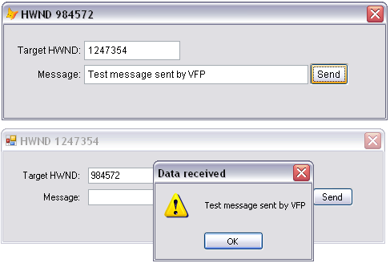

[ Home ](https://github.com/VFPX/Win32API)  

# Using WM_COPYDATA for interprocess communication (VFP9)

## Short description:
An application sends the WM_COPYDATA message to pass data to another application running on the same PC. The C# and VFP versions of this code sample are functionally identical. That allows exchanging data between .NET and VFP forms (applications).  
***  


## Before you begin:
An application sends the WM_COPYDATA message to pass data to another application running on the same PC.  

  
The screen copy above shows a message sent from VFP to C# application. The MessageBox is invoked by C# form upon receiving the message.  

See also:

* [Peer-to-peer LAN messenger built with Mailslot API functions](sample_410.md)  
* [Using mailslots to send messages on the network ](sample_269.md)  
* [Using named pipes for interprocess communication ](sample_522.md)  
* [Using the NetMessageBufferSend to send messages on the network](sample_494.md)  
* [How to create non-blocking Winsock server](sample_412.md)  
  
***  


## Code:
```foxpro  
PUBLIC oWindow1 As TForm, oWindow2 As TForm
oWindow1 = CREATEOBJECT("TForm")
oWindow2 = CREATEOBJECT("TForm")
WITH oWindow1
	.Left=50
	.Top=100
	.Visible=.T.
	.Activate
ENDWITH
WITH oWindow2
	.Left=250
	.Top=300
	.Visible=.T.
	.Activate
ENDWITH

oWindow1.SetTargetHwnd(oWindow2.hWnd)
oWindow2.SetTargetHwnd(oWindow1.hWnd)
* end of main

DEFINE CLASS Tform As Form
	Width=500
	Height=150
	MaxButton=.F.
	BorderStyle=2
	
	ADD OBJECT TCopyData1 As TCopyData
	
	ADD OBJECT Label1 As Label WITH Left=10,;
	Top=24, Width=86, Alignment=1, Caption="Target HWND:"

	ADD OBJECT txtHWND As TextBox WITH Left=100,;
	Top=20, Width=120, Height=24
	
	ADD OBJECT Label2 As Label WITH Left=10,;
	Top=54, Width=86, Alignment=1, Caption="Message:"

	ADD OBJECT txtMessage As TextBox WITH Left=100,;
	Top=50, Width=300, Height=24

	ADD OBJECT cmdSend As CommandButton WITH Left=402,;
	Top=48, Width=60, Height=27, Caption="Send"

PROCEDURE cmdSend.Click
	ThisForm.SendData

PROCEDURE Activate
	IF THIS.TCopyData1.hWindow = 0
		THIS.TCopyData1.EnableParentForm(THIS.HWnd)
		THIS.Caption = "HWND " + TRANSFORM(THIS.HWnd)
		THIS.txtHWND.Value = TRANSFORM(THIS.HWnd)
	ENDIF

PROCEDURE SetTargetHwnd(nHwnd)
	THIS.txtHWND.Value = TRANSFORM(m.nHwnd)

PROCEDURE SendData
	LOCAL hTargetWindow, cBuffer
	hTargetWindow = VAL(ALLTRIM(TRANSFORM(THIS.txtHWND.Value)))
	IF hTargetWindow = 0
		RETURN
	ENDIF
	cBuffer = ALLTRIM(TRANSFORM(THIS.txtMessage.Value))
	IF EMPTY(m.cBuffer)
		RETURN
	ENDIF

	THIS.TCopyData1.SendString(hTargetWindow, @cBuffer)
ENDDEFINE

DEFINE CLASS TCopyData As Custom
#DEFINE GWL_WNDPROC -4
#DEFINE WM_COPYDATA 0x004a
	Visible=.F.
	hWindow=0
	hOrigProc=0

PROCEDURE Init
	THIS.declare

PROCEDURE Destroy
	THIS.DisbleParentForm

PROCEDURE DisbleParentForm
	IF THIS.hWindow <> 0
		= UNBINDEVENTS(THIS.hWindow)
		THIS.hWindow=0
	ENDIF

PROCEDURE EnableParentForm(hWindow)
	THIS.DisbleParentForm

	THIS.hWindow = m.hWindow
	THIS.hOrigProc = GetWindowLong(THIS.hWindow, GWL_WNDPROC)
	= BINDEVENT(THIS.hWindow, WM_COPYDATA, THIS, "OnMessage")

PROTECTED PROCEDURE OnMessage(hWindow as Integer, nMsgID as Integer,;
	wParam as Integer, lParam as Integer)

	LOCAL nReturn
	nReturn=0
	
	DO CASE
	CASE nMsgID=WM_COPYDATA  && got some data
		THIS.OnDataReceived(wParam, lParam)
		nReturn=1

	OTHERWISE
		nReturn = CallWindowProc(THIS.hOrigProc, THIS.hWindow,;
			m.nMsgID, m.wParam, m.lParam)
	ENDCASE
RETURN nReturn

PROCEDURE OnDataReceived(wParam as Integer, lParam as Integer)
* wParam is the handle to the window passing the data
* lParam contains the address of a COPYDATASTRUCT structure
	LOCAL cCopydataStruct
	cCopydataStruct = REPLICATE(CHR(0), 12)
	= MemToStr(@cCopydataStruct, lParam, 12)
	
	LOCAL hBuffer, nBufsize, cBuffer
	* obtaining the address of a memory block with data
	* the data is considered read-only and volatile
	hBuffer = buf2dword(SUBSTR(cCopydataStruct,9,4))
	
	* the size of the data in bytes
	* evidently it cannot exceed 0xffffffff bytes
	nBufsize = buf2dword(SUBSTR(cCopydataStruct,5,4))
	
	* copying the data from memory block to VFP string
	cBuffer = REPLICATE(CHR(0),nBufsize)
	= MemToStr(@cBuffer, hBuffer, nBufsize)
	
	* convert from Unicode
	cBuffer = STRCONV(cBuffer,6)

	ACTIVATE SCREEN
	? "rcvd on [" + TRANSFORM(THIS.hWindow) +;
		"] from [" + TRANSFORM(m.wParam) + "] --> [" + cBuffer + "]"

PROCEDURE SendString(hTargetWindow, cBuffer)
	LOCAL oBuffer As PChar

	* converting to Unicode
	oBuffer = CREATEOBJECT("PChar",;
		STRCONV(m.cBuffer+CHR(0),5))

	THIS.SendPtr(m.hTargetWindow,;
		oBuffer.GetAddr(), LEN(m.cBuffer)*2)

PROCEDURE SendPtr(hTargetWindow, hBuffer, nBufsize)
	LOCAL cCopydataStruct, oCopydataStruct As PChar
	
	* assembling COPYDATASTRUCT structure
	cCopydataStruct = num2dword(0) +;
		num2dword(m.nBufsize) +;
		num2dword(m.hBuffer)

	oCopydataStruct = CREATEOBJECT("PChar", cCopydataStruct)
	
	* sending WM_COPYDATA message to the target window
	* the last parameter is a pointer to COPYDATASTRUCT structure
	= SendMessage(hTargetWindow, WM_COPYDATA,;
		ThisForm.HWND, oCopydataStruct.GetAddr())

PROCEDURE declare
	DECLARE RtlMoveMemory IN kernel32 As MemToStr;
		STRING @dst, INTEGER src, INTEGER nLength

	DECLARE INTEGER CallWindowProc IN user32;
		INTEGER lpPrevWndFunc, INTEGER hWindow, LONG Msg,;
		INTEGER wParam, INTEGER lParam

	DECLARE INTEGER GetWindowLong IN user32;
		INTEGER hWnd, INTEGER nIndex

	DECLARE INTEGER SendMessage IN user32;
		INTEGER hWindow, INTEGER Msg,;
		INTEGER wParam, INTEGER lParam

ENDDEFINE

FUNCTION buf2dword(cBuffer)
RETURN Asc(SUBSTR(cBuffer, 1,1)) + ;
	BitLShift(Asc(SUBSTR(cBuffer, 2,1)),  8) +;
	BitLShift(Asc(SUBSTR(cBuffer, 3,1)), 16) +;
	BitLShift(Asc(SUBSTR(cBuffer, 4,1)), 24)

FUNCTION num2dword(lnValue)
#DEFINE m0 0x0000100
#DEFINE m1 0x0010000
#DEFINE m2 0x1000000
	IF lnValue < 0
		lnValue = 0x100000000 + lnValue
	ENDIF
	LOCAL b0, b1, b2, b3
	b3 = Int(lnValue/m2)
	b2 = Int((lnValue - b3*m2)/m1)
	b1 = Int((lnValue - b3*m2 - b2*m1)/m0)
	b0 = Mod(lnValue, m0)
RETURN Chr(b0)+Chr(b1)+Chr(b2)+Chr(b3)

DEFINE CLASS PChar As Session
PROTECTED hMem

PROCEDURE Init(lcString)
	THIS.hMem = 0
	THIS.setValue(lcString)

PROCEDURE Destroy
	THIS.ReleaseString

FUNCTION GetAddr
RETURN THIS.hMem

FUNCTION GetValue
	LOCAL lnSize, lcBuffer
	lnSize = THIS.getAllocSize()
	lcBuffer = SPACE(lnSize)

	IF THIS.hMem <> 0
		DECLARE RtlMoveMemory IN kernel32 As MemToStr;
			STRING @, INTEGER, INTEGER
		= MemToStr(@lcBuffer, THIS.hMem, lnSize)
	ENDIF
RETURN lcBuffer

FUNCTION GetAllocSize
	DECLARE INTEGER GlobalSize IN kernel32 INTEGER hMem
RETURN Iif(THIS.hMem=0, 0, GlobalSize(THIS.hMem))

PROCEDURE SetValue(lcString)
#DEFINE GMEM_FIXED 0
	THIS.ReleaseString

	DECLARE INTEGER GlobalAlloc IN kernel32 INTEGER, INTEGER
	DECLARE RtlMoveMemory IN kernel32 As StrToMem;
		INTEGER, STRING @, INTEGER

	LOCAL lnSize
	lcString = lcString + Chr(0)
	lnSize = Len(lcString)
	THIS.hMem = GlobalAlloc(GMEM_FIXED, lnSize)
	IF THIS.hMem <> 0
		= StrToMem(THIS.hMem, @lcString, lnSize)
	ENDIF

PROCEDURE ReleaseString
	IF THIS.hMem <> 0
		DECLARE INTEGER GlobalFree IN kernel32 INTEGER
		= GlobalFree (THIS.hMem)
		THIS.hMem = 0
	ENDIF
ENDDEFINE  
```  
***  


## Listed functions:
[CallWindowProc](../libraries/user32/CallWindowProc.md)  
[GetWindowLong](../libraries/user32/GetWindowLong.md)  
[GlobalAlloc](../libraries/kernel32/GlobalAlloc.md)  
[GlobalFree](../libraries/kernel32/GlobalFree.md)  
[GlobalSize](../libraries/kernel32/GlobalSize.md)  
[SendMessage](../libraries/user32/SendMessage.md)  

## Comment:
The forms belonging to different VFP sessions (different processes) can exchange data in the same way. The window handle stays global through the Windows session.   
  
The C# and VFP versions of this code sample are functionally identical. That allows exchanging data between .NET and VFP forms (applications).  
  
In real life situation, prior to exchanging data the forms must have exchanged their window handles. That can be arranged by each form <a href="http://msdn2.microsoft.com/en-us/library/ms648996(VS.85).aspx">broadcasting a specific message</a> that the other forms would recognize and respond. The FindWindow API is another option.  
  
* * *  
Comparing to other ways of interprocess communication (named pipes, mailslots, Winsock) the WM_COPYDATA has a certain edge: no need to implement any listening part. The OS does it for you.   
  
* * *  
http://blogs.msdn.com/oldnewthing/archive/2003/12/11/56043.aspx  
> if you need to pass more than 32767 characters of information to a child process, you`ll have to use something other than the command line. 
***

Articles:  
* <a href="http://msdn2.microsoft.com/en-us/library/aa365574.aspx">Interprocess Communications</a> chapter on MSDN.  
 
  
***  

